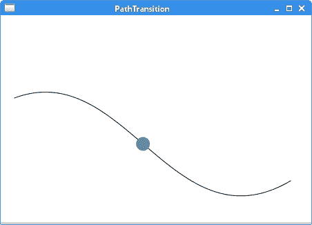

# JavaFX 动画

> 原文： [http://zetcode.com/gui/javafx/animation/](http://zetcode.com/gui/javafx/animation/)

在本章中，我们将使用 JavaFX 中的动画。 我们使用`AnimationTimer`，`Transition`和`Timeline`创建动画。

动画是连续的图像，使人产生了运动的幻觉。 但是，动画不仅限于运动。 随着时间的推移更改节点的背景也被视为动画。

JavaFX 提供了三种创建动画的基本工具：

*   动画计时器
*   过渡
*   时间线

`AnimationTimer`是创建动画的最简单工具。 这是一个基本计时器。 在动画的每一帧中都会调用其`handle()`方法。 `Transition`是定义动画的基本高级框架。 动画由`interpolate()`方法的`frac`值控制。 `Timeline`是用于制作高级动画的最复杂的工具。 `Timeline`动画由`KeyFrames`定义，该动画概述了沿`Timeline`插补的一组变量在指定时间点的节点目标值。 动画属性由`KeyValues`定义。

## 动画类

`Animation`是 JavaFX 中定义高级动画的基本类。 `Transition`和`Timeline`都扩展了`Animation`。 动画以`play()`或`playFromStart()`方法开始，以`stop()`方法结束。 可以通过调用`pause()`方法暂停动画，然后下一个`play()`调用从暂停的位置继续播放动画。 `rate`属性定义了预期播放动画的方向和速度。 `delay`属性指定动画的初始延迟量。 动画可以循环运行； `cycleCount`属性中定义了循环数，`cycleDuration`指示了循环的持续时间。 可以使用`autoReverseProperty`以交替的周期反转动画。

## 动画计时器

`AnimationTimer`允许创建一个定时器，该定时器在活动时在每个帧中被调用。 这是一个抽象类； 因此，我们需要创建一个扩展它的自定义类。 在每个帧中调用的`handle()`方法都必须重写。 `AnimationTimer's` `start()`方法启动计时器，`stop()`方法停止计时器。

`AnimationTimerEx.java`

```java
package com.zetcode;

import javafx.animation.AnimationTimer;
import javafx.application.Application;
import javafx.scene.Scene;
import javafx.scene.control.Label;
import javafx.scene.layout.StackPane;
import javafx.scene.text.Font;
import javafx.stage.Stage;

/**
 * ZetCode JavaFX tutorial
 *
 * This program uses AnimationTimer to 
 * create an animation.
 *
 * Author: Jan Bodnar 
 * Website: zetcode.com 
 * Last modified: June 2015
 */

public class AnimationTimerEx extends Application {

    private double opacity = 1;
    private Label lbl;

    @Override
    public void start(Stage stage) {

        initUI(stage);
    }

    private void initUI(Stage stage) {

        StackPane root = new StackPane();

        lbl = new Label("JavaFX");
        lbl.setFont(Font.font(48));
        root.getChildren().add(lbl);

        AnimationTimer timer = new MyTimer();
        timer.start();

        Scene scene = new Scene(root, 300, 250);

        stage.setTitle("AnimationTimer");
        stage.setScene(scene);
        stage.show();
    }

    private class MyTimer extends AnimationTimer {

        @Override
        public void handle(long now) {

            doHandle();
        }

        private void doHandle() {

            opacity -= 0.01;
            lbl.opacityProperty().set(opacity);

            if (opacity <= 0) {
                stop();
                System.out.println("Animation stopped");
            }
        }
    }

    public static void main(String[] args) {
        launch(args);
    }
}

```

该示例使用`AnimationTimer`在节点上创建淡出效果。

```java
lbl = new Label("JavaFX");
lbl.setFont(Font.font(48));
root.getChildren().add(lbl);

```

我们的动画更改了此`Label`控件的属性。

```java
AnimationTimer timer = new MyTimer();
timer.start();

```

创建一个`AnimationTimer`并调用其`start()`方法。

```java
private class MyTimer extends AnimationTimer {

    @Override
    public void handle(long now) {

        doHandle();
    }
...
}

```

我们创建`AnimationTimer`的具体子类并覆盖其`handle()`方法。

```java
private void doHandle() {

    opacity -= 0.01;
    lbl.opacityProperty().set(opacity);

    if (opacity <= 0) {
        stop();
        System.out.println("Animation stopped");
    }
}

```

在`doHandle()`方法中，我们减小`opacity`变量并更新`opacityProperty`。 如果`opacity`达到最小值，则使用`stop()`方法停止计时器。

## 渐隐过渡

`Transition`动画最适合计划的动画。 `Transition`具有具体的类，可用于创建可以并行或顺序执行的各种动画； 例如`FadeTransition`，`PathTransition`，`RotateTransition`或`ScaleTransition`。

`FadeTransition`创建一个跨越其持续时间的淡入淡出效果动画。 这是通过定期更新节点的`opacity`变量来完成的。

`FadeTransitionEx.java`

```java
package com.zetcode;

import javafx.animation.Animation;
import javafx.animation.FadeTransition;
import javafx.application.Application;
import javafx.event.EventHandler;
import javafx.scene.Group;
import javafx.scene.Scene;
import javafx.scene.input.MouseEvent;
import javafx.scene.shape.Rectangle;
import javafx.stage.Stage;
import javafx.util.Duration;

/**
 * ZetCode JavaFX tutorial
 *
 * This program uses a FadeTransition. A rectangle
 * fades out after we click into its area.
 *
 * Author: Jan Bodnar 
 * Website: zetcode.com 
 * Last modified: June 2015
 */

public class FadeTransitionEx extends Application {

    private FadeTransition ft;
    private Rectangle rect;

    @Override
    public void start(Stage stage) {

        initUI(stage);
    }

    private void initUI(Stage stage) {

        Group root = new Group();

        rect = new Rectangle(20, 20, 150, 150);
        rect.setOnMouseClicked(new RectClickHandler());

        ft = new FadeTransition(Duration.millis(5000), rect);
        ft.setFromValue(1.0);
        ft.setToValue(0.0);

        root.getChildren().add(rect);

        Scene scene = new Scene(root, 300, 250);

        stage.setTitle("Fading transition");
        stage.setScene(scene);
        stage.show();        
    }

    private class RectClickHandler implements EventHandler<MouseEvent> {

        @Override
        public void handle(MouseEvent event) {

            doHandle();
        }

        private void doHandle() {

            Double opa = rect.getOpacity();

            if (opa.intValue() == 0) {
                return;
            }

            Animation.Status as = ft.getStatus();

            if (as == Animation.Status.RUNNING) {
                return;
            }

            if (as == Animation.Status.STOPPED) {
                ft.play();
            }            
        }

    }

    public static void main(String[] args) {
        Application.launch(args);
    }
}

```

本示例使用`FadeTransition`在矩形上创建淡出效果。 在矩形区域内单击鼠标后开始动画。

```java
rect = new Rectangle(20, 20, 150, 150);
rect.setOnMouseClicked(new RectClickHandler());

```

鼠标单击的处理程序设置为矩形。

```java
ft = new FadeTransition(Duration.millis(5000), rect);

```

创建了`FadeTransition`。 它的第一个参数是过渡的持续时间。 第二个参数是更新其`opacity`参数的节点。

```java
ft.setFromValue(1.0);
ft.setToValue(0.0);

```

`setFromValue()`设置不透明度的开始值，`setToValue()`设置不透明度的结束值。

```java
Double opa = rect.getOpacity();

```

当前的不透明度值是通过`getOpacity()`方法确定的。

```java
if (opa.intValue() == 0) {
    return;
}

```

矩形淡出后，我们取消了鼠标单击。

```java
Animation.Status as = ft.getStatus();

if (as == Animation.Status.RUNNING) {
    return;
}

if (as == Animation.Status.STOPPED) {
    ft.play();
}  

```

`getStatus()`方法确定转换的状态。 如果状态为`Animation.Status.STOPPED`，我们将使用`play()`方法开始转换。

## 路径转换

`PathTransition`沿路径创建动画。 通过更新节点的`translateX`和`translateY`变量来完成沿路径的转换。 请注意，我们必须使用支持元素绝对定位的节点。

`PathTransitionEx.java`

```java
package com.zetcode;

import javafx.animation.PathTransition;
import javafx.application.Application;
import javafx.scene.Scene;
import javafx.scene.layout.Pane;
import javafx.scene.paint.Color;
import javafx.scene.shape.Circle;
import javafx.scene.shape.CubicCurveTo;
import javafx.scene.shape.MoveTo;
import javafx.scene.shape.Path;
import javafx.stage.Stage;
import javafx.util.Duration;

/**
 * ZetCode JavaFX tutorial
 *
 * This program uses a PathTransition to move 
 * a circle along a path.
 * 
 * Author: Jan Bodnar 
 * Website: zetcode.com 
 * Last modified: June 2015
 */

public class PathTransitionEx extends Application {

    @Override
    public void start(Stage stage) {

        initUI(stage);
    }

    private void initUI(Stage stage) {

        Pane root = new Pane();

        Path path = new Path();
        path.getElements().add(new MoveTo(20, 120));
        path.getElements().add(new CubicCurveTo(180, 60, 250, 340, 420, 240));

        Circle circle = new Circle(20, 120, 10);
        circle.setFill(Color.CADETBLUE);

        PathTransition ptr = new PathTransition();

        ptr.setDuration(Duration.seconds(6));
        ptr.setDelay(Duration.seconds(2));
        ptr.setPath(path);
        ptr.setNode(circle);
        ptr.setCycleCount(2);
        ptr.setAutoReverse(true);
        ptr.play();     

        root.getChildren().addAll(path, circle);

        Scene scene = new Scene(root, 450, 300);

        stage.setTitle("PathTransition");
        stage.setScene(scene);
        stage.show();
    }

    public static void main(String[] args) {
        launch(args);
    }
}

```

该示例使用`PathTransition`沿路径移动圆。 动画在初始延迟 2 秒后开始。 它由两个周期组成。 动画受到尊敬； 也就是说，圆从起点到终点再返回。

```java
Pane root = new Pane();

```

我们使用`Pane`作为我们的根节点。 它支持动画所需的绝对定位。

```java
Path path = new Path();
path.getElements().add(new MoveTo(20, 120));
path.getElements().add(new CubicCurveTo(180, 60, 250, 340, 420, 240));

```

在这里，我们定义了动画对象将沿其移动的`Path`。

```java
Circle circle = new Circle(20, 120, 10);
circle.setFill(Color.CADETBLUE);

```

这个圆是动画中的运动对象。

```java
PathTransition ptr = new PathTransition();

```

创建一个`PathTransition`对象。

```java
ptr.setDuration(Duration.seconds(6));

```

`setDuration()`方法设置动画的持续时间。

```java
ptr.setDelay(Duration.seconds(2));

```

`setDelay()`方法设置动画的初始延迟。

```java
ptr.setPath(path);
ptr.setNode(circle);

```

`setPath()`方法设置路径，`setNode()`设置动画的目标节点。

```java
ptr.setCycleCount(2);

```

我们的动画有两个循环。 循环次数通过`setCycleCount()`方法设置。

```java
ptr.setAutoReverse(true);

```

使用`setAutoReverse()`方法，我们可以反转动画的方向。 圆会移回到起始位置。

```java
ptr.play();

```

最后，`play()`方法开始播放动画。



Figure: PathTransition

## 并行转换

`ParallelTransition`并行播放`Animations`的列表。

`ParallelTransitionEx.java`

```java
package com.zetcode;

import javafx.animation.FillTransition;
import javafx.animation.ParallelTransition;
import javafx.animation.RotateTransition;
import javafx.animation.ScaleTransition;
import javafx.application.Application;
import javafx.scene.Scene;
import javafx.scene.layout.Pane;
import javafx.scene.paint.Color;
import javafx.scene.shape.Rectangle;
import javafx.stage.Stage;
import javafx.util.Duration;

/**
 * ZetCode JavaFX tutorial
 *
 * This program creates a parallel 
 * transition animation.
 *
 * Author: Jan Bodnar 
 * Website: zetcode.com 
 * Last modified: June 2015
 */

public class ParallelTransitionEx extends Application {

    @Override
    public void start(Stage stage) {

        initUI(stage);
    }

    private void initUI(Stage stage) {

        Pane root = new Pane();

        Rectangle rect = new Rectangle(50, 50, 30, 30);
        rect.setArcHeight(10);
        rect.setArcWidth(10);
        rect.setFill(Color.CADETBLUE);

        RotateTransition rottr
                = new RotateTransition(Duration.millis(2000), rect);
        rottr.setByAngle(180);
        rottr.setCycleCount(2);
        rottr.setAutoReverse(true);

        ScaleTransition sctr = new ScaleTransition(Duration.millis(2000), 
                rect);
        sctr.setByX(2);
        sctr.setByY(2);
        sctr.setCycleCount(2);
        sctr.setAutoReverse(true);

        FillTransition fltr = new FillTransition(Duration.millis(2000), 
                rect, Color.CADETBLUE, Color.STEELBLUE);
        fltr.setCycleCount(2);
        fltr.setAutoReverse(true);

        root.getChildren().add(rect);

        ParallelTransition ptr = new ParallelTransition();
        ptr.getChildren().addAll(rottr, sctr, fltr);

        ptr.play();    

        Scene scene = new Scene(root, 300, 250);

        stage.setTitle("ParallelTransition");
        stage.setScene(scene);
        stage.show();
    }

    public static void main(String[] args) {
        launch(args);
    }
}

```

该示例并行播放三个过渡。 有一个旋转，缩放和背景颜色变化的矩形对象。

```java
RotateTransition rottr
        = new RotateTransition(Duration.millis(2000), rect);
rottr.setByAngle(180);
rottr.setCycleCount(2);
rottr.setAutoReverse(true);

```

`RotateTransition`将矩形旋转指定角度。 旋转以两个周期发生并反转。

```java
ScaleTransition sctr = new ScaleTransition(Duration.millis(2000), 
        rect);
sctr.setByX(2);
sctr.setByY(2);

```

`ScaleTransition`将矩形放大和缩小 2 倍。

```java
FillTransition fltr = new FillTransition(Duration.millis(2000), 
        rect, Color.CADETBLUE, Color.STEELBLUE);

```

`FillTransition`将矩形的填充颜色从一种颜色值更改为另一种颜色值。

```java
ParallelTransition ptr = new ParallelTransition();
ptr.getChildren().addAll(rottr, sctr, fltr);

ptr.play(); 

```

三种类型的过渡放置在`ParallelTransition`中，它们并行（即同时）播放它们。

## 顺序转换

`SequentialTransition`按顺序播放`Animations`的列表。

`SequentialTransitionEx.java`

```java
package com.zetcode;

import javafx.animation.FillTransition;
import javafx.animation.RotateTransition;
import javafx.animation.ScaleTransition;
import javafx.animation.SequentialTransition;
import javafx.application.Application;
import javafx.scene.Scene;
import javafx.scene.layout.Pane;
import javafx.scene.paint.Color;
import javafx.scene.shape.Rectangle;
import javafx.stage.Stage;
import javafx.util.Duration;

/**
 * ZetCode JavaFX tutorial
 *
 * This program plays three transitions in
 * a sequential order.
 *
 * Author: Jan Bodnar 
 * Website: zetcode.com 
 * Last modified: June 2015
 */

public class SequentialTransitionEx extends Application {

    @Override
    public void start(Stage stage) {

        initUI(stage);
    }

    private void initUI(Stage stage) {

        Pane root = new Pane();

        Rectangle rect = new Rectangle(50, 50, 30, 30);
        rect.setArcHeight(10);
        rect.setArcWidth(10);
        rect.setFill(Color.CADETBLUE);

        RotateTransition rottr
                = new RotateTransition(Duration.millis(2000), rect);
        rottr.setByAngle(180);
        rottr.setCycleCount(2);
        rottr.setAutoReverse(true);

        ScaleTransition sctr = new ScaleTransition(Duration.millis(2000), 
                rect);
        sctr.setByX(2);
        sctr.setByY(2);
        sctr.setCycleCount(2);
        sctr.setAutoReverse(true);

        FillTransition fltr = new FillTransition(Duration.millis(2000), 
                rect, Color.CADETBLUE, Color.STEELBLUE);
        fltr.setCycleCount(2);
        fltr.setAutoReverse(true);

        root.getChildren().add(rect);

        SequentialTransition str = new SequentialTransition();
        str.getChildren().addAll(rottr, sctr, fltr);

        str.play();         

        Scene scene = new Scene(root, 300, 250);

        stage.setTitle("SequentialTransition");
        stage.setScene(scene);
        stage.show();
    }

    public static void main(String[] args) {
        launch(args);
    }
}

```

该示例按顺序播放三个过渡-一个接一个。

```java
SequentialTransition str = new SequentialTransition();
str.getChildren().addAll(rottr, sctr, fltr);

str.play();

```

这三个转换被添加到`SequentialTransition`中。

## 时间线

`Timeline`是使用 JavaFX 创建动画的最复杂的工具。 动画用`KeyFrames`定义，其中包含更改的节点的属性。 这些属性封装在[H​​TG2]中。 `Timeline`内插属性的更改。

`TimelineEx.java`

```java
package com.zetcode;

import javafx.animation.KeyFrame;
import javafx.animation.KeyValue;
import javafx.animation.Timeline;
import javafx.application.Application;
import javafx.scene.Scene;
import javafx.scene.effect.Lighting;
import javafx.scene.layout.Pane;
import javafx.scene.paint.Color;
import javafx.scene.shape.Rectangle;
import javafx.stage.Stage;
import javafx.util.Duration;

/**
 * ZetCode JavaFX tutorial
 *
 * This program uses a Timeline to 
 * move a rectangle.
 * 
 * Author: Jan Bodnar 
 * Website: zetcode.com 
 * Last modified: June 2015
 */

public class TimelineEx extends Application {

    @Override
    public void start(Stage stage) {

        initUI(stage);
    }

    private void initUI(Stage stage) {

        Pane root = new Pane();

        Rectangle rect = new Rectangle(20, 20, 60, 60);
        rect.setEffect(new Lighting());
        rect.setFill(Color.CADETBLUE);

        Timeline tl = new Timeline();

        tl.setCycleCount(2);
        tl.setAutoReverse(true);

        KeyValue kv = new KeyValue(rect.translateXProperty(), 200);
        KeyFrame kf = new KeyFrame(Duration.millis(2000), kv);
        tl.getKeyFrames().addAll(kf);

        tl.play();

        root.getChildren().addAll(rect);

        Scene scene = new Scene(root, 350, 250);

        stage.setTitle("Timeline");
        stage.setScene(scene);
        stage.show();
    }

    public static void main(String[] args) {
        launch(args);
    }
}

```

该示例使用`Timeline`为矩形动画。

```java
Rectangle rect = new Rectangle(20, 20, 60, 60);
rect.setEffect(new Lighting());
rect.setFill(Color.CADETBLUE);

```

此矩形是动画中的移动对象。

```java
Timeline tl = new Timeline();

```

创建一个`Timeline`对象。

```java
tl.setCycleCount(2);
tl.setAutoReverse(true);

```

动画由两个循环组成，并且被反转。 矩形前后移动。

```java
KeyValue kv = new KeyValue(rect.translateXProperty(), 200);

```

`KeyValue`包含`translateX`属性，该属性会随着时间变化为 200。

```java
KeyFrame kf = new KeyFrame(Duration.millis(2000), kv);

```

实例化了`KeyFrame`。 第一个参数是其持续时间，第二个参数是`KeyValue`。 动画持续 2 秒钟，其`translateX`属性更改为 200。

```java
tl.getKeyFrames().addAll(kf);

```

关键帧将添加到帧列表。

## 顺序时间线动画

我们没有在时间轴中定义所有关键帧。 我们定义一些帧，其余的帧被插值。 关键帧在指定的时间点为时间轴内插的一组变量提供目标值。 为了顺序执行关键帧，我们利用了`SequentialTransition`类。

`SequentialTimelineEx.java`

```java
package com.zetcode;

import javafx.animation.KeyFrame;
import javafx.animation.KeyValue;
import javafx.animation.SequentialTransition;
import javafx.animation.Timeline;
import javafx.application.Application;
import javafx.scene.Scene;
import javafx.scene.layout.Pane;
import javafx.scene.paint.Color;
import javafx.scene.shape.Circle;
import javafx.stage.Stage;
import javafx.util.Duration;

/**
 * ZetCode JavaFX tutorial
 *
 * This program creates a sequential Timeline
 * animation.
 * 
 * Author: Jan Bodnar 
 * Website: zetcode.com 
 * Last modified: June 2015
 */

public class SequentialTimelineEx extends Application {

    @Override
    public void start(Stage stage) {

        initUI(stage);
    }

    private void initUI(Stage stage) {

        Pane root = new Pane();

        Circle c = new Circle(50, 100, 10);
        c.setFill(Color.CADETBLUE);

        KeyValue kv1 = new KeyValue(c.scaleXProperty(), 4);
        KeyValue kv2 = new KeyValue(c.scaleYProperty(), 4);
        KeyFrame kf1 = new KeyFrame(Duration.millis(3000), kv1, kv2);

        Timeline scale = new Timeline();
        scale.getKeyFrames().add(kf1);        

        KeyValue kv3 = new KeyValue(c.centerXProperty(), 250);
        KeyFrame kf2 = new KeyFrame(Duration.millis(5000), kv3);

        Timeline move = new Timeline();
        move.getKeyFrames().add(kf2);        

        KeyValue kv4 = new KeyValue(c.scaleXProperty(), 1);
        KeyValue kv5 = new KeyValue(c.scaleYProperty(), 1);
        KeyFrame kf3 = new KeyFrame(Duration.millis(3000), kv4, kv5);

        Timeline scale2 = new Timeline();
        scale2.getKeyFrames().add(kf3);           

        SequentialTransition seqtr = new SequentialTransition(scale, 
                move, scale2);
        seqtr.play();

        root.getChildren().add(c);

        Scene scene = new Scene(root, 300, 250);

        stage.setTitle("Sequential Timeline animation");
        stage.setScene(scene);
        stage.show();
    }

    public static void main(String[] args) {
        launch(args);
    }
}

```

该示例创建顺序时间轴动画。 动画由三个`Timelines`组成，它们与`SequentialTransition`顺序执行。

```java
Circle c = new Circle(50, 100, 10);
c.setFill(Color.CADETBLUE);

```

此动画中的移动对象是`Circle`。

```java
KeyValue kv1 = new KeyValue(c.scaleXProperty(), 4);
KeyValue kv2 = new KeyValue(c.scaleYProperty(), 4);
KeyFrame kf1 = new KeyFrame(Duration.millis(3000), kv1, kv2);

Timeline scale = new Timeline();
scale.getKeyFrames().add(kf1); 

```

这是第一个`Timeline`。 它会在三秒钟的时间内放大圆圈。

```java
KeyValue kv3 = new KeyValue(c.centerXProperty(), 250);
KeyFrame kf2 = new KeyFrame(Duration.millis(5000), kv3);

Timeline move = new Timeline();
move.getKeyFrames().add(kf2);   

```

第二个`Timeline`将圆圈向前移动。 动画的这一部分持续五秒钟。

```java
KeyValue kv4 = new KeyValue(c.scaleXProperty(), 1);
KeyValue kv5 = new KeyValue(c.scaleYProperty(), 1);
KeyFrame kf3 = new KeyFrame(Duration.millis(3000), kv4, kv5);

Timeline scale2 = new Timeline();
scale2.getKeyFrames().add(kf3);   

```

第三个`Timeline`按比例缩小圆圈。

```java
SequentialTransition seqtr = new SequentialTransition(scale, 
        move, scale2);
seqtr.play();

```

这三个时间线放置在`SequentialTransition`中。 时间轴依次播放。

在本章中，我们介绍了 JavaFX 动画。