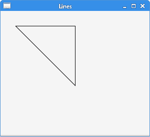
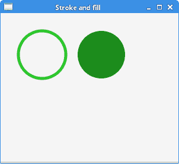
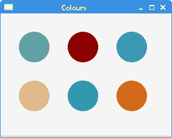
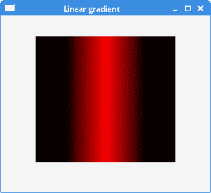
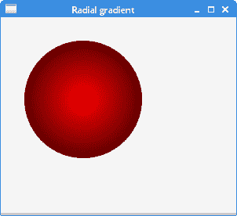
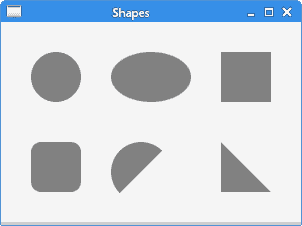
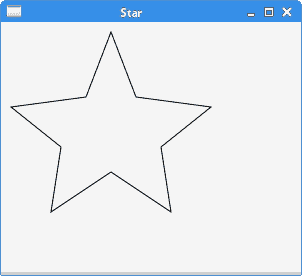
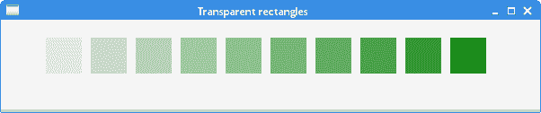

# JavaFX 画布

> 原文： [http://zetcode.com/gui/javafx/canvas/](http://zetcode.com/gui/javafx/canvas/)

`Canvas`是可以使用`GraphicsContext`提供的一组图形命令绘制的图像。 它是进行绘图的高级工具。

`GraphicsContext`用于使用缓冲区向`Canvas`发出绘图调用。

## 简单的线条

在第一个示例中，我们绘制了简单的线条。 线是基本的图形基元。 需要两个坐标才能形成一条线。

`SimpleLinesEx.java`

```java
package com.zetcode;

import javafx.application.Application;
import javafx.scene.Scene;
import javafx.scene.canvas.Canvas;
import javafx.scene.canvas.GraphicsContext;
import javafx.scene.layout.Pane;
import javafx.stage.Stage;

/**
 * ZetCode JavaFX tutorial
 *
 * This program draws three lines which
 * form a rectangle.
 * 
 * Author: Jan Bodnar 
 * Website: zetcode.com 
 * Last modified: June 2015
 */

public class SimpleLinesEx extends Application {

    @Override
    public void start(Stage stage) {

        initUI(stage);
    }

    private void initUI(Stage stage) {

        Pane root = new Pane();

        Canvas canvas = new Canvas(300, 300);
        GraphicsContext gc = canvas.getGraphicsContext2D();
        drawLines(gc);

        root.getChildren().add(canvas);

        Scene scene = new Scene(root, 300, 250, Color.WHITESMOKE);

        stage.setTitle("Lines");
        stage.setScene(scene);
        stage.show();
    }

    private void drawLines(GraphicsContext gc) {

        gc.beginPath();
        gc.moveTo(30.5, 30.5);
        gc.lineTo(150.5, 30.5);
        gc.lineTo(150.5, 150.5);
        gc.lineTo(30.5, 30.5);
        gc.stroke();
    }

    public static void main(String[] args) {
        launch(args);
    }
}

```

该示例绘制了形成矩形的三条线。

```java
Canvas canvas = new Canvas(300, 300);

```

`Canvas`的宽度和高度指定了将画布绘制命令渲染到的图像的大小。 所有绘图操作都被裁剪到该图像的边界。

```java
GraphicsContext gc = canvas.getGraphicsContext2D();

```

`getGraphicsContext2D()`返回与画布关联的`GraphicsContext`。

```java
drawLines(gc);

```

该图形委托给`drawLines()`方法。

```java
gc.beginPath();

```

线图元表示为路径元素。 `beginPath()`方法开始一个新路径。

```java
gc.moveTo(30.5, 30.5);

```

`moveTo()`方法将当前路径的起点移动到指定的坐标。

```java
gc.lineTo(150.5, 30.5);
gc.lineTo(150.5, 150.5);
gc.lineTo(30.5, 30.5);

```

`lineTo()`方法将线段添加到当前路径。

```java
gc.stroke();

```

`stroke()`方法使用当前的描边绘图描边路径。



图：直线

## 描边和填充

笔划用于绘制形状的轮廓。 填充用于绘制形状的内部。

`StrokeFillEx.java`

```java
package com.zetcode;

import javafx.application.Application;
import javafx.scene.Scene;
import javafx.scene.canvas.Canvas;
import javafx.scene.canvas.GraphicsContext;
import javafx.scene.layout.Pane;
import javafx.scene.paint.Color;
import javafx.stage.Stage;

/**
 * ZetCode JavaFX tutorial
 *
 * This program draws an outline of a circle 
 * and fills an interior of a circle.
 * 
 * Author: Jan Bodnar 
 * Website: zetcode.com 
 * Last modified: June 2015
 */

public class StrokeFillEx extends Application {

    @Override
    public void start(Stage stage) {

        initUI(stage);
    }

    private void initUI(Stage stage) {

        Pane root = new Pane();

        Canvas canvas = new Canvas(300, 300);
        GraphicsContext gc = canvas.getGraphicsContext2D();
        doDrawing(gc);

        root.getChildren().add(canvas);    

        Scene scene = new Scene(root, 300, 250, Color.WHITESMOKE);

        stage.setTitle("Stroke and fill");
        stage.setScene(scene);
        stage.show();
    }

    private void doDrawing(GraphicsContext gc) {

        gc.setStroke(Color.FORESTGREEN.brighter());
        gc.setLineWidth(5);
        gc.strokeOval(30, 30, 80, 80);        
        gc.setFill(Color.FORESTGREEN);
        gc.fillOval(130, 30, 80, 80);
    }    

    public static void main(String[] args) {
        launch(args);
    }
}

```

该示例绘制了圆的轮廓并填充了圆的内部。

```java
gc.setStroke(Color.FORESTGREEN.brighter());

```

`setStroke()`方法设置当前的笔触绘图属性。 默认颜色是黑色。 `GraphicsContext`的笔触方法使用该属性。

```java
gc.setLineWidth(5);

```

`setLineWidth()`设置当前线宽。

```java
gc.strokeOval(130, 30, 80, 80);

```

`strokeOval()`方法使用当前的描边绘图描边椭圆。

```java
gc.setFill(Color.FORESTGREEN);

```

`setFill()`方法设置当前的填充涂料属性。 默认颜色是黑色。 `GraphicsContext`的填充方法使用该属性。

```java
gc.fillOval(30, 30, 80, 80);

```

`fillOval()`使用当前的填充颜料填充椭圆形。



Figure: Stroke and fill

## 颜色

`Color`类用于处理 JavaFX 中的颜色。 有许多预定义的颜色。 可以使用 RGB 或 HSB 颜色模型创建自定义颜色值。

`ColoursEx.java`

```java
package com.zetcode;

import javafx.application.Application;
import javafx.scene.Scene;
import javafx.scene.canvas.Canvas;
import javafx.scene.canvas.GraphicsContext;
import javafx.scene.layout.Pane;
import javafx.scene.paint.Color;
import javafx.stage.Stage;

/**
 * ZetCode JavaFX tutorial
 *
 * This program draws six circles in six 
 * different colours.
 *
 * Author: Jan Bodnar 
 * Website: zetcode.com 
 * Last modified: June 2015
 */

public class ColoursEx extends Application {

    @Override
    public void start(Stage stage) {

        initUI(stage);
    }

    private void initUI(Stage stage) {

        Pane root = new Pane();

        Canvas canvas = new Canvas(300, 300);
        GraphicsContext gc = canvas.getGraphicsContext2D();
        drawShapes(gc);

        root.getChildren().add(canvas);         

        Scene scene = new Scene(root, 280, 200, Color.WHITESMOKE);

        stage.setTitle("Colours");
        stage.setScene(scene);
        stage.show();
    }

    private void drawShapes(GraphicsContext gc) {

        gc.setFill(Color.CADETBLUE);
        gc.fillOval(30, 30, 50, 50);

        gc.setFill(Color.DARKRED);
        gc.fillOval(110, 30, 50, 50);

        gc.setFill(Color.STEELBLUE);
        gc.fillOval(190, 30, 50, 50);    

        gc.setFill(Color.BURLYWOOD);
        gc.fillOval(30, 110, 50, 50); 

        gc.setFill(Color.LIGHTSEAGREEN);
        gc.fillOval(110, 110, 50, 50);  

        gc.setFill(Color.CHOCOLATE);
        gc.fillOval(190, 110, 50, 50);          
    }

    public static void main(String[] args) {
        launch(args);
    }
}

```

该示例使用预定义的颜色值绘制六个圆。

```java
gc.setFill(Color.CADETBLUE);

```

预定义的`Color.CADETBLUE`颜色设置为当前填充。

```java
gc.fillOval(30, 30, 50, 50);

```

圆形对象的内部填充有当前的`fill`属性。



图：颜色

## 渐变色

在计算机图形学中，渐变是从浅到深或从一种颜色到另一种颜色的阴影的平滑混合。 在绘图和绘图程序中，渐变用于创建彩色背景和特殊效果以及模拟灯光和阴影。 有两种类型的渐变：线性渐变和径向渐变。

### 线性渐变

线性渐变是沿直线平滑混合颜色。 它由`LinearGradient`类定义。

`LinearGradientEx.java`

```java
package com.zetcode;

import javafx.application.Application;
import javafx.scene.Scene;
import javafx.scene.canvas.Canvas;
import javafx.scene.canvas.GraphicsContext;
import javafx.scene.layout.Pane;
import javafx.scene.paint.Color;
import javafx.scene.paint.CycleMethod;
import javafx.scene.paint.LinearGradient;
import javafx.scene.paint.Stop;
import javafx.stage.Stage;

/*
 * ZetCode JavaFX tutorial
 *
 * This program draws a linear gradient.
 *
 * Author: Jan Bodnar 
 * Website: zetcode.com 
 * Last modified: August 2016
 */
public class LinearGradientEx extends Application {

    @Override
    public void start(Stage stage) {

        initUI(stage);
    }

    private void initUI(Stage stage) {

        Pane root = new Pane();

        Canvas canvas = new Canvas(300, 300);
        GraphicsContext gc = canvas.getGraphicsContext2D();
        doDrawing(gc);

        root.getChildren().add(canvas);    

        Scene scene = new Scene(root, 300, 250, Color.WHITESMOKE);

        stage.setTitle("Linear gradient");
        stage.setScene(scene);
        stage.show();
    }

    private void doDrawing(GraphicsContext gc) {

        Stop[] stops1 = new Stop[] { new Stop(0.2, Color.BLACK), 
            new Stop(0.5, Color.RED), new Stop(0.8, Color.BLACK)};
        LinearGradient lg1 = new LinearGradient(0, 0, 1, 0, true, 
                CycleMethod.NO_CYCLE, stops1);
        gc.setFill(lg1);
        gc.fillRect(50, 30, 200, 180);
    }

    public static void main(String[] args) {
        launch(args);
    }
}

```

在示例中，我们用线性渐变填充矩形。

```java
Stop[] stops1 = new Stop[] { new Stop(0.2, Color.BLACK), 
    new Stop(0.5, Color.RED), new Stop(0.8, Color.BLACK)};

```

我们定义渐变的停止点。 它们指定如何沿渐变分布颜色。

```java
LinearGradient lg1 = new LinearGradient(0, 0, 1, 0, true, 
        CycleMethod.NO_CYCLE, stops1);

```

前四个参数指定渐变绘制所沿的线。 第五个参数是比例参数，它设置坐标是否与该渐变填充的形状成比例。 第六个参数设置渐变的循环方法。 最后一个参数为停止点。



Figure: LinearGradient

### 径向渐变

径向渐变是圆和焦点之间颜色或阴影的平滑混合。 径向渐变由`RadialGradient`类定义。

`RadialGradientEx.java`

```java
package com.zetcode;

import javafx.application.Application;
import javafx.scene.Scene;
import javafx.scene.canvas.Canvas;
import javafx.scene.canvas.GraphicsContext;
import javafx.scene.layout.Pane;
import javafx.scene.paint.Color;
import javafx.scene.paint.CycleMethod;
import javafx.scene.paint.RadialGradient;
import javafx.scene.paint.Stop;
import javafx.stage.Stage;

/*
 * ZetCode JavaFX tutorial
 *
 * This program draws a radial gradient.
 *
 * Author: Jan Bodnar 
 * Website: zetcode.com 
 * Last modified: August 2016
 */
public class RadialGradientEx extends Application {

    @Override
    public void start(Stage stage) {

        initUI(stage);
    }

    private void initUI(Stage stage) {

        Pane root = new Pane();

        Canvas canvas = new Canvas(300, 300);
        GraphicsContext gc = canvas.getGraphicsContext2D();
        doDrawing(gc);

        root.getChildren().add(canvas);    

        Scene scene = new Scene(root, 300, 250, Color.WHITESMOKE);

        stage.setTitle("Radial gradient");
        stage.setScene(scene);
        stage.show();
    }

    private void doDrawing(GraphicsContext gc) {

        Stop[] stops1 = new Stop[] { new Stop(0, Color.RED), 
            new Stop(1, Color.BLACK)};
        RadialGradient lg1 = new RadialGradient(0, 0, 0.5, 0.5, 0.8, true, 
                CycleMethod.NO_CYCLE, stops1);
        gc.setFill(lg1);
        gc.fillOval(30, 30, 150, 150);
    }

    public static void main(String[] args) {
        launch(args);
    }
}

```

该示例使用径向渐变填充圆。

```java
Stop[] stops1 = new Stop[] { new Stop(0, Color.RED), 
    new Stop(1, Color.BLACK)};

```

我们定义渐变的终止值。

```java
RadialGradient lg1 = new RadialGradient(0, 0, 0.5, 0.5, 0.8, true, 
        CycleMethod.NO_CYCLE, stops1);

```

创建了一个径向渐变。 前两个参数是聚焦角和聚焦距离。 接下来的两个参数是渐变圆的圆心的 x 和 y 坐标。 第五个参数是定义颜色渐变范围的圆的半径。



Figure: RadialGradient

## 形状

矩形，椭圆形，弧形是基本的几何形状。 `GraphicsContext`包含用于绘制这些形状的轮廓和内部的方法。

`ShapesEx.java`

```java
package com.zetcode;

import javafx.application.Application;
import javafx.scene.Scene;
import javafx.scene.canvas.Canvas;
import javafx.scene.canvas.GraphicsContext;
import javafx.scene.layout.Pane;
import javafx.scene.paint.Color;
import javafx.scene.shape.ArcType;
import javafx.stage.Stage;

/**
 * ZetCode JavaFX tutorial
 *
 * This program paints six different
 * shapes.
 *
 * Author: Jan Bodnar 
 * Website: zetcode.com 
 * Last modified: June 2015
 */

public class ShapesEx extends Application {

    @Override
    public void start(Stage stage) {

        initUI(stage);
    }

    private void initUI(Stage stage) {

        Pane root = new Pane();

        Canvas canvas = new Canvas(320, 300);
        GraphicsContext gc = canvas.getGraphicsContext2D();
        drawShapes(gc);

        root.getChildren().add(canvas);        

        Scene scene = new Scene(root, 300, 200, Color.WHITESMOKE);

        stage.setTitle("Shapes");
        stage.setScene(scene);
        stage.show();
    }

    private void drawShapes(GraphicsContext gc) {

        gc.setFill(Color.GRAY);

        gc.fillOval(30, 30, 50, 50);
        gc.fillOval(110, 30, 80, 50);
        gc.fillRect(220, 30, 50, 50);
        gc.fillRoundRect(30, 120, 50, 50, 20, 20);
        gc.fillArc(110, 120, 60, 60, 45, 180, ArcType.OPEN);
        gc.fillPolygon(new double[]{220, 270, 220}, 
                new double[]{120, 170, 170}, 3);
    }

    public static void main(String[] args) {
        launch(args);
    }
}

```

该示例使用图形上下文的`fill`方法绘制了六个不同的形状。

```java
gc.setFill(Color.GRAY);

```

形状涂成灰色。

```java
gc.fillOval(30, 30, 50, 50);
gc.fillOval(110, 30, 80, 50);

```

`fillOval()`方法绘制一个圆和一个椭圆。 前两个参数是 x 和 y 坐标。 第三个和第四个参数是椭圆的宽度和高度。

```java
gc.fillRect(220, 30, 50, 50);

```

`fillRect()`使用当前的填充颜料填充矩形。

```java
gc.fillRoundRect(30, 120, 50, 50, 20, 20);

```

`fillRoundRect()`绘制一个矩形，其角是圆形的。 该方法的最后两个参数是矩形角的圆弧宽度和圆弧高度。

```java
gc.fillArc(110, 120, 60, 60, 45, 180, ArcType.OPEN);

```

`fillArc()`方法使用当前的填充涂料填充圆弧。 最后三个参数是起始角度，角度扩展和闭合类型。

```java
gc.fillPolygon(new double[]{220, 270, 220}, 
        new double[]{120, 170, 170}, 3);

```

`fillPolygon()`方法使用当前设置的填充涂料用给定的点填充多边形。 在我们的例子中，它绘制了一个直角三角形。 第一个参数是包含多边形点的 x 坐标的数组，第二个参数是包含多边形点的 y 坐标的数组。 最后一个参数是形成多边形的点数。



图：颜色

## 星形

可以使用`strokePolygon()`和`fillPolygon()`方法绘制更复杂的形状。 下一个示例绘制一个星形。

`StarShapeEx.java`

```java
package com.zetcode;

import javafx.application.Application;
import javafx.scene.Scene;
import javafx.scene.canvas.Canvas;
import javafx.scene.canvas.GraphicsContext;
import javafx.scene.layout.Pane;
import javafx.scene.paint.Color;
import javafx.stage.Stage;

/**
 * ZetCode JavaFX tutorial
 *
 * This program draws a Star shape on 
 * a Canvas.
 * 
 * Author: Jan Bodnar 
 * Website: zetcode.com 
 * Last modified: June 2015
 */

public class StarShapeEx extends Application {

    @Override
    public void start(Stage stage) {

        initUI(stage);
    }

    private void initUI(Stage stage) {

        Pane root = new Pane();

        Canvas canvas = new Canvas(300, 300);
        GraphicsContext gc = canvas.getGraphicsContext2D();
        drawStarShape(gc);

        root.getChildren().add(canvas);

        Scene scene = new Scene(root, 300, 250, Color.WHITESMOKE);

        stage.setTitle("Star");
        stage.setScene(scene);
        stage.show();
    }

    private void drawStarShape(GraphicsContext gc) {

        double xpoints[] = {10, 85, 110, 135, 210, 160,
            170, 110, 50, 60};
        double ypoints[] = {85, 75, 10, 75, 85, 125,
            190, 150, 190, 125};
        gc.strokePolygon(xpoints, ypoints, xpoints.length);
    }

    public static void main(String[] args) {
        launch(args);
    }
}

```

该示例绘制了星形的轮廓。 形状由十个坐标组成。

```java
double xpoints[] = {10, 85, 110, 135, 210, 160, 
    170, 110, 50, 60};
double ypoints[] = {85, 75, 10, 75, 85, 125, 
    190, 150, 190, 125};

```

这些是形状的 x 和 y 坐标。

```java
gc.strokePolygon(xpoints, ypoints, xpoints.length);

```

使用`strokePolygon()`方法绘制形状。



图：星星 shape

## 透明矩形

透明性是指能够透视材料的质量。 在计算机图形学中，我们可以使用 alpha 合成来实现透明效果。 Alpha 合成是将图像与背景组合以创建部分透明外观的过程。

`TransparentRectanglesEx.java`

```java
package com.zetcode;

import javafx.application.Application;
import javafx.scene.Scene;
import javafx.scene.canvas.Canvas;
import javafx.scene.canvas.GraphicsContext;
import javafx.scene.layout.Pane;
import javafx.scene.paint.Color;
import javafx.stage.Stage;

/**
 * ZetCode JavaFX tutorial
 *
 * This program draws ten rectangles with different
 * levels of transparency.
 *
 * Author: Jan Bodnar 
 * Website: zetcode.com 
 * Last modified: June 2015
 */

public class TransparentRectanglesEx extends Application {

    @Override
    public void start(Stage stage) {

        initUI(stage);
    }

    private void initUI(Stage stage) {

        Pane root = new Pane();

        Canvas canvas = new Canvas(600, 300);
        GraphicsContext gc = canvas.getGraphicsContext2D();
        drawRectangles(gc);

        root.getChildren().add(canvas);

        Scene scene = new Scene(root, 600, 100, Color.WHITESMOKE);

        stage.setTitle("Transparent rectangles");
        stage.setScene(scene);
        stage.show();
    }

    private void drawRectangles(GraphicsContext gc) {

        for (int i = 1; i <= 10; i++) {

            float alpha = i * 0.1f;

            gc.setFill(Color.FORESTGREEN);
            gc.setGlobalAlpha(alpha);
            gc.fillRect(50 * i, 20, 40, 40);
        }
    }

    public static void main(String[] args) {
        launch(args);
    }
}

```

该示例绘制了十个具有不同透明度级别的矩形。

```java
float alpha = i * 0.1f;

```

在每个`for`周期中计算一个 alpha 值。

```java
gc.setGlobalAlpha(alpha);

```

`setGlobalAlpha()`方法设置当前状态的全局 alpha。



图：透明矩形

在本章中，我们在`Canvas`节点上执行了绘制操作。