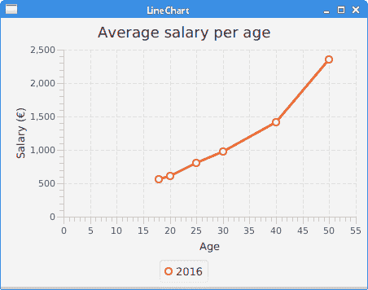
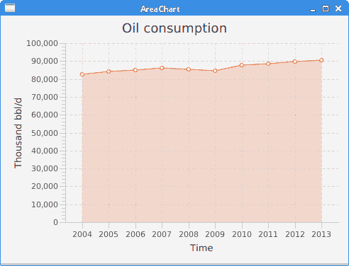
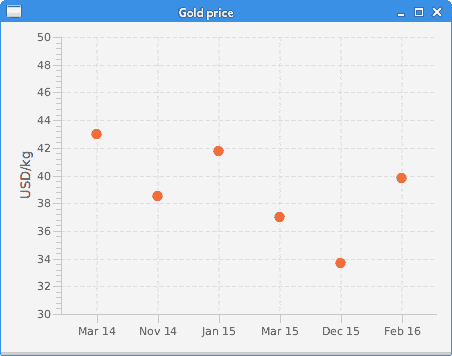
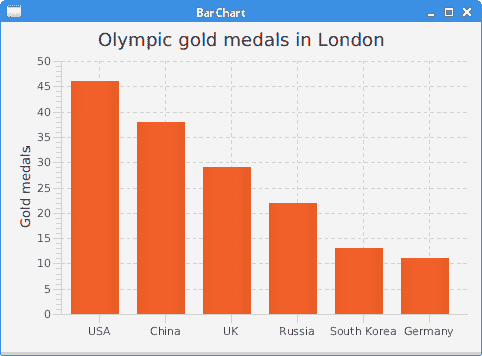
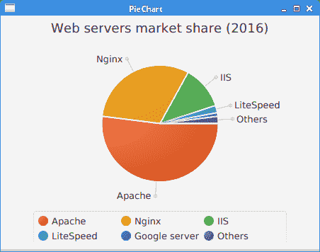

# JavaFX 图表

> 原文： [http://zetcode.com/gui/javafx/charts/](http://zetcode.com/gui/javafx/charts/)

在 JavaFX 教程的这一部分中，我们将使用图表。 在 JavaFX 中，只需添加几行代码即可构建图表。

在以下示例中，我们创建一个折线图，一个面积图，一个散点图，一个条形图和一个饼图。

## 折线图

折线图是一种基本类型的图表，它将信息显示为由直线段连接的一系列数据点。 JavaFX 中的折线图是使用`javafx.scene.chart.LineChart`创建的。

`LineChartEx.java`

```
package com.zetcode;

import javafx.application.Application;
import javafx.scene.Scene;
import javafx.scene.chart.LineChart;
import javafx.scene.chart.NumberAxis;
import javafx.scene.chart.XYChart;
import javafx.scene.layout.HBox;
import javafx.stage.Stage;

/*
 * ZetCode JavaFX tutorial
 *
 * This program creates a line chart.
 *
 * Author: Jan Bodnar 
 * Website: zetcode.com 
 * Last modified: August 2016
 */

public class LineChartEx extends Application {

    @Override
    public void start(Stage stage) {

        initUI(stage);
    }

    private void initUI(Stage stage) {

        HBox root = new HBox();

        Scene scene = new Scene(root, 450, 330);

        NumberAxis xAxis = new NumberAxis();
        xAxis.setLabel("Age");

        NumberAxis yAxis = new NumberAxis();
        yAxis.setLabel("Salary (€)");

        LineChart lineChart = new LineChart(xAxis, yAxis);
        lineChart.setTitle("Average salary per age");

        XYChart.Series data = new XYChart.Series();
        data.setName("2016");

        data.getData().add(new XYChart.Data(18, 567));
        data.getData().add(new XYChart.Data(20, 612));
        data.getData().add(new XYChart.Data(25, 800));
        data.getData().add(new XYChart.Data(30, 980));
        data.getData().add(new XYChart.Data(40, 1410));
        data.getData().add(new XYChart.Data(50, 2350));

        lineChart.getData().add(data);

        root.getChildren().add(lineChart);

        stage.setTitle("LineChart");
        stage.setScene(scene);
        stage.show();
    }

    public static void main(String[] args) {
        launch(args);
    }
}

```

在示例中，我们有一个折线图，显示每个年龄段的平均工资。

```
NumberAxis xAxis = new NumberAxis();
xAxis.setLabel("Age");

NumberAxis yAxis = new NumberAxis();
yAxis.setLabel("Salary (€)");

```

用`NumberAxis`创建两个轴。 `setLabel()`方法设置轴的描述。

```
LineChart lineChart = new LineChart(xAxis, yAxis);
lineChart.setTitle("Average salary per age");

```

`LineChart`创建折线图。 `setTitle()`方法为图表设置标题。

```
XYChart.Series data = new XYChart.Series();
data.setName("2016");

```

`XYChart.Series`为图表提供数据系列。 数据系列是数据点的列表。 每个数据点包含一个 x 值和一个 y 值。 `setName()`方法为系列命名。 （一个图表中可能有多个系列。）

```
data.getData().add(new XYChart.Data(18, 567));
data.getData().add(new XYChart.Data(20, 612));
data.getData().add(new XYChart.Data(25, 800));
data.getData().add(new XYChart.Data(30, 980));
data.getData().add(new XYChart.Data(40, 1410));
data.getData().add(new XYChart.Data(50, 2350));

```

我们将数据添加到数据系列中。 `XYChart.Data`是一个单独的数据项，其中包含 2 个轴图的数据。

```
lineChart.getData().add(data);

```

数据被插入到图表中。



Figure: LineChart

## 区域图

区域图以图形方式显示随时间变化的定量数据。

`AreaChart.java`

```
package com.zetcode;

import javafx.application.Application;
import javafx.scene.Scene;
import javafx.scene.chart.AreaChart;
import javafx.scene.chart.CategoryAxis;
import javafx.scene.chart.NumberAxis;
import javafx.scene.chart.XYChart;
import javafx.scene.layout.HBox;
import javafx.stage.Stage;

/*
 * ZetCode JavaFX tutorial
 *
 * This program creates an area chart.
 *
 * Author: Jan Bodnar 
 * Website: zetcode.com 
 * Last modified: August 2016
 */
public class AreaChartEx extends Application {

    @Override
    public void start(Stage stage) {

        initUI(stage);
    }

    private void initUI(Stage stage) {

        HBox root = new HBox();

        Scene scene = new Scene(root, 490, 350);

        CategoryAxis xAxis = new CategoryAxis();
        xAxis.setLabel("Time");

        NumberAxis yAxis = new NumberAxis();
        yAxis.setLabel("Thousand bbl/d");

        AreaChart areaChart = new AreaChart(xAxis, yAxis);
        areaChart.setTitle("Oil consumption");

        XYChart.Series data = new XYChart.Series();

        data.getData().add(new XYChart.Data("2004", 82502));
        data.getData().add(new XYChart.Data("2005", 84026));
        data.getData().add(new XYChart.Data("2006", 85007));
        data.getData().add(new XYChart.Data("2007", 86216));
        data.getData().add(new XYChart.Data("2008", 85559));
        data.getData().add(new XYChart.Data("2009", 84491));
        data.getData().add(new XYChart.Data("2010", 87672));
        data.getData().add(new XYChart.Data("2011", 88575));
        data.getData().add(new XYChart.Data("2012", 89837));
        data.getData().add(new XYChart.Data("2013", 90701));

        areaChart.getData().add(data);
        areaChart.setLegendVisible(false);

        root.getChildren().add(areaChart);

        stage.setTitle("AreaChart");
        stage.setScene(scene);
        stage.show();
    }

    public static void main(String[] args) {
        launch(args);
    }
}

```

该示例显示了一个区域图，该区域图按年份显示了世界原油消耗量。

```
AreaChart areaChart = new AreaChart(xAxis, yAxis);
areaChart.setTitle("Oil consumption");

```

使用`AreaChart`创建面积图。

```
CategoryAxis xAxis = new CategoryAxis();
xAxis.setLabel("Time");

```

`CategoryAxis`适用于字符串类别。 我们在此轴上显示年份字符串。



Figure: AreaChart

## 散点图

散点图是在水平和垂直轴上绘制的一组点。

`ScatterChartEx.java`

```
package com.zetcode;

import javafx.application.Application;
import javafx.scene.Scene;
import javafx.scene.chart.CategoryAxis;
import javafx.scene.chart.NumberAxis;
import javafx.scene.chart.ScatterChart;
import javafx.scene.chart.XYChart;
import javafx.scene.layout.HBox;
import javafx.stage.Stage;

/*
 * ZetCode JavaFX tutorial
 *
 * This program creates a scatter chart.
 *
 * Author: Jan Bodnar 
 * Website: zetcode.com 
 * Last modified: August 2016
 */
public class ScatterChartEx extends Application {

    @Override
    public void start(Stage stage) {

        initUI(stage);
    }

    private void initUI(Stage stage) {

        HBox root = new HBox();

        CategoryAxis xAxis = new CategoryAxis();

        NumberAxis yAxis = new NumberAxis("USD/kg", 30, 50, 2);

        ScatterChart scatterChart = new ScatterChart(xAxis, yAxis);

        XYChart.Series data = new XYChart.Series();

        data.getData().add(new XYChart.Data("Mar 14", 43));
        data.getData().add(new XYChart.Data("Nov 14", 38.5));
        data.getData().add(new XYChart.Data("Jan 15", 41.8));
        data.getData().add(new XYChart.Data("Mar 15", 37));
        data.getData().add(new XYChart.Data("Dec 15", 33.7));
        data.getData().add(new XYChart.Data("Feb 16", 39.8));

        scatterChart.getData().add(data);
        scatterChart.setLegendVisible(false);

        Scene scene = new Scene(root, 450, 330);

        root.getChildren().add(scatterChart);

        stage.setTitle("Gold price");
        stage.setScene(scene);
        stage.show();
    }

    public static void main(String[] args) {
        launch(args);
    }
}

```

在示例中，我们使用`ScatterChart`显示黄金价格。

```
CategoryAxis xAxis = new CategoryAxis();

```

x 轴是用于显示日期的`CategoryAxis`。

```
NumberAxis yAxis = new NumberAxis("USD/kg", 30, 50, 2);

```

y 轴是用于显示黄金价格的`NumberAxis`。 构造函数的参数为​​：轴标签，下限，上限和刻度单位。

```
XYChart.Series data = new XYChart.Series();

data.getData().add(new XYChart.Data("Mar 14", 43));
...

```

使用`XYChart.Series`创建一系列数据，并使用`XYChart.Data`创建其数据项。



Figure: ScatterChart

## 条形图

条形图显示带有矩形条的分组数据，其长度与它们所代表的值成比例。 条形图可以垂直或水平绘制。

`BarChartEx.java`

```
package com.zetcode;

import javafx.application.Application;
import javafx.scene.Scene;
import javafx.scene.chart.BarChart;
import javafx.scene.chart.CategoryAxis;
import javafx.scene.chart.NumberAxis;
import javafx.scene.chart.XYChart;
import javafx.scene.layout.HBox;
import javafx.stage.Stage;

/*
 * ZetCode JavaFX tutorial
 *
 * This program creates a bar chart.
 *
 * Author: Jan Bodnar 
 * Website: zetcode.com 
 * Last modified: August 2016
 */
public class BarChartEx extends Application {

    @Override
    public void start(Stage stage) {

        initUI(stage);
    }

    private void initUI(Stage stage) {

        HBox root = new HBox();  

        Scene scene = new Scene(root, 480, 330);
        CategoryAxis xAxis = new CategoryAxis();

        NumberAxis yAxis = new NumberAxis();
        yAxis.setLabel("Gold medals");

        BarChart barChart = new BarChart(xAxis, yAxis);
        barChart.setTitle("Olympic gold medals in London");

        XYChart.Series data = new XYChart.Series();

        data.getData().add(new XYChart.Data("USA", 46));
        data.getData().add(new XYChart.Data("China", 38));
        data.getData().add(new XYChart.Data("UK", 29));
        data.getData().add(new XYChart.Data("Russia", 22));
        data.getData().add(new XYChart.Data("South Korea", 13));
        data.getData().add(new XYChart.Data("Germany", 11));

        barChart.getData().add(data);
        barChart.setLegendVisible(false);

        root.getChildren().add(barChart);

        stage.setTitle("BarChart");
        stage.setScene(scene);
        stage.show();

    }

    public static void main(String[] args) {
        launch(args);
    }
}

```

在示例中，我们使用条形图显示了 2012 年伦敦奥运会每个国家/地区的奥运金牌数量。

```
BarChart barChart = new BarChart(xAxis, yAxis);

```

使用`BarChart`创建条形图。



Figure: AreaChart

## 饼形图

饼图是一种圆图，分为多个切片以说明数值比例。

`PieChartEx.java`

```
package com.zetcode;

import javafx.application.Application;
import javafx.collections.FXCollections;
import javafx.collections.ObservableList;
import javafx.scene.Scene;
import javafx.scene.chart.PieChart;
import javafx.scene.layout.HBox;
import javafx.stage.Stage;

/*
 * ZetCode JavaFX tutorial
 *
 * This program creates a pie chart.
 *
 * Author: Jan Bodnar 
 * Website: zetcode.com 
 * Last modified: August 2016
 */
public class PieChartEx extends Application {

    @Override
    public void start(Stage stage) {

        initUI(stage);
    }

    private void initUI(Stage stage) {

        HBox root = new HBox();

        Scene scene = new Scene(root, 450, 330);

        ObservableList<PieChart.Data> pieChartData
                = FXCollections.observableArrayList(
                        new PieChart.Data("Apache", 52),
                        new PieChart.Data("Nginx", 31),
                        new PieChart.Data("IIS", 12),
                        new PieChart.Data("LiteSpeed", 2),
                        new PieChart.Data("Google server", 1),
                        new PieChart.Data("Others", 2));

        PieChart pieChart = new PieChart(pieChartData);
        pieChart.setTitle("Web servers market share (2016)");

        root.getChildren().add(pieChart);        

        stage.setTitle("PieChart");
        stage.setScene(scene);
        stage.show();
    }

    public static void main(String[] args) {
        launch(args);
    }
}

```

该示例使用饼图来显示 Web 服务器的市场份额。

```
ObservableList<PieChart.Data> pieChartData
        = FXCollections.observableArrayList(
                new PieChart.Data("Apache", 52),
                new PieChart.Data("Nginx", 31),
                new PieChart.Data("IIS", 12),
                new PieChart.Data("LiteSpeed", 2),
                new PieChart.Data("Google server", 1),
                new PieChart.Data("Others", 2));

```

饼图数据项是使用`PieChart.Data`创建的。

```
PieChart pieChart = new PieChart(pieChartData);

```

使用`PieChart`类创建一个饼图。



Figure: PieChart

在本章中，我们在 JavaFX 中创建了`LineChart`，`AreaChart`，`ScatterChart`，`BarChart`和`PieChart`。 [JFreechart 教程](/java/jfreechart)显示了如何在流行的 JFreechart 库中创建图表。