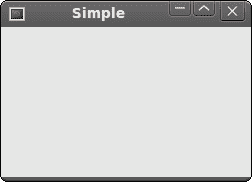
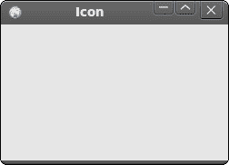
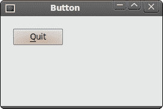
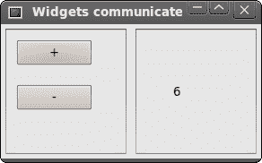

# wxWidgets 中的第一个程序

> 原文： [http://zetcode.com/gui/wxwidgets/firstprograms/](http://zetcode.com/gui/wxwidgets/firstprograms/)

在本章中，我们将介绍创建 wxWidgets 应用所需的基础知识。 我们将创建第一个简单示例，展示如何显示图标。 接下来，我们将创建一个简单的示例来演示事件的用法。 最后，我们将看到小部件如何在 wxWidgets 应用中进行通信。

## 一个简单的应用

首先，我们创建非常基本的 wxWidgets 程序。

`simple.h`

```cpp
#include <wx/wx.h>

class Simple : public wxFrame
{
public:
    Simple(const wxString& title);

};

```

`simple.cpp`

```cpp
#include "simple.h"

Simple::Simple(const wxString& title)
       : wxFrame(NULL, wxID_ANY, title, wxDefaultPosition, wxSize(250, 150))
{
  Centre();
}

```

`main.h`

```cpp
#include <wx/wx.h>

class MyApp : public wxApp
{
  public:
    virtual bool OnInit();
};

```

`main.cpp`

```cpp
#include "main.h"
#include "simple.h"

IMPLEMENT_APP(MyApp)

bool MyApp::OnInit()
{
    Simple *simple = new Simple(wxT("Simple"));
    simple->Show(true);

    return true;
}

```

这个非常基本的示例在屏幕上显示了一个小窗口。 窗口居中。

```cpp
Centre();

```

此方法使窗口在屏幕上水平和垂直居中。

```cpp
IMPLEMENT_APP(MyApp)

```

实现该应用的代码隐藏在此宏的后面。 这是复制和粘贴代码，我们通常不必关心。

```cpp
g++ main.cpp main.h simple.cpp simple.h  `wx-config --cxxflags --libs` -o simple

```

要在 Unix 上编译示例，请运行以上命令。



Figure: Simple

## 应用图标

在此示例中，我们为应用提供一个图标。 在窗口的左上角显示小图标已成为一种标准。 图标是程序的图形标识。

`icon.h`

```cpp
#include <wx/wx.h>

class Icon : public wxFrame
{
public:
    Icon(const wxString& title);

};

```

`icon.cpp`

```cpp
#include "icon.h"

Icon::Icon(const wxString& title)
       : wxFrame(NULL, wxID_ANY, title, wxDefaultPosition, wxSize(250, 150))
{
  SetIcon(wxIcon(wxT("web.xpm")));
  Centre();
}

```

`main.h`

```cpp
#include <wx/wx.h>

class MyApp : public wxApp
{
  public:
    virtual bool OnInit();
};

```

`main.cpp`

```cpp
#include "main.h"
#include "icon.h"

IMPLEMENT_APP(MyApp)

bool MyApp::OnInit()
{
    Icon *icon = new Icon(wxT("Icon"));
    icon->Show(true);

    return true;
}

```

在我们的示例中，我们显示了一个小的 Web 图标。

```cpp
SetIcon(wxIcon(wxT("web.xpm")));

```

显示应用图标仅需一行代码。 XPM（X PixMap）是 ASCII 图像格式。



Figure: Icon

## 一个简单的按钮

在下面的示例中，我们在框架小部件上创建一个按钮。 我们将展示如何创建一个简单的事件处理程序。

`button.h`

```cpp
#include <wx/wx.h>

class Button : public wxFrame
{
public:
    Button(const wxString& title);

    void OnQuit(wxCommandEvent & event);
};

```

`button.cpp`

```cpp
#include "button.h"

Button::Button(const wxString& title)
       : wxFrame(NULL, wxID_ANY, title, wxDefaultPosition, wxSize(270, 150))
{
  wxPanel *panel = new wxPanel(this, wxID_ANY);

  wxButton *button = new wxButton(panel, wxID_EXIT, wxT("Quit"), 
      wxPoint(20, 20));
  Connect(wxID_EXIT, wxEVT_COMMAND_BUTTON_CLICKED, 
      wxCommandEventHandler(Button::OnQuit));
  button->SetFocus();
  Centre();
}

void Button::OnQuit(wxCommandEvent & WXUNUSED(event))
{
    Close(true);
}

```

`main.h`

```cpp
#include <wx/wx.h>

class MyApp : public wxApp
{
  public:
    virtual bool OnInit();
};

```

`main.cpp`

```cpp
#include "main.h"
#include "button.h"

IMPLEMENT_APP(MyApp)

bool MyApp::OnInit()
{

    Button *btnapp = new Button(wxT("Button"));
    btnapp->Show(true);

    return true;
}

```

```cpp
wxPanel *panel = new wxPanel(this, wxID_ANY);

```

首先，我们创建一个`wxPanel`小部件。 它将放置在`wxFrame`小部件内。

```cpp
wxButton *button = new wxButton(panel, wxID_EXIT, wxT("Quit"), wxPoint(20, 20));

```

我们创建一个`wxButton`小部件。 它放在面板上。 我们为按钮使用预定义的`wxID_EXIT` ID。 这将导致在按钮上显示一个小的退出图标。 按钮的标签为“退出”。 手动将按钮定位在 x = 20，y = 20 坐标处。 坐标系的起点在左上角。

```cpp
Connect(wxID_EXIT, wxEVT_COMMAND_BUTTON_CLICKED, 
    wxCommandEventHandler(Button::OnQuit));

```

如果单击按钮，将生成`wxEVT_COMMAND_BUTTON_CLICKED`事件。 我们将事件连接到`Button`类的`OnQuit()`方法。 因此，当我们单击按钮时，将调用`OnQuit()`方法。

```cpp
button->SetFocus();

```

我们将键盘焦点设置为按钮。 因此，如果我们按`输入`键，则单击该按钮。

```cpp
Close(true);

```

在`OnQuit()`方法内部，我们称为`Close()`方法。 这将终止我们的应用。



Figure: Button

## 小部件通信

了解小部件如何在应用中进行通信非常重要。 请遵循下一个示例。

`Panels.h`

```cpp
#include <wx/wx.h>
#include <wx/panel.h>

class LeftPanel : public wxPanel
{
public:
    LeftPanel(wxPanel *parent);

    void OnPlus(wxCommandEvent & event);
    void OnMinus(wxCommandEvent & event);

    wxButton *m_plus;
    wxButton *m_minus;
    wxPanel *m_parent;
    int count;

};

class RightPanel : public wxPanel
{
public:
    RightPanel(wxPanel *parent);

    void OnSetText(wxCommandEvent & event);

    wxStaticText *m_text;

};

const int ID_PLUS = 101;
const int ID_MINUS = 102;

```

`Panels.cpp`

```cpp
#include <wx/stattext.h>
#include "Communicate.h"

LeftPanel::LeftPanel(wxPanel * parent)
       : wxPanel(parent, -1, wxPoint(-1, -1), wxSize(-1, -1), wxBORDER_SUNKEN)
{
  count = 0;
  m_parent = parent;
  m_plus = new wxButton(this, ID_PLUS, wxT("+"), 
      wxPoint(10, 10));
  m_minus = new wxButton(this, ID_MINUS, wxT("-"), 
      wxPoint(10, 60));
  Connect(ID_PLUS, wxEVT_COMMAND_BUTTON_CLICKED, 
      wxCommandEventHandler(LeftPanel::OnPlus));
  Connect(ID_MINUS, wxEVT_COMMAND_BUTTON_CLICKED, 
      wxCommandEventHandler(LeftPanel::OnMinus));
}

void LeftPanel::OnPlus(wxCommandEvent & WXUNUSED(event))
{
  count++;

  Communicate *comm = (Communicate *) m_parent->GetParent();
  comm->m_rp->m_text->SetLabel(wxString::Format(wxT("%d"), count));
}

void LeftPanel::OnMinus(wxCommandEvent & WXUNUSED(event))
{
  count--;

  Communicate *comm = (Communicate *) m_parent->GetParent();
  comm->m_rp->m_text->SetLabel(wxString::Format(wxT("%d"), count));
}

RightPanel::RightPanel(wxPanel * parent)
       : wxPanel(parent, wxID_ANY, wxDefaultPosition, 
         wxSize(270, 150), wxBORDER_SUNKEN)
{
    m_text = new wxStaticText(this, -1, wxT("0"), wxPoint(40, 60));
}

```

`Communicate.h`

```cpp
#include "Panels.h"
#include <wx/wxprec.h>

class Communicate : public wxFrame
{
public:
    Communicate(const wxString& title);

    LeftPanel *m_lp;
    RightPanel *m_rp;
    wxPanel *m_parent;

};

```

`Communicate.cpp`

```cpp
#include "Communicate.h"

Communicate::Communicate(const wxString& title)
       : wxFrame(NULL, wxID_ANY, title, wxDefaultPosition, wxSize(290, 150))
{
  m_parent = new wxPanel(this, wxID_ANY);

  wxBoxSizer *hbox = new wxBoxSizer(wxHORIZONTAL);

  m_lp = new LeftPanel(m_parent);
  m_rp = new RightPanel(m_parent);

  hbox->Add(m_lp, 1, wxEXPAND | wxALL, 5);
  hbox->Add(m_rp, 1, wxEXPAND | wxALL, 5);

  m_parent->SetSizer(hbox);

  this->Centre();
}

```

`main.h`

```cpp
#include <wx/wx.h>

class MyApp : public wxApp
{
  public:
    virtual bool OnInit();
};

```

`main.cpp`

```cpp
#include "main.h"
#include "Communicate.h"

IMPLEMENT_APP(MyApp)

bool MyApp::OnInit()
{

    Communicate *communicate = new Communicate(wxT("Widgets communicate"));
    communicate->Show(true);

    return true;
}

```

在我们的示例中，我们有两个面板。 左右面板。 左侧面板有两个按钮。 右侧面板有一个静态文本。 这些按钮更改静态文本中显示的数字。 问题是，我们如何抓住指向静态文本的指针？

```cpp
m_parent = parent;

```

在这里，我们将指针保存到`LeftPanel`的父窗口小部件。 这是一个`wxPanel`小部件。

```cpp
Communicate *comm = (Communicate *) m_parent->GetParent();
comm->m_rp->m_text->SetLabel(wxString::Format(wxT("%d"), count));

```

这两行是示例中最重要的行。 显示了如何访问放置在不同面板上的静态文本小部件。 首先，我们获得左右两个面板的父面板。 该父窗口小部件具有指向右侧面板的指针。 右面板上有一个指向静态文本的指针。



Figure: Widgets communicate

在 wxWidgets 教程的这一部分中，我们创建了一些简单的程序。