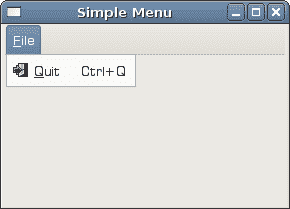
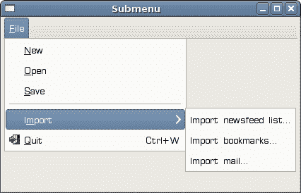
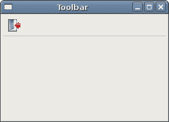
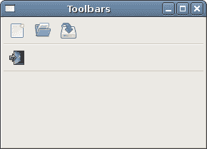

# wxWidgets 中的菜单和工具栏

> 原文： [http://zetcode.com/gui/wxwidgets/menustoolbars/](http://zetcode.com/gui/wxwidgets/menustoolbars/)

菜单栏是 GUI 应用中最可见的部分之一。 它是位于各个菜单中的一组命令。 在控制台应用中，您必须记住所有这些神秘命令，在这里，我们将大多数命令分组为逻辑部分。 有公认的标准可以进一步减少学习新应用的时间。 要在 wxWidgets 中实现菜单栏，我们需要三个类：`wxMenuBar`，`wxMenu`和`wxMenuItem`。

## 简单菜单示例

在 wxWidgets 中创建菜单栏非常简单。

`menu.h`

```cpp
#include <wx/wx.h>
#include <wx/menu.h>

class SimpleMenu : public wxFrame
{
public:
    SimpleMenu(const wxString& title);

    void OnQuit(wxCommandEvent& event);

    wxMenuBar *menubar;
    wxMenu *file;

};

```

`menu.cpp`

```cpp
#include "menu.h"

SimpleMenu::SimpleMenu(const wxString& title)
       : wxFrame(NULL, wxID_ANY, title, wxDefaultPosition, wxSize(280, 180))
{

  menubar = new wxMenuBar;
  file = new wxMenu;
  file->Append(wxID_EXIT, wxT("&Quit"));
  menubar->Append(file, wxT("&File"));
  SetMenuBar(menubar);

  Connect(wxID_EXIT, wxEVT_COMMAND_MENU_SELECTED,
      wxCommandEventHandler(SimpleMenu::OnQuit));
  Centre();

}

void SimpleMenu::OnQuit(wxCommandEvent& WXUNUSED(event))
{
  Close(true);
}

```

`main.h`

```cpp
#include <wx/wx.h>

class MyApp : public wxApp
{
  public:
    virtual bool OnInit();
};

```

`main.cpp`

```cpp
#include "main.h"
#include "menu.h"

IMPLEMENT_APP(MyApp)

bool MyApp::OnInit()
{

    SimpleMenu *menu = new SimpleMenu(wxT("Simple Menu"));
    menu->Show(true);

    return true;
}

```

```cpp
menubar = new wxMenuBar;

```

首先，我们创建一个菜单栏对象。

```cpp
file = new wxMenu;

```

接下来，我们创建一个菜单对象。

```cpp
file->Append(wxID_EXIT, wxT("&Quit"));

```

我们将菜单项添加到菜单对象中。 第一个参数是菜单项的 ID。 第二个参数是菜单项的名称。 在这里，我们没有明确创建一个`wxMenuItem`。 它是通过`Append()`方法在后台创建的。 稍后，我们将手动创建`wxMenuItem`。

```cpp
menubar->Append(file, wxT("&File"));
SetMenuBar(menubar);

```

之后，我们将菜单添加到菜单栏中。 &字符创建一个加速键。 带下划线的&后面的字符。 这样，可以通过 `Alt + F` 快捷方式访问菜单。 最后，我们调用`SetMenuBar()`方法。 该方法属于`wxFrame`小部件。 它设置菜单栏。



Figure: Simple menu example

## 子菜单

每个菜单也可以有一个子菜单。 这样，我们可以将类似的命令分组。 例如，我们可以将隐藏或显示各种工具栏（例如个人栏，地址栏，状态栏或导航栏）的命令放置在称为工具栏的子菜单中。 在菜单中，我们可以使用分隔符来分隔命令。 这是一条简单的线。 通常的做法是使用单个分隔符将命令（例如新建，打开，保存）与命令（例如打印，打印预览）分开。 在我们的示例中，我们将看到如何创建子菜单和菜单分隔符。

`menu.h`

```cpp
#include <wx/wx.h>
#include <wx/menu.h>

class SubMenu : public wxFrame
{
public:
  SubMenu(const wxString& title);

  void OnQuit(wxCommandEvent & event);

  wxMenuBar *menubar;
  wxMenu *file;
  wxMenu *imp;
  wxMenuItem *quit;

};

```

`menu.cpp`

```cpp
#include "menu.h"

SubMenu::SubMenu(const wxString& title)
       : wxFrame(NULL, wxID_ANY, title, wxDefaultPosition, wxSize(280, 180))
{

  menubar = new wxMenuBar;
  file = new wxMenu;

  file->Append(wxID_ANY, wxT("&New"));
  file->Append(wxID_ANY, wxT("&Open"));
  file->Append(wxID_ANY, wxT("&Save"));
  file->AppendSeparator();

  imp = new wxMenu;
  imp->Append(wxID_ANY, wxT("Import newsfeed list..."));
  imp->Append(wxID_ANY, wxT("Import bookmarks..."));
  imp->Append(wxID_ANY, wxT("Import mail..."));

  file->AppendSubMenu(imp, wxT("I&mport"));

  quit = new wxMenuItem(file, wxID_EXIT, wxT("&Quit\tCtrl+W"));
  file->Append(quit);

  menubar->Append(file, wxT("&File"));
  SetMenuBar(menubar);

  Connect(wxID_EXIT, wxEVT_COMMAND_MENU_SELECTED, 
      wxCommandEventHandler(SubMenu::OnQuit));
  Centre();

}

void SubMenu::OnQuit(wxCommandEvent& WXUNUSED(event))
{
  Close(true);
}

```

`main.h`

```cpp
#include <wx/wx.h>

class MyApp : public wxApp
{
  public:
    virtual bool OnInit();
};

```

`main.cpp`

```cpp
#include "main.h"
#include "menu.h"

IMPLEMENT_APP(MyApp)

bool MyApp::OnInit()
{

    SubMenu *smenu = new SubMenu(wxT("Submenu"));
    smenu->Show(true);

    return true;
}

```

我们在文件菜单中创建了一个子菜单。 这是一个导入子菜单，可以在 Opera Web 浏览器中看到。

```cpp
file->AppendSeparator();

```

创建菜单分隔线，并调用`AppendSeparator()`方法。

```cpp
imp = new wxMenu;
imp->Append(wxID_ANY, wxT("Import newsfeed list..."));
imp->Append(wxID_ANY, wxT("Import bookmarks..."));
imp->Append(wxID_ANY, wxT("Import mail..."));

file->AppendSubMenu(imp, wxT("I&mport"));

```

子菜单的创建类似于普通菜单。 它附有`AppendSubMenu()`方法。



Figure: Submenu

## 工具栏

菜单将我们可以在应用中使用的所有命令分组。 使用工具栏可以快速访问最常用的命令。

```cpp
virtual wxToolBar* wxFrame::CreateToolBar(long style = wxTB_DEFAULT_STYLE,
    wxWindowID id = wxID_ANY, const wxString & name = wxToolBarNameStr)

```

要创建工具栏，我们调用框架窗口小部件的`CreateToolBar()`方法。

## 一个简单的工具栏

我们的第一个示例将创建一个简单的工具栏。

`toolbar.h`

```cpp
#include <wx/wx.h>

class Toolbar : public wxFrame
{
public:
    Toolbar(const wxString& title);

    void OnQuit(wxCommandEvent& event);
};

```

`toolbar.cpp`

```cpp
#include "toolbar.h"

Toolbar::Toolbar(const wxString& title)
       : wxFrame(NULL, wxID_ANY, title, 
                 wxDefaultPosition, wxSize(300, 250)) {

    wxImage::AddHandler(new wxPNGHandler);

    wxBitmap exit(wxT("exit.png"), wxBITMAP_TYPE_PNG);

    wxToolBar *toolbar = CreateToolBar();
    toolbar->AddTool(wxID_EXIT, wxT("Exit application"), exit);
    toolbar->Realize();

    Connect(wxID_EXIT, wxEVT_COMMAND_TOOL_CLICKED, 
        wxCommandEventHandler(Toolbar::OnQuit));
}

void Toolbar::OnQuit(wxCommandEvent& WXUNUSED(event)) {

    Close(true);
}

```

`main.h`

```cpp
#include <wx/wx.h>

class MyApp : public wxApp {

    public:
        virtual bool OnInit();
};

```

`main.cpp`

```cpp
#include "main.h"
#include "toolbar.h"

IMPLEMENT_APP(MyApp)

bool MyApp::OnInit() {

    Toolbar *toolbar = new Toolbar(wxT("Toolbar"));
    toolbar->Show(true);

    return true;
}

```

在我们的示例中，我们创建了一个工具栏和一个工具按钮。 单击工具栏按钮将终止应用。

```cpp
wxToolBar *toolbar = CreateToolBar();

```

我们创建一个工具栏。

```cpp
toolbar->AddTool(wxID_EXIT, wxT("Exit application"), exit);

```

我们将工具添加到工具栏。

```cpp
toolbar->Realize();

```

添加工具后，我们将调用`Realize()`方法。



Figure: Toolbar

#### 工具栏

如果我们要拥有多个工具栏，则必须以其他方式创建它们，例如 除了调用`CreateToolbar()`方法。

`toolbars.h`

```cpp
#include <wx/wx.h>

class Toolbar : public wxFrame {

    public:
        Toolbar(const wxString& title);

        void OnQuit(wxCommandEvent& event);

        wxToolBar *toolbar1;
        wxToolBar *toolbar2;
};

```

`toolbars.cpp`

```cpp
#include "toolbars.h"

Toolbar::Toolbar(const wxString& title)
       : wxFrame(NULL, wxID_ANY, title, 
                 wxDefaultPosition, wxSize(300, 250)) {

    wxImage::AddHandler(new wxPNGHandler);

    wxBitmap exit(wxT("exit.png"), wxBITMAP_TYPE_PNG);
    wxBitmap newb(wxT("new.png"), wxBITMAP_TYPE_PNG);
    wxBitmap open(wxT("open.png"), wxBITMAP_TYPE_PNG);
    wxBitmap save(wxT("save.png"), wxBITMAP_TYPE_PNG);

    wxBoxSizer *vbox = new wxBoxSizer(wxVERTICAL);

    toolbar1 = new wxToolBar(this, wxID_ANY);
    toolbar1->AddTool(wxID_ANY, wxT("New"), newb);
    toolbar1->AddTool(wxID_ANY, wxT("Open"), open);
    toolbar1->AddTool(wxID_ANY, wxT(""), save);
    toolbar1->Realize();

    toolbar2 = new wxToolBar(this, wxID_ANY);
    toolbar2->AddTool(wxID_EXIT, wxT("Exit application"), exit);
    toolbar2->Realize();

    vbox->Add(toolbar1, 0, wxEXPAND);
    vbox->Add(toolbar2, 0, wxEXPAND);

    SetSizer(vbox);

    Connect(wxID_EXIT, wxEVT_COMMAND_TOOL_CLICKED, 
        wxCommandEventHandler(Toolbar::OnQuit));
}

void Toolbar::OnQuit(wxCommandEvent& WXUNUSED(event)) {

    Close(true);
}

```

`main.h`

```cpp
#include <wx/wx.h>

class MyApp : public wxApp {

    public:
        virtual bool OnInit();
};

```

`main.cpp`

```cpp
#include "main.h"
#include "toolbars.h"

IMPLEMENT_APP(MyApp)

bool MyApp::OnInit() {

    Toolbar *toolbar = new Toolbar(wxT("Toolbar"));
    toolbar->Show(true);

    return true;
}

```

在我们的示例中，我们创建了两个水平工具栏。 我们将它们放置在垂直包装机上。

```cpp
toolbar1 = new wxToolBar(this, wxID_ANY);
...
toolbar2 = new wxToolBar(this, wxID_ANY);

```

在这里，我们创建两个工具栏。

```cpp
vbox->Add(toolbar1, 0, wxEXPAND);
vbox->Add(toolbar2, 0, wxEXPAND);

```

在这里，我们将它们添加到垂直框大小调整器中。



Figure: Toolbars

在 wxWidgets 教程的这一部分中，我们介绍了菜单和工具栏。