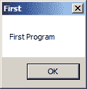
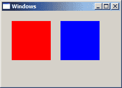
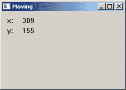

# UI 的第一步

> 原文： [http://zetcode.com/gui/winapi/firststeps/](http://zetcode.com/gui/winapi/firststeps/)

在 Windows API 教程的这一部分中，我们将创建一些简单的 UI 示例。

## 简单的程序

这是一个非常简单的程序。 它将弹出一个小对话框。

`simple.c`

```c
#include <windows.h>

int WINAPI wWinMain(HINSTANCE hInstance, HINSTANCE hPrevInstance, 
                    PWSTR pCmdLine, int CmdShow) {

    MessageBoxW(NULL, L"First Program", L"First", MB_OK);

    return 0;
}

```

屏幕上会显示一个小对话框。 它具有标题，消息和“确定”按钮。

```c
#include <windows.h>

```

我们包括基本的函数声明，常量，数据类型和结构。

```c
int WINAPI wWinMain(HINSTANCE hInstance, HINSTANCE hPrevInstance, 
                    PWSTR pCmdLine, int CmdShow)

```

`wWinMain()`函数是我们应用的入口。

```c
MessageBoxW(NULL, L"First Program", L"First", MB_OK);

```

`MessageBoxW()`函数显示一个简单的消息框。 第一个参数是所有者窗口。 在我们的情况下，该对话框没有所有者。 接下来的两个参数提供消息文本和标题。 最后一个参数定义消息对话框的类型。 `MB_OK`值使对话框具有一个“确定”按钮。



图：简单 message box

## 使窗口居中

在下一个代码示例中，我们将窗口置于屏幕中央。 `SetWindowPos()`函数更改子项，弹出窗口或顶级窗口的大小，位置和 Z 顺序。

```c
BOOL WINAPI SetWindowPos(HWND hWnd, HWND hWndInsertAfter, int x, int y,
    int cx, int cy, UINT uFlags);

```

第一个参数是窗口的句柄。 第二个参数是窗口的句柄，该窗口的句柄以 Z 顺序或特殊标志位于定位的窗口之前。 例如，`HWND_BOTTOM`标志将窗口置于 Z 顺序的底部，`HWND_TOP`标志置于 Z 顺序的顶部。 `x`和`y`参数是客户端坐标中窗口左侧和顶部的新位置。 `cx`和`cy`是窗口的新宽度和高度大小，以像素为单位。 最后一个参数是大小和位置标志的组合。 例如`SWP_NOMOVE`保留当前位置（忽略`x`和`y`参数）或`SWP_NOSIZE`保留当前大小（忽略`cx`和`cy`参数）。

`centering.c`

```c
#include <windows.h>

LRESULT CALLBACK WndProc(HWND, UINT, WPARAM, LPARAM);
void CenterWindow(HWND);

int WINAPI wWinMain(HINSTANCE hInstance, HINSTANCE hPrevInstance,
                    PWSTR pCmdLine, int nCmdShow) {

    MSG  msg;    
    WNDCLASSW wc = {0};
    wc.lpszClassName = L"Center";
    wc.hInstance     = hInstance;
    wc.hbrBackground = GetSysColorBrush(COLOR_3DFACE);
    wc.lpfnWndProc   = WndProc;
    wc.hCursor       = LoadCursor(0, IDC_ARROW);

    RegisterClassW(&wc);
    CreateWindowW(wc.lpszClassName, L"Center",
                  WS_OVERLAPPEDWINDOW | WS_VISIBLE,
                  100, 100, 250, 150, 0, 0, hInstance, 0);  

    while (GetMessage(&msg, NULL, 0, 0)) {

        TranslateMessage(&msg);
        DispatchMessage(&msg);
    }

    return (int) msg.wParam;
}

LRESULT CALLBACK WndProc(HWND hwnd, UINT msg,
    WPARAM wParam, LPARAM lParam) {

    switch(msg) {

        case WM_CREATE: 

            CenterWindow(hwnd);
            break;      

        case WM_DESTROY: 

            PostQuitMessage(0);
            break;
    }

    return DefWindowProcW(hwnd, msg, wParam, lParam);
}

void CenterWindow(HWND hwnd) {

    RECT rc = {0};

    GetWindowRect(hwnd, &rc);
    int win_w = rc.right - rc.left;
    int win_h = rc.bottom - rc.top;

    int screen_w = GetSystemMetrics(SM_CXSCREEN);
    int screen_h = GetSystemMetrics(SM_CYSCREEN);

    SetWindowPos(hwnd, HWND_TOP, (screen_w - win_w)/2, 
        (screen_h - win_h)/2, 0, 0, SWP_NOSIZE);
}

```

为了使窗口在屏幕上居中，我们需要确定窗口和屏幕的大小。

```c
case WM_CREATE: 

    CenterWindow(hwnd);
    break;  

```

我们在`WM_CREATE`消息期间调用用户定义的`CenterWindow()`函数。

```c
GetWindowRect(hwnd, &rc) ;

```

使用`GetWindowRect()`函数，我们检索指定窗口的边界矩形的大小。

```c
int win_w = rc.right - rc.left;
int win_h = rc.bottom - rc.top;

```

计算窗口的宽度和高度。

```c
int screen_w = GetSystemMetrics(SM_CXSCREEN)
int screen_h = GetSystemMetrics(SM_CYSCREEN);

```

通过`GetSystemMetrics()`函数，我们可以确定屏幕的宽度和高度。

```c
SetWindowPos(hwnd, HWND_TOP, (screen_w - win_w)/2, 
    (screen_h - win_h)/2, 0, 0, SWP_NOSIZE);

```

我们使用`SetWindowPos()`函数将应用窗口放置在屏幕中央。

## 热键

在以下示例中，我们显示了如何注册热键。 热键是用于执行特定操作的组合键。 热键已通过`RegisterHotKey()`函数注册。

```c
BOOL WINAPI RegisterHotKey(HWND hWnd, int id, UINT fsModifiers, UINT vk);

```

第一个参数是窗口的句柄，该窗口将接收由热键生成的`WM_HOTKEY`消息。 第二个参数是热键的 ID。 第三个参数由修饰符组成； 必须将这些键与`vk`参数指定的键组合在一起才能生成`WM_HOTKEY`消息。 改性剂的实例包括`MOD_ALT`或`MOD_CONTROL`。 最后一个参数是热键的虚拟键代码。

`hotkey.c`

```c
#include <windows.h>

LRESULT CALLBACK WndProc(HWND, UINT, WPARAM, LPARAM);
void CenterWindow(HWND);

#define ID_HOTKEY 1

int WINAPI wWinMain(HINSTANCE hInstance, HINSTANCE hPrevInstance,
                    PWSTR lpCmdLine, int nCmdShow) {

    HWND hwnd;
    MSG  msg;    
    WNDCLASSW wc = {0};
    wc.lpszClassName = L"Application";
    wc.hInstance     = hInstance;
    wc.hbrBackground = GetSysColorBrush(COLOR_3DFACE);
    wc.lpfnWndProc   = WndProc;
    wc.hCursor       = LoadCursor(0, IDC_ARROW);

    RegisterClassW(&wc);
    hwnd = CreateWindowW(wc.lpszClassName, L"Hot key",
                  WS_OVERLAPPEDWINDOW | WS_VISIBLE,
                  100, 100, 270, 170, 0, 0, 0, 0);  

    while (GetMessage(&msg, NULL, 0, 0)) {

        TranslateMessage(&msg);
        DispatchMessage(&msg);
    }

    return (int) msg.wParam;
}

LRESULT CALLBACK WndProc(HWND hwnd, UINT msg, 
        WPARAM wParam, LPARAM lParam) {

    switch(msg) {

        case WM_CREATE:

              RegisterHotKey(hwnd, ID_HOTKEY, MOD_CONTROL, 0x43);
              break;

        case WM_HOTKEY:

            if ((wParam) == ID_HOTKEY) {

                CenterWindow(hwnd);
            }

            break;

        case WM_DESTROY:

            UnregisterHotKey(hwnd, ID_HOTKEY);
            PostQuitMessage(0);            
            break; 
    }

    return DefWindowProcW(hwnd, msg, wParam, lParam);
}

void CenterWindow(HWND hwnd) {

    RECT rc = {0};

    GetWindowRect(hwnd, &rc);
    int win_w = rc.right - rc.left;
    int win_h = rc.bottom - rc.top;

    int screen_w = GetSystemMetrics(SM_CXSCREEN);
    int screen_h = GetSystemMetrics(SM_CYSCREEN);

    SetWindowPos(hwnd, HWND_TOP, (screen_w - win_w)/2, 
        (screen_h - win_h)/2, 0, 0, SWP_NOSIZE);
}

```

在示例中，我们注册了 `Ctrl + C` 热键。 它将窗口居中在屏幕上。

```c
case WM_CREATE:

      RegisterHotKey(hwnd, ID_HOTKEY, MOD_CONTROL, 0x43);
      break;

```

在创建窗口的过程中，我们使用`RegisterHotKey()`函数注册了 `Ctrl + C` 热键。

```c
case WM_HOTKEY:

    if ((wParam) == ID_HOTKEY) {

        CenterWindow(hwnd);
    }

    break;

```

调用热键时会生成`WM_HOTKEY`消息。 我们通过检查`wParam`参数来识别我们的热键，然后调用`CenterWindow()`函数。

```c
case WM_DESTROY:

    UnregisterHotKey(hwnd, ID_HOTKEY);
    PostQuitMessage(0);            
    break; 

```

当窗口被破坏时，我们使用`UnregisterHotKey()`函数取消注册热键。 MSDN 尚不清楚是否必须调用此函数。

## 更多窗口

从特定的窗口类创建一个窗口。 窗口类定义了几个窗口共有的一组行为。 一些类已经在系统中预定义。 自定义窗口类必须注册。 之后，我们可以创建此新窗口类的窗口。 使用`CreateWindowW()`函数创建一个窗口。 它的第一个参数是窗口类名称。

每个窗口都有一个窗口过程。 当用户与窗口交互时，此函数由 OS 调用。 在下面的示例中，我们创建三个窗口：一个父窗口和两个子窗口。

`morewindows.c`

```c
#include <windows.h>

LRESULT CALLBACK WndProc(HWND, UINT, WPARAM, LPARAM);
LRESULT CALLBACK PanelProc(HWND, UINT, WPARAM, LPARAM);

void RegisterRedPanelClass(void);
void RegisterBluePanelClass(void);

int WINAPI wWinMain(HINSTANCE hInstance, HINSTANCE hPrevInstance,
                    PWSTR lpCmdLine, int nCmdShow) {
    MSG  msg;    
    WNDCLASSW wc = {0};
    wc.lpszClassName = L"Windows";
    wc.hInstance     = hInstance;
    wc.hbrBackground = GetSysColorBrush(COLOR_3DFACE);
    wc.lpfnWndProc   = WndProc;
    wc.hCursor       = LoadCursor(0, IDC_ARROW);

    RegisterClassW(&wc);
    CreateWindowW(wc.lpszClassName, L"Windows",
                  WS_OVERLAPPEDWINDOW | WS_VISIBLE,
                  100, 100, 250, 180, 0, 0, hInstance, 0);  

    while (GetMessage(&msg, NULL, 0, 0)) {

        TranslateMessage(&msg);
        DispatchMessage(&msg);
    }

    return (int) msg.wParam;
}

LRESULT CALLBACK WndProc(HWND hwnd, UINT msg, 
    WPARAM wParam, LPARAM lParam) {    

    switch(msg) {

        case WM_CREATE:

            RegisterRedPanelClass();

            CreateWindowW(L"RedPanelClass", NULL, 
                          WS_CHILD | WS_VISIBLE,
                          20, 20, 80, 80,
                          hwnd, (HMENU) 1, NULL, NULL);

            RegisterBluePanelClass();

            CreateWindowW(L"BluePanelClass", NULL, 
                          WS_CHILD | WS_VISIBLE,
                          120, 20, 80, 80,
                          hwnd, (HMENU) 2, NULL, NULL);
            break;

        case WM_DESTROY:

            PostQuitMessage(0);
            return 0; 
    }

    return DefWindowProcW(hwnd, msg, wParam, lParam);
}

LRESULT CALLBACK PanelProc(HWND hwnd, UINT msg, 
    WPARAM wParam, LPARAM lParam) {

    switch(msg) {

        case WM_LBUTTONUP:

            MessageBeep(MB_OK);
            break;    
    }

    return DefWindowProcW(hwnd, msg, wParam, lParam);
}

void RegisterRedPanelClass(void) {

    HBRUSH hbrush = CreateSolidBrush(RGB(255, 0, 0));

    WNDCLASSW rwc = {0};

    rwc.lpszClassName = L"RedPanelClass";
    rwc.hbrBackground = hbrush;
    rwc.lpfnWndProc   = PanelProc;
    rwc.hCursor       = LoadCursor(0, IDC_ARROW);
    RegisterClassW(&rwc); 
}

void RegisterBluePanelClass(void) {

    HBRUSH hbrush = CreateSolidBrush(RGB(0, 0, 255));

    WNDCLASSW rwc = {0};

    rwc.lpszClassName = L"BluePanelClass";
    rwc.hbrBackground = hbrush;
    rwc.lpfnWndProc   = PanelProc;
    rwc.hCursor       = LoadCursor(0, IDC_ARROW);

    RegisterClassW(&rwc);
}

```

我们有一个带有两个子窗口的应用窗口。 两个子窗口具有蓝色和红色背景。

```c
HBRUSH hbrush = CreateSolidBrush(RGB(255, 0, 0));
...
rwc.hbrBackground = hbrush;

```

要创建彩色窗口背景，我们通过调用`CreateSolidBrush()`函数来创建自定义的实心画笔。 要指定颜色，我们使用`RGB`宏。 众所周知，可以通过组合红色，绿色和蓝色来创建任何颜色。 然后，将窗口类结构的`hbrBackground`参数设置为此新创建的画笔。

```c
RegisterRedPanelClass();

CreateWindowW(L"RedPanelClass", NULL, 
                WS_CHILD | WS_VISIBLE,
                20, 20, 80, 80,
                hwnd, (HMENU) 1, NULL, NULL);

```

首先，我们注册一个新的窗口类。 完成此步骤后，我们将创建此类的窗口。

我们的两个子窗口都共享`PanelProc`窗口过程。 当我们与 Windows OS 进行交互时，将调用此过程。

```c
case WM_LBUTTONUP:

    MessageBeep(MB_OK);
    break;    

```

单击子窗口时，我们将与它们交互。 通过在子窗口上单击鼠标左键，Windows 操作系统将调用子窗口过程并发送`WM_LBUTTONUP`消息。 在我们的示例中，我们调用`MessageBeep()`函数。 如果我们在两个子窗口的背景上单击鼠标左键，则会听到 Windows 默认的蜂鸣声。

```c
void RegisterBluePanelClass(void) {

    HBRUSH hbrush = CreateSolidBrush(RGB(0, 0, 255));

    WNDCLASSW rwc = {0};

    rwc.lpszClassName = L"BluePanelClass";
    rwc.hbrBackground = hbrush;
    rwc.lpfnWndProc   = PanelProc;
    rwc.hCursor       = LoadCursor(0, IDC_ARROW);

    RegisterClassW(&rwc);
} 

```

该函数注册一个新的窗口类。 此窗口类类型的窗口具有红色背景。 编辑，按钮和静态控件是从预定义的窗口类创建的，这些窗口类已可用于所有进程。 因此，在这些情况下，我们不需要为其注册窗口类。



图：更多窗口

## 退出键

通常，通过按 `Escape` 键可以终止应用。 还显示一个消息框以确认终止。

`escapekey.c`

```c
#include <windows.h>

LRESULT CALLBACK WndProc(HWND, UINT, WPARAM, LPARAM);

int WINAPI wWinMain(HINSTANCE hInstance, HINSTANCE hPrevInstance, 
                    PWSTR pCmdLine, int CmdShow) {

    MSG  msg;    
    WNDCLASSW wc = {0};
    wc.lpszClassName = L"Escape";
    wc.hInstance     = hInstance;
    wc.hbrBackground = GetSysColorBrush(COLOR_3DFACE);
    wc.lpfnWndProc   = WndProc;
    wc.hCursor       = LoadCursor(0, IDC_ARROW);

    RegisterClassW(&wc);
    CreateWindowW(wc.lpszClassName, L"Escape",
                  WS_OVERLAPPEDWINDOW | WS_VISIBLE,
                  100, 100, 250, 180, 0, 0, hInstance, 0);  

  while (GetMessage(&msg, NULL, 0, 0)) {

      TranslateMessage(&msg);
      DispatchMessage(&msg);
  }

  return (int) msg.wParam;
}

LRESULT CALLBACK WndProc(HWND hwnd, UINT msg, 
    WPARAM wParam, LPARAM lParam) {

    switch(msg) {

        case WM_KEYDOWN:

            if (wParam == VK_ESCAPE) {

                int ret = MessageBoxW(hwnd, L"Are you sure to quit?", 
                                  L"Message", MB_OKCANCEL);

                if (ret == IDOK) {

                    SendMessage(hwnd, WM_CLOSE, 0, 0);
                }
             }

             break;

        case WM_DESTROY:

            PostQuitMessage(0);
            break; 
    }

    return DefWindowProcW(hwnd, msg, wParam, lParam);
}

```

询问用户是否确实要关闭应用是一种常见的做法。 如果我们有时钟或计算器，那就没关系了。 但是，如果我们有文本编辑器或绘图应用，那确实很重要。 我们可能不小心按了 `Escape` 键并失去了所有修改。

```c
case WM_KEYDOWN:

    if (wParam == VK_ESCAPE) {

        int ret = MessageBoxW(hwnd, L"Are you sure to quit?", 
                            L"Message", MB_OKCANCEL);

        if (ret == IDOK) {

            SendMessage(hwnd, WM_CLOSE, 0, 0);
        }
    }

    break;

```

如果我们按一个键，则窗口过程会收到`WM_KEYDOWN`消息。 `wParam`参数具有键码。 我们可以通过发送`WM_CLOSE`消息来关闭窗口。 该消息通过`SendMessage()`函数发送。

## 移动窗口

当我们在屏幕上移动窗口时，窗口过程会收到`WM_MOVE`消息。 在我们的示例中，我们在屏幕上显示当前窗口的位置-我们显示窗口左上角的坐标。

`moving.c`

```c
#include <windows.h>
#include <wchar.h>

LRESULT CALLBACK WndProc(HWND, UINT, WPARAM, LPARAM);
void CreateLabels(HWND);

HWND hwndSta1;
HWND hwndSta2;

int WINAPI wWinMain(HINSTANCE hInstance, HINSTANCE hPrevInstance, 
                    PWSTR pCmdLine, int CmdShow) {
    HWND hwnd;
    MSG  msg;

    WNDCLASSW wc = {0};
    wc.lpszClassName = L"Moving";
    wc.hInstance     = hInstance ;
    wc.hbrBackground = GetSysColorBrush(COLOR_3DFACE);
    wc.lpfnWndProc   = WndProc;
    wc.hCursor       = LoadCursor(0, IDC_ARROW);

    RegisterClassW(&wc);
    hwnd = CreateWindowW(wc.lpszClassName, L"Moving",
                         WS_OVERLAPPEDWINDOW | WS_VISIBLE,
                         150, 150, 250, 180, 0, 0, hInstance, 0);

    while(GetMessage(&msg, NULL, 0, 0)) {

        TranslateMessage(&msg);
        DispatchMessage(&msg);
    }

    return (int) msg.wParam;
}

LRESULT CALLBACK WndProc(HWND hwnd, UINT msg, 
    WPARAM wParam, LPARAM lParam) {

    wchar_t buf[10];
    RECT rect;

    switch(msg) {

      case WM_CREATE:

        CreateLabels(hwnd);
        break;

      case WM_MOVE:

        GetWindowRect(hwnd, &rect);

        StringCbPrintfW(buf, BUF_LEN, L"%ld", rect.left);  
        SetWindowTextW(hwndSta1, buf);

        StringCbPrintfW(buf, BUF_LEN, L"%ld", rect.top);  
        SetWindowTextW(hwndSta2, buf);

        break;

      case WM_DESTROY:

        PostQuitMessage(0);
        break; 
    }

    return DefWindowProcW(hwnd, msg, wParam, lParam);
}

void CreateLabels(HWND hwnd) {

    CreateWindowW(L"static", L"x: ",
        WS_CHILD | WS_VISIBLE,
        10, 10, 25, 25, 
        hwnd, (HMENU) 1, NULL, NULL);

    hwndSta1 = CreateWindowW(L"static", L"150",
        WS_CHILD | WS_VISIBLE,
        40, 10, 55, 25, 
       hwnd, (HMENU) 2, NULL, NULL);

    CreateWindowW(L"static", L"y: ",
        WS_CHILD | WS_VISIBLE,
        10, 30, 25, 25, 
        hwnd, (HMENU) 3, NULL, NULL);

    hwndSta2 = CreateWindowW(L"static", L"150",
        WS_CHILD | WS_VISIBLE,
        40, 30, 55, 25, 
        hwnd, (HMENU) 4, NULL, NULL);
}

```

静态文本控件的创建委托给`CreateLabels()`函数。

```c
void CreateLabels(HWND hwnd) {

    CreateWindowW(L"static", L"x: ",
        WS_CHILD | WS_VISIBLE,
        10, 10, 25, 25, 
        hwnd, (HMENU) 1, NULL, NULL);

    hwndSta1 = CreateWindowW(L"static", L"150",
        WS_CHILD | WS_VISIBLE,
        40, 10, 55, 25, 
       hwnd, (HMENU) 2, NULL, NULL);

    CreateWindowW(L"static", L"y: ",
        WS_CHILD | WS_VISIBLE,
        10, 30, 25, 25, 
        hwnd, (HMENU) 3, NULL, NULL);

    hwndSta2 = CreateWindowW(L"static", L"150",
        WS_CHILD | WS_VISIBLE,
        40, 30, 55, 25, 
        hwnd, (HMENU) 4, NULL, NULL);
}

```

有四个静态文本控件。 在应用的生命周期中，其中两个会更改。 因此，我们只需要两个句柄。

```c
case WM_MOVE:

  GetWindowRect(hwnd, &rect);

  StringCbPrintfW(buf, BUF_LEN, L"%ld", rect.left);  
  SetWindowTextW(hwndSta1, buf);

  StringCbPrintfW(buf, BUF_LEN, L"%ld", rect.top);  
  SetWindowTextW(hwndSta2, buf);

  break;

```

要获取窗口坐标，我们调用`GetWindowRect()`函数。 由于坐标是数字，因此必须将其转换为字符串。 为此，我们使用`StringCbPrintfW()`函数。



图：移动窗口

## 闪烁窗口

有时，当发生重要事件时，标题栏或任务栏按钮开始闪烁。 闪烁是标题栏从非活动状态更改为活动状态，反之亦然。 当我们收到新消息时，这是 Miranda IM 中的常见功能。

`flashing.c`

```c
#include <windows.h>

LRESULT CALLBACK WndProc(HWND, UINT, WPARAM, LPARAM);

int WINAPI wWinMain(HINSTANCE hInstance, HINSTANCE hPrevInstance,
                    PWSTR lpCmdLine, int nCmdShow) {
    MSG  msg;    
    WNDCLASSW wc = {0};
    wc.lpszClassName = L"Flash";
    wc.hInstance     = hInstance;
    wc.hbrBackground = GetSysColorBrush(COLOR_3DFACE);
    wc.lpfnWndProc   = WndProc;
    wc.hCursor       = LoadCursor(0,IDC_ARROW);

    RegisterClassW(&wc);
    CreateWindowW(wc.lpszClassName, L"Flash",
                 WS_OVERLAPPEDWINDOW | WS_VISIBLE,
                 100, 100, 250, 180, 0, 0, hInstance, 0);

    while(GetMessage(&msg, NULL, 0, 0)) {

      TranslateMessage(&msg);
      DispatchMessage(&msg);
    }

   return (int) msg.wParam;
}

LRESULT CALLBACK WndProc(HWND hwnd, UINT msg,
    WPARAM wParam, LPARAM lParam) {

    FLASHWINFO fwi;

    switch(msg)  {

      case WM_CREATE:

          CreateWindowW(L"Button", L"Flash",
                  WS_CHILD | WS_VISIBLE,
                  10, 10, 80, 25, 
                  hwnd, (HMENU) 1, NULL, NULL);
          break;

      case WM_COMMAND:

          fwi.cbSize = sizeof(fwi);
          fwi.dwFlags = FLASHW_ALL;
          fwi.dwTimeout = 0;
          fwi.hwnd = hwnd;
          fwi.uCount = 4;

          FlashWindowEx(&fwi);
          break;

      case WM_DESTROY:

          PostQuitMessage(0);
          break; 
    }

    return DefWindowProcW(hwnd, msg, wParam, lParam);
}

```

为了刷新窗口，我们必须执行两个步骤：创建并填充`FLASHWINFO`结构并调用`FlashWindowEx()`函数。

```c
fwi.dwFlags = FLASHW_ALL;

```

我们已经设置了`FLASHW_ALL`标志。 这将同时闪烁标题栏和任务栏按钮。 要仅闪烁标题栏，我们可以使用`FLASHW_CAPTION`标签。 要闪烁任务栏按钮，我们可以使用`FLASHW_TRAY`标志。

```c
fwi.dwTimeout = 0;

```

`dwTimeout`成员是刷新窗口的速率，以毫秒为单位。 如果`dwTimeout`为零，则该功能使用默认的光标闪烁速率。

```c
fwi.hwnd = hwnd;
fwi.uCount = 4;

```

在这里，我们设置要闪烁的窗口以及要闪烁多少次。 在本例中，我们将主窗口闪烁四次。

```c
FlashWindowEx(&fwi);

```

`FlashWindowEx()`开始闪烁。

在 Windows API 教程的这一部分中，我们创建了一些简单的 UI 示例。