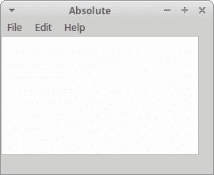
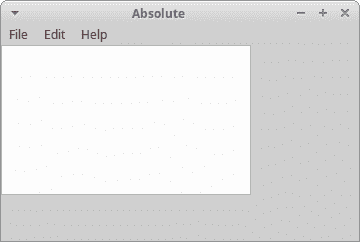
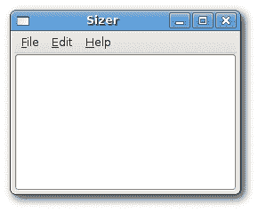
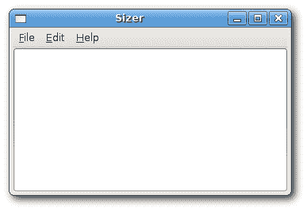
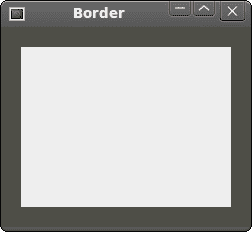
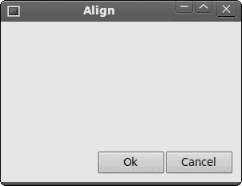
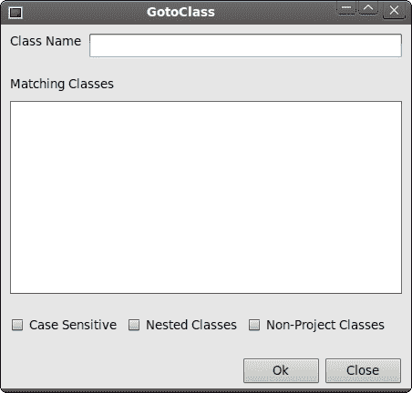
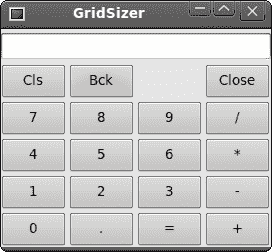
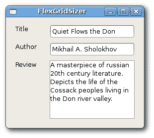

# wxWidgets 中的布局管理

> 原文： [http://zetcode.com/gui/wxwidgets/layoutmanagement/](http://zetcode.com/gui/wxwidgets/layoutmanagement/)

典型的应用由各种小部件组成。 这些小部件放置在容器小部件内。 程序员必须管理应用的布局。 这不是一件容易的事。

在 wxWidgets 中，我们有两个选择：

*   绝对定位。
*   大小调整器。

## 绝对定位

程序员以像素为单位指定每个小部件的位置和大小。 使用绝对定位时，我们必须了解以下几点：

*   如果我们调整窗口大小，则小部件的大小和位置不会改变。
*   在各种平台上，应用看起来有所不同（通常很差）。
*   在我们的应用中更改字体可能会破坏布局。
*   如果我们决定更改布局，则必须完全重做您的布局，这既繁琐又耗时。

在某些情况下，例如在简单的教程中，我们可能会使用绝对定位。 我们不想让示例太难，所以我们经常使用绝对定位来解释某个主题。 但是大多数情况下，在现实世界的程序中，程序员使用大小调整器。

在我们的示例中，我们有一个简单的文本编辑器框架。 如果我们调整窗口大小，则`wxTextCtrl`的大小不会像我们期望的那样改变。

`absolute.h`

```cpp
#include <wx/wx.h>
#include <wx/menu.h>

class Absolute : public wxFrame {

    public:
        Absolute(const wxString& title);

        wxMenuBar *menubar;
        wxMenu *file;
        wxMenu *edit;
        wxMenu *help;
        wxTextCtrl *textctrl;
};

```

`absolute.cpp`

```cpp
#include "absolute.h"

Absolute::Absolute(const wxString& title)
       : wxFrame(NULL, -1, title, wxDefaultPosition, wxSize(350, 250)) {

    wxPanel *panel = new wxPanel(this, -1);

    menubar = new wxMenuBar;
    file = new wxMenu;
    edit = new wxMenu;
    help = new wxMenu;

    menubar->Append(file, wxT("&File"));
    menubar->Append(edit, wxT("&Edit"));
    menubar->Append(help, wxT("&Help"));
    SetMenuBar(menubar);

    textctrl = new wxTextCtrl(panel, -1, wxT(""), wxDefaultPosition,
        wxSize(250, 150), wxTE_MULTILINE);
}

```

`main.h`

```cpp
#include <wx/wx.h>

class MyApp : public wxApp {

    public:
        virtual bool OnInit();
};

```

`main.cpp`

```cpp
#include "main.h"
#include "absolute.h"

IMPLEMENT_APP(MyApp)

bool MyApp::OnInit() {

    Absolute *absolute = new Absolute(wxT("Absolute"));
    absolute->Show(true);

    return true;
}

```

本示例使用绝对定位。 我们将`wxTextCtrl`小部件放置在面板小部件上。

```cpp
textctrl = new wxTextCtrl(panel, -1, wxT(""), wxDefaultPosition,
    wxSize(250, 150), wxTE_MULTILINE);

```

我们在`wxTextCtrl`小部件的构造函数中进行绝对定位。 在我们的情况下，我们为小部件提供默认位置。 宽度为 250 像素，高度为 150 像素。



Figure: Before resizement



Figure: After resizement

调整窗口大小时，文本控件的大小不会更改。

## 使用大小调整器

wxWidgets 中的大小调整器确实解决了所有这些问题，我们通过绝对定位提到了这些问题。 我们可以在这些大小调整器中进行选择。

*   `wxBoxSizer`
*   `wxStaticBoxSizer`
*   `wxGridSizer`
*   `wxFlexGridSizer`
*   `wxGridBagSizer`



Figure: Before resizement



Figure: After resizement

`sizer.h`

```cpp
#include <wx/wx.h>

class Sizer : public wxFrame
{
public:
  Sizer(const wxString& title);

  wxMenuBar *menubar;
  wxMenu *file;
  wxMenu *edit;
  wxMenu *help;
  wxTextCtrl *textctrl;

};

```

`sizer.cpp`

```cpp
#include "sizer.h"

Sizer::Sizer(const wxString& title)
       : wxFrame(NULL, -1, title, wxPoint(-1, -1), wxSize(250, 180))
{

 menubar = new wxMenuBar;
 file = new wxMenu;
 edit = new wxMenu;
 help = new wxMenu;

 menubar->Append(file, wxT("&File"));
 menubar->Append(edit, wxT("&Edit"));
 menubar->Append(help, wxT("&Help"));
 SetMenuBar(menubar);

 textctrl = new wxTextCtrl(this, -1, wxT(""), wxPoint(-1, -1),
     wxSize(250, 150));

 Centre();
}

```

`main.h`

```cpp
#include <wx/wx.h>

class MyApp : public wxApp
{
  public:
    virtual bool OnInit();
};

```

`main.cpp`

```cpp
#include "main.h"
#include "sizer.h"

IMPLEMENT_APP(MyApp)

bool MyApp::OnInit()
{

    Sizer *sizer = new Sizer(wxT("Sizer"));
    sizer->Show(true);

    return true;
}

```

`wxTextCtrl`放置在`wxFrame`小部件内。 `wxFrame`小部件具有特殊的内置大小调整器。 我们只能在`wxFrame`容器中放入一个小部件。 子窗口小部件占据了所有空间，边框，菜单，工具栏和状态栏未分配该空间。

## `wxBoxSizer`

这个 sizer 使我们能够将几个小部件放在一行或一列中。 我们可以将另一个调整器放到现有的调整器中。 这样，我们可以创建非常复杂的布局。

```cpp
wxBoxSizer(int orient)
wxSizerItem* Add(wxWindow* window, int proportion = 0, int flag = 0, int border = 0)

```

方向可以是`wxVERTICAL`或`wxHORIZONTAL`。 通过`Add()`方法将小部件添加到`wxBoxSizer`中。 为了理解它，我们需要查看它的参数。

比例参数定义控件在定义的方向上如何变化的比例。 假设我们有比例为 0、1 和 2 的树按钮。它们被添加到水平`wxBoxSizer`中。 比例为 0 的按钮完全不会改变。 在水平方向上比例为 2 的按钮的变化比比例为 1 的按钮大两倍。

使用`flag`参数，您可以进一步在`wxBoxSizer`中配置小部件的行为。 我们可以控制小部件之间的边界。 我们在小部件之间添加一些像素间距。 为了应用边框，我们需要定义要使用边框的边。 我们可以将它们与`|`运算符，例如`wxLEFT | wxBOTTOM`结合使用。 我们可以在这些标志之间进行选择：

*   `wxLEFT`
*   `wxRIGHT`
*   `wxBOTTOM`
*   `wxTOP`
*   `wxALL`



Figure: Border around a panel

`border.h`

```cpp
#include <wx/wx.h>

class Border : public wxFrame
{
public:
  Border(const wxString& title);

};

```

`border.cpp`

```cpp
#include "border.h"

Border::Border(const wxString& title)
       : wxFrame(NULL, wxID_ANY, title, wxDefaultPosition, wxSize(250, 200))
{
  wxColour col1, col2;
  col1.Set(wxT("#4f5049"));
  col2.Set(wxT("#ededed"));

  wxPanel *panel = new wxPanel(this, -1);
  panel->SetBackgroundColour(col1);
  wxBoxSizer *vbox = new wxBoxSizer(wxVERTICAL);

  wxPanel *midPan = new wxPanel(panel, wxID_ANY);
  midPan->SetBackgroundColour(col2);

  vbox->Add(midPan, 1, wxEXPAND | wxALL, 20);
  panel->SetSizer(vbox);

  Centre();
}

```

`main.h`

```cpp
#include <wx/wx.h>

class MyApp : public wxApp
{
  public:
    virtual bool OnInit();
};

```

`main.cpp`

```cpp
#include "main.h"
#include "border.h"

IMPLEMENT_APP(MyApp)

bool MyApp::OnInit()
{

    Border *border = new Border(wxT("Border"));
    border->Show(true);

    return true;
}

```

在此示例中，我们创建两个面板。 第二个面板周围有一些空间。

```cpp
vbox->Add(midPan, 1, wxEXPAND | wxALL, 20);

```

我们在`midPan`面板周围放置了 20 像素的边框。 `wxALL`标志将边框大小应用于所有四个侧面。 如果我们使用`wxEXPAND`标志，则该小部件将使用分配给它的所有空间。

最后，我们还可以定义小部件的对齐方式。 我们使用以下标志来实现：

*   `wxALIGN_LEFT`
*   `wxALIGN_RIGHT`
*   `wxALIGN_TOP`
*   `wxALIGN_BOTTOM`
*   `wxALIGN_CENTER_VERTICAL`
*   `wxALIGN_CENTER_HORIZONTAL`
*   `wxALIGN_CENTER`

假设我们要在窗口的右下方放置两个按钮。

`align.h`

```cpp
#include <wx/wx.h>

class Align : public wxFrame
{
public:
    Align(const wxString& title);

};

```

`align.cpp`

```cpp
#include "align.h"

Align::Align(const wxString& title)
       : wxFrame(NULL, -1, title, wxPoint(-1, -1), wxSize(300, 200))
{

  wxPanel *panel = new wxPanel(this, -1);

  wxBoxSizer *vbox = new wxBoxSizer(wxVERTICAL);
  wxBoxSizer *hbox1 = new wxBoxSizer(wxHORIZONTAL);
  wxBoxSizer *hbox2 = new wxBoxSizer(wxHORIZONTAL);

  wxButton *ok = new wxButton(panel, -1, wxT("Ok"));
  wxButton *cancel = new wxButton(panel, -1, wxT("Cancel"));

  hbox1->Add(new wxPanel(panel, -1));
  vbox->Add(hbox1, 1, wxEXPAND);

  hbox2->Add(ok);
  hbox2->Add(cancel);

  vbox->Add(hbox2, 0, wxALIGN_RIGHT | wxRIGHT | wxBOTTOM, 10);
  panel->SetSizer(vbox);

  Centre();
}

```

`main.h`

```cpp
#include <wx/wx.h>

class MyApp : public wxApp
{
  public:
    virtual bool OnInit();
};

```

`main.cpp`

```cpp
#include "main.h"
#include "align.h"

IMPLEMENT_APP(MyApp)

bool MyApp::OnInit()
{

    Align *align = new Align(wxT("Align"));
    align->Show(true);

    return true;
}

```

我们创建三个大小调整器。 一台垂直分级机和两台水平分级机。 我们将这两个水平大小调整器放到垂直大小调整器中。

```cpp
hbox1->Add(new wxPanel(panel, -1));
vbox->Add(hbox1, 1, wxEXPAND);

```

我们将`wxPanel`放入第一个水平缩放器中。 我们将比例设置为`1`并设置一个`wxEXPAND`标志。 这样，大小调整器将占据`hbox2`以外的所有空间。

```cpp
vbox->Add(hbox2, 0, wxALIGN_RIGHT | wxRIGHT | wxBOTTOM, 10);

```

我们已将按钮放入`hbox2`大小调整器中。 `hbox2`右对齐，我们还在按钮的底部和右侧留了一些空间。



Figure: Aligning buttons

## `GotoClass`

在下面的示例中，我们介绍了几个重要的想法。

`gotoclass.h`

```cpp
#include <wx/wx.h>

class GotoClass : public wxFrame
{
public:
  GotoClass(const wxString& title);

};

```

`gotoclass.cpp`

```cpp
#include "gotoclass.h"

GotoClass::GotoClass(const wxString& title)
       : wxFrame(NULL, -1, title, wxPoint(-1, -1), wxSize(450, 400))
{

  wxPanel *panel = new wxPanel(this, -1);

  wxBoxSizer *vbox = new wxBoxSizer(wxVERTICAL);

  wxBoxSizer *hbox1 = new wxBoxSizer(wxHORIZONTAL);
  wxStaticText *st1 =  new wxStaticText(panel, wxID_ANY, 
      wxT("Class Name"));

  hbox1->Add(st1, 0, wxRIGHT, 8);
  wxTextCtrl *tc = new wxTextCtrl(panel, wxID_ANY);
  hbox1->Add(tc, 1);
  vbox->Add(hbox1, 0, wxEXPAND | wxLEFT | wxRIGHT | wxTOP, 10);

  vbox->Add(-1, 10);

  wxBoxSizer *hbox2 = new wxBoxSizer(wxHORIZONTAL);
  wxStaticText *st2 = new wxStaticText(panel, wxID_ANY, 
      wxT("Matching Classes"));

  hbox2->Add(st2, 0);
  vbox->Add(hbox2, 0, wxLEFT | wxTOP, 10);

  vbox->Add(-1, 10);

  wxBoxSizer *hbox3 = new wxBoxSizer(wxHORIZONTAL);
  wxTextCtrl *tc2 = new wxTextCtrl(panel, wxID_ANY, wxT(""), 
      wxPoint(-1, -1), wxSize(-1, -1), wxTE_MULTILINE);

  hbox3->Add(tc2, 1, wxEXPAND);
  vbox->Add(hbox3, 1, wxLEFT | wxRIGHT | wxEXPAND, 10);

  vbox->Add(-1, 25);

  wxBoxSizer *hbox4 = new wxBoxSizer(wxHORIZONTAL);
  wxCheckBox *cb1 = new wxCheckBox(panel, wxID_ANY, 
      wxT("Case Sensitive"));

  hbox4->Add(cb1);
  wxCheckBox *cb2 = new wxCheckBox(panel, wxID_ANY, 
      wxT("Nested Classes"));

  hbox4->Add(cb2, 0, wxLEFT, 10);
  wxCheckBox *cb3 = new wxCheckBox(panel, wxID_ANY, 
      wxT("Non-Project Classes"));

  hbox4->Add(cb3, 0, wxLEFT, 10);
  vbox->Add(hbox4, 0, wxLEFT, 10);

  vbox->Add(-1, 25);

  wxBoxSizer *hbox5 = new wxBoxSizer(wxHORIZONTAL);
  wxButton *btn1 = new wxButton(panel, wxID_ANY, wxT("Ok"));
  hbox5->Add(btn1, 0);
  wxButton *btn2 = new wxButton(panel, wxID_ANY, wxT("Close"));
  hbox5->Add(btn2, 0, wxLEFT | wxBOTTOM , 5);
  vbox->Add(hbox5, 0, wxALIGN_RIGHT | wxRIGHT, 10);

  panel->SetSizer(vbox);

  Centre();
}

```

`main.h`

```cpp
#include <wx/wx.h>

class MyApp : public wxApp
{
  public:
    virtual bool OnInit();
};

```

`main.cpp`

```cpp
#include "main.h"
#include "gotoclass.h"

IMPLEMENT_APP(MyApp)

bool MyApp::OnInit()
{
 GotoClass *gotoclass = new GotoClass(wxT("GotoClass"));
 gotoclass->Show(true);

 return true;
}

```

这是使用`wxBoxSizer`的复杂示例。 布局僵硬。 我们创建一个垂直大小调整器。 然后，我们将五个水平大小调整器放入其中。

```cpp
vbox->Add(hbox3, 1, wxLEFT | wxRIGHT | wxEXPAND, 10);

vbox->Add(-1, 25);

```

我们已经知道可以通过组合`flag`参数和`border`参数来控制小部件之间的距离。 但是有一个真正的约束。 在`Add()`方法中，我们只能为所有给定的边指定一个边框。 在我们的示例中，我们在右侧和左侧分别设置了 10 像素。 但是我们不能给底部 25 像素。 我们可以做的是在底部加上 10 像素或 0 像素。 如果我们省略`wxBOTTOM`。 因此，如果我们需要不同的值，则可以添加一些额外的空间。 使用`Add()`方法，我们也可以插入小部件和空间。

```cpp
vbox->Add(hbox5, 0, wxALIGN_RIGHT | wxRIGHT, 10);

```

我们将两个按钮放在窗口的右侧。 我们该怎么做呢？ 实现这一点很重要的三件事：比例，对齐标志和`wxEXPAND`标志。 比例必须为零。 调整窗口大小时，按钮不应更改其大小。 我们一定不要指定`wxEXPAND`标志。 按钮仅占用已分配给它的区域。 最后，我们必须指定`wxALIGN_RIGHT`标志。 水平大小调整器从窗口的左侧扩展到右侧。 因此，如果我们指定`wxALIGN_RIGHT`标志，则按钮将放置在右侧。 正是我们想要的。



Figure: GotoClass

## `wxGridSizer`

`wxGridSizer`在二维表中布置小部件。 表格中的每个单元格都具有相同的大小。

```cpp
wxGridSizer(int rows, int cols, int vgap, int hgap)

```

在构造函数中，我们指定表中的行数和列数。 以及我们细胞之间的垂直和水平空间。

在我们的示例中，我们创建了计算器的骨架。 这是`wxGridSizer`的完美示例。

`gridsizer.h`

```cpp
#include <wx/wx.h>

class GridSizer : public wxFrame
{
public:
  GridSizer(const wxString& title);

  wxMenuBar *menubar;
  wxMenu *file;

  wxBoxSizer *sizer;
  wxGridSizer *gs;
  wxTextCtrl *display;

};

```

`gridsizer.cpp`

```cpp
#include "gridsizer.h"

GridSizer::GridSizer(const wxString& title)
       : wxFrame(NULL, -1, title, wxPoint(-1, -1), wxSize(270, 220))
{
  menubar = new wxMenuBar;
  file = new wxMenu;

  SetMenuBar(menubar);

  sizer = new wxBoxSizer(wxVERTICAL);

  display = new wxTextCtrl(this, -1, wxT(""), wxPoint(-1, -1),
     wxSize(-1, -1), wxTE_RIGHT);

  sizer->Add(display, 0, wxEXPAND | wxTOP | wxBOTTOM, 4);
  gs = new wxGridSizer(4, 4, 3, 3);

  gs->Add(new wxButton(this, -1, wxT("Cls")), 0, wxEXPAND);
  gs->Add(new wxButton(this, -1, wxT("Bck")), 0, wxEXPAND);
  gs->Add(new wxStaticText(this, -1, wxT("")), 0, wxEXPAND);
  gs->Add(new wxButton(this, -1, wxT("Close")), 0, wxEXPAND);
  gs->Add(new wxButton(this, -1, wxT("7")), 0, wxEXPAND); 
  gs->Add(new wxButton(this, -1, wxT("8")), 0, wxEXPAND);
  gs->Add(new wxButton(this, -1, wxT("9")), 0, wxEXPAND);
  gs->Add(new wxButton(this, -1, wxT("/")), 0, wxEXPAND);
  gs->Add(new wxButton(this, -1, wxT("4")), 0, wxEXPAND);
  gs->Add(new wxButton(this, -1, wxT("5")), 0, wxEXPAND);
  gs->Add(new wxButton(this, -1, wxT("6")), 0, wxEXPAND);
  gs->Add(new wxButton(this, -1, wxT("*")), 0, wxEXPAND);
  gs->Add(new wxButton(this, -1, wxT("1")), 0, wxEXPAND);
  gs->Add(new wxButton(this, -1, wxT("2")), 0, wxEXPAND);
  gs->Add(new wxButton(this, -1, wxT("3")), 0, wxEXPAND);
  gs->Add(new wxButton(this, -1, wxT("-")), 0, wxEXPAND);
  gs->Add(new wxButton(this, -1, wxT("0")), 0, wxEXPAND);
  gs->Add(new wxButton(this, -1, wxT(".")), 0, wxEXPAND);
  gs->Add(new wxButton(this, -1, wxT("=")), 0, wxEXPAND);
  gs->Add(new wxButton(this, -1, wxT("+")), 0, wxEXPAND);

  sizer->Add(gs, 1, wxEXPAND);
  SetSizer(sizer);
  SetMinSize(wxSize(270, 220));

  Centre();
}

```

`main.h`

```cpp
#include <wx/wx.h>

class MyApp : public wxApp
{
  public:
    virtual bool OnInit();
};

```

`main.cpp`

```cpp
#include "main.h"
#include "gridsizer.h"

IMPLEMENT_APP(MyApp)

bool MyApp::OnInit()
{

    GridSizer *gs = new GridSizer(wxT("GridSizer"));
    gs->Show(true);

    return true;
}

```

在我们的示例中，我们为`wxFrame`设置了垂直大小调整器。 我们将静态文本和网格大小调整器放入垂直大小调整器中。

注意我们如何在`Bck`和`Close`按钮之间放置空格。 我们只是在其中放一个空的`wxStaticText`。

```cpp
gs->Add(new wxButton(this, -1, wxT("Cls")), 0, wxEXPAND);

```

我们多次调用`Add()`方法。 将小部件按顺序放置在表中，然后将它们添加。 第一行先填充，然后第二行等。



Figure: GridSizer

## `wxFlexGridSizer`

该大小调整器类似于`wxGridSizer`。 它还确实将其小部件布置在二维表中。 它增加了一些灵活性。 `wxGridSizer`细胞大小相同。 `wxFlexGridSizer`中的所有单元格都具有相同的高度。 一列中所有单元格的宽度均相同。 但是，所有行和列不一定都具有相同的高度或宽度。

```cpp
wxFlexGridSizer(int rows, int cols, int vgap, int hgap)

```

`rows`和`cols`指定大小调整器中的行数和列数。 `vgap`和`hgap`在两个方向的小部件之间添加了一些空间。

很多时候，开发人员必须开发用于数据输入和修改的对话框。 我发现`wxFlexGridSizer`适用于此类任务。 开发人员可以使用此大小调整器轻松设置对话框窗口。 也可以使用`wxGridSizer`完成此操作，但由于每个单元格的大小相同，因此看起来不太好。

`flexgridsizer.h`

```cpp
#include <wx/wx.h>

class FlexGridSizer : public wxFrame
{
public:
  FlexGridSizer(const wxString& title);

};

```

`flexgridsizer.cpp`

```cpp
#include "flexgridsizer.h"

FlexGridSizer::FlexGridSizer(const wxString& title)
       : wxFrame(NULL, -1, title, wxPoint(-1, -1), wxSize(270, 220))
{ 
  wxPanel *panel = new wxPanel(this, -1);

  wxBoxSizer *hbox = new wxBoxSizer(wxHORIZONTAL);

  wxFlexGridSizer *fgs = new wxFlexGridSizer(3, 2, 9, 25);

  wxStaticText *thetitle = new wxStaticText(panel, -1, wxT("Title"));
  wxStaticText *author = new wxStaticText(panel, -1, wxT("Author"));
  wxStaticText *review = new wxStaticText(panel, -1, wxT("Review"));

  wxTextCtrl *tc1 = new wxTextCtrl(panel, -1);
  wxTextCtrl *tc2 = new wxTextCtrl(panel, -1);
  wxTextCtrl *tc3 = new wxTextCtrl(panel, -1, wxT(""),
      wxPoint(-1, -1), wxSize(-1, -1), wxTE_MULTILINE);

  fgs->Add(thetitle);
  fgs->Add(tc1, 1, wxEXPAND);
  fgs->Add(author);
  fgs->Add(tc2, 1, wxEXPAND);
  fgs->Add(review, 1, wxEXPAND);
  fgs->Add(tc3, 1, wxEXPAND);

  fgs->AddGrowableRow(2, 1);
  fgs->AddGrowableCol(1, 1);

  hbox->Add(fgs, 1, wxALL | wxEXPAND, 15);
  panel->SetSizer(hbox);
  Centre();
}

```

`main.h`

```cpp
#include <wx/wx.h>

class MyApp : public wxApp
{
  public:
    virtual bool OnInit();
};

```

`main.cpp`

```cpp
#include "main.h"
#include "flexgridsizer.h"

IMPLEMENT_APP(MyApp)

bool MyApp::OnInit()
{

    FlexGridSizer *fgs = new FlexGridSizer(wxT("FlexGridSizer"));
    fgs->Show(true);

    return true;
}

```

在我们的示例中，我们创建一个简单的对话框。 它可以用于将数据插入数据库。

```cpp
wxBoxSizer *hbox = new wxBoxSizer(wxHORIZONTAL);
...
hbox->Add(fgs, 1, wxALL | wxEXPAND, 15);

```

我们创建一个水平框大小调整器，以便在小部件表周围放置一些空间（15 像素）。

```cpp
fgs->Add(thetitle);

```

完全与`GridSizer`一样，将小部件添加到大小调整器中。

```cpp
fgs->AddGrowableRow(2, 1);
fgs->AddGrowableCol(1, 1);

```

我们使第三行和第二列可增长。 这样，当调整窗口大小时，我们使文本控件变大。 前两个文本控件将在水平方向上增长，第三个文本控件将在两个方向上增长。 我们一定不要忘记使小部件可扩展（`wxEXPAND`）以使其真正起作用。



Figure: FlexGridSizer

wxWidgets 教程的这一部分专门用于布局管理。