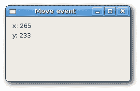
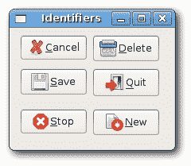

# wxWidgets 中的事件

> 原文： [http://zetcode.com/gui/wxwidgets/events/](http://zetcode.com/gui/wxwidgets/events/)

事件是每个 GUI 应用不可或缺的一部分。 所有 GUI 应用都是事件驱动的。 应用会对在其生命周期内生成的不同事件类型做出反应。 事件主要由应用的用户生成。 但是它们也可以通过其他方式生成，例如 Internet 连接，窗口管理器或计时器。 当应用启动时，将创建一个主循环。 该应用位于主循环中，并等待事件生成。 当我们退出应用时，主循环退出。

## 定义

_ 事件 _ 是来自底层框架（通常是 GUI 工具箱）的应用级信息。 _ 事件循环 _ 是一种程序结构，用于等待并调度程序中的事件或消息。 事件循环反复查找事件以对其进行处理。 _ 调度程序 _ 是将事件映射到 _ 事件处理程序 _ 的过程。 事件处理程序是对事件做出反应的方法。

_ 事件对象 _ 是与事件关联的对象。 通常是一个窗口。 _ 事件类型 _ 是已生成的唯一事件。

## 一个简单的事件示例

在 wxWidgets 中处理事件的传统方法是使用 _ 静态事件表。_ 这受 Microsoft 基础类（MFC）的影响。 一种更灵活，更现代的方法是使用`Connect()`方法。 我们在整个 wxWidgets 教程中都使用它。

## 事件表

在下一个示例中，我们显示一个使用事件表的示例。

`button.h`

```
#include <wx/wx.h>

class MyButton : public wxFrame
{
public:
    MyButton(const wxString& title);

    void OnQuit(wxCommandEvent& event);

private:
    DECLARE_EVENT_TABLE()

};

```

`button.cpp`

```
#include "button.h"

MyButton::MyButton(const wxString& title)
       : wxFrame(NULL, wxID_ANY, title, wxDefaultPosition, wxSize(270, 150))
{

  wxPanel *panel = new wxPanel(this, wxID_ANY);
  wxButton *button = new wxButton(panel, wxID_EXIT, 
      wxT("Quit"), wxPoint(20, 20));

  Centre();
}

void MyButton::OnQuit(wxCommandEvent& WXUNUSED(event))
{
    Close(true);
}

BEGIN_EVENT_TABLE(MyButton, wxFrame)
    EVT_BUTTON(wxID_EXIT,  MyButton::OnQuit)
END_EVENT_TABLE()

```

`main.h`

```
#include <wx/wx.h>

class MyApp : public wxApp
{
  public:
    virtual bool OnInit();
};

```

`main.cpp`

```
#include "main.h"
#include "button.h"

IMPLEMENT_APP(MyApp)

bool MyApp::OnInit()
{

    MyButton *button = new MyButton(wxT("Button"));
    button->Show(true);

    return true;
}

```

在我们的示例中，我们创建一个简单的按钮。 通过单击按钮，我们关闭应用。

```
private:
    DECLARE_EVENT_TABLE()

```

在头文件中，我们使用`DECLARE_EVENT_TABLE()`宏声明一个事件表。

```
BEGIN_EVENT_TABLE(MyButton, wxFrame)
    EVT_BUTTON(wxID_EXIT,  MyButton::OnQuit)
END_EVENT_TABLE()

```

我们通过将每个事件映射到适当的成员函数来实现事件表。

## 使用`Connect()`的示例

我们将讨论移动事件。 移动事件保存有关移动更改事件的信息。 当我们将窗口移到新位置时，将生成一个移动事件。 表示移动事件的类为`wxMoveEvent`。 `wxEVT_MOVE`是事件类型。

`move.h`

```
#include <wx/wx.h>

class Move : public wxFrame
{
public:
  Move(const wxString& title);

  void OnMove(wxMoveEvent & event);

  wxStaticText *st1;
  wxStaticText *st2;

};

```

`move.cpp`

```
#include "move.h"

Move::Move(const wxString& title)
       : wxFrame(NULL, wxID_ANY, title, wxDefaultPosition, wxSize(250, 130))
{
  wxPanel *panel = new wxPanel(this, -1);

  st1 = new wxStaticText(panel, -1, wxT(""), wxPoint(10, 10));
  st2 = new wxStaticText(panel, -1, wxT(""), wxPoint(10, 30));

  Connect(wxEVT_MOVE, wxMoveEventHandler(Move::OnMove));

  Centre();
}

void Move::OnMove(wxMoveEvent& event)
{
  wxPoint size = event.GetPosition();
  st1->SetLabel(wxString::Format(wxT("x: %d"), size.x ));
  st2->SetLabel(wxString::Format(wxT("y: %d"), size.y ));
}

```

`main.h`

```
#include <wx/wx.h>

class MyApp : public wxApp
{
  public:
    virtual bool OnInit();
};

```

`main.cpp`

```
#include "main.h"
#include "move.h"

IMPLEMENT_APP(MyApp)

bool MyApp::OnInit()
{
    Move *move = new Move(wxT("Move event"));
    move->Show(true);

    return true;
}

```

该示例显示窗口的当前位置。

```
Connect(wxEVT_MOVE, wxMoveEventHandler(Move::OnMove));

```

在这里，我们将`wxEVT_MOVE`事件类型与`OnMove()`方法连接在一起。

```
wxPoint size = event.GetPosition();

```

`OnMove()`方法中的事件参数是特定于特定事件的对象。 在我们的例子中，它是`wxMoveEvent`类的实例。 该对象保存有关事件的信息。 我们可以通过调用事件的`GetPosition()`方法找出当前位置。



Figure: Move event

## 事件传播

事件有两种类型：基本事件和命令事件。 它们的传播方式不同。 事件传播是事件从子小部件传播到父小部件和祖父小部件等的事件。基本事件不传播。 命令事件确实传播。 例如，`wxCloseEvent`是一个基本事件。 此事件传播到父窗口小部件没有任何意义。

默认情况下，在事件处理程序中捕获的事件停止传播。 要继续传播，我们必须调用`Skip()`方法。

`propagate.h`

```
#include <wx/wx.h>

class Propagate : public wxFrame
{
public:
  Propagate(const wxString& title);

  void OnClick(wxCommandEvent& event);

};

class MyPanel : public wxPanel
{
public: 
  MyPanel(wxFrame *frame, int id);

  void OnClick(wxCommandEvent& event);
};

class MyButton : wxButton
{
public:
  MyButton(MyPanel *panel, int id, const wxString &label);

  void OnClick(wxCommandEvent& event);

};

```

`propagate.cpp`

```
#include <iostream>
#include "propagate.h"

const int ID_BUTTON = 1;

Propagate::Propagate(const wxString& title)
    : wxFrame(NULL, wxID_ANY, title, wxDefaultPosition, wxSize(250, 130))
{
  MyPanel *panel = new MyPanel(this, -1);

  new MyButton(panel, ID_BUTTON, wxT("Ok"));

  Connect(ID_BUTTON, wxEVT_COMMAND_BUTTON_CLICKED, 
      wxCommandEventHandler(Propagate::OnClick));

  Centre();
}

void Propagate::OnClick(wxCommandEvent& event) 
{
  std::cout << "event reached frame class" << std::endl;
  event.Skip();
}

MyPanel::MyPanel(wxFrame *frame, int id)
    : wxPanel(frame, id)
{
  Connect(ID_BUTTON, wxEVT_COMMAND_BUTTON_CLICKED, 
      wxCommandEventHandler(MyPanel::OnClick));
} 

void MyPanel::OnClick(wxCommandEvent& event) 
{
  std::cout << "event reached panel class" << std::endl;
  event.Skip();
}

MyButton::MyButton(MyPanel *mypanel, int id, const wxString& label)
    : wxButton(mypanel, id, label, wxPoint(15, 15))
{
  Connect(ID_BUTTON, wxEVT_COMMAND_BUTTON_CLICKED, 
      wxCommandEventHandler(MyButton::OnClick));
} 

void MyButton::OnClick(wxCommandEvent& event) 
{
  std::cout << "event reached button class" << std::endl;
  event.Skip();
}

```

`main.h`

```
#include <wx/wx.h>

class MyApp : public wxApp
{
  public:
    virtual bool OnInit();
};

```

`main.cpp`

```
#include "main.h"
#include "propagate.h"

IMPLEMENT_APP(MyApp)

bool MyApp::OnInit()
{

    Propagate *prop = new Propagate(wxT("Propagate"));
    prop->Show(true);

    return true;
}

```

在我们的示例中，面板上有一个按钮。 面板放置在框架小部件中。 我们为所有小部件定义一个处理程序。

```
event reached button class
event reached panel class
event reached frame class

```

当我们点击按钮时，我们得到了这个。 事件从按钮传播到面板和框架。

尝试省略一些`Skip()`方法，看看会发生什么。

## 取消事件

有时我们需要停止处理事件。 为此，我们称方法`Veto()`。

`veto.h`

```
#include <wx/wx.h>

class Veto : public wxFrame
{
public:
  Veto(const wxString& title);

  void OnClose(wxCloseEvent& event);

};

```

`veto.cpp`

```
#include "veto.h"

Veto::Veto(const wxString& title)
    : wxFrame(NULL, wxID_ANY, title, wxDefaultPosition, wxSize(250, 130))
{

  Connect(wxEVT_CLOSE_WINDOW, wxCloseEventHandler(Veto::OnClose));
  Centre();
}

void Veto::OnClose(wxCloseEvent& event) 
{
  wxMessageDialog *dial = new wxMessageDialog(NULL,
      wxT("Are you sure to quit?"), wxT("Question"),
      wxYES_NO | wxNO_DEFAULT | wxICON_QUESTION);

  int ret = dial->ShowModal();
  dial->Destroy();

  if (ret == wxID_YES) {
      Destroy();
  } else {
      event.Veto();
  }
}

```

`main.h`

```
#include <wx/wx.h>

class MyApp : public wxApp
{
  public:
    virtual bool OnInit();
};

```

`main.cpp`

```
#include "main.h"
#include "veto.h"

IMPLEMENT_APP(MyApp)

bool MyApp::OnInit()
{

    Veto *veto = new Veto(wxT("Veto"));
    veto->Show(true);

    return true;
}

```

在我们的示例中，我们处理`wxCloseEvent`。 当我们单击标题栏上的 X 按钮，按 `Alt` + `F4` 或从系统菜单中选择关闭时，将称为此事件。 在许多应用中，如果要进行一些更改，我们希望防止意外关闭窗口。 为此，我们必须连接`wxEVT_CLOSE_WINDOW`事件类型。

```
wxMessageDialog *dial = new wxMessageDialog(NULL, 
   wxT("Are you sure to quit?"), wxT("Question"),
   wxYES_NO | wxNO_DEFAULT | wxICON_QUESTION);

```

在关闭事件期间，我们显示一个消息对话框。

```
if (ret == wxID_YES) {
    Destroy();
} else {
    event.Veto();
}

```

根据返回值，我们销毁窗口或否决事件。 注意，要关闭窗口，我们必须调用`Destroy()`方法。 通过调用`Close()`方法，我们将陷入无尽的循环。

## 窗口标识符

窗口标识符是在事件系统中唯一确定窗口标识的整数。 有三种创建窗口 ID 的方法：

*   让系统自动创建一个 ID。
*   使用标准标识符。
*   创建我们自己的 ID。

每个小部件都有一个 id 参数。 这是事件系统中的唯一编号。 如果我们使用多个小部件，则必须在它们之间进行区分。

```
wxButton(parent, -1)
wxButton(parent, wxID_ANY)

```

如果为 ID 参数提供-1 或`wxID_ANY`，则让 wxWidgets 自动为我们创建一个 ID。 自动创建的 ID 始终为负，而用户指定的 ID 必须始终为正。 当我们不需要更改窗口小部件状态时，通常使用此选项。 例如，静态文本在应用的生命周期内将永远不会更改。 如果需要，我们仍然可以获取 ID。 有一种方法`GetId()`，它将为我们确定 ID。

应尽可能使用标准标识符。 标识符可以在某些平台上提供一些标准的图形或行为。

`ident.h`

```
#include <wx/wx.h>

class Ident : public wxFrame
{
public:
  Ident(const wxString& title);

};

```

`ident.cpp`

```
#include "ident.h"

Ident::Ident(const wxString& title)
    : wxFrame(NULL, wxID_ANY, title, wxDefaultPosition, wxSize(200, 150))
{

  wxPanel *panel = new wxPanel(this, -1);

  wxGridSizer *grid = new wxGridSizer(2, 3);

  grid->Add(new wxButton(panel, wxID_CANCEL), 0, wxTOP | wxLEFT, 9);
  grid->Add(new wxButton(panel, wxID_DELETE), 0, wxTOP, 9);
  grid->Add(new wxButton(panel, wxID_SAVE), 0, wxLEFT, 9);
  grid->Add(new wxButton(panel, wxID_EXIT));
  grid->Add(new wxButton(panel, wxID_STOP), 0, wxLEFT, 9);
  grid->Add(new wxButton(panel, wxID_NEW));

  panel->SetSizer(grid);
  Centre();
}

```

`main.h`

```
#include <wx/wx.h>

class MyApp : public wxApp
{
  public:
    virtual bool OnInit();
};

```

`main.cpp`

```
#include "main.h"
#include "ident.h"

IMPLEMENT_APP(MyApp)

bool MyApp::OnInit()
{

    Ident *ident = new Ident(wxT("Identifiers"));
    ident->Show(true);

    return true;
}

```

在我们的示例中，我们在按钮上使用标准标识符。 在 Linux 上，按钮带有小图标。



Figure: Identifiers

在本章中，我们讨论了 wxWidgets 中的事件。