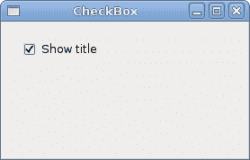
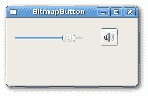
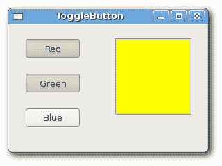
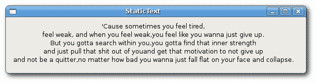
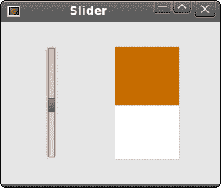

# wxWidgets 小部件

> 原文： [http://zetcode.com/gui/wxwidgets/widgets/](http://zetcode.com/gui/wxwidgets/widgets/)

在本章中，我们将展示 wxWidgets 中提供的几个小部件的小示例。 小部件是我们应用的构建块。 wxWidgets 包含大量有用的小部件。小部件是基本的 GUI 对象。 一个小部件为 wxWidgets 工具包命名。 该术语在 UNIX 系统上使用。 在 Windows 上，小部件通常称为控件。

## `wxCheckBox`

`wxCheckBox`是具有两种状态的窗口小部件：打开和关闭。 这是一个带有标签的盒子。 标签可以设置在框的右侧或左侧。 如果选中此复选框，则在方框中用勾号表示。 复选框可用于在启动时显示或隐藏启动画面，切换工具栏的可见性等。

`checkbox.h`

```cpp
#include <wx/wx.h>

class CheckBox : public wxFrame
{
public:
    CheckBox(const wxString& title);

    void OnToggle(wxCommandEvent& event);

    wxCheckBox *m_cb;

};

const int ID_CHECKBOX = 100;

```

`checkbox.cpp`

```cpp
#include "checkbox.h"

CheckBox::CheckBox(const wxString& title)
       : wxFrame(NULL, wxID_ANY, title, wxDefaultPosition, wxSize(270, 150))
{
  wxPanel *panel = new wxPanel(this, wxID_ANY);

  m_cb = new wxCheckBox(panel, ID_CHECKBOX, wxT("Show title"), 
                        wxPoint(20, 20));
  m_cb->SetValue(true);
  Connect(ID_CHECKBOX, wxEVT_COMMAND_CHECKBOX_CLICKED, 
          wxCommandEventHandler(CheckBox::OnToggle));
  Centre();
}

void CheckBox::OnToggle(wxCommandEvent& WXUNUSED(event))
{

  if (m_cb->GetValue()) {
      this->SetTitle(wxT("CheckBox"));
  } else {
      this->SetTitle(wxT(" "));
  }
}

```

`main.h`

```cpp
#include <wx/wx.h>

class MyApp : public wxApp
{
  public:
    virtual bool OnInit();
};

```

`main.cpp`

```cpp
#include "main.h"
#include "checkbox.h"

IMPLEMENT_APP(MyApp)

bool MyApp::OnInit()
{

    CheckBox *cb = new CheckBox(wxT("CheckBox"));
    cb->Show(true);

    return true;
}

```

在我们的示例中，我们在窗口上显示一个复选框。 我们通过单击复选框来切换窗口的标题。

```cpp
m_cb = new wxCheckBox(panel, ID_CHECKBOX, wxT("Show title"), 
                    wxPoint(20, 20));
m_cb->SetValue(true);

```

我们创建一个复选框。 默认情况下，标题是可见的。 因此，我们通过调用方法`SetValue()`来选中该复选框。

```cpp
Connect(ID_CHECKBOX, wxEVT_COMMAND_CHECKBOX_CLICKED, 
        wxCommandEventHandler(CheckBox::OnToggle));

```

如果单击复选框，则会生成`wxEVT_COMMAND_CHECKBOX_CLICKED`事件。 我们将此事件连接到用户定义的`OnToggle()`方法。

```cpp
if (m_cb->GetValue()) {
    this->SetTitle(wxT("CheckBox"));
} else {
    this->SetTitle(wxT(" "));
}

```

在`OnToggle()`方法内部，我们检查复选框的状态。 如果选中，我们将在标题栏中显示“`CheckBox`”字符串，否则我们将清除标题。



图：`wxCheckBox`

## `wxBitmapButton`

位图按钮是显示位图的按钮。 位图按钮可以具有其他三个状态。 选定，集中并显示。 我们可以为这些状态设置特定的位图。

`bitmapbutton.h`

```cpp
#include <wx/wx.h>
#include <wx/slider.h>

class BitmapButton : public wxFrame
{
public:
  BitmapButton(const wxString& title);

  wxSlider *slider;
  wxBitmapButton *button;
  int pos;

  void OnScroll(wxScrollEvent& event);

};

const int ID_SLIDER = 100;

```

`bitmapbutton.cpp`

```cpp
#include "bitmapbutton.h"

BitmapButton::BitmapButton(const wxString& title)
       : wxFrame(NULL, wxID_ANY, title, wxDefaultPosition, wxSize(250, 130))
{
  wxImage::AddHandler( new wxPNGHandler );
  wxPanel *panel = new wxPanel(this);
  slider = new wxSlider(panel, ID_SLIDER, 0, 0, 100, 
      wxPoint(10, 30), wxSize(140, -1));

  button = new wxBitmapButton(panel, wxID_ANY, wxBitmap(wxT("mute.png"), 
      wxBITMAP_TYPE_PNG), wxPoint(180, 20));

  Connect(ID_SLIDER, wxEVT_COMMAND_SLIDER_UPDATED, 
      wxScrollEventHandler(BitmapButton::OnScroll));  
  Center();
}

void BitmapButton::OnScroll(wxScrollEvent& event)
{
  pos = slider->GetValue(); 

  if (pos == 0) {
      button->SetBitmapLabel(wxBitmap(wxT("mute.png"), wxBITMAP_TYPE_PNG));
  } else if (pos > 0 && pos <= 30 ) {
      button->SetBitmapLabel(wxBitmap(wxT("min.png"), wxBITMAP_TYPE_PNG));
  } else if (pos > 30 && pos < 80 ) {
      button->SetBitmapLabel(wxBitmap(wxT("med.png"), wxBITMAP_TYPE_PNG));
  } else {
      button->SetBitmapLabel(wxBitmap(wxT("max.png"), wxBITMAP_TYPE_PNG));
  }
}

```

`main.h`

```cpp
#include <wx/wx.h>

class MyApp : public wxApp
{
  public:
    virtual bool OnInit();
};

```

`main.cpp`

```cpp
#include "main.h"
#include "bitmapbutton.h"

IMPLEMENT_APP(MyApp)

bool MyApp::OnInit()
{

    BitmapButton *bb = new BitmapButton(wxT("BitmapButton"));
    bb->Show(true);

    return true;
}

```

在我们的示例中，我们有一个滑块和一个位图按钮。 我们模拟了音量控制。 通过拖动滑块的手柄，我们可以更改按钮上的位图。

```cpp
wxImage::AddHandler( new wxPNGHandler );

```

我们将使用 PNG 图像，因此必须初始化 PNG 图像处理程序。

```cpp
button = new wxBitmapButton(panel, wxID_ANY, wxBitmap(wxT("mute.png"), 
    wxBITMAP_TYPE_PNG), wxPoint(180, 20));

```

我们创建一个位图按钮。 我们指定位图类型，在本例中为`wxBITMAP_TYPE_PNG`

```cpp
pos = slider->GetValue(); 

```

我们得到滑块值。 根据此值，我们为按钮设置一个位图。 我们有四个音量状态：静音，最小，中和最大。 要更改按钮上的位图，我们调用`SetBitmapLabel()`方法。



图：`wxBitmapButton`

## `wxToggleButton`

`wxToggleButton`是具有两种状态的按钮：已按下和未按下。 通过单击可以在这两种状态之间切换。 在某些情况下此功能非常合适。

`togglebutton.h`

```cpp
#include <wx/wx.h>
#include <wx/tglbtn.h>

class ToggleButton : public wxFrame
{
public:
  ToggleButton(const wxString& title);

  void OnToggleRed(wxCommandEvent& event);
  void OnToggleGreen(wxCommandEvent& event);
  void OnToggleBlue(wxCommandEvent& event);

protected:
  wxToggleButton *m_tgbutton1;
  wxToggleButton *m_tgbutton2;
  wxToggleButton *m_tgbutton3;

  wxPanel *m_panel;
  wxColour *colour;

};

const int ID_TGBUTTON1 = 101;
const int ID_TGBUTTON2 = 102;
const int ID_TGBUTTON3 = 103;

```

`togglebutton.cpp`

```cpp
#include "togglebutton.h"

ToggleButton::ToggleButton(const wxString& title)
       : wxFrame(NULL, wxID_ANY, title, wxDefaultPosition, wxSize(280, 180))
{
  wxPanel *panel = new wxPanel(this, wxID_ANY);

  colour = new wxColour(0, 0, 0);

  m_tgbutton1 = new wxToggleButton(panel, ID_TGBUTTON1, 
                                   wxT("Red"), wxPoint(20, 20));
  m_tgbutton2 = new wxToggleButton(panel, ID_TGBUTTON2, 
                                   wxT("Green"), wxPoint(20, 70));
  m_tgbutton3 = new wxToggleButton(panel, ID_TGBUTTON3, 
                                   wxT("Blue"), wxPoint(20, 120));

  Connect(ID_TGBUTTON1, wxEVT_COMMAND_TOGGLEBUTTON_CLICKED, 
      wxCommandEventHandler(ToggleButton::OnToggleRed));
  Connect(ID_TGBUTTON2, wxEVT_COMMAND_TOGGLEBUTTON_CLICKED, 
      wxCommandEventHandler(ToggleButton::OnToggleGreen));
  Connect(ID_TGBUTTON3, wxEVT_COMMAND_TOGGLEBUTTON_CLICKED,  
      wxCommandEventHandler(ToggleButton::OnToggleBlue));

  m_panel = new wxPanel(panel, wxID_NEW, wxPoint(150, 20), 
                        wxSize(110, 110), wxSUNKEN_BORDER);
  m_panel->SetBackgroundColour(colour->GetAsString());

}

void ToggleButton::OnToggleRed(wxCommandEvent& WXUNUSED(event))
{
  unsigned char green = colour->Green(); 
  unsigned char blue = colour->Blue(); 

  if ( colour->Red() ) {
      colour->Set(0, green, blue);

  } else { 
      colour->Set(255, green, blue);
  }

  m_panel->SetBackgroundColour(colour->GetAsString());

}

void ToggleButton::OnToggleGreen(wxCommandEvent& WXUNUSED(event))
{
  unsigned char red = colour->Red(); 
  unsigned char blue = colour->Blue(); 

  if ( colour->Green() ) {
      colour->Set(red, 0, blue);

  } else { 
      colour->Set(red, 255, blue);
  }

  m_panel->SetBackgroundColour(colour->GetAsString());

}

void ToggleButton::OnToggleBlue(wxCommandEvent& WXUNUSED(event))
{
  unsigned char red = colour->Red(); 
  unsigned char green = colour->Green(); 

  if ( colour->Blue() ) {
      colour->Set(red, green, 0);

  } else { 
      colour->Set(red, green, 255);
  }

  m_panel->SetBackgroundColour(colour->GetAsString());
}

```

`main.h`

```cpp
#include <wx/wx.h>

class MyApp : public wxApp
{
  public:
    virtual bool OnInit();
};

```

`main.cpp`

```cpp
#include "main.h"
#include "togglebutton.h"

IMPLEMENT_APP(MyApp)

bool MyApp::OnInit()
{

    ToggleButton *button = new ToggleButton(wxT("ToggleButton"));

    button->Centre();
    button->Show(true);

    return true;
}

```

在我们的示例中，我们显示了三个切换按钮和一个面板。 我们将面板的背景色设置为黑色。 切换按钮将切换颜色值的红色，绿色和蓝色部分。 背景颜色取决于我们按下的切换按钮。

```cpp
colour = new wxColour(0, 0, 0);

```

这是初始颜色值。 红色，绿色和蓝色均不等于黑色。 从理论上讲，黑色毕竟不是颜色。

```cpp
m_tgbutton1 = new wxToggleButton(panel, ID_TGBUTTON1, 
                                 wxT("Red"), wxPoint(20, 20));

```

在这里，我们创建一个切换按钮。

```cpp
Connect(ID_TGBUTTON1, wxEVT_COMMAND_TOGGLEBUTTON_CLICKED, 
    wxCommandEventHandler(ToggleButton::OnToggleRed));

```

如果单击切换按钮，则会生成`wxEVT_COMMAND_TOGGLEBUTTON_CLICKED`事件。 我们为此事件连接事件处理程序。 注意，我们没有将事件连接到按钮方法，而是连接到`wxFrame`。 小部件，它是切换按钮的高级父级。 之所以可以这样做，是因为命令事件会传播到其父对象。 在我们的例子中，按钮 -&gt; 面板 -&gt; 框。 如果要将事件连接到按钮，则必须创建派生的按钮类，这意味着需要做更多的工作。

```cpp
if ( colour->Blue() ) {
    colour->Set(red, green, 0);

} else { 
    colour->Set(red, green, 255);
}

```

在事件处理程序中，我们设置各自的`wxColour`参数。

```cpp
m_panel->SetBackgroundColour(colour->GetAsString());

```

我们设置面板的背景。



图：`wxToggleButton`

## `wxStaticLine`

此小部件在窗口上显示一条简单的线。 它可以是水平或垂直的。

`staticline.h`

```cpp
#include <wx/wx.h>

class Staticline : public wxDialog
{
public:
    Staticline(const wxString& title);

};

```

`staticline.cpp`

```cpp
#include "staticline.h"
#include <wx/stattext.h>
#include <wx/statline.h>

Staticline::Staticline(const wxString& title) : wxDialog(NULL, wxID_ANY, title, 
    wxDefaultPosition, wxSize(360, 350))
{

  wxFont font(10, wxDEFAULT, wxNORMAL, wxBOLD);
  wxStaticText *heading = new wxStaticText(this, wxID_ANY, wxT("The Central Europe"), 
      wxPoint(30, 15));
  heading->SetFont(font);

  wxStaticLine *sl1 = new wxStaticLine(this, wxID_ANY, wxPoint(25, 50), 
      wxSize(300,1));

  wxStaticText *st1 = new wxStaticText(this, wxID_ANY, wxT("Slovakia"), 
      wxPoint(25, 80));
  wxStaticText *st2 = new wxStaticText(this, wxID_ANY, wxT("Hungary"), 
      wxPoint(25, 100));
  wxStaticText *st3 = new wxStaticText(this, wxID_ANY, wxT("Poland"), 
      wxPoint(25, 120));
  wxStaticText *st4 = new wxStaticText(this, wxID_ANY, wxT("Czech Republic"), 
      wxPoint(25, 140));
  wxStaticText *st5 = new wxStaticText(this, wxID_ANY, wxT("Germany"), 
      wxPoint(25, 160));
  wxStaticText *st6 = new wxStaticText(this, wxID_ANY, wxT("Slovenia"), 
      wxPoint(25, 180));
  wxStaticText *st7 = new wxStaticText(this, wxID_ANY, wxT("Austria"), 
      wxPoint(25, 200));
  wxStaticText *st8 = new wxStaticText(this, wxID_ANY, wxT("Switzerland"), 
      wxPoint(25, 220));

  wxStaticText *st9  = new wxStaticText(this, wxID_ANY, wxT("5 379 000"), 
      wxPoint(220, 80), wxSize(90, -1), wxALIGN_RIGHT);
  wxStaticText *st10 = new wxStaticText(this, wxID_ANY, wxT("10 084 000"), 
      wxPoint(220, 100), wxSize(90, -1), wxALIGN_RIGHT);
  wxStaticText *st11 = new wxStaticText(this, wxID_ANY, wxT("38 635 000"), 
      wxPoint(220, 120), wxSize(90, -1), wxALIGN_RIGHT);
  wxStaticText *st12 = new wxStaticText(this, wxID_ANY, wxT("10 240 000"), 
      wxPoint(220, 140), wxSize(90, -1), wxALIGN_RIGHT);
  wxStaticText *st13 = new wxStaticText(this, wxID_ANY, wxT("82 443 000"), 
      wxPoint(220, 160), wxSize(90, -1), wxALIGN_RIGHT);
  wxStaticText *st14 = new wxStaticText(this, wxID_ANY, wxT("2 001 000"),  
      wxPoint(220, 180), wxSize(90, -1), wxALIGN_RIGHT);
  wxStaticText *st15 = new wxStaticText(this, wxID_ANY, wxT("8 032 000"),  
      wxPoint(220, 200), wxSize(90, -1), wxALIGN_RIGHT);
  wxStaticText *st16 = new wxStaticText(this, wxID_ANY, wxT("7 288 000"),  
      wxPoint(220, 220), wxSize(90, -1), wxALIGN_RIGHT);

  wxStaticLine *sl2 = new wxStaticLine(this, wxID_ANY, wxPoint(25, 260), 
      wxSize(300, 1));

  wxStaticText *sum = new wxStaticText(this, wxID_ANY, wxT("164 102 000"), 
      wxPoint(220, 280));
  wxFont sum_font = sum->GetFont();
  sum_font.SetWeight(wxBOLD);
  sum->SetFont(sum_font);

  this->Centre();
}

```

`main.h`

```cpp
#include <wx/wx.h>

class MyApp : public wxApp
{
  public:
    virtual bool OnInit();
};

```

`main.cpp`

```cpp
#include "main.h"
#include "staticline.h"

IMPLEMENT_APP(MyApp)

bool MyApp::OnInit()
{
    Staticline *sl = new Staticline(wxT("The Central Europe"));
    sl->ShowModal();
    sl->Destroy();

    return true;
}

```

在前面的示例中，我们显示了欧洲中部国家及其人口。 `wxStaticLine`的使用在视觉上更具吸引力。

```cpp
wxStaticLine *sl1 = new wxStaticLine(this, wxID_ANY, wxPoint(25, 50), 
   wxSize(300,1));

```

在这里，我们创建一条水平静态线。 宽度为 300 像素。 高度为 1 像素。


图：`wxStaticLine`

## `wxStaticText`

`wxStaticText`小部件显示一行或多行只读文本。

`statictext.h`

```cpp
#include <wx/wx.h>

class StaticText : public wxFrame
{
public:
  StaticText(const wxString& title);

};

```

`statictext.cpp`

```cpp
#include "statictext.h"

StaticText::StaticText(const wxString& title)
       : wxFrame(NULL, wxID_ANY, title)
{

  wxPanel *panel = new wxPanel(this, wxID_ANY);
  wxString  text = wxT("'Cause sometimes you feel tired,\n\
feel weak, and when you feel weak,\
you feel like you wanna just give up.\n\
But you gotta search within you,\
you gotta find that inner strength\n\
and just pull that shit out of you\
and get that motivation to not give up\n\
and not be a quitter,\
no matter how bad you wanna just fall flat on your face and collapse.");

  wxStaticText *st = new wxStaticText(panel, wxID_ANY, text, 
      wxPoint(10, 10), wxDefaultSize, wxALIGN_CENTRE);

  this->SetSize(600, 110);
  this->Centre();
}

```

`main.h`

```cpp
#include <wx/wx.h>

class MyApp : public wxApp
{
  public:
    virtual bool OnInit();
};

```

`main.cpp`

```cpp
#include "main.h"
#include "statictext.h"

IMPLEMENT_APP(MyApp)

bool MyApp::OnInit()
{

  StaticText *st = new StaticText(wxT("StaticText"));
  st->Show(true);

  return true;
}

```

在我们的示例中，我们在窗口上显示了 Eminem 的 Till I Collapse 歌词的一部分。

```cpp
wxStaticText *st = new wxStaticText(panel, wxID_ANY, text, 
   wxPoint(10, 10), wxDefaultSize, wxALIGN_CENTRE);

```

在这里，我们创建`wxStaticText`小部件。 静态文本与中心对齐。



图：`wxStaticText`

## wxSlider

`wxSlider`是具有简单句柄的小部件。 该手柄可以前后拉动。 这样，我们可以为特定任务选择一个值。 有时使用滑块比仅提供数字或使用旋转控件更自然。

`Slider.h`

```cpp
#include <wx/wx.h>
#include <wx/slider.h>

class MyPanel : public wxPanel
{
public:
    MyPanel(wxFrame *parent);

    void OnPaint(wxPaintEvent& event);
    void OnScroll(wxScrollEvent& event);

    wxSlider *slider;
    int fill;

};

class Slider : public wxFrame
{
public:
    Slider(const wxString& title);

    MyPanel *panel;

};

const int ID_SLIDER = 100;

```

`Slider.cpp`

```cpp
#include "Slider.h"

Slider::Slider(const wxString& title)
       : wxFrame(NULL, wxID_ANY, title, wxDefaultPosition, 
       wxSize(270, 200))
{
  panel = new MyPanel(this);
  Center();
}

MyPanel::MyPanel(wxFrame * parent)
       : wxPanel(parent, wxID_ANY)
{
  fill = 0;
  slider = new wxSlider(this, ID_SLIDER, 0, 0, 140, wxPoint(50, 30), 
      wxSize(-1, 140), wxSL_VERTICAL);

  Connect(ID_SLIDER, wxEVT_COMMAND_SLIDER_UPDATED, 
      wxScrollEventHandler(MyPanel::OnScroll));  
  Connect(wxEVT_PAINT, wxPaintEventHandler(MyPanel::OnPaint));

}

void MyPanel::OnScroll(wxScrollEvent& event)
{
  fill = slider->GetValue();
  Refresh();
}

void MyPanel::OnPaint(wxPaintEvent& event)
{
  wxPaintDC dc(this);

  wxPen pen(wxColour(212, 212, 212));
  dc.SetPen(pen);

  dc.DrawRectangle(wxRect(140, 30, 80, 140));  

  wxBrush brush1(wxColour(197, 108, 0));
  dc.SetBrush(brush1);

  dc.DrawRectangle(wxRect(140, 30, 80, fill));
}

```

`main.h`

```cpp
#include <wx/wx.h>

class MyApp : public wxApp
{
  public:
    virtual bool OnInit();
};

```

`main.cpp`

```cpp
#include "main.h"
#include "Slider.h"

IMPLEMENT_APP(MyApp)

bool MyApp::OnInit()
{

    Slider *slider = new Slider(wxT("Slider"));
    slider->Show(true);

    return true;
}

```

在我们的示例中，我们显示一个滑块小部件。 通过拉动滑块的手柄，我们可以控制面板的背景色。 在这样的示例中，使用滑块比使用例如滑块更自然。 自旋控件。

```cpp
slider = new wxSlider(this, ID_SLIDER, 0, 0, 140, wxPoint(50, 30), 
   wxSize(-1, 140), wxSL_VERTICAL);

```

我们创建一个垂直滑块。 初始值为 0，最小值为 0，最大值为 140。我们不显示刻度线，也不显示标签。

```cpp
Connect(ID_SLIDER, wxEVT_COMMAND_SLIDER_UPDATED, 
   wxScrollEventHandler(MyPanel::OnScroll));  

```

在这里，我们将`wxEVT_COMMAND_SLIDER_UPDATED`事件连接到`OnScroll()`用户定义的方法。

```cpp
Connect(wxEVT_PAINT, wxPaintEventHandler(MyPanel::OnPaint));

```

我们还将进行一些绘制，因此将`OnPaint()`方法连接到`wxEVT_PAINT`事件。

```cpp
fill = slider->GetValue();
Refresh();

```

在`OnScroll()`方法中，我们将获得当前的滑块值。 我们调用`Refresh()`方法，该方法将生成`wxEVT_PAINT`事件。

```cpp
dc.DrawRectangle(wxRect(140, 30, 80, 140)); 
...
dc.DrawRectangle(wxRect(140, 30, 80, fill));

```

在`OnPaint()`事件处理程序内，我们绘制了两个矩形。 第一种方法是绘制带有灰色边框的白色矩形。 第二种方法绘制带有某种褐色的矩形。 矩形的高度由`fill`值控制，该值由滑块控件设置。



图：`wxSlider`

在 wxWidgets 教程的这一部分中，我们介绍了各种小部件。