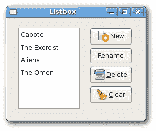
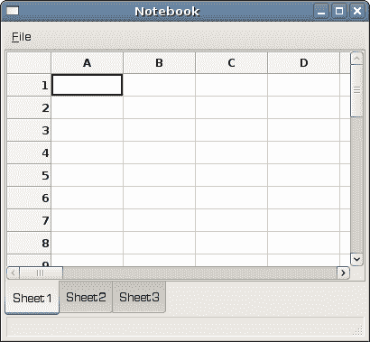

# wxWidgets 小部件 II

> 原文： [http://zetcode.com/gui/wxwidgets/widgetsII/](http://zetcode.com/gui/wxwidgets/widgetsII/)

在本章中，我们将继续介绍其他各种小部件。 我们将提到`wxListBox`，`wxNotebook`和`wxScrolledWindow`。

## `wxListBox`

`wxListBox`小部件用于显示和使用项目列表。 顾名思义，它是一个矩形，里面有一个字符串列表。 我们可以使用它来显示 MP3 文件，书籍名称，较大项目的模块名称或朋友名称的列表。 可以在两种不同的状态下创建`wxListBox`。 在单选状态或多选状态下。 单一选择状态是默认状态。 `wxListBox`中有两个重要事件。 第一个是`wxEVT_COMMAND_LISTBOX_SELECTED`事件。 当我们在`wxListBox`中选择一个字符串时，将生成此事件。 第二个事件是`wxEVT_COMMAND_LISTBOX_DOUBLE_CLICKED`事件。 当我们双击`wxListBox`中的项目时会生成该文件。 `wxListBox`内部的元素数量在 GTK 平台上受到限制。 根据文档，当前大约有 2000 个元素。 元素从零开始编号。 如果需要，滚动条会自动显示。

`Listbox.h`

```
#include <wx/wx.h>
#include <wx/listbox.h>

class MyPanel : public wxPanel
{
public:
    MyPanel(wxPanel *parent);

    void OnNew(wxCommandEvent& event);
    void OnRename(wxCommandEvent& event);
    void OnClear(wxCommandEvent& event);
    void OnDelete(wxCommandEvent& event);

    wxListBox *m_lb;

    wxButton *m_newb;
    wxButton *m_renameb;
    wxButton *m_clearb;
    wxButton *m_deleteb;

};

class Listbox : public wxFrame
{
public:
    Listbox(const wxString& title);

    void OnDblClick(wxCommandEvent& event);

    wxListBox *listbox;
    MyPanel *btnPanel;

};

const int ID_RENAME = 1;
const int ID_LISTBOX = 5;

```

`Listbox.cpp`

```
#include "listbox.h"
#include <wx/textdlg.h>

Listbox::Listbox(const wxString& title)
       : wxFrame(NULL, wxID_ANY, title, wxDefaultPosition, wxSize(270, 200))
{

  wxPanel * panel = new wxPanel(this, -1);

  wxBoxSizer *hbox = new wxBoxSizer(wxHORIZONTAL);

  listbox = new wxListBox(panel, ID_LISTBOX, 
      wxPoint(-1, -1), wxSize(-1, -1)); 

  hbox->Add(listbox, 3, wxEXPAND | wxALL, 20);

  btnPanel = new MyPanel(panel);
  hbox->Add(btnPanel, 2, wxEXPAND | wxRIGHT, 10);

  Connect(wxEVT_COMMAND_LISTBOX_DOUBLECLICKED, 
      wxCommandEventHandler(Listbox::OnDblClick));

  panel->SetSizer(hbox);
  Center();  
}

MyPanel::MyPanel(wxPanel * parent)
       : wxPanel(parent, wxID_ANY)
{
  wxBoxSizer *vbox = new wxBoxSizer(wxVERTICAL);

  Listbox *lb = (Listbox *) parent->GetParent();
  m_lb = lb->listbox;

  m_newb = new wxButton(this, wxID_NEW, wxT("New"));
  m_renameb = new wxButton(this, ID_RENAME, wxT("Rename"));
  m_deleteb = new wxButton(this, wxID_DELETE, wxT("Delete"));
  m_clearb = new wxButton(this, wxID_CLEAR, wxT("Clear"));

  Connect(wxID_NEW, wxEVT_COMMAND_BUTTON_CLICKED, 
      wxCommandEventHandler(MyPanel::OnNew) );
  Connect(ID_RENAME, wxEVT_COMMAND_BUTTON_CLICKED, 
      wxCommandEventHandler(MyPanel::OnRename) );
  Connect(wxID_CLEAR, wxEVT_COMMAND_BUTTON_CLICKED, 
      wxCommandEventHandler(MyPanel::OnClear) );
  Connect(wxID_DELETE, wxEVT_COMMAND_BUTTON_CLICKED, 
      wxCommandEventHandler(MyPanel::OnDelete) );

  vbox->Add(-1, 20);
  vbox->Add(m_newb);
  vbox->Add(m_renameb, 0, wxTOP, 5);
  vbox->Add(m_deleteb, 0, wxTOP, 5);
  vbox->Add(m_clearb, 0, wxTOP, 5);

  SetSizer(vbox);
}

void MyPanel::OnNew(wxCommandEvent& event) 
{
  wxString str = wxGetTextFromUser(wxT("Add new item"));
  if (str.Len() > 0)
      m_lb->Append(str); 
}

void MyPanel::OnClear(wxCommandEvent& event) 
{
  m_lb->Clear();
}

void MyPanel::OnRename(wxCommandEvent& event) 
{
  wxString text;
  wxString renamed;

  int sel = m_lb->GetSelection();
  if (sel != -1) {
      text = m_lb->GetString(sel);
      renamed = wxGetTextFromUser(wxT("Rename item"), 
                  wxT("Rename dialog"), text);
  }

  if (!renamed.IsEmpty()) {
      m_lb->Delete(sel);
      m_lb->Insert(renamed, sel);
  }
}

void MyPanel::OnDelete(wxCommandEvent& event) 
{
  int sel = m_lb->GetSelection();
  if (sel != -1) {
      m_lb->Delete(sel);
  }
}

void Listbox::OnDblClick(wxCommandEvent& event) 
{
  wxString text;
  wxString renamed;

  int sel = listbox->GetSelection();
  if (sel != -1) {
      text = listbox->GetString(sel);
      renamed = wxGetTextFromUser(wxT("Rename item"), 
                  wxT("Rename dialog"), text);
  } 

  if (!renamed.IsEmpty()) {
      listbox->Delete(sel);
      listbox->Insert(renamed, sel);
  }
}

```

`main.h`

```
#include <wx/wx.h>

class MyApp : public wxApp
{
  public:
    virtual bool OnInit();
};

```

`main.cpp`

```
#include "main.h"
#include "Listbox.h"

IMPLEMENT_APP(MyApp)

bool MyApp::OnInit()
{

    Listbox *listbox = new Listbox(wxT("Listbox"));
    listbox->Show(true);

    return true;
}

```

```
listbox = new wxListBox(panel, ID_LISTBOX, 
    wxPoint(-1, -1), wxSize(-1, -1));

```

这是列表框窗口小部件的构造函数。

在我们的示例中，我们有一个列表框和四个按钮。 这些按钮用于添加，重命名，删除和清除列表框中的所有项目。

```
wxString str = wxGetTextFromUser(wxT("Add new item"));
if (str.Len() > 0)
    m_lb->Append(str); 

```

要向列表框中添加新字符串，我们将显示一个`wxGetTextFromUser`对话框。 我们调用`Append()`方法将字符串追加到列表框。

```
m_lb->Clear();

```

清除所有项目是最简单的操作。 我们只调用`Clear()`方法。

```
int sel = m_lb->GetSelection();
if (sel != -1) {
    m_lb->Delete(sel);
}

```

要删除一个项目，我们找出选定的项目。 然后我们调用`Delete()`方法。

重命名项目需要几个步骤。

```
wxString text;
wxString renamed;

```

我们定义了两个局部变量。

```
int sel = listbox->GetSelection();
if (sel != -1) {
    text = listbox->GetString(sel);
    renamed = wxGetTextFromUser(wxT("Rename item"), 
                wxT("Rename dialog"), text);
} 

```

我们获取选定的字符串并将其保存到重命名的变量中。

```
if (!renamed.IsEmpty()) {
    m_lb->Delete(sel);
    m_lb->Insert(renamed, sel);
}

```

我们检查重命名的变量是否为空。 这是为了避免插入空字符串。 然后，我们删除旧项目并插入新项目。



Figure: Listbox

## `wxNotebook`

`wxNotebook`小部件将多个窗口与相应的选项卡连接在一起。 您可以使用以下样式标志来定位 Notebook 小部件：

*   `wxNB_LEFT`
*   `wxNB_RIGHT`
*   `wxNB_TOP`
*   `wxNB_BOTTOM`

默认位置为`wxNB_TOP`。

`Notebook.h`

```
#include <wx/wx.h>
#include <wx/notebook.h>
#include <wx/grid.h>

class Notebook : public wxFrame
{
public:
    Notebook(const wxString& title);

    void OnQuit(wxCommandEvent& event);

};

class MyGrid : public wxGrid
{
public:
    MyGrid(wxNotebook *parent);

};

```

`Notebook.cpp`

```
#include "Notebook.h"

Notebook::Notebook(const wxString& title)
       : wxFrame(NULL, wxID_ANY, title, wxDefaultPosition, wxSize(400, 350))
{

  wxNotebook *nb = new wxNotebook(this, -1, wxPoint(-1, -1), 
      wxSize(-1, -1), wxNB_BOTTOM);

  wxMenuBar *menubar = new wxMenuBar;
  wxMenu *file = new wxMenu;
  file->Append(wxID_EXIT, wxT("Quit"), wxT(""));
  menubar->Append(file, wxT("&File"));
  SetMenuBar(menubar);

  Connect(wxEVT_COMMAND_MENU_SELECTED, 
      wxCommandEventHandler(Notebook::OnQuit)); 

  MyGrid *grid1 = new MyGrid(nb);
  MyGrid *grid2 = new MyGrid(nb);
  MyGrid *grid3 = new MyGrid(nb);

  nb->AddPage(grid1, wxT("Sheet1"));
  nb->AddPage(grid2, wxT("Sheet2"));
  nb->AddPage(grid3, wxT("Sheet3"));

  CreateStatusBar();
  Center();
}

void Notebook::OnQuit(wxCommandEvent& event) 
{
  Close(true);
}

MyGrid::MyGrid(wxNotebook * parent)
       : wxGrid(parent, wxID_ANY)
{
  CreateGrid(30, 30);
  SetRowLabelSize(50);
  SetColLabelSize(25);
  SetRowLabelAlignment(wxALIGN_RIGHT, wxALIGN_CENTRE);
  SetLabelFont(wxFont(9, wxFONTFAMILY_DEFAULT, 
      wxFONTSTYLE_NORMAL, wxFONTWEIGHT_BOLD));

  for (int i = 0; i < 30 ; i++) {
      this->SetRowSize(i, 25);
  }
}

```

`main.h`

```
#include <wx/wx.h>

class MyApp : public wxApp
{
  public:
    virtual bool OnInit();
};

```

`main.cpp`

```
#include "main.h"
#include "Notebook.h"

IMPLEMENT_APP(MyApp)

bool MyApp::OnInit()
{

    Notebook *notebook = new Notebook(wxT("Notebook"));
    notebook->Show(true);

    return true;
}

```

在此示例中，我们创建了带有三个网格的笔记本小部件。 笔记本小部件位于底部。

```
wxNotebook *nb = new wxNotebook(this, -1, wxPoint(-1, -1), 
    wxSize(-1, -1), wxNB_BOTTOM);

```

在这里，我们创建笔记本小部件。

```
nb->AddPage(grid1, wxT("Sheet1"));
nb->AddPage(grid2, wxT("Sheet2"));
nb->AddPage(grid3, wxT("Sheet3"));

```

我们将三个网格对象添加到笔记本小部件中。



Figure: Notebook widget

## `wxScrolledWindow`

这是容器小部件之一。 当我们的区域大于窗口可以显示的区域时，此功能将非常有用。 在我们的示例中，我们演示了这种情况。 我们将大图像放入窗口。 当窗口小于我们的图像时，将自动显示滚动条。

`scrolledwindow.h`

```
#include <wx/wx.h>

class ScrWindow : public wxFrame
{
public:
  ScrWindow(const wxString& title);

};

```

`scrolledwindow.cpp`

```
#include "scrolledwindow.h"

ScrWindow::ScrWindow(const wxString& title)
       : wxFrame(NULL, wxID_ANY, title, wxDefaultPosition, wxSize(300, 200))
{
  wxImage::AddHandler(new wxJPEGHandler);
  wxScrolledWindow *sw = new wxScrolledWindow(this);

  wxBitmap bmp(wxT("castle.jpg"), wxBITMAP_TYPE_JPEG);
  wxStaticBitmap *sb = new wxStaticBitmap(sw, -1, bmp);

  int width = bmp.GetWidth();
  int height = bmp.GetHeight();

  sw->SetScrollbars(10, 10, width/10, height/10);
  sw->Scroll(50,10);

  Center();
}

```

`main.h`

```
#include <wx/wx.h>

class MyApp : public wxApp
{
  public:
    virtual bool OnInit();
};

```

`main.cpp`

```
#include "main.h"
#include "scrolledwindow.h"

IMPLEMENT_APP(MyApp)

bool MyApp::OnInit()
{

    ScrWindow *sw = new ScrWindow(wxT("ScrolledWindow"));
    sw->Show(true);

    return true;
}

```

在我们的示例中，我们显示了 Spis 城堡的图片。

```
wxImage::AddHandler(new wxJPEGHandler);

```

要处理 JPG 图像，我们必须启动`wxJPEGHandler`。

```
wxScrolledWindow *sw = new wxScrolledWindow(this);

wxBitmap bmp(wxT("castle.jpg"), wxBITMAP_TYPE_JPEG);
wxStaticBitmap *sb = new wxStaticBitmap(sw, -1, bmp);

```

我们创建一个滚动窗口，并在其中放置一个静态位图。

```
sw->SetScrollbars(10, 10, width/10, height/10);

```

我们设置滚动条。

```
sw->Scroll(50,10);

```

我们稍微滚动窗口。

在本章中，我们继续介绍 wxWidgets 库中的小部件。