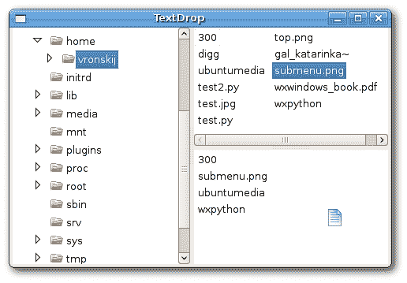

# wxWidgets 中的拖放

> 原文： [http://zetcode.com/gui/wxwidgets/dragdrop/](http://zetcode.com/gui/wxwidgets/dragdrop/)

Wikipedia 将拖动&拖放定义为单击虚拟对象并将其拖动到其他位置或另一个虚拟对象的动作（或支持该动作）。 通常，它可用于调用多种动作，或在两个抽象对象之间创建各种类型的关联。

拖放操作使我们能够直观地完成复杂的事情。

在拖放中，我们基本上将一些数据从数据源拖到数据目标。 我们处理以下对象：

*   数据对象
*   数据源
*   数据目标

对于拖放&文本，wxWidgets 具有预定义的`wxTextDropTarget`类。

在下面的示例中，我们将文件名从上方的列表控件拖放到底部的控件中。

`textdrop.h`

```
#include <wx/wx.h>
#include <wx/dnd.h>

class TextDrop : public wxFrame
{
public:
  TextDrop(const wxString& title);

  void OnSelect(wxCommandEvent& event);
  void OnDragInit(wxListEvent& event);

  wxGenericDirCtrl *m_gdir;
  wxListCtrl *m_lc1;
  wxListCtrl *m_lc2;

};

class MyTextDropTarget : public wxTextDropTarget
{
public:
  MyTextDropTarget(wxListCtrl *owner);

  virtual bool OnDropText(wxCoord x, wxCoord y, 
      const wxString& data);

  wxListCtrl *m_owner;

};

```

`textdrop.cpp`

```
#include "textdrop.h"
#include <wx/treectrl.h>
#include <wx/dirctrl.h>
#include <wx/dir.h>
#include <wx/splitter.h>

TextDrop::TextDrop(const wxString& title)
       : wxFrame(NULL, wxID_ANY, title, wxDefaultPosition, wxSize(300, 200))
{

  wxSplitterWindow *spl1 = new wxSplitterWindow(this, -1);
  wxSplitterWindow *spl2 = new wxSplitterWindow(spl1, -1);
  m_gdir = new wxGenericDirCtrl(spl1, -1, wxT("/home/"), 
      wxPoint(-1, -1), wxSize(-1, -1), wxDIRCTRL_DIR_ONLY);

  m_lc1 = new wxListCtrl(spl2, -1, wxPoint(-1, -1), 
      wxSize(-1, -1), wxLC_LIST);
  m_lc2 = new wxListCtrl(spl2, -1, wxPoint(-1, -1), 
      wxSize(-1, -1), wxLC_LIST);

  MyTextDropTarget *mdt = new MyTextDropTarget(m_lc2);
  m_lc2->SetDropTarget(mdt);

  Connect(m_lc1->GetId(), wxEVT_COMMAND_LIST_BEGIN_DRAG, 
      wxListEventHandler(TextDrop::OnDragInit));

  wxTreeCtrl *tree = m_gdir->GetTreeCtrl();

  spl2->SplitHorizontally(m_lc1, m_lc2);
  spl1->SplitVertically(m_gdir, spl2);

  Connect(tree->GetId(), wxEVT_COMMAND_TREE_SEL_CHANGED, 
      wxCommandEventHandler(TextDrop::OnSelect));

  Center();
}

MyTextDropTarget::MyTextDropTarget(wxListCtrl *owner)
{
  m_owner = owner;
}

bool MyTextDropTarget::OnDropText(wxCoord x, wxCoord y, 
    const wxString& data)
{

  m_owner->InsertItem(0, data);
  return true;

}

void TextDrop::OnSelect(wxCommandEvent& event)
{
  wxString filename;
  wxString path = m_gdir->GetPath();
  wxDir dir(path);

  bool cont = dir.GetFirst(&filename, wxEmptyString, wxDIR_FILES);

  int i = 0;

  m_lc1->ClearAll();
  m_lc2->ClearAll();

  while ( cont )
  {
      m_lc1->InsertItem(i, filename);
      cont = dir.GetNext(&filename);
      i++;
  }
}

void TextDrop::OnDragInit(wxListEvent& event)
{

 wxString text = m_lc1->GetItemText(event.GetIndex());

 wxTextDataObject tdo(text);
 wxDropSource tds(tdo, m_lc1);
 tds.DoDragDrop(wxDrag_CopyOnly);

}

```

`main.h`

```
#include <wx/wx.h>

class MyApp : public wxApp
{
  public:
    virtual bool OnInit();
};

```

`main.cpp`

```
#include "main.h"
#include "textdrop.h"

IMPLEMENT_APP(MyApp)

bool MyApp::OnInit()
{

    TextDrop *td = new TextDrop(wxT("TextDrop"));
    td->Show(true);

    return true;
}

```

在我们的示例中，我们将窗口分为三个部分。 这是通过`wxSplitterWindow`小部件完成的。 在窗口的左侧，我们有一个通用的目录控件。 我们显示文件系统下所有可用的目录。 右侧有两个窗口。 第一个显示所选目录下的所有文件。 第二个用于拖动文件。

```
MyTextDropTarget *mdt = new MyTextDropTarget(m_lc2);
m_lc2->SetDropTarget(mdt);

```

在这里，我们定义了文本放置目标。

```
wxString text = m_lc1->GetItemText(event.GetIndex());

wxTextDataObject tdo(text);
wxDropSource tds(tdo, m_lc1);
tds.DoDragDrop(wxDrag_CopyOnly);

```

在`OnDragInit()`方法中，我们定义了一个文本数据对象和一个放置源对象。 我们称为`DoDragDrop()`方法。 `wxDrag_CopyOnly`常数仅允许复制数据。

```
bool MyTextDropTarget::OnDropText(wxCoord x, wxCoord y, 
    const wxString& data)
{
  m_owner->InsertItem(0, data);
  return true;
}

```

在放置操作期间，我们将文本数据插入到列表控件中。



Figure: Drag & Drop

在本章中，我们介绍了 wxWidgets 中的拖放操作。