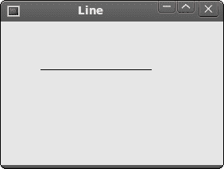
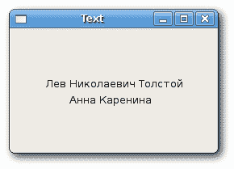
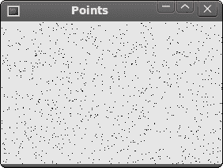
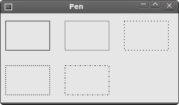
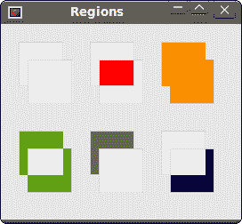
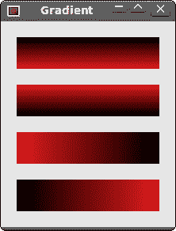
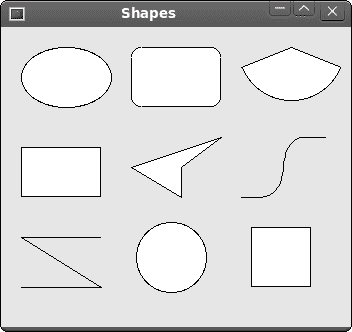

# wxWidgets 中的设备上下文

> 原文： [http://zetcode.com/gui/wxwidgets/gdi/](http://zetcode.com/gui/wxwidgets/gdi/)

GDI （`Graphics Device Interface`）是用于处理图形的界面。 它用于与图形设备（例如监视器，打印机或文件）进行交互。 GDI 允许程序员在屏幕或打印机上显示数据，而不必担心特定设备的详细信息。 GDI 使程序员与硬件隔离。


Figure: The GDI structure

从程序员的角度来看，GDI 是用于处理图形的一组类和方法。 GDI 由 2D 向量图形，字体和图像组成。

要开始绘制图形，我们必须创建一个设备上下文（DC）对象。 在 wxWidgets 中，设备上下文称为`wxDC`。 该文档将`wxDC`定义为可以在其上绘制图形和文本的设备上下文。 它以通用方式表示设备数量。 同一段代码可以写入不同类型的设备。 无论是屏幕还是打印机。 `wxDC`不能直接使用。 相反，程序员应选择派生类之一。 每个派生类都打算在特定条件下使用。

以下类是派生的`wxDC`类：

*   `wxBufferedDC`
*   `wxBufferedPaintDC`
*   `wxPostScriptDC`
*   `wxMemoryDC`
*   `wxPrinterDC`
*   `wxScreenDC`
*   `wxClientDC`
*   `wxPaintDC`
*   `wxWindowDC`

`wxScreenDC`用于在屏幕上的任何地方绘制。 如果要在整个窗口上绘制（仅 Windows），则使用`wxWindowDC`。 这包括窗口装饰。 `wxClientDC`用于绘制窗口的客户区域。 客户区域是没有装饰（标题和边框）的窗口区域。 `wxPaintDC`也用于绘制客户区。 但是`wxPaintDC`和`wxClientDC`之间有一个区别。 `wxPaintDC`应该仅从 wxPaintEvent 使用。 不应从`wxPaintEvent`中使用`wxClientDC`。 `wxMemoryDC`用于在位图上绘制图形。 `wxPostScriptDC`用于在任何平台上写入 PostScript 文件。 `wxPrinterDC`用于访问打印机（仅 Windows）。

#### 简单的线条

我们从画一条线开始。

`line.h`

```cpp
#include <wx/wx.h>

class Line : public wxFrame
{
public:
    Line(const wxString& title);

    void OnPaint(wxPaintEvent& event);

};

```

`line.cpp`

```cpp
#include "line.h"

Line::Line(const wxString& title)
       : wxFrame(NULL, wxID_ANY, title, wxDefaultPosition, wxSize(280, 180))
{
  this->Connect(wxEVT_PAINT, wxPaintEventHandler(Line::OnPaint));
  this->Centre();
}

void Line::OnPaint(wxPaintEvent& event)
{
  wxPaintDC dc(this);

  wxCoord x1 = 50, y1 = 60;
  wxCoord x2 = 190, y2 = 60;

  dc.DrawLine(x1, y1, x2, y2);
}

```

`main.h`

```cpp
#include <wx/wx.h>

class MyApp : public wxApp
{
  public:
    virtual bool OnInit();
};

```

`main.cpp`

```cpp
#include "main.h"
#include "line.h"

IMPLEMENT_APP(MyApp)

bool MyApp::OnInit()
{

    Line *line = new Line(wxT("Line"));
    line->Show(true);

    return true;
}

```

在我们的示例中，我们在窗口的客户区域上画一条简单的线。 如果我们调整窗口的大小，它将被重绘。 生成`wxPaintEvent`。 然后再次画线。

```cpp
void OnPaint(wxPaintEvent& event);

```

在这里，我们声明一个`OnPaint()`事件处理函数。

```cpp
this->Connect(wxEVT_PAINT, wxPaintEventHandler(Line::OnPaint));

```

我们将绘画事件连接到`OnPaint()`方法。 所有绘图都发生在`OnPaint()`事件处理程序内。

```cpp
wxPaintDC dc(this);

```

我们定义一个`wxPaintDC`设备上下文。 它是设备上下文，用于在`wxPaintEvent`内部的窗口上绘制

```cpp
wxCoord x1 = 50, y1 = 60;
wxCoord x2 = 190, y2 = 60;

```

我们定义四个坐标。

```cpp
dc.DrawLine(x1, y1, x2, y2);

```

我们画一条简单的线调用`DrawLine()`方法。



Figure: A simple line

## 绘制文字

在窗口上绘制一些文本很容易。

`text.h`

```cpp
#include <wx/wx.h>

class Text : public wxFrame
{
public:
    Text(const wxString & title);

    void OnPaint(wxPaintEvent & event);

};

```

`text.cpp`

```cpp
#include "text.h"

Text::Text(const wxString& title)
       : wxFrame(NULL, wxID_ANY, title, wxDefaultPosition, wxSize(250, 150))
{
  Connect(wxEVT_PAINT, wxPaintEventHandler(Text::OnPaint));
  Centre();
}

void Text::OnPaint(wxPaintEvent& event)
{
  wxPaintDC dc(this);

  dc.DrawText(wxT("Лев Николaевич Толстoй"), 40, 60);
  dc.DrawText(wxT("Анна Каренина"), 70, 80);
}

```

`main.h`

```cpp
#include <wx/wx.h>

class MyApp : public wxApp
{
  public:
    virtual bool OnInit();
};

```

`main.cpp`

```cpp
#include "main.h"
#include "text.h"

IMPLEMENT_APP(MyApp)

bool MyApp::OnInit()
{

    Text *text = new Text(wxT("Text"));
    text->Show(true);

    return true;
}

```

在我们的示例中，我们在窗口上绘制了俄罗斯阿兹布卡语的列夫·尼古拉耶维奇·托尔斯泰，安娜·卡列尼娜的文字。

```cpp
dc.DrawText(wxT("Лев Николaевич Толстoй"), 40, 60);
dc.DrawText(wxT("Анна Каренина"), 70, 80);

```

`DrawText()`方法在窗口上绘制文本。 它使用当前文本字体以及当前文本前景色和背景色在指定点绘制文本字符串。 感谢`wxT()`宏，我们可以直接在代码中使用 azbuka。 `wxT()`宏与`_T()`宏相同。 它包装字符串文字以使用或不使用 Unicode。 未启用 Unicode 时，`wxT()`是一个空宏。 启用 Unicode 时，它将为字符串文字添加必要的 L，以使其成为宽字符串常量。



Figure: Drawing text

#### 点

最简单的几何对象是一个点。 它是窗口上的一个普通点。

```cpp
DrawPoint(int x, int y)

```

此方法在 x，y 坐标处绘制点。

`point.h`

```cpp
#include <wx/wx.h>

class Points : public wxFrame
{
public:
    Points(const wxString & title);

    void OnPaint(wxPaintEvent & event);

};

```

`points.cpp`

```cpp
#include "points.h"
#include <stdlib.h>
#include <time.h>

Points::Points(const wxString& title)
       : wxFrame(NULL, wxID_ANY, title, wxDefaultPosition, wxSize(280, 180))
{

  this->Connect(wxEVT_PAINT, wxPaintEventHandler(Points::OnPaint));
  srand(time(NULL));
  this->Centre();
}

void Points::OnPaint(wxPaintEvent & event)
{
  wxPaintDC dc(this);

  wxCoord x = 0;
  wxCoord y = 0;

  wxSize size = this->GetSize();

  for (int i = 0; i<1000; i++) {
      x = rand() % size.x + 1;
      y = rand() % size.y + 1;
      dc.DrawPoint(x, y);
  }
}

```

`main.h`

```cpp
#include <wx/wx.h>

class MyApp : public wxApp
{
  public:
    virtual bool OnInit();
};

```

`main.cpp`

```cpp
#include "main.h"
#include "points.h"

IMPLEMENT_APP(MyApp)

bool MyApp::OnInit()
{

    Points *points = new Points(wxT("Points"));
    points->Show(true);

    return true;
}

```

单点可能很难看清。 因此，我们创建了 1000 点。 每次调整窗口大小时，我们都会在窗口的客户区域上绘制 1000 点。

```cpp
wxSize size = this->GetSize();

```

在这里，我们得到窗口的大小。

```cpp
x = rand() % size.x + 1;

```

在这里，我们得到一个介于 1 到`size.x`范围内的随机数。



Figure: Points

## 钢笔

笔是基本的图形对象。 它用于绘制矩形，椭圆形，多边形或其他形状的线，曲线和轮廓。

```cpp
 wxPen(const wxColour& colour, int width = 1, int style = wxSOLID)

```

`wxPen`构造函数具有三个参数：colour，width 和 style。 以下是可能的笔样式的列表：

*   `wxSOLID`
*   `wxDOT`
*   `wxLONG_DASH`
*   `wxSHORT_DASH`
*   `wxDOT_DASH`
*   `wxTRANSPARENT`

`pen.h`

```cpp
#include <wx/wx.h>

class Pen : public wxFrame
{
public:
    Pen(const wxString& title);

    void OnPaint(wxPaintEvent& event);

};

```

`pen.cpp`

```cpp
#include "pen.h"

Pen::Pen(const wxString& title)
       : wxFrame(NULL, wxID_ANY, title, wxDefaultPosition, wxSize(360, 180))
{
  this->Connect(wxEVT_PAINT, wxPaintEventHandler(Pen::OnPaint));
  this->Centre();
}

void Pen::OnPaint(wxPaintEvent& event)
{
  wxPaintDC dc(this);

  wxColour col1, col2;

  col1.Set(wxT("#0c0c0c"));
  col2.Set(wxT("#000000"));

  wxBrush brush(wxColour(255, 255, 255), wxTRANSPARENT);
  dc.SetBrush(brush);

  dc.SetPen(wxPen(col1, 1, wxSOLID));
  dc.DrawRectangle(10, 15, 90, 60);

  dc.SetPen(wxPen(col1, 1, wxDOT));
  dc.DrawRectangle(130, 15, 90, 60);

  dc.SetPen(wxPen(col1, 1, wxLONG_DASH));
  dc.DrawRectangle(250, 15, 90, 60);

  dc.SetPen(wxPen(col1, 1, wxSHORT_DASH));
  dc.DrawRectangle(10, 105, 90, 60);

  dc.SetPen(wxPen(col1, 1, wxDOT_DASH));
  dc.DrawRectangle(130, 105, 90, 60);

  dc.SetPen(wxPen(col1, 1, wxTRANSPARENT));
  dc.DrawRectangle(250, 105, 90, 60);
}

```

`main.h`

```cpp
#include <wx/wx.h>

class MyApp : public wxApp
{
  public:
    virtual bool OnInit();
};

```

`main.cpp`

```cpp
#include "main.h"
#include "pen.h"

IMPLEMENT_APP(MyApp)

bool MyApp::OnInit()
{
  Pen *pen = new Pen(wxT("Pen"));
  pen->Show(true);

  return true;
}

```

在我们的示例中，我们绘制了 6 个具有不同笔样式的矩形。 最后一个是透明的，不可见。

```cpp
dc.SetPen(wxPen(col1, 1, wxSOLID));
dc.DrawRectangle(10, 15, 90, 60);

```

在这里，我们为第一个矩形定义了一支笔。 我们设置了一支颜色为`col1`（＃0c0c0c），宽 1 像素的实心钢笔。 `DrawRectangle()`方法绘制矩形。



Figure: Pen

## 区域

可以组合区域以创建更复杂的形状。 我们可以使用四个设置操作：`Union()`，`Intersect()`，`Substract()`和`Xor()`。 以下示例显示了所有正在执行的四个操作。

`Regions.h`

```cpp
#include <wx/wx.h>

class Regions : public wxFrame
{
public:
  Regions(const wxString & title);

  void OnPaint(wxPaintEvent & event);

};

```

`Regions.cpp`

```cpp
#include "Regions.h"

Regions::Regions(const wxString& title)
       : wxFrame(NULL, wxID_ANY, title, wxDefaultPosition, wxSize(270, 220))
{
  this->Connect(wxEVT_PAINT, wxPaintEventHandler(Regions::OnPaint));
  this->Centre();
}

void Regions::OnPaint(wxPaintEvent & event)
{
  wxPaintDC dc(this);
  wxColour gray, white, red, blue;
  wxColour orange, green, brown;

  gray.Set(wxT("#d4d4d4"));
  white.Set(wxT("#ffffff"));
  red.Set(wxT("#ff0000"));
  orange.Set(wxT("#fa8e00"));
  green.Set(wxT("#619e1b"));
  brown.Set(wxT("#715b33"));
  blue.Set(wxT("#0d0060"));

  dc.SetPen(wxPen(gray));

  dc.DrawRectangle(20, 20, 50, 50);
  dc.DrawRectangle(30, 40, 50, 50);

  dc.SetBrush(wxBrush(white));
  dc.DrawRectangle(100, 20, 50, 50);
  dc.DrawRectangle(110, 40, 50, 50); 
  wxRegion region1(100, 20, 50, 50);
  wxRegion region2(110, 40, 50, 50);
  region1.Intersect(region2);
  wxRect rect1 = region1.GetBox();
  dc.SetClippingRegion(region1);
  dc.SetBrush(wxBrush(red));
  dc.DrawRectangle(rect1);
  dc.DestroyClippingRegion();

  dc.SetBrush(wxBrush(white));
  dc.DrawRectangle(180, 20, 50, 50);
  dc.DrawRectangle(190, 40, 50, 50);
  wxRegion region3(180, 20, 50, 50);
  wxRegion region4(190, 40, 50, 50);
  region3.Union(region4);
  dc.SetClippingRegion(region3);
  wxRect rect2 = region3.GetBox();
  dc.SetBrush(wxBrush(orange));
  dc.DrawRectangle(rect2);
  dc.DestroyClippingRegion();

  dc.SetBrush(wxBrush(white));
  dc.DrawRectangle(20, 120, 50, 50);
  dc.DrawRectangle(30, 140, 50, 50);
  wxRegion region5(20, 120, 50, 50);
  wxRegion region6(30, 140, 50, 50);
  region5.Xor(region6);
  wxRect rect3 = region5.GetBox();
  dc.SetClippingRegion(region5);
  dc.SetBrush(wxBrush(green));
  dc.DrawRectangle(rect3);
  dc.DestroyClippingRegion();

  dc.SetBrush(wxBrush(white));
  dc.DrawRectangle(100, 120, 50, 50);
  dc.DrawRectangle(110, 140, 50, 50);
  wxRegion region7(100, 120, 50, 50);
  wxRegion region8(110, 140, 50, 50);
  region7.Subtract(region8);
  wxRect rect4 = region7.GetBox();
  dc.SetClippingRegion(region7);
  dc.SetBrush(wxBrush(brown));
  dc.DrawRectangle(rect4);
  dc.DestroyClippingRegion();

  dc.SetBrush(white);
  dc.DrawRectangle(180, 120, 50, 50);
  dc.DrawRectangle(190, 140, 50, 50);
  wxRegion region9(180, 120, 50, 50);
  wxRegion region10(190, 140, 50, 50);
  region10.Subtract(region9);
  wxRect rect5 = region10.GetBox();
  dc.SetClippingRegion(region10);
  dc.SetBrush(wxBrush(blue));
  dc.DrawRectangle(rect5);
  dc.DestroyClippingRegion(); 
}

```

`main.h`

```cpp
#include <wx/wx.h>

class MyApp : public wxApp
{
  public:
    virtual bool OnInit();
};

```

`main.cpp`

```cpp
#include "main.h"
#include "Regions.h"

IMPLEMENT_APP(MyApp)

bool MyApp::OnInit()
{
  Regions *regions = new Regions(wxT("Regions"));
  regions->Show(true);

  return true;
}

```



Figure: Regions

## 渐变

在计算机图形学中，渐变是从浅到深或从一种颜色到另一种颜色的阴影的平滑混合。 在 2D 绘图程序和绘画程序中，渐变用于创建彩色背景和特殊效果以及模拟灯光和阴影。 （answers.com）

```cpp
void GradientFillLinear(const wxRect& rect, const wxColour& initialColour, 
     const wxColour& destColour, wxDirection nDirection = wxEAST)

```

此方法从`initialColour`开始以线性渐变填充由 rect 指定的区域，最终逐渐渐变为`destColour`。 `nDirection`参数指定颜色更改的方向，默认值为`wxEAST`。

`gradient.h`

```cpp
#include <wx/wx.h>

class Gradient : public wxFrame
{
public:
  Gradient(const wxString& title);

  void OnPaint(wxPaintEvent& event);

};

```

`gradient.cpp`

```cpp
#include "gradient.h"

Gradient::Gradient(const wxString& title)
       : wxFrame(NULL, wxID_ANY, title, wxDefaultPosition, wxSize(220, 260))
{
  this->Connect(wxEVT_PAINT, wxPaintEventHandler(Gradient::OnPaint));
  this->Centre();
}

void Gradient::OnPaint(wxPaintEvent& event)
{
  wxPaintDC dc(this);

  wxColour col1, col2;

  col1.Set(wxT("#e12223"));
  col2.Set(wxT("#000000"));

  dc.GradientFillLinear(wxRect(20, 20, 180, 40), col1, col2, wxNORTH);
  dc.GradientFillLinear(wxRect(20, 80, 180, 40), col1, col2, wxSOUTH);
  dc.GradientFillLinear(wxRect(20, 140, 180, 40), col1, col2, wxEAST);
  dc.GradientFillLinear(wxRect(20, 200, 180, 40), col1, col2, wxWEST);  
}

```

`main.h`

```cpp
#include <wx/wx.h>

class MyApp : public wxApp
{
  public:
    virtual bool OnInit();
};

```

`main.cpp`

```cpp
#include "main.h"
#include "gradient.h"

IMPLEMENT_APP(MyApp)

bool MyApp::OnInit()
{
  Gradient *grad = new Gradient(wxT("Gradient"));
  grad->Show(true);

  return true;
}

```



Figure: Gradient

## 形状

形状是更复杂的几何对象。 在下面的示例中，我们将绘制各种几何形状。

`shapes.h`

```cpp
#include <wx/wx.h>

class Shapes : public wxFrame
{
public:
    Shapes(const wxString & title);

    void OnPaint(wxPaintEvent & event);

};

```

`shapes.cpp`

```cpp
#include "shapes.h"

Shapes::Shapes(const wxString& title)
       : wxFrame(NULL, wxID_ANY, title, wxDefaultPosition, wxSize(350, 300))
{
  this->Connect(wxEVT_PAINT, wxPaintEventHandler(Shapes::OnPaint));
  this->Centre();
}

void Shapes::OnPaint(wxPaintEvent& event)
{
  wxPaintDC dc(this);

  wxPoint lines[] = { wxPoint(20, 260), wxPoint(100, 260), 
          wxPoint(20, 210), wxPoint(100, 210) };
  wxPoint polygon[] = { wxPoint(130, 140), wxPoint(180, 170), 
          wxPoint(180, 140), wxPoint(220, 110), wxPoint(140, 100) };
  wxPoint splines[] = { wxPoint(240, 170), wxPoint(280, 170), 
          wxPoint(285, 110), wxPoint(325, 110) };

  dc.DrawEllipse(20, 20, 90, 60);
  dc.DrawRoundedRectangle(130, 20, 90, 60, 10);
  dc.DrawArc(240, 40, 340, 40, 290, 20);

  dc.DrawPolygon(4, polygon);
  dc.DrawRectangle(20, 120, 80, 50);
  dc.DrawSpline(4, splines);

  dc.DrawLines(4, lines);
  dc.DrawCircle(170, 230, 35);
  dc.DrawRectangle(250, 200, 60, 60);

}

```

`main.h`

```cpp
#include <wx/wx.h>

class MyApp : public wxApp
{
  public:
    virtual bool OnInit();
};

```

`main.cpp`

```cpp
#include "main.h"
#include "shapes.h"

IMPLEMENT_APP(MyApp)

bool MyApp::OnInit()
{

    Shapes *shapes = new Shapes(wxT("Shapes"));
    shapes->Show(true);

    return true;
}

```



Figure: Shapes

在本章中，我们介绍了 wxWidgets 中的 GDI。