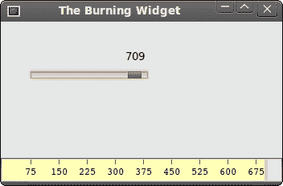

# wxWidgets 中的自定义小部件

> 原文： [http://zetcode.com/gui/wxwidgets/customwidgets/](http://zetcode.com/gui/wxwidgets/customwidgets/)

工具箱通常仅提供最常见的窗口小部件，例如按钮，文本窗口小部件，滚动条，滑块等。没有工具箱可以提供所有可能的窗口小部件。 wxWidgets 有许多小部件； 客户程序员创建了更多专门的小部件。

使用工具箱提供的绘图工具创建自定义窗口小部件。 有两种可能：程序员可以修改或增强现有的小部件，或者可以从头开始创建自定义小部件。

## 刻录小部件

这是我们从头开始创建的小部件的示例。 可以在各种媒体刻录应用（例如 Nero 烧录 ROM）中找到此小部件。

`widget.h`

```cpp
#ifndef WIDGET_H
#define WIDGET_H

#include <wx/wx.h>

class Widget : public wxPanel
{
public:
  Widget(wxPanel *parent, int id );

  wxPanel *m_parent;

  void OnSize(wxSizeEvent& event);
  void OnPaint(wxPaintEvent& event);  

};

#endif

```

`widget.cpp`

```cpp
#include <wx/wx.h>
#include "widget.h"
#include "burning.h"

int num[] = { 75, 150, 225, 300, 375, 450, 525, 600, 675 };
int asize = sizeof(num)/sizeof(num[1]);

Widget::Widget(wxPanel *parent, int id)
      : wxPanel(parent, id, wxDefaultPosition, wxSize(-1, 30), wxSUNKEN_BORDER)
{

  m_parent = parent;

  Connect(wxEVT_PAINT, wxPaintEventHandler(Widget::OnPaint));
  Connect(wxEVT_SIZE, wxSizeEventHandler(Widget::OnSize));

}

void Widget::OnPaint(wxPaintEvent& event)
{
  wxFont font(9, wxFONTFAMILY_DEFAULT, wxFONTSTYLE_NORMAL,
            wxFONTWEIGHT_NORMAL, false, wxT("Courier 10 Pitch"));

  wxPaintDC dc(this);
  dc.SetFont(font);
  wxSize size = GetSize();
  int width = size.GetWidth();

  Burning *burn = (Burning *) m_parent->GetParent();

  int cur_width = burn->GetCurWidth();

  int step = (int) round(width / 10.0);

  int till = (int) ((width / 750.0) * cur_width);
  int full = (int) ((width / 750.0) * 700);

  if (cur_width >= 700) {

      dc.SetPen(wxPen(wxColour(255, 255, 184))); 
      dc.SetBrush(wxBrush(wxColour(255, 255, 184)));
      dc.DrawRectangle(0, 0, full, 30);
      dc.SetPen(wxPen(wxColour(255, 175, 175)));
      dc.SetBrush(wxBrush(wxColour(255, 175, 175)));
      dc.DrawRectangle(full, 0, till-full, 30);

  } else { 

      dc.SetPen(wxPen(wxColour(255, 255, 184)));
      dc.SetBrush(wxBrush(wxColour(255, 255, 184)));
      dc.DrawRectangle(0, 0, till, 30);

  }

  dc.SetPen(wxPen(wxColour(90, 80, 60)));
  for ( int i=1; i <= asize; i++ ) {

  dc.DrawLine(i*step, 0, i*step, 6);
  wxSize size = dc.GetTextExtent(wxString::Format(wxT("%d"), num[i-1]));
  dc.DrawText(wxString::Format(wxT("%d"), num[i-1]), 
      i*step-size.GetWidth()/2, 8);
   }
}

void Widget::OnSize(wxSizeEvent& event)
{
  Refresh();
}

```

`burning.h`

```cpp
#ifndef BURNING_H
#define BURNING_H

#include <wx/wx.h>
#include "widget.h"

class Burning : public wxFrame
{
public:
  Burning(const wxString& title);

  void OnScroll(wxScrollEvent& event);
  int GetCurWidth();

  wxSlider *m_slider;
  Widget *m_wid;

  int cur_width;

};

#endif

```

`burning.cpp`

```cpp
#include "burning.h"
#include "widget.h"

int ID_SLIDER = 1;

Burning::Burning(const wxString& title)
       : wxFrame(NULL, wxID_ANY, title, wxDefaultPosition, wxSize(350, 200))
{

  cur_width = 75;

  wxPanel *panel = new wxPanel(this, wxID_ANY);
  wxPanel *centerPanel = new wxPanel(panel, wxID_ANY);

  m_slider = new wxSlider(centerPanel, ID_SLIDER, 75, 0, 750, wxPoint(-1, -1), 
      wxSize(150, -1), wxSL_LABELS);

  wxBoxSizer *vbox = new wxBoxSizer(wxVERTICAL);
  wxBoxSizer *hbox = new wxBoxSizer(wxHORIZONTAL);
  wxBoxSizer *hbox2 = new wxBoxSizer(wxHORIZONTAL);
  wxBoxSizer *hbox3 = new wxBoxSizer(wxHORIZONTAL);

  m_wid = new Widget(panel, wxID_ANY);
  hbox->Add(m_wid, 1, wxEXPAND);

  hbox2->Add(centerPanel, 1, wxEXPAND);
  hbox3->Add(m_slider, 0, wxTOP | wxLEFT, 35);

  centerPanel->SetSizer(hbox3);

  vbox->Add(hbox2, 1, wxEXPAND);
  vbox->Add(hbox, 0, wxEXPAND);

  panel->SetSizer(vbox);
  m_slider->SetFocus();

  Connect(ID_SLIDER, wxEVT_COMMAND_SLIDER_UPDATED, 
      wxScrollEventHandler(Burning::OnScroll)); 

  Centre();

}

void Burning::OnScroll(wxScrollEvent& WXUNUSED(event))
{
 cur_width = m_slider->GetValue();
 m_wid->Refresh();
}

int Burning::GetCurWidth() 
{
 return cur_width;
}

```

`main.h`

```cpp
#include <wx/wx.h>

class MyApp : public wxApp
{
  public:
    virtual bool OnInit();
};

```

`main.cpp`

```cpp
#include "main.h"
#include "burning.h"

IMPLEMENT_APP(MyApp)

bool MyApp::OnInit()
{

    Burning *burning = new Burning(wxT("The Burning Widget"));
    burning->Show(true);

    return true;
}

```

我们在窗口底部放置一个`wxPanel`并手动绘制整个窗口小部件。 所有重要的代码都位于小部件类的`OnPaint()`方法中。 此小部件以图形方式显示了介质的总容量和可供我们使用的可用空间。 小部件由滑块控制。 自定义窗口小部件的最小值为 0，最大值为 750。如果值达到 700，则开始绘制红色。 这表明过度燃烧。

```cpp
wxSize size = GetSize();
int width = size.GetWidth();
... 
int till = (int) ((width / 750.0) * cur_width);
int full = (int) ((width / 750.0) * 700);

```

我们动态绘制小部件。 窗口越大，刻录小部件越大。 反之亦然。 这就是为什么我们必须计算在其上绘制自定义窗口小部件的`wxPanel`的大小。 `till`参数确定要绘制的总大小。 该值来自滑块小部件。 它占整个面积的一部分。 `full`参数确定了我们开始绘制红色的点。 注意使用浮点算法。 这是为了达到更高的精度。

实际图纸包括三个步骤。 我们绘制黄色或红色和黄色矩形。 然后，我们绘制垂直线，这些垂直线将小部件分为几个部分。 最后，我们画出数字来表示介质的容量。

```cpp
void Widget::OnSize(wxSizeEvent& event)
{
  Refresh();
}

```

每次调整窗口大小时，我们都会刷新小部件。 这将导致小部件重新绘制自身。

```cpp
void Burning::OnScroll(wxScrollEvent& WXUNUSED(event))
{
 cur_width = m_slider->GetValue();
 m_wid->Refresh();
}

```

如果滚动滑块的拇指，我们将获得实际值并将其保存到`cur_width`变量中。 绘制刻录窗口小部件时使用此值。 然后，我们使小部件重新绘制。



图：烧录小部件

在 wxWidgets 教程的这一部分中，我们创建了一个自定义窗口小部件。