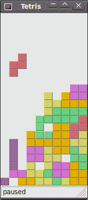

# wxWidgets 中的俄罗斯方块游戏

> 原文： [http://zetcode.com/gui/wxwidgets/thetetrisgame/](http://zetcode.com/gui/wxwidgets/thetetrisgame/)

俄罗斯方块游戏是有史以来最受欢迎的计算机游戏之一。 原始游戏是由俄罗斯程序员 _Alexey Pajitnov_ 于 1985 年设计和编程的。此后，几乎所有版本的几乎所有计算机平台上都可以使用 Tetris。

俄罗斯方块被称为下降块益智游戏。 在这个游戏中，我们有七个不同的形状，称为 _tetrominoes_ 。 S 形，Z 形，T 形，L 形，线形，镜像 L 形和正方形。 这些形状中的每一个都形成有四个正方形。 形状从板上掉下来。 俄罗斯方块游戏的目的是移动和旋转形状，以便它们尽可能地适合。 如果我们设法形成一行，则该行将被破坏并得分。 我们玩俄罗斯方块游戏，直到达到顶峰。


Figure: Tetrominoes

wxWidgets 是一个用于创建应用的工具包。 还有其他一些旨在创建计算机游戏的库。 不过，可以使用 wxWidgets 和其他应用工具包来创建简单的游戏。

## 发展历程

我们的俄罗斯方块游戏没有图像，我们使用 wxWidgets 编程工具包中提供的绘图 API 绘制四面体。 每个计算机游戏的背后都有一个数学模型。 俄罗斯方块也是如此。

游戏背后的一些想法。

*   我们使用`wxTimer`创建游戏周期。
*   绘制四聚体。
*   形状以正方形为单位移动（而不是逐个像素移动）。
*   从数学上讲，木板是一个简单的数字列表。

`Shape.h`

```
#ifndef SHAPE_H
#define SHAPE_H

enum Tetrominoes { NoShape, ZShape, SShape, LineShape, 
                  TShape, SquareShape, LShape, MirroredLShape };

class Shape
{
public:
    Shape() { SetShape(NoShape); }
    void SetShape(Tetrominoes shape);
    void SetRandomShape();

    Tetrominoes GetShape() const { return pieceShape; }
    int x(int index) const { return coords[index][0]; }
    int y(int index) const { return coords[index][1]; }

    int MinX() const;
    int MaxX() const;
    int MinY() const;
    int MaxY() const;

    Shape RotateLeft() const;
    Shape RotateRight() const;

private:
    void SetX(int index, int x) { coords[index][0] = x; }
    void SetY(int index, int y) { coords[index][1] = y; }
    Tetrominoes pieceShape;
    int coords[4][2];
};

#endif

```

`Shape.cpp`

```
#include <stdlib.h>
#include <algorithm>
#include "Shape.h"

using namespace std;

void Shape::SetShape(Tetrominoes shape)
{
    static const int coordsTable[8][4][2] = {
        { { 0, 0 },   { 0, 0 },   { 0, 0 },   { 0, 0 } },
        { { 0, -1 },  { 0, 0 },   { -1, 0 },  { -1, 1 } },
        { { 0, -1 },  { 0, 0 },   { 1, 0 },   { 1, 1 } },
        { { 0, -1 },  { 0, 0 },   { 0, 1 },   { 0, 2 } },
        { { -1, 0 },  { 0, 0 },   { 1, 0 },   { 0, 1 } },
        { { 0, 0 },   { 1, 0 },   { 0, 1 },   { 1, 1 } },
        { { -1, -1 }, { 0, -1 },  { 0, 0 },   { 0, 1 } },
        { { 1, -1 },  { 0, -1 },  { 0, 0 },   { 0, 1 } }
    };

    for (int i = 0; i < 4 ; i++) {
        for (int j = 0; j < 2; ++j)
            coords[i][j] = coordsTable[shape][i][j];
    }
    pieceShape = shape;
}

void Shape::SetRandomShape()
{
  int x = rand() % 7 + 1;
  SetShape(Tetrominoes(x));
}

int Shape::MinX() const
{
  int m = coords[0][0];
  for (int i=0; i<4; i++) {
      m = min(m, coords[i][0]);
  }
  return m;
}

int Shape::MaxX() const
{
  int m = coords[0][0];
  for (int i=0; i<4; i++) {
      m = max(m, coords[i][0]);
  }
  return m;
}

int Shape::MinY() const
{
  int m = coords[0][1];
  for (int i=0; i<4; i++) {
      m = min(m, coords[i][1]);
  }
  return m;
}

int Shape::MaxY() const
{
  int m = coords[0][1];
  for (int i=0; i<4; i++) {
      m = max(m, coords[i][1]);
  }
  return m;
}

Shape Shape::RotateLeft() const
{
    if (pieceShape == SquareShape)
        return *this;

    Shape result;
    result.pieceShape = pieceShape;
    for (int i = 0; i < 4; ++i) {
        result.SetX(i, y(i));
        result.SetY(i, -x(i));
    }
    return result;
}

Shape Shape::RotateRight() const
{
    if (pieceShape == SquareShape)
        return *this;

    Shape result;
    result.pieceShape = pieceShape;
    for (int i = 0; i < 4; ++i) {
        result.SetX(i, -y(i));
        result.SetY(i, x(i));
    }
    return result;
}

```

`Board.h`

```
#ifndef BOARD_H
#define BOARD_H

#include "Shape.h"
#include <wx/wx.h>

class Board : public wxPanel
{

public:
    Board(wxFrame *parent);
    void Start();
    void Pause();
    void linesRemovedChanged(int numLines);

protected:
    void OnPaint(wxPaintEvent& event);
    void OnKeyDown(wxKeyEvent& event);
    void OnTimer(wxCommandEvent& event);

private:
    enum { BoardWidth = 10, BoardHeight = 22 };

    Tetrominoes & ShapeAt(int x, int y) { return board[(y * BoardWidth) + x]; }

    int SquareWidth() { return GetClientSize().GetWidth() / BoardWidth; }
    int SquareHeight() { return GetClientSize().GetHeight() / BoardHeight; }
    void ClearBoard();
    void DropDown();
    void OneLineDown();
    void PieceDropped();
    void RemoveFullLines();
    void NewPiece();
    bool TryMove(const Shape& newPiece, int newX, int newY);
    void DrawSquare(wxPaintDC &dc, int x, int y, Tetrominoes shape);

    wxTimer *timer;
    bool isStarted;
    bool isPaused;
    bool isFallingFinished;
    Shape curPiece;
    int curX;
    int curY;
    int numLinesRemoved;
    Tetrominoes board[BoardWidth * BoardHeight];
    wxStatusBar *m_stsbar;
};

#endif

```

`Board.cpp`

```
#include "Board.h"

Board::Board(wxFrame *parent)
       : wxPanel(parent, wxID_ANY, wxDefaultPosition,
             wxDefaultSize, wxBORDER_NONE)
{
    timer = new wxTimer(this, 1);

    m_stsbar = parent->GetStatusBar();
    isFallingFinished = false;
    isStarted = false;
    isPaused = false;
    numLinesRemoved = 0;
    curX = 0;
    curY = 0;

    ClearBoard();  

    Connect(wxEVT_PAINT, wxPaintEventHandler(Board::OnPaint));
    Connect(wxEVT_KEY_DOWN, wxKeyEventHandler(Board::OnKeyDown));
    Connect(wxEVT_TIMER, wxCommandEventHandler(Board::OnTimer));
}

void Board::Start()
{
    if (isPaused)
        return;

    isStarted = true;
    isFallingFinished = false;
    numLinesRemoved = 0;
    ClearBoard();

    NewPiece();
    timer->Start(300);
}

void Board::Pause()
{
    if (!isStarted)
        return;

    isPaused = !isPaused;
    if (isPaused) {
        timer->Stop();
        m_stsbar->SetStatusText(wxT("paused"));
    } else {
        timer->Start(300);
        wxString str;
        str.Printf(wxT("%d"), numLinesRemoved);
        m_stsbar->SetStatusText(str);
    }
    Refresh();
}

void Board::OnPaint(wxPaintEvent& event)
{
    wxPaintDC dc(this);

    wxSize size = GetClientSize();
    int boardTop = size.GetHeight() - BoardHeight * SquareHeight();

    for (int i = 0; i < BoardHeight; ++i) {
        for (int j = 0; j < BoardWidth; ++j) {
            Tetrominoes shape = ShapeAt(j, BoardHeight - i - 1);
            if (shape != NoShape)
                DrawSquare(dc, 0 + j * SquareWidth(),
                           boardTop + i * SquareHeight(), shape);
        }
    }

    if (curPiece.GetShape() != NoShape) {
        for (int i = 0; i < 4; ++i) {
            int x = curX + curPiece.x(i);
            int y = curY - curPiece.y(i);
            DrawSquare(dc, 0 + x * SquareWidth(),
                       boardTop + (BoardHeight - y - 1) * SquareHeight(),
                       curPiece.GetShape());
        }
    }
}

void Board::OnKeyDown(wxKeyEvent& event)
{
    if (!isStarted || curPiece.GetShape() == NoShape) {  
        event.Skip();
        return;
    }

    int keycode = event.GetKeyCode();

    if (keycode == 'p' || keycode == 'P') {
	Pause();
        return;
    }

    if (isPaused)
        return;

    switch (keycode) {
    case WXK_LEFT:
        TryMove(curPiece, curX - 1, curY);
        break;
    case WXK_RIGHT:
        TryMove(curPiece, curX + 1, curY);
        break;
    case WXK_DOWN:
        TryMove(curPiece.RotateRight(), curX, curY);
        break;
    case WXK_UP:
        TryMove(curPiece.RotateLeft(), curX, curY);
        break;
    case WXK_SPACE:
        DropDown();
        break;
    case 'd':
        OneLineDown();
        break;
    case 'D':
        OneLineDown();
        break;
    default:
        event.Skip();
    }

}

void Board::OnTimer(wxCommandEvent& event)
{
    if (isFallingFinished) {
        isFallingFinished = false;
        NewPiece();
    } else {
        OneLineDown();
    }
}

void Board::ClearBoard()
{
    for (int i = 0; i < BoardHeight * BoardWidth; ++i)
        board[i] = NoShape;
}

void Board::DropDown()
{
    int newY = curY;
    while (newY > 0) {
        if (!TryMove(curPiece, curX, newY - 1))
            break;
        --newY;
    }
    PieceDropped();
}

void Board::OneLineDown()
{
    if (!TryMove(curPiece, curX, curY - 1))
        PieceDropped();
}

void Board::PieceDropped()
{
    for (int i = 0; i < 4; ++i) {
        int x = curX + curPiece.x(i);
        int y = curY - curPiece.y(i);
        ShapeAt(x, y) = curPiece.GetShape();
    }

    RemoveFullLines();

    if (!isFallingFinished)
        NewPiece();
}

void Board::RemoveFullLines()
{
     int numFullLines = 0;

     for (int i = BoardHeight - 1; i >= 0; --i) {
         bool lineIsFull = true;

         for (int j = 0; j < BoardWidth; ++j) {
             if (ShapeAt(j, i) == NoShape) {
                 lineIsFull = false;
                 break;
             }
         }

         if (lineIsFull) {
             ++numFullLines;
             for (int k = i; k < BoardHeight - 1; ++k) {
                 for (int j = 0; j < BoardWidth; ++j)
                     ShapeAt(j, k) = ShapeAt(j, k + 1);
             }
         }
     }

     if (numFullLines > 0) {
         numLinesRemoved += numFullLines;
         wxString str;
	 str.Printf(wxT("%d"), numLinesRemoved);
         m_stsbar->SetStatusText(str);

         isFallingFinished = true;
         curPiece.SetShape(NoShape);
         Refresh();
     }
 }

void Board::NewPiece()
{
    curPiece.SetRandomShape();
    curX = BoardWidth / 2 + 1;
    curY = BoardHeight - 1 + curPiece.MinY();

    if (!TryMove(curPiece, curX, curY)) {
        curPiece.SetShape(NoShape);
        timer->Stop();
        isStarted = false;
        m_stsbar->SetStatusText(wxT("game over"));
    }
}

bool Board::TryMove(const Shape& newPiece, int newX, int newY)
{
    for (int i = 0; i < 4; ++i) {
        int x = newX + newPiece.x(i);
        int y = newY - newPiece.y(i);
        if (x < 0 || x >= BoardWidth || y < 0 || y >= BoardHeight)
            return false;
        if (ShapeAt(x, y) != NoShape)
            return false;
    }

    curPiece = newPiece;
    curX = newX;
    curY = newY;
    Refresh();
    return true;
}

void Board::DrawSquare(wxPaintDC& dc, int x, int y, Tetrominoes shape)
{
    static wxColour colors[] = { wxColour(0, 0, 0), wxColour(204, 102, 102), 
             wxColour(102, 204, 102), wxColour(102, 102, 204), 
             wxColour(204, 204, 102), wxColour(204, 102, 204), 
             wxColour(102, 204, 204), wxColour(218, 170, 0) };

    static wxColour light[] = { wxColour(0, 0, 0), wxColour(248, 159, 171),
             wxColour(121, 252, 121), wxColour(121, 121, 252), 
             wxColour(252, 252, 121), wxColour(252, 121, 252), 
             wxColour(121, 252, 252), wxColour(252, 198, 0) };

    static wxColour dark[] = { wxColour(0, 0, 0), wxColour(128, 59, 59), 
             wxColour(59, 128, 59), wxColour(59, 59, 128), 
             wxColour(128, 128, 59), wxColour(128, 59, 128), 
             wxColour(59, 128, 128), wxColour(128, 98, 0) };

    wxPen pen(light[int(shape)]);
    pen.SetCap(wxCAP_PROJECTING);
    dc.SetPen(pen);

    dc.DrawLine(x, y + SquareHeight() - 1, x, y);
    dc.DrawLine(x, y, x + SquareWidth() - 1, y);

    wxPen darkpen(dark[int(shape)]);
    darkpen.SetCap(wxCAP_PROJECTING);
    dc.SetPen(darkpen);

    dc.DrawLine(x + 1, y + SquareHeight() - 1,
        x + SquareWidth() - 1, y + SquareHeight() - 1);
    dc.DrawLine(x + SquareWidth() - 1, 
        y + SquareHeight() - 1, x + SquareWidth() - 1, y + 1);

    dc.SetPen(*wxTRANSPARENT_PEN);
    dc.SetBrush(wxBrush(colors[int(shape)])); 
    dc.DrawRectangle(x + 1, y + 1, SquareWidth() - 2, 
        SquareHeight() - 2);
}

```

`Tetris.h`

```
#include <wx/wx.h>

class Tetris : public wxFrame
{
public:
    Tetris(const wxString& title);

};

```

`Tetris.cpp`

```
#include "Tetris.h"
#include "Board.h"

Tetris::Tetris(const wxString& title)
       : wxFrame(NULL, wxID_ANY, title, wxDefaultPosition, wxSize(180, 380))
{
  wxStatusBar *sb = CreateStatusBar();
  sb->SetStatusText(wxT("0"));
  Board *board = new Board(this);
  board->SetFocus();
  board->Start();
}

```

`main.h`

```
#include <wx/wx.h>

class MyApp : public wxApp
{
  public:
    virtual bool OnInit();

};

```

`main.cpp`

```
#include "main.h"
#include "Tetris.h"

IMPLEMENT_APP(MyApp)

bool MyApp::OnInit()
{
    srand(time(NULL));
    Tetris *tetris = new Tetris(wxT("Tetris"));
    tetris->Centre();
    tetris->Show(true);

    return true;
}

```

我对游戏做了一些简化，以便于理解。 游戏启动后立即开始。 我们可以通过按 `p` 键暂停游戏。 `空格键`将把俄罗斯方块放在底部。 `d` 键会将棋子下降一行。 （它可以用来加快下降速度。）游戏以恒定速度运行，没有实现加速。 分数是我们已删除的行数。

```
...
isFallingFinished = false;
isStarted = false;
isPaused = false;
numLinesRemoved = 0;
curX = 0;
curY = 0;
...

```

在开始游戏之前，我们先初始化一些重要的变量。 `isFallingFinished`变量确定俄罗斯方块形状是否已完成下降，然后我们需要创建一个新形状。 `numLinesRemoved`计算行数，到目前为止我们已经删除了行数。 `curX`和`curY`变量确定下降的俄罗斯方块形状的实际位置。

```
for (int i = 0; i < BoardHeight; ++i) {
    for (int j = 0; j < BoardWidth; ++j) {
        Tetrominoes shape = ShapeAt(j, BoardHeight - i - 1);
        if (shape != NoShape)
            DrawSquare(dc, 0 + j * SquareWidth(),
                    boardTop + i * SquareHeight(), shape);
    }
}

```

游戏的绘画分为两个步骤。 在第一步中，我们绘制所有形状或已放置到板底部的形状的其余部分。 所有正方形都记在`board`数组中。 我们使用`ShapeAt()`方法访问它。

```
if (curPiece.GetShape() != NoShape) {
    for (int i = 0; i < 4; ++i) {
        int x = curX + curPiece.x(i);
        int y = curY - curPiece.y(i);
        DrawSquare(dc, 0 + x * SquareWidth(),
                   boardTop + (BoardHeight - y - 1) * SquareHeight(),
                   curPiece.GetShape());
    }
}

```

下一步是绘制掉落的实际零件。

```
...
switch (keycode) {
case WXK_LEFT:
    TryMove(curPiece, curX - 1, curY);
    break;
...

```

在`Board::OnKeyDown()`方法中，我们检查按键是否按下。 如果按向左箭头键，我们将尝试将棋子向左移动。 我们说尝试，因为这片可能无法移动。

```
void Board::OnTimer(wxCommandEvent& event)
{
    if (isFallingFinished) {
        isFallingFinished = false;
        NewPiece();
    } else {
        OneLineDown();
    }
}

```

在`Board::OnTimer()`方法中，我们可以创建一个新的片段，将前一个片段放到底部，或者将下降的片段向下移动一行。

```
void Board::DropDown()
{
    int newY = curY;
    while (newY > 0) {
        if (!TryMove(curPiece, curX, newY - 1))
            break;
        --newY;
    }
    PieceDropped();
}

```

`Board::DropDown()`方法将下落的形状立即下降到板的底部。 当我们按下空格键时会发生这种情况。

```
void Board::PieceDropped()
{
    for (int i = 0; i < 4; ++i) {
        int x = curX + curPiece.x(i);
        int y = curY - curPiece.y(i);
        ShapeAt(x, y) = curPiece.GetShape();
    }

    RemoveFullLines();

    if (!isFallingFinished)
        NewPiece();
}

```

在`Board::PieceDropped()`方法中，我们将当前形状设置为其最终位置。 我们调用`RemoveFullLines()`方法来检查是否至少有一个完整的行。 如果尚未在`Board::PieceDropped()`方法中创建新的俄罗斯方块形状，则可以创建一个新的俄罗斯方块形状。

```
if (lineIsFull) {
    ++numFullLines;
    for (int k = i; k < BoardHeight - 1; ++k) {
        for (int j = 0; j < BoardWidth; ++j)
            ShapeAt(j, k) = ShapeAt(j, k + 1);
    }
}

```

此代码将删除所有行。 找到整条线后，我们增加计数器。 我们将整行上方的所有行向下移动一行。 这样我们就破坏了整个生产线。 注意，在俄罗斯方块游戏中，我们使用了 _ 天真引力 _。 这意味着正方形可能会漂浮在空白间隙上方。

```
void Board::NewPiece()
{
    curPiece.SetRandomShape();
    curX = BoardWidth / 2 + 1;
    curY = BoardHeight - 1 + curPiece.MinY();

    if (!TryMove(curPiece, curX, curY)) {
        curPiece.SetShape(NoShape);
        timer->Stop();
        isStarted = false;
        m_stsbar->SetStatusText(wxT("game over"));
    }
}

```

`Board::NewPiece()`方法随机创建一个新的俄罗斯方块。 如果棋子无法进入其初始位置，则游戏结束。

```
bool Board::TryMove(const Shape& newPiece, int newX, int newY)
{
    for (int i = 0; i < 4; ++i) {
        int x = newX + newPiece.x(i);
        int y = newY - newPiece.y(i);
        if (x < 0 || x >= BoardWidth || y < 0 || y >= BoardHeight)
            return false;
        if (ShapeAt(x, y) != NoShape)
            return false;
    }

    curPiece = newPiece;
    curX = newX;
    curY = newY;
    Refresh();
    return true;
}

```

在`Board::TryMove()`方法中，我们尝试移动形状。 如果形状在木板的边缘或与其他形状相邻，则返回 false。 否则，我们将当前下降形状放置到新位置并返回 true。

`Shape`类保存有关俄罗斯方块的信息。

```
for (int i = 0; i < 4 ; i++) {
    for (int j = 0; j < 2; ++j)
        coords[i][j] = coordsTable[shape][i][j];
}

```

coords 数组保存俄罗斯方块的坐标。 例如，数字{0，-1}，{0，0}，{1，0}，{1，1}表示旋转的 S 形。 下图说明了形状。


Figure: Coordinates

当绘制当前下降片时，将其绘制在`curX`和`curY`位置。 然后，我们查看坐标表并绘制所有四个正方形。



Figure: Tetris

这是 wxWidgets 中的俄罗斯方块游戏。