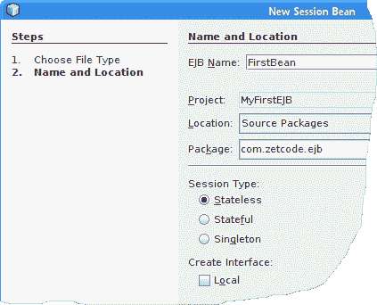
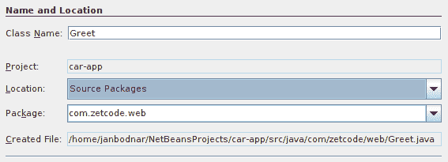
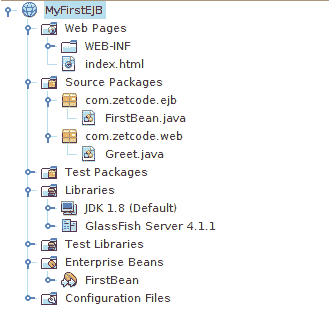
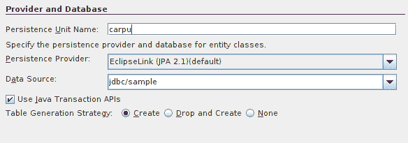
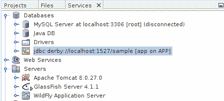
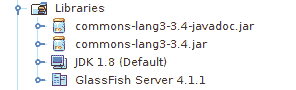
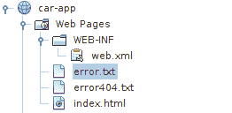
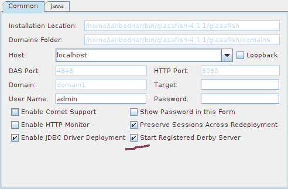

# EJB 简介

原文：http://zetcode.com/java/ejb/

在本教程中，我们学习如何使用 Enterprise JavaBeans。 我们使用 GlassFish，NetBeans，Derby 和 Maven。

Enterprise JavaBean （EJB） 是服务器端组件，封装了应用的业务逻辑。 EJB 在 EJB 容器中运行，该容器负责各种系统级服务，包括事务管理，安全性和并发控制。 EJB 是 Java EE 规范的一部分。

GlassFish 是 Java EE 的参考实现，它包括 Enterprise JavaBeans 容器。 我们将在 GlassFish 中运行示例。 Apache Derby 是完全用 Java 实现的开源关系数据库。 Oracle 以 Java DB 的名义分发相同的二进制文件。

## 第一个 EJB

我们在 NetBeans 中创建一个新的 Web 应用。 该项目将称为`MyFirstEJB`。 从“服务器和设置”页面，选择 GlassFish 服务器，并将上下文更改为`myfirstejb`。


Figure: Server and Settings


在此对话框中，我们选择应用服务器，Java EE 版本和上下文路径。

`index.html`

```java
<!DOCTYPE html>
<html>
    <head>
        <title>Test page</title>
        <meta charset="UTF-8">
        <meta name="viewport" content="width=device-width, initial-scale=1.0">
    </head>
    <body>
        <p>Test page</p>
    </body>
</html>

```

这是我们的`index.html`页面。 如果我们访问应用的根页面，它将返回。

我们右键单击应用图标，然后选择一个 Session Bean 类型的新 EJB。 我们将 bean 称为`MyFirstBean`，键入`com.zetcode.ejb`包，然后选择无状态会话类型。



Figure: Creating a new session bean in NetBeans


无状态会话 Bean 不维护与客户端的对话状态。 当客户端调用无状态 Bean 的方法时，该 Bean 的实例变量可能包含特定于该客户端的状态，但仅在调用期间包含。 该方法完成后，客户端特定的状态将丢失。

`FirstBean.java`

```java
package com.zetcode.ejb;

import javax.ejb.Stateless;

@Stateless
public class FirstBean {

    private String name;

    public String getName() {
        return name;
    }

    public void setName(String name) {
        this.name = name;
    }

    public String sayHello() {

        StringBuilder sb = new StringBuilder("Hello ");
        sb.append(this.getName()).append("!");
        return sb.toString();
    }
}

```

`MyFirstBean`是无状态会话 Bean。 使用`@Stateless`装饰创建一个无状态会话 bean。 它具有`no-interface view`，其中不使用本地业务接口，并且 Bean 类的所有公共方法都自动向调用者公开。

```java
public String sayHello() {

    StringBuilder sb = new StringBuilder("Hello ");
    sb.append(this.getName()).append("!");
    return sb.toString();
}

```

`MyFirstBean's`的工作是构造对调用者的问候。

接下来，我们通过右键单击项目图标并从 Web 类别中选择 Servlet 文件类型来创建一个新的 Servlet。 我们将 servlet 称为`Greet`，然后键入`com.zetcode.web`包。 我们将 URL 模式更改为`/greet`。



Figure: New servlet creation


在新的 Servlet 对话框中，我们提供 Servlet 名称及其包。

`Greet.java`

```java
package com.zetcode.web;

import com.zetcode.ejb.FirstBean;
import java.io.IOException;
import java.io.PrintWriter;
import javax.ejb.EJB;
import javax.servlet.ServletException;
import javax.servlet.annotation.WebServlet;
import javax.servlet.http.HttpServlet;
import javax.servlet.http.HttpServletRequest;
import javax.servlet.http.HttpServletResponse;

@WebServlet(name = "Greet", urlPatterns = {"/greet"})
public class Greet extends HttpServlet {

    @EJB
    private FirstBean firstBean;

    @Override
    protected void doGet(HttpServletRequest request, HttpServletResponse response)
            throws ServletException, IOException {

        response.setContentType("text/plain;charset=UTF-8");

        firstBean.setName(request.getParameter("name"));
        String msg = firstBean.createMessage();

        try (PrintWriter out = response.getWriter()) {

            out.println(msg);

        }
    }
}

```

`Greet` Servlet 从客户端发送的 URL 中读取名称参数，调用 EJB 的`createMessage()`业务方法，并以纯文本形式返回响应。

```java
@EJB
private FirstBean firstBean;

```

`@EJB`注解将 EJB 注入 Servlet。

```java
response.setContentType("text/plain;charset=UTF-8");

```

servelt 响应以 UTF-8 字符集的纯文本格式显示。

```java
firstBean.setName(request.getParameter("name"));

```

我们从请求中检索`name`参数，并将其设置为 EJB。

```java
String msg = firstBean.createMessage();

```

我们将其称为`createMessage()`业务方法。



Figure: MyFirstEJB project structure


我们构建应用并将其部署到 GlassFish 服务器。 要构建应用，请右键单击项目图标，然后选择“ Build”（构建）。 要部署应用，请右键单击项目图标，然后选择“部署”。

```java
$ curl localhost:8080/myfirstejb/greet?name=Jan
Hello Jan!

```

使用`curl`工具，我们连接到`myfirstejb` Web 应用的`Greet` servlet，并向其传递参数。 Web 应用以问候语响应。

```java
$ curl localhost:8080/myfirstejb/
<!DOCTYPE html>
<html>
    <head>
        <title>Test page</title>
        <meta charset="UTF-8">
        <meta name="viewport" content="width=device-width, initial-scale=1.0">
    </head>
    <body>
        <p>Test page</p>
    </body>
</html>

```

访问根页面，应用将返回 HTML 测试页面。

## 使用实体 bean 持久化数据

在第二个示例中，我们创建一个将读取和保存汽车的 Web 应用。 汽车对象将保存在 Derby 数据库中。

我们使用`car-app`名称创建一个新的 Java Web 应用。 然后，我们创建一个新的`Car`实体。 实体类文件类型位于持久性类别中。 软件包将为`com.zetcode.persistence`。 主键类型为`Long`，并选中了创建持久性单元选项。

在下一页中，我们将持久性单元名称更改为`carpu`，然后选择默认的`EclipseLink`持久性提供程序。 我们选择`jdbc/sample`数据源，并选择了`Create`表生成策略。 `jdbc/sample`数据源是指默认情况下位于用户主目录的`.netbeans-derby`子目录中的`sample`数据库。



Figure: Persistence provider


在此视图中，我们提供了持久性单元名称，持久性提供程序，数据源和表生成策略。

### 实体 Bean

实体 Bean 是一种 Enterprise JavaBean，它表示持久存储中存在的业务实体对象。 实体 bean 由主键标识。 与在客户端会话的生存期内生存的会话 Bean 不同，实体 Bean 即使在 EJB 容器崩溃时也可以幸免。

`Car.java`

```java
package com.zetcode.persistence;

import java.io.Serializable;
import javax.persistence.Column;
import javax.persistence.Entity;
import javax.persistence.GeneratedValue;
import javax.persistence.GenerationType;
import javax.persistence.Id;
import javax.persistence.Table;

@Entity
@Table(name="Cars")
public class Car implements Serializable {

    private static final long serialVersionUID = 1L;

    @Id
    @GeneratedValue(strategy = GenerationType.AUTO)
    @Column(name="Id")
    private Long id;    

    @Column(name="Name")
    private String name;

    @Column(name="Price")
    private int price;      

    public Car() { }

    public Car(String name, int price) {

        this.name = name;
        this.price = price;
    }

    public String getName() {
        return name;
    }

    public void setName(String name) {
        this.name = name;
    }

    public int getPrice() {
        return price;
    }

    public void setPrice(int price) {
        this.price = price;
    }    

    public Long getId() {
        return id;
    }

    public void setId(Long id) {
        this.id = id;
    }
}

```

`Car`是 EJB 实体 Bean。 它是要存储在 Derby 数据库中的业务对象。

```java
@Entity
@Table(name="Cars")
public class Car implements Serializable {

```

实体 bean 用`@Entity`注释修饰。 该实体映射到`Cars`表。

```java
@Id
@GeneratedValue(strategy = GenerationType.AUTO)
@Column(name="Id")
private Long id;   

```

每个实体都有一个唯一的对象标识符。 此唯一标识符或主键使客户端能够定位特定的实体实例。 `@Id`声明此实体 bean 的标识符属性，`@GeneratedValue`注解用于指定主键的生成方式，`@Column`将标识符映射到数据库表的`Id`列。

```java
public Car() { }

```

持久性框架需要无参数的构造器。

### EJB

我们创建一个本地无状态`ManageCarBean`企业 bean。 这次 EJB 具有本地接口视图。

`ManageCarBeanLocal.java`

```java
package com.zetcode.ejb;

import javax.ejb.Local;
import com.zetcode.persistence.Car;

@Local
public interface ManageCarBeanLocal {

    void saveCar(Car car);
    void setPrice(int price);
    void setName(String name);

    Car getCar(Long id);
}

```

该接口定义了 EJB 客户端要使用的方法。 客户端只能通过 bean 的业务接口中定义的方法来访问会话 bean。

```java
@Local
public interface ManageCarBeanLocal {

```

`@Local`装饰指定该接口是本地业务接口。

`ManageCarBean.java`

```java
package com.zetcode.ejb;

import javax.ejb.Stateless;
import javax.persistence.EntityManager;
import javax.persistence.PersistenceContext;
import com.zetcode.persistence.Car;

@Stateless
public class ManageCarBean implements ManageCarBeanLocal {

    private String name;
    private int price;

    @PersistenceContext(unitName = "carpu")
    private EntityManager em;

    public String getName() {
        return name;
    }

    @Override
    public void setName(String name) {
        this.name = name;
    }

    public int getPrice() {
        return price;
    }

    @Override
    public void setPrice(int price) {
        this.price = price;
    }

    @Override
    public void saveCar(Car car) {

        em.persist(car);
    }

    @Override
    public Car getCar(Long id) {

        Car car = em.find(Car.class, id);
        return car;
    }
}

```

`ManageCarBean`读取并保存汽车对象。

```java
@PersistenceContext(unitName = "carpu")
private EntityManager em;

```

容器使用`persistence.xml`中的信息创建`EntityManager`。 `@PersistenceContext`注释将实体管理器注入到 Bean 中。 管理器已映射到`carpu`持久性单元。 实体管理器用于通过持久性上下文与数据进行交互。

```java
@Override
public void saveCar(Car car) {

    em.persist(car);
}

```

`saveCar()`方法将汽车对象保存到数据库中； 在我们的例子中是 Derby。

```java
@Override
public Car getCar(Long id) {

    Car car = em.find(Car.class, id);
    return car;
}

```

`getCar()`方法通过其 ID 查找汽车。

`persistence.xml`

```java
<?xml version="1.0" encoding="UTF-8"?>
<persistence version="2.1" xmlns="http://xmlns.jcp.org/xml/ns/persistence" xmlns:xsi="http://www.w3.org/2001/XMLSchema-instance" xsi:schemaLocation="http://xmlns.jcp.org/xml/ns/persistence http://xmlns.jcp.org/xml/ns/persistence/persistence_2_1.xsd">

  <persistence-unit name="carpu" transaction-type="JTA">
    <jta-data-source>jdbc/sample</jta-data-source>
    <exclude-unlisted-classes>false</exclude-unlisted-classes>
    <properties>
      <property name="eclipselink.ddl-generation" value="create-tables" />
    </properties>
  </persistence-unit>

</persistence>

```

`persistence.xml`文件是一个配置文件，其中包含有关我们在应用中使用的数据库的信息。 `jdbc/sample`是 GlassFish 服务器随附的内置数据源。 在我们的应用中，我们将数据保存在 Derby 的预先创建的`sample`数据库中。 如果`eclipselink.ddl-generation`属性不存在，则会自动导致创建`Cars`表。



Figure: NetBeans Derby tool


我们可以使用 NetBeans Derby 工具来连接和管理数据库中的数据。 该工具位于“服务”窗口中。

### servlet

我们创建两个 servlet：`SaveCar`和`ReadCar`。 我们将它们放入`com.zetcode.web`包中。 Servlet 是从 NetBeans Web 类别创建的。 两个 servlet 均以纯文本形式响应。



Figure: Apache Common Lang JARs


我们还包括用于帮助程序方法的 Apache Common Lang JAR。 可以从[项目网站](https://commons.apache.org/proper/commons-lang/download_lang.cgi)下载该库。

`ValidateParameter.java`

```java
package com.zetcode.util;

import org.apache.commons.lang3.math.NumberUtils;

public class ValidateParameter {

    private static final int MAX_PRICE_CAR = 10_000_000;

    public static boolean validateName(String param) {

        return !(null == param || "".equals(param) || 
                NumberUtils.isNumber(param));
    }

    public static boolean validateId(String param) {

        return !(null == param || "".equals(param) || 
                !NumberUtils.isNumber(param));
    }   

    public static boolean validatePrice(String param) {

       if (null == param || "".equals(param) || !NumberUtils.isNumber(param)) {
           return false;
       }

       int price = Integer.valueOf(param);

       return !(price < 0 || price > MAX_PRICE_CAR);

    }     
}

```

`ValidateParameter`类用于验证请求参数。 参数不能为`null`或为空，并且 ID 和价格值必须为数字。 另外，价格必须在合理范围内。 我们使用 Apache Common Lang 的`NumberUtils.isNumber()`检查数字值。

`SaveCar.java`

```java
package com.zetcode.web;

import java.io.IOException;
import java.io.PrintWriter;
import javax.ejb.EJB;
import javax.servlet.ServletException;
import javax.servlet.annotation.WebServlet;
import javax.servlet.http.HttpServlet;
import javax.servlet.http.HttpServletRequest;
import javax.servlet.http.HttpServletResponse;
import com.zetcode.ejb.ManageCarBeanLocal;
import com.zetcode.persistence.Car;
import com.zetcode.util.ValidateParameter;

@WebServlet(name = "SaveCar", urlPatterns = {"/save"})
public class SaveCar extends HttpServlet {

    @EJB
    private ManageCarBeanLocal manageCarBean;

    @Override
    protected void doGet(HttpServletRequest request, HttpServletResponse response)
            throws ServletException, IOException {

        String sname = request.getParameter("name");
        String sprice = request.getParameter("price");

        String message;

        if (ValidateParameter.validateName(sname)
                && ValidateParameter.validatePrice(sprice)) {

            message = String.format("%s car is saved", sname);

            int price = Integer.valueOf(sprice);
            Car car = new Car(sname, price);
            manageCarBean.saveCar(car);

        } else {

            message = "Wrong parameters";
        }

        response.setContentType("text/plain;charset=UTF-8");

        try (PrintWriter out = response.getWriter()) {

            out.println(message);

        }
    }
}

```

`SaveCar` Servlet 的目的是调用适当的 EJB 来保存汽车。 汽车对象的数据是从客户端发送的 URL 中读取的。

```java
@WebServlet(name = "SaveCar", urlPatterns = {"/save"})

```

`@WebServlet`注释将`SaveCar` Servlet 映射到`/save`路径。

```java
@EJB
private ManageCarBeanLocal manageCarBean;

```

`ManageCarBeanLocal`企业 bean 被注入到 servlet 中。

```java
String sname = request.getParameter("name");
String sprice = request.getParameter("price");

```

从请求中读取参数。

```java
if (ValidateParameter.validateName(sname)
        && ValidateParameter.validatePrice(sprice)) {

```

参数正在验证中。

```java
Car car = new Car(sname, price);
manageCarBean.saveCar(car);

```

创建一个新的汽车对象并将其保存到数据库。 为了保存汽车对象，我们利用了`ManageCarBean`的`saveCar()`方法。

`ReadCar.java`

```java
package com.zetcode.web;

import com.zetcode.ejb.ManageCarBeanLocal;
import java.io.IOException;
import java.io.PrintWriter;
import javax.ejb.EJB;
import javax.servlet.ServletException;
import javax.servlet.annotation.WebServlet;
import javax.servlet.http.HttpServlet;
import javax.servlet.http.HttpServletRequest;
import javax.servlet.http.HttpServletResponse;
import com.zetcode.persistence.Car;
import com.zetcode.util.ValidateParameter;

@WebServlet(name = "ReadCar", urlPatterns = {"/read"})
public class ReadCar extends HttpServlet {

    @EJB
    private ManageCarBeanLocal manageCarBean;

    @Override
    protected void doGet(HttpServletRequest request, HttpServletResponse response)
            throws ServletException, IOException {

        response.setContentType("text/plain;charset=UTF-8");

        String message;
        String pid = request.getParameter("id");

        if (ValidateParameter.validateId(pid)) {

            Long carId = Long.valueOf(pid);

            Car rcar = manageCarBean.getCar(carId);

            if (null != rcar) {

                message = String.format("Name: %s, Price: %d",
                        rcar.getName(), rcar.getPrice());

            } else {

                message = "Cannot find car with this ID";
            }
        } else {

            message = "Wrong parameters";
        }

        try (PrintWriter out = response.getWriter()) {

            out.println(message);
        }
    }
}

```

`ReadCar` servlet 调用`ManageCarBean`企业 bean 从数据库中读取数据； 它根据提供的 ID 选择汽车对象。

```java
String sid = request.getParameter("id");

```

从 URL 读取 ID。

```java
Long carId = Long.valueOf(pid);

Car rcar = manageCarBean.getCar(carId);

if (null != rcar) {

    message = String.format("Name: %s, Price: %d",
            rcar.getName(), rcar.getPrice());

} else {

    message = "Cannot find car with this ID";
}

```

`ManageCarBean`的`readCar()`方法用于检索汽车对象。

`web.xml`

```java
<?xml version="1.0" encoding="UTF-8"?>

<web-app xmlns="http://xmlns.jcp.org/xml/ns/javaee"
         xmlns:xsi="http://www.w3.org/2001/XMLSchema-instance"
         xsi:schemaLocation="http://xmlns.jcp.org/xml/ns/javaee http://xmlns.jcp.org/xml/ns/javaee/web-app_3_1.xsd"
         version="3.1">

    <session-config>
        <session-timeout>
            30
        </session-timeout>
    </session-config>

    <error-page>
        <error-code>404</error-code>
        <location>/error404.txt</location>
    </error-page>

    <error-page>
        <location>/error.txt</location>
    </error-page>    

</web-app>

```

在`web.xml`文件中，我们提供了两个错误页面。 `error.txt`是所有错误的默认错误页面，`error404.txt`是 404 错误的错误页面，当客户端请求不存在的资源时触发。 注意，`error404.txt`必须先于`error.txt`。



图：错误页面s


我们将两个文本文件放置在网页中。

`error.txt`

```java
Error has occurred, check the GlassFish log file

```

这是一般错误页面。

`error404.txt`

```java
404 : Page was not found

```

这是 404 错误的错误页面。

### 部署方式

是时候部署应用了。 通过右键单击 Web 项目并选择 Deploy 命令来部署应用。 请注意，当我们清理项目时，将取消部署该应用。 如果未运行所选的应用服务器，那么 deploy 命令还将启动它。

```java
$ ./asadmin list-applications
MyFirstEJB  <ejb, web>
car-app     <ejb, web>  
Command list-applications executed successfully.

```

GlassFish 的`asadmin`工具可用于确定当前已部署的应用。

GlassFish 启动时，NetBeans 会自动启动 Derby 服务器。 可以在 GlassFish 服务器设置中将其关闭。



Figure: GlassFish server properties


在 NetBeans 的“服务”选项卡中，我们展开“服务器”节点，然后选择 GlassFish 属性。 在那里，我们可以看到“启动已注册 Derby 服务器”选项。

```java
$ curl localhost:8080/car-app/doread
404 : Page was not found

```

如果尝试访问不存在的资源，则会收到自定义 404 错误消息。

```java
$ curl "localhost:8080/car-app/save?name=Volvo&price=29000"
Volvo car is saved

```

沃尔沃汽车将保存到数据库中。 注意 URL 的双引号的用法。

```java
$ curl "localhost:8080/car-app/save?name=Bentley&price=299000000"
Wrong parameters

```

验证器发现了不切实际的高汽车价格。

```java
$ curl localhost:8080/car-app/read?id=401
Name: Volvo, Price: 29000

```

我们从数据库中读取了一辆汽车。

## 使用 Maven 构建项目

NetBeans 在开发过程中为我们节省了许多繁琐的工作。 但是使用 Maven 手动构建项目是有益的。

```java
mvn archetype:generate -DgroupId=com.zetcode -DartifactId=car-app 
    -DarchetypeArtifactId=maven-archetype-webapp -DinteractiveMode=false 

```

我们创建一个新的 Maven 项目。 我们使用`maven-archetype-webapp`类型。

```java
$ tree 
.
└── car-app
    ├── pom.xml
    └── src
        └── main
            ├── resources
            └── webapp
                ├── index.jsp
                └── WEB-INF
                    └── web.xml

6 directories, 3 files

```

`tree`命令向我们显示了创建的项目结构。

```java
$ mkdir -p src/main/java/com/zetcode/ejb
$ mkdir src/main/java/com/zetcode/persistence
$ mkdir src/main/java/com/zetcode/web
$ mkdir src/main/java/com/zetcode/util
$ mkdir src/main/resources/META-INF

```

我们创建目录。

复制应用源文件后，项目结构如下所示：

```java
$ tree
.
├── pom.xml
└── src
    └── main
        ├── java
        │   └── com
        │       └── zetcode
        │           ├── ejb
        │           │   ├── ManageCarBean.java
        │           │   └── ManageCarBeanLocal.java
        │           ├── persistence
        │           │   └── Car.java
        │           ├── util
        │           │   └── ValidateParameter.java
        │           └── web
        │               ├── ReadCar.java
        │               └── SaveCar.java
        ├── resources
        │   └── META-INF
        │       └── persistence.xml
        └── webapp
            ├── index.jsp
            └── WEB-INF
                └── web.xml

```

不要忘记复制`web.xml`文件。 Maven 为我们创建了一个空的`web.xml`文件。

`pom.xml`

```java
<project xmlns="http://maven.apache.org/POM/4.0.0" xmlns:xsi="http://www.w3.org/2001/XMLSchema-instance"
    xsi:schemaLocation="http://maven.apache.org/POM/4.0.0 http://maven.apache.org/maven-v4_0_0.xsd">
    <modelVersion>4.0.0</modelVersion>
    <groupId>com.zetcode</groupId>
    <artifactId>car-app</artifactId>
    <packaging>war</packaging>
    <version>1.0-SNAPSHOT</version>
    <name>car-app Maven Webapp</name>
    <url>http://maven.apache.org</url>

    <dependencies>

        <dependency>
            <groupId>org.eclipse.persistence</groupId>
            <artifactId>eclipselink</artifactId>
            <version>2.5.0</version>
        </dependency>   

        <dependency>
            <groupId>org.apache.commons</groupId>
            <artifactId>commons-lang3</artifactId>
            <version>3.0</version>
        </dependency>        

        <dependency>  
            <groupId>javax</groupId>    
            <artifactId>javaee-web-api</artifactId>    
            <version>7.0</version>  
        </dependency>     

    </dependencies>  

    <build>

        <plugins>

            <plugin>
                <groupId>org.apache.maven.plugins</groupId>
                <artifactId>maven-compiler-plugin</artifactId>
                <version>3.5.1</version>
                <configuration>
                <source>1.8</source>
                <target>1.8</target>
                </configuration>
            </plugin>            

        </plugins>    

        <resources>
            <resource>
                <directory>src/main/resources</directory>
                <filtering>true</filtering>
            </resource>
        </resources>
        <finalName>car-app</finalName>
    </build>         

</project>

```

`pom.xml`是一个文件，其中包含有关项目的信息以及 Maven 用于构建项目的配置详细信息。 我们提供了 Eclipse 链接持久性提供程序，Apache Commons lang 库和 Java EE Web API 的依赖项。 我们指示 Maven 使用 Java8。最终的构建文件称为`car-app.war`，位于`target`子目录中。

```java
$ mvn package

```

该项目是使用`mvn package`命令构建的。

```java
$ ./asadmin start-domain 

```

从 GlassFish 的`bin`目录中，启动 GlassFish 服务器。

```java
$ ./asadmin start-database --db-home ~/.netbeans-derby

```

Derby 服务器已启动。 NetBeans 在`.netbeans-derby`目录中创建 Derby 系统主目录，该目录位于用户的主目录中。 在这里，我们可以找到我们之前使用过的`sample`数据库。

```java
$ ~/bin/glassfish-4.1.1/glassfish/bin/asadmin deploy target/car-app.war

```

我们部署应用。 我们看到警告语`Table/View 'CARS' already exists in Schema 'APP'`。 这是`eclipselink.ddl-generation`属性的结果，该属性设置为`create_tables`。 我们可以忽略警告。

```java
$ curl localhost:8080/car-app/read?id=401
Name: Volvo, Price: 29000

```

我们检索先前创建的汽车。

在本教程中，我们为一些简单的业务逻辑创建了 Enterprise JavaBeans。 我们已使用 NetBeans，Derby 和 Maven 作为示例。 ZetCode 具有以下相关教程： [Derby 教程](/db/apachederbytutorial/)， [Java 教程](/lang/java/)和 [Stripes 教程](/java/stripes/)。