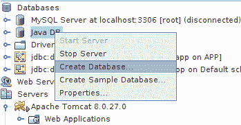
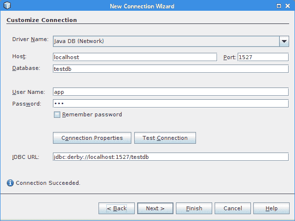
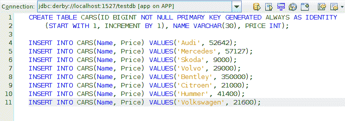
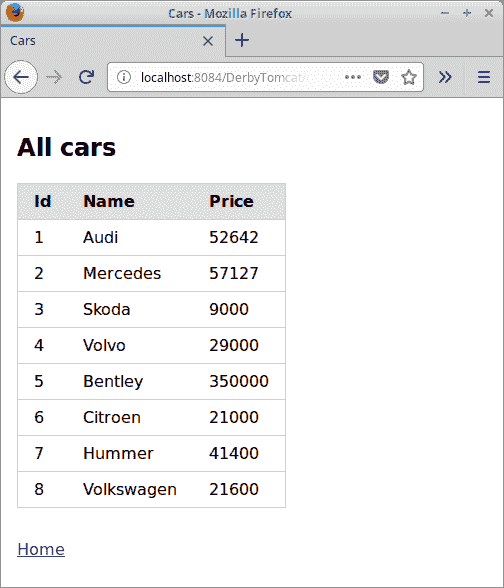

# Tomcat Derby 教程

原文：http://zetcode.com/java/tomcatderby/

在本教程中，我们将使用 Tomcat 和 Derby。 该应用程序分为四个层，它具有一个控制器，并使用 DAO 访问数据。 对于项目创建，我们使用 NetBeans IDE。 源代码可从作者的 Github [TomcatDerby](https://github.com/janbodnar/TomcatDerby) 存储库中获得。

现代 Java Web 应用程序主要通过使用诸如 Spring 或 Vaadin 之类的框架来创建。 但是有必要了解基础。

我们使用`pure.css`库来帮助创建用户界面。

Apache Derby 是完全用 Java 实现的开源关系数据库。 它占地面积小，易于部署和安装。 它支持嵌入式和客户端/服务器模式。

Apache Tomcat 是 Java Servlet，JavaServer Pages，Java Expression Language 和 Java WebSocket 技术的开源实现。

数据访问对象&lt;abbr&gt;（DAO）&lt;/abbr&gt; 是为数据库或其他持久性机制提供抽象接口的对象。 DAO 完全向其客户端隐藏了数据源实现细节。 它充当组件和数据源之间的适配器。

## Java Web 应用程序

我们在 NetBeans 中创建一个新的 Web 应用程序。 该应用程序管理一个简单的`Cars`表。 它将创建新的汽车，检索一辆汽车和所有汽车。

该应用程序分为四个层：表示层，模型层，服务层和持久层。 Web 应用程序的多层设置是重要的软件开发模式。

```
$ tree
.
├── nb-configuration.xml
├── pom.xml
├── README.md
└── src
    ├── main
    │   ├── java
    │   │   └── com
    │   │       └── zetcode
    │   │           ├── bean
    │   │           │   └── Car.java
    │   │           ├── persistence
    │   │           │   ├── CarDAO.java
    │   │           │   ├── Executable.java
    │   │           │   └── JdbcDAO.java
    │   │           ├── service
    │   │           │   ├── CarsService.java
    │   │           │   └── ICarsService.java
    │   │           ├── util
    │   │           │   ├── DBUtils.java
    │   │           │   ├── ServiceLocator.java
    │   │           │   └── ValidateParameter.java
    │   │           └── web
    │   │               └── Controller.java
    │   └── webapp
    │       ├── allCars.jsp
    │       ├── carSaved.jsp
    │       ├── index.jsp
    │       ├── META-INF
    │       │   └── context.xml
    │       ├── readCarId.jsp
    │       ├── readCar.jsp
    │       ├── showCar.jsp
    │       ├── unknown.jsp
    │       ├── WEB-INF
    │       └── wrongParams.jsp
    └── test
        └── java

```

这是项目结构。

`pom.xml`

```
<?xml version="1.0" encoding="UTF-8"?>
<project xmlns="http://maven.apache.org/POM/4.0.0" 
         xmlns:xsi="http://www.w3.org/2001/XMLSchema-instance" 
         xsi:schemaLocation="http://maven.apache.org/POM/4.0.0 
http://maven.apache.org/xsd/maven-4.0.0.xsd">

    <modelVersion>4.0.0</modelVersion>

    <groupId>com.mycompany</groupId>
    <artifactId>DerbyTomcat</artifactId>
    <version>1.0-SNAPSHOT</version>
    <packaging>war</packaging>

    <name>DerbyTomcat</name>

    <properties>
        <project.build.sourceEncoding>UTF-8</project.build.sourceEncoding>
        <maven.compiler.source>1.8</maven.compiler.source>
        <maven.compiler.target>1.8</maven.compiler.target>
    </properties>

    <dependencies>

        <dependency>
            <groupId>javax.servlet</groupId>
            <artifactId>javax.servlet-api</artifactId>
            <version>4.0.0</version>
            <scope>provided</scope>
        </dependency>

        <dependency>
            <groupId>org.apache.derby</groupId>
            <artifactId>derbyclient</artifactId>
            <version>10.14.1.0</version>
        </dependency>

        <dependency>
            <groupId>javax.servlet</groupId>
            <artifactId>jstl</artifactId>
            <version>1.2</version>
        </dependency>

        <dependency>
            <groupId>org.apache.commons</groupId>
            <artifactId>commons-lang3</artifactId>
            <version>3.7</version>
        </dependency>

    </dependencies>

   <build>
        <plugins>

            <plugin>
                <groupId>org.apache.maven.plugins</groupId>
                <artifactId>maven-war-plugin</artifactId>
                <version>3.2.0</version>
                <configuration>
                    <failOnMissingWebXml>false</failOnMissingWebXml>
                </configuration>
            </plugin>

        </plugins>
    </build>

</project>

```

`pom.xml`包含项目依赖项：servlet 的 JAR，JSP 页面，Derby 数据库驱动程序，JSTL 库以及某些帮助程序类的 Apache Commons Lang JAR。

<figure>

<figcaption>Figure: Database creation</figcaption>

</figure>

在“服务”选项卡中，我们右键单击 Java DB 节点，然后选择“创建数据库”选项。 我们给它命名为`testdb`。 该数据库位于用户主目录的`.netbeans_derby`目录中。

`cars.sql`

```
CREATE TABLE CARS(ID BIGINT NOT NULL PRIMARY KEY GENERATED ALWAYS AS IDENTITY 
    (START WITH 1, INCREMENT BY 1), NAME VARCHAR(30), PRICE INT);

INSERT INTO CARS(Name, Price) VALUES('Audi', 52642);
INSERT INTO CARS(Name, Price) VALUES('Mercedes', 57127);
INSERT INTO CARS(Name, Price) VALUES('Skoda', 9000);
INSERT INTO CARS(Name, Price) VALUES('Volvo', 29000);
INSERT INTO CARS(Name, Price) VALUES('Bentley', 350000);
INSERT INTO CARS(Name, Price) VALUES('Citroen', 21000);
INSERT INTO CARS(Name, Price) VALUES('Hummer', 41400);
INSERT INTO CARS(Name, Price) VALUES('Volkswagen', 21600);

```

这是创建`Cars`表的 SQL。 汽车对象的 ID 会自动增加。 我们可以使用 NetBeans 工具创建`Cars`表。 我们右键单击“数据库”节点，然后选择“新建连接”选项。

<figure>

<figcaption>Figure: Connection wizard</figcaption>

</figure>

我们在连接向导中填写必要的详细信息。 我们使用 Derby 网络驱动程序； 德比的港口是 1527。

<figure>

<figcaption>Figure: Connections</figcaption>

</figure>

创建一个新的连接对象； 它由橙色图标表示。 其上下文菜单提供了用于连接到指定数据库并执行命令的选项。 “执行命令”选项显示了执行 SQL 命令的工具。 在此窗口中，我们可以使用上面的 SQL 创建`Cars`表。

<figure>

<figcaption>Figure: NetBeans Derby tool</figcaption>

</figure>

NetBeans 具有有用的 Derby 工具，可用于管理 Derby 数据库。

`context.xml`

```
<?xml version="1.0" encoding="UTF-8"?>
<Context path="/DerbyTomcat">

    <Resource name="jdbc/testdb"
              auth="Container" 
              type="javax.sql.DataSource"
              driverClassName="org.apache.derby.jdbc.ClientDriver" 
              username="app"
              password="app" 
              url="jdbc:derby://localhost:1527/testdb" 
              maxActive="10" maxIdle="4" 
    />
</Context>

```

在`META-INF`目录中的`context.xml`文件中，我们提供了数据源。 使用 JNDI API 查找资源。

### 模型层

模型层具有`Car`类。

`Car.java`

```
package com.zetcode.bean;

import java.util.Objects;

public class Car {

    private Long id;
    private String name;
    private int price;

    public String getName() {
        return name;
    }

    public void setName(String name) {
        this.name = name;
    }

    public int getPrice() {
        return price;
    }

    public void setPrice(int price) {
        this.price = price;
    }

    public Long getId() {
        return id;
    }

    public void setId(Long id) {
        this.id = id;
    }

    @Override
    public int hashCode() {

        int hash = 7;
        hash = 61 * hash + Objects.hashCode(this.id);
        hash = 61 * hash + Objects.hashCode(this.name);
        hash = 61 * hash + this.price;
        return hash;
    }

    @Override
    public boolean equals(Object obj) {

        if (this == obj) {
            return true;
        }
        if (obj == null) {
            return false;
        }
        if (getClass() != obj.getClass()) {
            return false;
        }
        final Car other = (Car) obj;
        if (this.price != other.price) {
            return false;
        }
        if (!Objects.equals(this.name, other.name)) {
            return false;
        }

        return Objects.equals(this.id, other.id);
    }    
}

```

`Car`类具有三个属性以及相应的 getter 和 setter 方法。

### 表示层

应用程序的表示层包含 JSP 页面，这些页面构建了应用程序的用户界面。

`index.jsp`

```
<%@page contentType="text/html" pageEncoding="UTF-8"%>
<%@page trimDirectiveWhitespaces="true"%>
<%@taglib prefix="c" uri="http://java.sun.com/jsp/jstl/core" %>
<!DOCTYPE html>
<html>
    <head>
        <title>Home page</title>
        <meta charset="UTF-8">
        <meta name="viewport" content="width=device-width, initial-scale=1">
    </head>
    <body>

        <h2>Home page</h2>

        <p>Available actions:</p>

        <ul>
            <li><a href="controller?action=listcars">Show all</a></li>
            <li><a href="controller?action=readbyid">Show car by ID</a></li>
            <li><a href="controller?action=readcar">Create a new car</a></li>
        </ul>

        <nav>
            <a href="<%= request.getContextPath() %>">Home</a>
        </nav>      

    </body>
</html>

```

`index.jsp`页面包含三个可用操作的链接：显示所有汽车，显示通过其 ID 找到的汽车以及创建新汽车。

```
<a href="<%= request.getContextPath() %>">Home</a>

```

使用`getContextPath()`方法，我们可以获得主页路径。

`allCars.jsp`

```
<%@page contentType="text/html" pageEncoding="UTF-8"%>
<%@page trimDirectiveWhitespaces="true"%>
<%@taglib prefix="c" uri="http://java.sun.com/jsp/jstl/core" %>
<!DOCTYPE html>
<html>
    <head>
        <title>Cars</title>
        <meta charset="UTF-8">
        <meta name="viewport" content="width=device-width, initial-scale=1">
        <link rel="stylesheet" href="https://unpkg.com/purecss@1.0.0/build/pure-min.css" 
              integrity="sha384-nn4HPE8lTHyVtfCBi5yW9d20FjT8BJwUXyWZT9InLYax14RDjBj46LmSztkmNP9w"
              crossorigin="anonymous">  

        <style>
            body { padding:1em }
            nav { margin-top: 2em }
        </style>
    </head>
    <body>

        <h2>All cars</h2>

        <table class="pure-table pure-table-horizontal">
            <thead>
                <tr>
                    <th>Id</th>
                    <th>Name</th>
                    <th>Price</th>
                </tr>
            </thead>

            <c:forEach items="${carList}" var='car'>
                <tr>
                    <td>
                        <c:out value="${car.id}"/>
                    </td>
                    <td>
                        <c:out value="${car.name}"/>
                    </td>
                    <td>
                        <c:out value="${car.price}"/>
                    </td>                    
                </tr>
            </c:forEach>          

        </table>

        <nav>
            <a href="<%= request.getContextPath() %>">Home</a>
        </nav>  

    </body>
</html>

```

在`allCars.jsp`页面中，JSTL 的`&lt;c:forEach&gt;`和`&lt;c:out&gt;`标签用于打印每个返回的汽车对象的属性。

```
<table class="pure-table pure-table-horizontal">

```

我们使用`pure.css`类来设计表。

`readCar.jsp`

```
<%@page contentType="text/html" pageEncoding="UTF-8"%>
<%@page trimDirectiveWhitespaces="true" %>
<%@taglib prefix="c" uri="http://java.sun.com/jsp/jstl/core" %>
<!DOCTYPE html>
<html>
    <head>
        <title>Car details</title>
        <meta charset="UTF-8">
        <meta name="viewport" content="width=device-width, initial-scale=1">
        <link rel="stylesheet" href="https://unpkg.com/purecss@1.0.0/build/pure-min.css" 
              integrity="sha384-nn4HPE8lTHyVtfCBi5yW9d20FjT8BJwUXyWZT9InLYax14RDjBj46LmSztkmNP9w"
              crossorigin="anonymous">      
        <style>
            body { padding:1em }
            nav { margin-top: 2em }
        </style>

    </head>

    <body>

        <form class="pure-form pure-form-stacked" action="controller?action=savecar" method="post">

            <legend>Enter car details:</legend>

            <label for="carName">Name:</label>
            <input id="carName" type="text" name="carName">

            <label for="carPrice">Price:</label>
            <input id ="carPrice" type="text" name="carPrice">

            <button class="pure-button pure-button-primary" type="submit">Submit</button>

        </form>

        <nav>
            <a href="<%= request.getContextPath() %>">Home</a>
        </nav>               

    </body>
</html>

```

在`readCar.jsp`页面上，我们有一个表格来输入新车的详细信息。

`readCarId.jsp`

```
<%@page contentType="text/html" pageEncoding="UTF-8"%>
<%@page trimDirectiveWhitespaces="true"%>
<%@taglib prefix="c" uri="http://java.sun.com/jsp/jstl/core" %>
<!DOCTYPE html>
<html>
    <head>
        <title>Enter car ID</title>
        <meta charset="UTF-8">
        <meta name="viewport" content="width=device-width, initial-scale=1">

        <link rel="stylesheet" href="https://unpkg.com/purecss@1.0.0/build/pure-min.css" 
              integrity="sha384-nn4HPE8lTHyVtfCBi5yW9d20FjT8BJwUXyWZT9InLYax14RDjBj46LmSztkmNP9w"
              crossorigin="anonymous">  

        <style>
            body { padding:1em }
            nav { margin-top:2em }
        </style>        

    </head>
    <body>

        <form class="pure-form pure-form-stacked" action="controller">

            <legend>Enter car Id</legend>

            <input type="hidden" name="action" value="viewcar">

            <label for="carId">Id:</label>
            <input id="carId" type="text" name="carId">

            <button class="pure-button pure-button-primary" type="submit">Submit</button>

        </form>

        <nav>
            <a href="<%= request.getContextPath() %>">Home</a>
        </nav>  

    </body>
</html>

```

在`readCarId.jsp`文件中，我们有一个表格来输入我们要检索的汽车 ID。

`carSaved.jsp`

```
<%@page contentType="text/html" pageEncoding="UTF-8"%>
<%@page trimDirectiveWhitespaces="true"%>
<%@taglib prefix="c" uri="http://java.sun.com/jsp/jstl/core"%>
<!DOCTYPE html>
<html>
    <head>
        <title>Car saved</title>
        <meta charset="UTF-8">
        <meta name="viewport" content="width=device-width, initial-scale=1">
    </head>
    <body>
        <p>
            Successfully saved  <c:out value="${sessionScope.carName}"/>
            car priced <c:out value="${sessionScope.carPrice}"/>
        </p>

        <nav>
            <a href="<%= request.getContextPath() %>">Home</a>
        </nav>  
    </body>
</html>

```

在`carSaved.jsp`页面中，我们仅通知您已保存具有给定名称和价格的汽车。 我们使用 JSTL 库中的`&lt;c:out&gt;`标签。

`showCar.jsp`

```
<%@page contentType="text/html" pageEncoding="UTF-8"%>
<%@page trimDirectiveWhitespaces="true"%>
<%@taglib prefix="c" uri="http://java.sun.com/jsp/jstl/core" %>
<!DOCTYPE html>
<html>
    <head>
        <title>Returned car</title>        
        <meta charset="UTF-8">
        <meta name="viewport" content="width=device-width, initial-scale=1">
    </head>
    <body>

        <h2>Car details</h2>

        <ul>
            <li>ID: <c:out value="${returnedCar.id}"/></li>
            <li>Name: <c:out value="${returnedCar.name}"/></li>
            <li>Price: <c:out value="${returnedCar.price}"/></li>
        </ul>

        <nav>
            <a href="<%= request.getContextPath() %>">Home</a>
        </nav>        

    </body>
</html>

```

在`showCar.jsp`页面中，我们显示检索到的汽车的属性。

`unknown.jsp`

```
<%@page contentType="text/html" pageEncoding="UTF-8"%>
<%@page trimDirectiveWhitespaces="true"%>
<%@taglib prefix="c" uri="http://java.sun.com/jsp/jstl/core"%>
<!DOCTYPE html>
<html>
    <head>
        <title>Unknown action</title>
        <meta charset="UTF-8">
        <meta name="viewport" content="width=device-width, initial-scale=1">
    </head>
    <body>

        <h2>Unknown action</h2>

        <nav>
            <a href="<%= request.getContextPath() %>">Home</a>
        </nav>  
    </body>
</html>

```

当控制器收到未定义的动作时，将显示`unknown.jsp`页面。

`wrongParams.jsp`

```
<%@page contentType="text/html" pageEncoding="UTF-8"%>
<%@page trimDirectiveWhitespaces="true"%>
<%@taglib prefix="c" uri="http://java.sun.com/jsp/jstl/core"%>
<!DOCTYPE html>
<html>
    <head>
        <title>Wrong parameters</title>
        <meta charset="UTF-8">
        <meta name="viewport" content="width=device-width, initial-scale=1">
    </head>
    <body>
        <h2>Wrong parameters specified</h2>

        <nav>
            <a href="<%= request.getContextPath() %>">Home</a>
        </nav>  

    </body>
</html>

```

请求参数无效时，显示`wrongParams.jsp`页面。 创建名为`ValidateParameter`的实用程序类以确保请求参数的有效性。

### 服务层

服务层提供逻辑以对发送到 DAO 和从 DAO 发送的数据进行操作。

`ICarsService.java`

```
package com.zetcode.service;

import com.zetcode.bean.Car;
import java.util.List;

public interface ICarsService {

    public List<Car> findAllCars();
    public Car findCar(Long id);
    public void saveCar(Car car);
}

```

`ICarsService`为汽车服务提供了三种合同方式。 我们提供了一种检索所有汽车，查找特定汽车并保存新汽车的方法。

`CarsService.java`

```
package com.zetcode.service;

import com.zetcode.bean.Car;
import com.zetcode.persistence.CarDAO;
import com.zetcode.persistence.JdbcDAO;
import java.util.List;

public class CarsService implements ICarsService {

    @Override
    public List<Car> findAllCars() {

        CarDAO carDAO = new JdbcDAO();
        return carDAO.findAll();
    }

    @Override
    public Car findCar(Long id) {

        CarDAO carDAO = new JdbcDAO();
        return carDAO.findCar(id);
    }

    @Override
    public void saveCar(Car car) {

        CarDAO carDAO = new JdbcDAO();
        carDAO.saveCar(car);
    }
}

```

`CarsService`提供合同方法的实现。

```
@Override
public List<Car> findAllCars() {

    CarDAO carDAO = new JdbcDAO();
    return carDAO.findAll();
}

```

`findAllCars()`方法创建一个`JdbcDAO`并调用其`findAll()`方法。

### 持久层

在持久层中，我们应用 DAO 模式。 DAO 在定义的 API 中隐藏了数据库编程的复杂性。

`CarDAO.java`

```
package com.zetcode.persistence;

import com.zetcode.bean.Car;
import java.util.List;

public interface CarDAO {

  public void saveCar(Car car);
  public Car findCar(Long id);
  public List<Car> findAll();
}

```

这是`CarDAO`界面，显示用于访问我们的数据库的方法签名。

`Executable.java`

```
package com.zetcode.persistence;

import java.sql.SQLException;
import javax.naming.NamingException;

public interface Executable {

    void exec() throws SQLException, NamingException;
}

```

`Executable`接口是将 try / catch / finally 样板放入`exec()`方法的合约。

`JdbcDAO.java`

```
package com.zetcode.persistence;

import com.zetcode.bean.Car;
import com.zetcode.util.DBUtils;
import com.zetcode.util.ServiceLocator;
import java.sql.Connection;
import java.sql.PreparedStatement;
import java.sql.ResultSet;
import java.util.ArrayList;
import java.util.List;
import java.util.logging.Level;
import java.util.logging.Logger;
import javax.naming.NamingException;
import java.sql.SQLException;
import javax.sql.DataSource;

public class JdbcDAO implements CarDAO {

    private static final String DATA_SOURCE = "java:comp/env/jdbc/testdb";
    private Connection con;
    private ResultSet rs;
    private PreparedStatement pst;

    @Override
    public void saveCar(Car car) {

        execute(() -> {
            DataSource ds = ServiceLocator.getDataSource(DATA_SOURCE);

            con = ds.getConnection();

            pst = con.prepareStatement("INSERT INTO CARS(Name, Price) VALUES(?, ?)");
            pst.setString(1, car.getName());
            pst.setInt(2, car.getPrice());
            pst.executeUpdate();
        });
    }

    @Override
    public Car findCar(Long id) {

        Car car = new Car();

        execute(() -> {
            DataSource ds = ServiceLocator.getDataSource(DATA_SOURCE);
            con = ds.getConnection();

            pst = con.prepareStatement("SELECT * FROM CARS WHERE Id = (?)");
            pst.setLong(1, id);
            rs = pst.executeQuery();

            if (rs.next()) {

                car.setId(rs.getLong(1));
                car.setName(rs.getString(2));
                car.setPrice(rs.getInt(3));
            }
        });

        return car;
    }

    @Override
    public List<Car> findAll() {

        List<Car> carList = new ArrayList<>();

        execute(() -> {
            DataSource ds = ServiceLocator.getDataSource(DATA_SOURCE);
            con = ds.getConnection();
            pst = con.prepareStatement("SELECT * FROM CARS");

            rs = pst.executeQuery();

            while (rs.next()) {
                Car car = new Car();
                car.setId(rs.getLong(1));
                car.setName(rs.getString(2));
                car.setPrice(rs.getInt(3));
                carList.add(car);
            }
        });

        return carList;
    }

    private void execute(Executable executable) {

        try {
            executable.exec();
        } catch (NamingException | SQLException e) {

            Logger lgr = Logger.getLogger(JdbcDAO.class.getName());
            lgr.log(Level.SEVERE, e.getMessage(), e);

        } finally {

            DBUtils.closeResultSet(rs);
            DBUtils.closeStatement(pst);
            DBUtils.closeConnection(con);
        }
    }
}

```

`JdbcDAO`是`CarDAO`接口的具体实现。 它使用 JDBC 从`Cars`表中插入和检索数据。

```
private static final String DATA_SOURCE = "java:comp/env/jdbc/testdb";

```

这是用于定位`testdb`数据库的 JNDI 资源名称。

```
@Override
public void saveCar(Car car) {

    execute(() -> {
        DataSource ds = ServiceLocator.getDataSource(DATA_SOURCE);

        con = ds.getConnection();

        pst = con.prepareStatement("INSERT INTO CARS(Name, Price) VALUES(?, ?)");
        pst.setString(1, car.getName());
        pst.setInt(2, car.getPrice());
        pst.executeUpdate();
    });
}

```

`saveCar()`方法保存一个新的汽车对象。 `ServiceLocator.getDataSource()`方法查找并返回数据源。 该代码已插入`execute()`方法中，该方法将处理 try / catch / finally 样板。

```
@Override
public Car findCar(Long id) {

    Car car = new Car();

    execute(() -> {
        DataSource ds = ServiceLocator.getDataSource(DATA_SOURCE);
        con = ds.getConnection();

        pst = con.prepareStatement("SELECT * FROM CARS WHERE Id = (?)");
        pst.setLong(1, id);
        rs = pst.executeQuery();

        if (rs.next()) {

            car.setId(rs.getLong(1));
            car.setName(rs.getString(2));
            car.setPrice(rs.getInt(3));
        }
    });

    return car;
}

```

`findCar()`方法从`Cars`表中检索新车。 它执行准备好的语句，该语句接收汽车的 ID。 一个新的 car bean 填充了返回的数据。

```
private void execute(Executable executable) {

    try {
        executable.exec();
    } catch (NamingException | SQLException e) {

        Logger lgr = Logger.getLogger(JdbcDAO.class.getName());
        lgr.log(Level.SEVERE, e.getMessage(), e);

    } finally {

        DBUtils.closeResultSet(rs);
        DBUtils.closeStatement(pst);
        DBUtils.closeConnection(con);
    }
}

```

处理异常的重复代码位于`execute()`方法中。

### 实用程序类

我们创建了三个实用程序类：`ServiceLocator`，`ValidateParameter`和`DBUtils`。 这些类位于`com.zetcode.util`包中。

`ServiceLocator.java`

```
package com.zetcode.util;

import javax.naming.Context;
import javax.naming.InitialContext;
import javax.naming.NamingException;
import javax.sql.DataSource;

public class ServiceLocator {

    public static DataSource getDataSource(String jndiName) throws NamingException {

        Context ctx = new InitialContext();
        DataSource ds = (DataSource) ctx.lookup(jndiName);

        return ds;
    }
}

```

`ServiceLocator`查找并返回数据源。 从`JdbcDAO`类调用它。 数据源的详细信息在`context.xml`文件中指定。

`ValidateParameter.java`

```
package com.zetcode.util;

import org.apache.commons.lang3.math.NumberUtils;

public class ValidateParameter {

    private static final int MAX_PRICE_CAR = 10_000_000;

    public static boolean validateName(String param) {

        return !(null == param || "".equals(param));
    }

    public static boolean validateId(String param) {

        return !(null == param || "".equals(param) || 
                !NumberUtils.isCreatable(param));
    }   

    public static boolean validatePrice(String param) {

       if (null == param || "".equals(param) || !NumberUtils.isCreatable(param)) {
           return false;
       }

       int price = Integer.valueOf(param);

       return !(price < 0 || price > MAX_PRICE_CAR);

    } 
}

```

`ValidateParameter`具有用于验证请求参数的静态方法。 例如，ID 必须为数字，且价格不得为负。 我们使用 Apache Commons Lang 库中的`NumberUtils.isCreatable()`方法来确保参数为数字。

`DBUtils.java`

```
package com.zetcode.util;

import java.sql.Connection;
import java.sql.ResultSet;
import java.sql.SQLException;
import java.sql.Statement;
import java.util.logging.Level;
import java.util.logging.Logger;

public class DBUtils {

    private static final Logger logger = Logger.getLogger(DBUtils.class.getName());

    public static void closeResultSet(ResultSet rs) {

        if (rs != null) {
            try {
                rs.close();
            } catch (SQLException ex) {
                logger.log(Level.FINEST, "Could not close JDBC ResultSet", ex);
            } catch (Throwable ex) {
                // We don't trust the JDBC driver: It might throw RuntimeException or Error.
                logger.log(Level.FINEST, "Unexpected exception on closing JDBC ResultSet", ex);
            }
        }
    }

    public static void closeStatement(Statement stmt) {
        if (stmt != null) {
            try {
                stmt.close();
            } catch (SQLException ex) {
                logger.log(Level.FINEST, "Could not close JDBC Statement", ex);
            } catch (Throwable ex) {
                // We don't trust the JDBC driver: It might throw RuntimeException or Error.
                logger.log(Level.FINEST, "Unexpected exception on closing JDBC Statement", ex);
            }
        }
    }    

    public static void closeConnection(Connection con) {

        if (con != null) {
            try {
                con.close();
            } catch (SQLException ex) {
                logger.log(Level.FINEST, "Could not close JDBC Connection", ex);
            } catch (Throwable ex) {
                // We don't trust the JDBC driver: It might throw RuntimeException or Error.
                logger.log(Level.FINEST, "Unexpected exception on closing JDBC Connection", ex);
            }
        }
    }
}

```

`DBUtils`包含释放数据库资源和处理异常的方法。

### 控制者

`Controller`是一个 Servlet，它接收传入的请求，调用服务方法并发送响应。

`Controller.java`

```
package com.zetcode.web;

import com.zetcode.bean.Car;
import com.zetcode.persistence.CarDAO;
import com.zetcode.persistence.JdbcDAO;
import com.zetcode.service.CarsService;
import com.zetcode.service.ICarsService;
import com.zetcode.util.ValidateParameter;
import java.io.IOException;
import javax.servlet.RequestDispatcher;
import javax.servlet.ServletException;
import javax.servlet.annotation.WebServlet;
import javax.servlet.http.HttpServlet;
import javax.servlet.http.HttpServletRequest;
import javax.servlet.http.HttpServletResponse;

@WebServlet(name = "Controller", urlPatterns = {"/controller"})
public class Controller extends HttpServlet {

    private static final String ACTION_KEY = "action";

    private static final String READ_CAR_BY_ID_VIEW = "readCarId.jsp";
    private static final String SHOW_CAR_VIEW = "showCar.jsp";
    private static final String READ_CAR_VIEW = "readCar.jsp";
    private static final String CAR_SAVED_VIEW = "carSaved.jsp";
    private static final String ALL_CARS_VIEW = "allCars.jsp";

    private static final String UNKNOWN_VIEW = "unknown.jsp";
    private static final String WRONG_PARAMS_VIEW = "wrongParams.jsp";

    private static final String LIST_CARS_ACTION = "listcars";
    private static final String READ_CAR_BY_ID_ACTION = "readbyid";
    private static final String READ_CAR_ACTION = "readcar";
    private static final String VIEW_CAR_ACTION = "viewcar";
    private static final String SAVE_CAR_ACTION = "savecar";

    @Override
    protected void doGet(HttpServletRequest request, HttpServletResponse response)
            throws ServletException, IOException {
        response.setContentType("text/html;charset=UTF-8");

        String actionName = request.getParameter(ACTION_KEY);
        String page = UNKNOWN_VIEW;

        if (LIST_CARS_ACTION.equals(actionName)) {

            ICarsService service = new CarsService();

            request.setAttribute("carList", service.findAllCars());
            page = ALL_CARS_VIEW;
        }

        if (READ_CAR_BY_ID_ACTION.equals(actionName)) {
            page = READ_CAR_BY_ID_VIEW;
        }     

        if (READ_CAR_ACTION.equals(actionName)) {
            page = READ_CAR_VIEW;
        }             

        if (VIEW_CAR_ACTION.equals(actionName)) {

            String sid = request.getParameter("carId");

            if (ValidateParameter.validateId(sid)) {

                ICarsService service = new CarsService();
                Long carId = Long.valueOf(sid);
                request.setAttribute("returnedCar", service.findCar(carId));

                page = SHOW_CAR_VIEW;
            } else {

                page = WRONG_PARAMS_VIEW;
            }
        }

        RequestDispatcher disp = getServletContext().getRequestDispatcher("/" + page);
        disp.forward(request, response);
    }

    @Override
    protected void doPost(HttpServletRequest request, HttpServletResponse response)
            throws ServletException, IOException {

        response.setContentType("text/html;charset=UTF-8");

        String actionName = request.getParameter(ACTION_KEY);
        String page = UNKNOWN_VIEW;        

        if (SAVE_CAR_ACTION.equals(actionName)) {

            String sname = request.getParameter("carName");
            String sprice = request.getParameter("carPrice");

            if (ValidateParameter.validateName(sname)
                    && ValidateParameter.validatePrice(sprice)) {

                Car car = new Car();
                car.setName(sname);
                car.setPrice(Integer.valueOf(sprice));

                ICarsService service = new CarsService();
                service.saveCar(car);

                request.getSession().setAttribute("carName", sname);
                request.getSession().setAttribute("carPrice", sprice);
                page = CAR_SAVED_VIEW;

            } else {

                page = WRONG_PARAMS_VIEW;
            }
        }    

        response.sendRedirect(page);
    }
}

```

该 servlet 位于`com.zetcode.web`包中。

```
private static final String READ_CAR_BY_ID_VIEW = "readCarId.jsp";
private static final String SHOW_CAR_VIEW = "showCar.jsp";
private static final String READ_CAR_VIEW = "readCar.jsp";
...

```

这些是我们的应用程序中使用的各种视图。

```
private static final String LIST_CARS_ACTION = "listcars";
private static final String READ_CAR_BY_ID_ACTION = "readbyid";
private static final String READ_CAR_ACTION = "readcar";
...

```

这些是应用程序的各种动作。 例如，`READ_CAR_ACTION`显示的视图包含一个表单，用户可以在其中输入新车的详细信息。

```
if (LIST_CARS_ACTION.equals(actionName)) {

    ICarsService service = new CarsService();

    request.setAttribute("carList", service.findAllCars());
    page = ALL_CARS_VIEW;
}

```

对于`LIST_CARS_ACTION`，我们创建一个`CarsService`对象。 我们调用`findAllCars()`服务方法，并将结果设置为`carList`属性。 然后，控制器 Servlet 指向`ALL_CARS_VIEW`。

```
if (VIEW_CAR_ACTION.equals(actionName)) {

    String sid = request.getParameter("carId");

    if (ValidateParameter.validateId(sid)) {

        ICarsService service = new CarsService();
        Long carId = Long.valueOf(sid);
        request.setAttribute("returnedCar", service.findCar(carId));

        page = SHOW_CAR_VIEW;
    } else {

        page = WRONG_PARAMS_VIEW;
    }
}

```

为了查看一辆汽车，我们从`request`参数中获得了汽车的 ID。 该值使用`ValidateParameter.validateId()`实用程序方法进行验证。 （该值不能为`null`，为空，并且必须为数字。）如果参数无效，则控制器导航至`WRONG_PARAMS_VIEW`。

`findCar()`尝试从数据库中检索汽车。 返回的汽车将插入`returnedCar`属性，该属性随后会在`showCar.jsp`页面中获取。

```
if (ValidateParameter.validateName(sname)
        && ValidateParameter.validatePrice(sprice)) {

    Car car = new Car();
    car.setName(sname);
    car.setPrice(Integer.valueOf(sprice));

    ICarsService service = new CarsService();
    service.saveCar(car);

    request.getSession().setAttribute("carName", sname);
    request.getSession().setAttribute("carPrice", sprice);
    page = CAR_SAVED_VIEW;

} else {

    page = WRONG_PARAMS_VIEW;
}

```

该代码位于`doPost()`方法中。 保存新车时，我们有两个参数：汽车的名称和价格。 该 ID 由 Derby 自动创建。 验证参数，并创建一个新的`Car`对象并填充参数。 `saveCar()`将汽车对象保存到数据库中。 汽车的名称将传递到`CAR_SAVED_VIEW`，以便向用户创建消息。 由于我们在`doPost()`方法中使用了重定向，因此我们将汽车的名称及其价格放入会话对象； 进行重定向操作后，我们会从原始请求中删除数据。

```
response.sendRedirect(page);

```

遵循发布/重定向/获取模式，我们将重定向到`doPost()`方法中的视图。 这样可以防止提交多个表单。 （例如，我们可能不小心多次添加了汽车）。

<figure>

<figcaption>Figure: Displaying all cars</figcaption>

</figure>

在本教程中，我们创建了一个简单的 Web 应用程序框架，用于管理汽车对象。 数据已保存在 Derby 数据库中。

该应用程序分为四层。 我们已经使用 DAO 模式进行数据访问。 您可以在 ZetCode 的 [Derby 教程](/db/apachederbytutorial)中找到有关 Derby 的更多信息。 在[中显示数据网格中的数据](/articles/easyuidatagrid/)教程中，我们展示了如何在 EasyUI datagrid 控件中显示来自 Derby 数据库的数据。