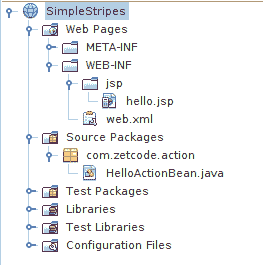
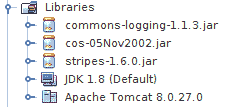
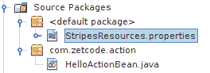
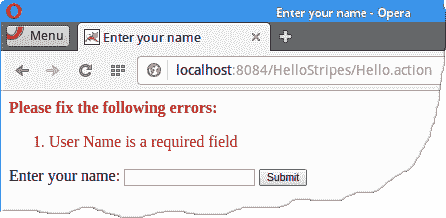
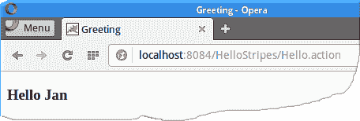

# Stripes 介绍

原文：http://zetcode.com/java/stripes/

这是条纹入门教程。 我们使用 Stripes Web 框架创建两个简单的 Web 应用。 我们使用 NetBeans 来构建应用。

Stripes 是一个开源的轻量级 Java Web 应用框架。 Stripes 的目标是使 Java 中基于 Servlet / JSP 的 Web 开发变得简单，直观和直接。 Stripes 是基于动作的 MVC（模型视图控制器）框架。 它运行在 JEE Web 容器中，使用最少的配置文件，并具有灵活和简单的参数绑定。

Stripes 的 ActionBean 是一个对象，用于接收在请求中提交的数据并处理用户的输入。 它既定义了表单的属性，又定义了表单的处理逻辑。 Stripes 会在部署时通过扫描 Web 应用的类路径来自动发现 ActionBean。 条带过滤器的`ActionResolver.Packages` `init-param`（在`web.xml`中）设置一个或多个包根。

分辨率是作为对已处理请求的响应而创建的对象。 解决方案可以转发到 JSP 页面，流数据或返回错误消息。 分辨率由 ActionBeans 的处理程序方法返回。

从 Stripes 的 Github [页面](https://github.com/StripesFramework/stripes/releases)中，我们下载了最新的 Stripes 版本。 在 lib 子目录中，我们需要在项目中包含三个 JAR 文件：`commons-logging-1.1.3.jar`，`cos-05Nov2002.jar`和`stripes-1.6.0.jar`。 此外，还有`StripesResources.properties`文件，其中包含各种消息。

## 简单 Stripes 应用

第一个应用显示当前日期。 我们在 NetBeans 中创建一个新的 Web 应用。 我们选择 Tomcat 作为我们的 JSP / servlet 硬币容器。



Figure: The project files


该项目包含三个文件：`HelloActionBean.java`包含响应我们请求的代码，`showDate.jsp`是作为响应发送回用户的视图，而`web.xml`文件包含用于设置 Stripes 的配置。 在此应用中，我们不使用`StripesResources.properties`。



Figure: The project libraries


这些是我们构建 Stripes 应用所需的库。

`web.xml`

```
<?xml version="1.0" encoding="UTF-8"?>

<web-app xmlns="http://xmlns.jcp.org/xml/ns/javaee"
         xmlns:xsi="http://www.w3.org/2001/XMLSchema-instance"
         xsi:schemaLocation="http://xmlns.jcp.org/xml/ns/javaee http://xmlns.jcp.org/xml/ns/javaee/web-app_3_1.xsd"
         version="3.1">

    <filter>
        <display-name>Stripes Filter</display-name>
        <filter-name>StripesFilter</filter-name>
        <filter-class>net.sourceforge.stripes.controller.StripesFilter</filter-class>
        <init-param>
            <param-name>ActionResolver.Packages</param-name>
            <param-value>com.zetcode.action</param-value>
        </init-param>
    </filter>

    <filter-mapping>
        <filter-name>StripesFilter</filter-name>
        <url-pattern>*.jsp</url-pattern>
        <dispatcher>REQUEST</dispatcher>
    </filter-mapping>

    <filter-mapping>
        <filter-name>StripesFilter</filter-name>
        <servlet-name>StripesDispatcher</servlet-name>
        <dispatcher>REQUEST</dispatcher>
    </filter-mapping>

    <servlet>
        <servlet-name>StripesDispatcher</servlet-name>
        <servlet-class>net.sourceforge.stripes.controller.DispatcherServlet</servlet-class>
        <load-on-startup>1</load-on-startup>
    </servlet>

    <servlet-mapping>
        <servlet-name>StripesDispatcher</servlet-name>
        <url-pattern>*.action</url-pattern>
    </servlet-mapping>    

    <welcome-file-list>
        <welcome-file>Hello.action</welcome-file>
    </welcome-file-list>

</web-app>

```

在标准`web.xml`部署描述符中，我们配置 Stripes。 我们指定 Stripes 在哪里寻找 ActionBean：在我们的例子中是`com.zetcode.action`包。 欢迎文件是当我们请求主页时显示的文件。 `Hello.action`指示应执行`HelloActionBean`。

`HelloActionBean.java`

```
package com.zetcode.action;

import java.util.Date;
import net.sourceforge.stripes.action.ActionBean;
import net.sourceforge.stripes.action.ActionBeanContext;
import net.sourceforge.stripes.action.DefaultHandler;
import net.sourceforge.stripes.action.ForwardResolution;
import net.sourceforge.stripes.action.Resolution;

public class HelloActionBean implements ActionBean {

    private static final String VIEW = "/WEB-INF/jsp/showDate.jsp";
    private ActionBeanContext context;
    private Date date;

    public Date getDate() {
        return date;
    }

    public void setDate(Date date) {
        this.date = date;
    }

    @Override
    public void setContext(ActionBeanContext context) {

        this.context = context;
    }

    @Override
    public ActionBeanContext getContext() {

        return context;
    }

    @DefaultHandler
    public Resolution hello() {

        this.date = new Date();
        return new ForwardResolution(VIEW);
    }
}

```

`HelloActionBean`处理请求，并以向前解析的方式响应 JSP 页面。

```
private static final String VIEW = "/WEB-INF/jsp/showDate.jsp";

```

该视图是`showDate.jsp`文件。

```
private ActionBeanContext context;

```

`ActionBeanContext`封装有关当前请求的信息。 如果我们出于任何原因需要使用它，它提供对底层 Servlet API 的访问。

```
@DefaultHandler
public Resolution hello() {

    this.date = new Date();
    return new ForwardResolution(VIEW);
}

```

`@DefaultHandler`注释为此动作 bean 设置了默认处理程序。 它用当前日期填充`date`属性，并返回一个新的`ForwardResolution`。 分辨率转发到视图。

`showDate.jsp`

```
<%@page contentType="text/html" pageEncoding="UTF-8"%>
<!DOCTYPE html>
<html>
    <head>
        <meta http-equiv="Content-Type" content="text/html; charset=UTF-8">
        <title>Current date</title>
    </head>
    <body>
        <h3>The date is ${actionBean.date}</h3>
    </body>
</html>

```

这是用户的模板视图。 `${actionBean}`表达式引用指向此视图的操作 bean。 我们使用表达式来引用动作 bean 的`date`属性。

```
$ curl localhost:8084/SimpleStripes/

<!DOCTYPE html>
<html>
    <head>
        <meta http-equiv="Content-Type" content="text/html; charset=UTF-8">
        <title>Current date</title>
    </head>
    <body>
        <h3>The date is Thu Jun 02 14:13:01 CEST 2016</h3>
    </body>
</html>

```

构建和部署应用之后，我们将使用`curl`工具访问应用的主页。 该应用将响应一个包含当前日期的 HTML 页面。

## Hello Stripes 应用

在第二个应用中，我们有一个简单的 HTML 表单。 用户在文本框中指定其名称。 该应用以问候回应。 验证用于确保用户已在文本字段中输入了内容。

`web.xml`

```
<?xml version="1.0" encoding="UTF-8"?>

<web-app xmlns="http://xmlns.jcp.org/xml/ns/javaee"
         xmlns:xsi="http://www.w3.org/2001/XMLSchema-instance"
         xsi:schemaLocation="http://xmlns.jcp.org/xml/ns/javaee http://xmlns.jcp.org/xml/ns/javaee/web-app_3_1.xsd"
         version="3.1">

    <filter>
        <display-name>Stripes Filter</display-name>
        <filter-name>StripesFilter</filter-name>
        <filter-class>net.sourceforge.stripes.controller.StripesFilter</filter-class>
        <init-param>
            <param-name>ActionResolver.Packages</param-name>
            <param-value>com.zetcode.action</param-value>
        </init-param>
    </filter>

    <filter-mapping>
        <filter-name>StripesFilter</filter-name>
        <url-pattern>*.jsp</url-pattern>
        <dispatcher>REQUEST</dispatcher>
    </filter-mapping>

    <filter-mapping>
        <filter-name>StripesFilter</filter-name>
        <servlet-name>StripesDispatcher</servlet-name>
        <dispatcher>REQUEST</dispatcher>
    </filter-mapping>

    <servlet>
        <servlet-name>StripesDispatcher</servlet-name>
        <servlet-class>net.sourceforge.stripes.controller.DispatcherServlet</servlet-class>
        <load-on-startup>1</load-on-startup>
    </servlet>

    <servlet-mapping>
        <servlet-name>StripesDispatcher</servlet-name>
        <url-pattern>*.action</url-pattern>
    </servlet-mapping>    

    <welcome-file-list>
        <welcome-file>index.jsp</welcome-file>
    </welcome-file-list>

</web-app>

```

在`web.xml`文件中，我们将`index.jsp`文件设置为欢迎文件。

`index.jsp`

```
<%@taglib prefix="stripes" uri="http://stripes.sourceforge.net/stripes.tld"%>
<%@page contentType="text/html" pageEncoding="UTF-8"%>
<!DOCTYPE html>
<html>
    <head>
        <meta http-equiv="Content-Type" content="text/html; charset=UTF-8">
        <title>Enter your name</title>
    </head>
    <body>
        <stripes:form beanclass="com.zetcode.action.HelloActionBean">
            <stripes:errors/>
                Enter your name:
                <stripes:text name="userName"/>
                <stripes:submit name="save" value="Submit"/>
        </stripes:form>
    </body>
</html>

```

`index.jsp`包含一个简单的 HTML 表单。 条纹具有自己的标签。 `&lt;stripes:errors/&gt;`显示验证错误。 如果我们未在该字段中写入任何文本，则会显示验证错误。 在`&lt;stripes:form&gt;`标记中，我们指定应处理请求的操作 bean。 `&lt;stripes:text/&gt;`创建一个文本字段。 创建的请求参数将自动映射到`HelloActionBean`的`userName`属性。



Figure: StripesResources.properties


`StripesResources.properties`是 Stripes 框架的默认资源包。 它包含各种消息和标签的值。 样本文件包含在 Stripes 下载文件的 lib 子目录中。 我们将文件放入源包中，未指定包。 （该文件应最终位于`WEB-INF/classes`目录中。）

`StripesResources.properties`

```
...
validation.required.valueNotPresent={0} is a required field
...

```

当我们在文本字段中未输入任何内容并单击 Submit 按钮时，将显示此错误消息。

`HelloActionBean.java`

```
package com.zetcode.action;

import net.sourceforge.stripes.action.ActionBean;
import net.sourceforge.stripes.action.ActionBeanContext;
import net.sourceforge.stripes.action.DefaultHandler;
import net.sourceforge.stripes.action.ForwardResolution;
import net.sourceforge.stripes.action.Resolution;
import net.sourceforge.stripes.validation.Validate;

public class HelloActionBean implements ActionBean {

    private static final String VIEW = "/WEB-INF/jsp/greet.jsp";
    private ActionBeanContext context;

    @Validate(required=true)
    private String userName;

    public String getUserName() {
        return userName;
    }

    public void setUserName(String userName) {
        this.userName = userName;
    }

    @Override
    public void setContext(ActionBeanContext context) {

        this.context = context;
    }

    @Override
    public ActionBeanContext getContext() {

        return context;
    }

    @DefaultHandler
    public Resolution greet() {

        return new ForwardResolution(VIEW);
    }
}

```

单击提交按钮时，将执行`HelloActionBean`。 request 参数自动绑定到其`userName`属性。 默认处理程序将转发到`greet.jsp`视图。

```
@Validate(required=true)
private String userName;

```

`@Validate`注释用于强制验证表单的用户名字段。 如果未输入任何值，则会显示一条错误消息。



Figure: Validation error message


我们应用中的第二个视图是`greet.jsp`。

`greet.jsp`

```
<%@page contentType="text/html" pageEncoding="UTF-8"%>
<%@taglib prefix="stripes" uri="http://stripes.sourceforge.net/stripes.tld"%>
<!DOCTYPE html>

<html>
    <head>
        <meta http-equiv="Content-Type" content="text/html; charset=UTF-8">
        <title>Greeting</title>
    </head>
    <body>
        <h3>Hello ${actionBean.userName}</h3>
    </body>
</html>

```

`greet.jsp`显示给用户的问候消息。 通过`${actionBean.userName}`表达式，我们获得了用户名。



Figure: Greeting


该应用以一条简单消息响应。

在本教程中，我们使用 Stripes Web 框架创建了两个简单的 Web 应用。 您可能也对 ZetCode 的 [Java 教程](/lang/java/)，[验证过滤器教程](/java/validationfilter/)， [Java MVC 教程](/java/mvc/)， [Play 框架简介](/java/play/)和[感兴趣。 Spark Java](/java/spark/) ， [Stripes，MyBatis & Derby 教程](/java/stripesmybatisderby/)或 [EJB 教程](/java/ejb/)简介。