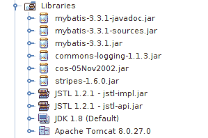
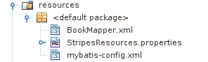
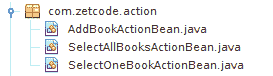
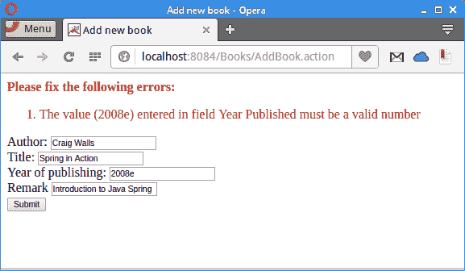
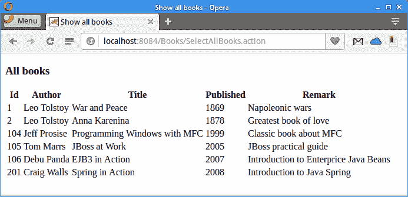

# 使用 Stripes 的 Java webapp，MyBatis，& Derby

原文：http://zetcode.com/java/stripesmybatisderby/

在本教程中，我们使用 Stripes，MyBatis 和 Derby 创建一个 Java Web 应用。 我们使用 NetBeans 来构建应用。 Apache Tomcat 用作 JSP 和 servlet 容器。 可从作者的 Github [仓库](https://github.com/janbodnar/Stripes-MyBatis-Derby)中获得项目源。

Stripes 是一个开源的轻量级 Java Web 应用框架。 Stripes 的目标是使 Java 中基于 Servlet/JSP 的 Web 开发变得简单，直观和直接。 Stripes 是基于动作的 MVC（模型视图控制器）框架。 它运行在 JEE Web 容器中，使用最少的配置文件，并具有灵活和简单的参数绑定。

MyBatis 是 Java 持久性框架，使用 XML 描述符或注释将对象与存储过程或 SQL 语句耦合。 与 ORM 框架不同，MyBatis 不会将 Java 对象映射到数据库表，而是将 Java 方法映射到 SQL 语句。 MyBatis 允许使用所有数据库功能，例如存储过程，视图，任何复杂性和供应商专有功能的查询。

Derby 是用 Java 编写的关系数据库管理系统。 Oracle 以 Java DB 的名义分发相同的二进制文件。 Derby 的占用空间很小，约为 2MB。 Derby 使用的数据库格式是可移植的且与平台无关。

## 图书应用

我们在 NetBeans 中创建一个新的 Web 应用。 在应用中，我们将能够将新书添加到数据库中，通过它们的 ID 选择单个书，然后选择表中的所有书。 该项目需要 Stripes，MyBatis 和 JSTL 库。 前三个 JAR 是 MyBatis 库，后三个是 Stripes 的库。 我们必须从他们的项目页面中删除他们。 JSTL JAR 随 NebBeans 一起提供。



Figure: Project libraries


在“NetBeans 服务”选项卡中，我们展开“数据库”节点，然后右键单击 Java DB 节点，然后选择“创建数据库”选项。 数据库名称将为`books`，用户名和密码为`app`和`app`。

`books.sql`

```java
CREATE TABLE Books(Id INTEGER NOT NULL PRIMARY KEY GENERATED ALWAYS AS IDENTITY 
    (START WITH 1, INCREMENT BY 1), Author VARCHAR(30), Title VARCHAR(60), 
    Published INTEGER, Remark VARCHAR(150));
INSERT INTO Books(Author, Title, Published, Remark) VALUES ('Leo Tolstoy', 'War and Peace', 1869, 'Napoleonic wars');    
INSERT INTO Books(Author, Title, Published, Remark) VALUES ('Leo Tolstoy', 'Anna Karenina', 1878, 'Greatest book of love');
INSERT INTO Books(Author, Title, Published, Remark) VALUES ('Jeff Prosise', 'Programming Windows with MFC', 1999, 'Classic book about MFC');
INSERT INTO Books(Author, Title, Published, Remark) VALUES ('Tom Marrs', 'JBoss at Work', 2005, 'JBoss practical guide');
INSERT INTO Books(Author, Title, Published, Remark) VALUES ('Debu Panda', 'EJB3 in Action', 2007, 'Introduction to Enterprice Java Beans');

```

我们创建一个与创建的数据库的新数据库连接，并执行此 SQL 代码。 我们有一个`Books`表，其中包含几本书。

`web.xml`

```java
<?xml version="1.0" encoding="UTF-8"?>

<web-app xmlns="http://xmlns.jcp.org/xml/ns/javaee"
         xmlns:xsi="http://www.w3.org/2001/XMLSchema-instance"
         xsi:schemaLocation="http://xmlns.jcp.org/xml/ns/javaee http://xmlns.jcp.org/xml/ns/javaee/web-app_3_1.xsd"
         version="3.1">

    <filter>
        <display-name>Stripes Filter</display-name>
        <filter-name>StripesFilter</filter-name>
        <filter-class>net.sourceforge.stripes.controller.StripesFilter</filter-class>
        <init-param>
            <param-name>ActionResolver.Packages</param-name>
            <param-value>com.zetcode.action</param-value>
        </init-param>
    </filter>

    <filter-mapping>
        <filter-name>StripesFilter</filter-name>
        <url-pattern>*.jsp</url-pattern>
        <dispatcher>REQUEST</dispatcher>
    </filter-mapping>

    <filter-mapping>
        <filter-name>StripesFilter</filter-name>
        <servlet-name>StripesDispatcher</servlet-name>
        <dispatcher>REQUEST</dispatcher>
    </filter-mapping>

    <servlet>
        <servlet-name>StripesDispatcher</servlet-name>
        <servlet-class>net.sourceforge.stripes.controller.DispatcherServlet</servlet-class>
        <load-on-startup>1</load-on-startup>
    </servlet>

    <servlet-mapping>
        <servlet-name>StripesDispatcher</servlet-name>
        <url-pattern>*.action</url-pattern>
    </servlet-mapping>    

    <welcome-file-list>
        <welcome-file>index.jsp</welcome-file>
    </welcome-file-list>

</web-app>

```

在`web.xml`部署描述符中，我们设置了 Stripes 框架。 `index.jsp`文件是默认的主页文件。 在`com.zetcode.action`中，有`ActionBeans`。

### `resources`

在`resources`目录中，我们有三个文件。 通过右键单击项目文件并选择“属性”来创建`resources`目录。 在源类别中，我们添加一个新的源包文件夹。



Figure: Resources


`BookMapper.xml`和`mybatis-config.xml`是 MyBatis 使用的 XML 文件。 `StripesResources.properties`是 Stripes 框架的默认资源束文件。 它包含应用的错误消息和标签。 它位于 Stripes 下载文件的`lib`子目录中。

### 表示层

表示层由六个 JSP 页面组成。 `index.jsp`是应用的默认主页。 `addBook.jsp`是用于向数据库添加新书的页面，`findBook.jsp`是用于通过其 ID 查找书的页面。 将书籍成功插入数据库后，`bookAdded.jsp`显示一条消息，`showOneBook.jsp`显示选定的书籍，`showAllBooks.jsp`显示数据库中的所有书籍。

`index.jsp`

```java
<%@taglib prefix="stripes" uri="http://stripes.sourceforge.net/stripes.tld"%>
<%@page contentType="text/html" pageEncoding="UTF-8"%>
<!DOCTYPE html>
<html>
    <head>
        <meta http-equiv="Content-Type" content="text/html; charset=UTF-8">
        <title>Welcome page</title>
    </head>
    <body>

        <stripes:link href="addBook.jsp">
            Add a new book
        </stripes:link>      

        <stripes:link href="findBook.jsp">
            Find one book
        </stripes:link>                  

        <stripes:link beanclass="com.zetcode.action.SelectAllBooksActionBean">
            Show all books
        </stripes:link>    

    </body>
</html>

```

`index.jsp`包含指向两个 JSP 页面的 Stripes 链接，以添加一本新书并查找一本书，以及一个指向`ActionBean`的链接以显示所有书。 `<%@taglib prefix="stripes" uri="http://stripes.sourceforge.net/stripes.tld"%>`声明 Stripes 使用的标签，包括`<stripes:link>`。

`findBook.jsp`

```java
<%@taglib prefix="stripes" uri="http://stripes.sourceforge.net/stripes.tld"%>
<%@page contentType="text/html" pageEncoding="UTF-8"%>
<!DOCTYPE html>
<html>
    <head>
        <meta http-equiv="Content-Type" content="text/html; charset=UTF-8">
        <title>Find a book</title>
    </head>
    <body>
      <stripes:form beanclass="com.zetcode.action.SelectOneBookActionBean">
            <stripes:errors/>
                Book ID:
                <stripes:text name="bookId"/><br>
                <stripes:submit name="save" value="Submit"/>
        </stripes:form>    
    </body>
</html>

```

在`findBook.jsp`中，我们有一个表格，可通过其 ID 查找图书。 该表单包含一个文本字段和一个“提交”按钮。 插入值已验证； 如果用户添加了无效值，则应用将返回错误消息。

`addBook.jsp`

```java
<%@taglib prefix="stripes" uri="http://stripes.sourceforge.net/stripes.tld"%>
<%@page contentType="text/html" pageEncoding="UTF-8"%>
<!DOCTYPE html>
<html>
    <head>
        <meta http-equiv="Content-Type" content="text/html; charset=UTF-8">
        <title>Add new book</title>
    </head>
    <body>

        <stripes:form beanclass="com.zetcode.action.AddBookActionBean">
            <stripes:errors/>
                Author:
                <stripes:text name="author"/><br>

                Title:
                <stripes:text name="title"/><br>                

                Year of publishing:
                <stripes:text name="published"/><br>

                Remark
                <stripes:text name="remark"/><br>                

                <stripes:submit name="save" value="Submit"/>
        </stripes:form>        

    </body>
</html>

```

`addBook.jsp`将一本新书添加到数据库中。 它包含一个带有四个文本字段的表单，用于书籍对象。 该 ID 由 Derby 数据库自动生成。

`bookAdded.jsp`

```java
<%@page contentType="text/html" pageEncoding="UTF-8"%>
<!DOCTYPE html>
<html>
    <head>
        <meta http-equiv="Content-Type" content="text/html; charset=UTF-8">
        <title>Book added</title>
    </head>
    <body>
        <h3>Book added to database</h3>
    </body>
</html>

```

将新书添加到数据库后，应用返回`bookAdded.jsp`，其中包含一条简单消息。

`showAllBooks.jsp`

```java
<%@page contentType="text/html" pageEncoding="UTF-8"%>
<%@taglib prefix="c" uri="http://java.sun.com/jsp/jstl/core" %>
<!DOCTYPE html>
<html>
    <head>
        <meta http-equiv="Content-Type" content="text/html; charset=UTF-8">
        <title>Show all books</title>
    </head>
    <body>
        <h3>All books</h3>

        <table>
            <thead>
                <tr>
                    <th>Id</th>
                    <th>Author</th>
                    <th>Title</th>
                    <th>Published</th>
                    <th>Remark</th>
                </tr>
            </thead>

            <c:forEach items="${actionBean.books}" var='book'>
                <tr>
                    <td>
                        <c:out value="${book.id}"/>
                    </td>
                    <td>
                        <c:out value="${book.author}"/>
                    </td>
                    <td>
                        <c:out value="${book.title}"/>
                    </td>        
                    <td>
                        <c:out value="${book.published}"/>
                    </td>  
                    <td>
                        <c:out value="${book.remark}"/>
                    </td>                      
                </tr>
            </c:forEach>          

        </table>
    </body>
</html>

```

`showAllBooks.jsp`显示从数据库检索到的所有书籍。 `<%@taglib prefix="c" uri="http://java.sun.com/jsp/jstl/core" %>`指令声明了 JSTL 核心标记，包括`<c:forEach>`和`<c:out>`。 可以使用`${actionBean}`表达式访问返回的数据，其中`actionBean`是转发视图（即此 JSP 页面）的操作 bean。 在这种情况下，操作 bean 是`SelectAllBooksActionBean`。

`showOneBook.jsp`

```java
<%@page contentType="text/html" pageEncoding="UTF-8"%>
<%@taglib prefix="c" uri="http://java.sun.com/jsp/jstl/core" %>
<!DOCTYPE html>
<html>
    <head>
        <meta http-equiv="Content-Type" content="text/html; charset=UTF-8">
        <title>Show one book</title>
    </head>
    <body>
        <h3>A book</h3>

        <table>
            <thead>
                <tr>
                    <th>Id</th>
                    <th>Author</th>
                    <th>Title</th>
                    <th>Published</th>
                    <th>Remark</th>
                </tr>
            </thead>

            <tr>
                <td>
                    <c:out value="${actionBean.book.id}"/>
                </td>
                <td>
                    <c:out value="${actionBean.book.author}"/>
                </td>
                <td>
                    <c:out value="${actionBean.book.title}"/>
                </td>        
                <td>
                    <c:out value="${actionBean.book.published}"/>
                </td>  
                <td>
                    <c:out value="${actionBean.book.remark}"/>
                </td>                      
            </tr>

        </table>
    </body>
</html>

```

`showOneBook.jsp`显示一本书，我们通过其 ID 找到了它。

### `Book` bean

`Book` bean 是一个 Java 类，代表我们应用的域对象-一本书。

`Book.java`

```java
package com.zetcode.bean;

public class Book {

    private Long id;

    private String author;
    private String title;
    private int yearPublished;
    private String remark;

    public Book() {};

    public Book(String author, String title, int published, 
            String remark) {

        this.author = author;
        this.title = title;
        this.yearPublished = published;
        this.remark = remark;
    }

    public Long getId() {
        return id;
    }

    public void setId(Long id) {
        this.id = id;
    }

    public String getAuthor() {
        return author;
    }

    public void setAuthor(String author) {
        this.author = author;
    }

    public String getTitle() {
        return title;
    }

    public void setTitle(String title) {
        this.title = title;
    }

    public int getPublished() {
        return yearPublished;
    }

    public void setPublished(int published) {
        this.yearPublished = published;
    }

    public String getRemark() {
        return remark;
    }

    public void setRemark(String remark) {
        this.remark = remark;
    }
}

```

Bean 具有必要的属性以及获取器和设置器方法。 请注意，还必须添加一个空的构造器。

### `ActionBean`

Stripes 的`ActionBean`是一个对象，该对象接收在请求中提交的数据并处理用户的输入。 它既定义了表单的属性，又定义了表单的处理逻辑。 最后，它向用户返回一个视图。 在我们的应用中，我们有三个动作 bean：`AddBookActionBean`，`SelectAllBooksActionBean`和`SelectOneBookActionBean`。 它们每个代表在应用中要执行的某些操作。



Figure: Action beans


我们将动作 bean 放入`com.zetcode.action`包中。

`AddBookActionBean.java`

```java
package com.zetcode.action;

import com.zetcode.bean.Book;
import com.zetcode.service.BookService;
import net.sourceforge.stripes.action.ActionBean;
import net.sourceforge.stripes.action.ActionBeanContext;
import net.sourceforge.stripes.action.DefaultHandler;
import net.sourceforge.stripes.action.ForwardResolution;
import net.sourceforge.stripes.action.Resolution;
import net.sourceforge.stripes.validation.Validate;

public class AddBookActionBean implements ActionBean {

    private static final String VIEW = "/bookAdded.jsp";
    private ActionBeanContext context;

    @Validate(required = true)
    private String author;

    @Validate(required = true)
    private String title;

    @Validate(required = true)
    private int yearPublished;

    @Validate(required = true)
    private String remark;

    public String getAuthor() {
        return author;
    }

    public void setAuthor(String author) {
        this.author = author;
    }

    public String getTitle() {
        return title;
    }

    public void setTitle(String title) {
        this.title = title;
    }

    public int getYearPublished() {
        return yearPublished;
    }

    public void setYearPublished(int yearPublished) {
        this.yearPublished = yearPublished;
    }

    public String getRemark() {
        return remark;
    }

    public void setRemark(String remark) {
        this.remark = remark;
    }

    @DefaultHandler
    public Resolution addBook() {

        Book book = new Book(this.author, this.title,
                this.yearPublished, this.remark);
        BookService.saveBook(book);

        return new ForwardResolution(VIEW);
    }

    @Override
    public void setContext(ActionBeanContext context) {

        this.context = context;
    }

    @Override
    public ActionBeanContext getContext() {

        return context;
    }
}

```

在我们填写表格以添加新书后，将调用`AddBookActionBean`。 动作 Bean 自动将请求属性绑定到其自己的属性。

```java
private static final String VIEW = "/bookAdded.jsp";

```

书籍成功保存到数据库后，`AddBookActionBean`返回`bookAdded.jsp`页面。

```java
@Validate(required=true)
private String author;

@Validate(required=true)
private String title;
...

```

使用`@Validate`注解，我们为 HTML 字段提供了验证服务。 这些字段不能为空，并且必须与正确的数据类型匹配。



Figure: Validation


如果发布年份具有非整数字符，则“提交”操作将失败。

```java
@DefaultHandler
public Resolution addBook() {

    Book book = new Book(this.author, this.title, 
            this.yearPublished, this.remark);
    BookService.saveBook(book);

    return new ForwardResolution(VIEW);
}

```

`@DefaultHandler`注释指定此操作 bean 的默认处理器方法。 （可以定义多个处理器。）处理器创建`Book` bean，调用`BookService.saveBook()`并转发到适当的视图。

`SelectOneBookActionBean.java`

```java
package com.zetcode.action;

import com.zetcode.bean.Book;
import com.zetcode.service.BookService;
import java.io.IOException;
import net.sourceforge.stripes.action.ActionBean;
import net.sourceforge.stripes.action.ActionBeanContext;
import net.sourceforge.stripes.action.DefaultHandler;
import net.sourceforge.stripes.action.ForwardResolution;
import net.sourceforge.stripes.action.Resolution;
import net.sourceforge.stripes.validation.Validate;

public class SelectOneBookActionBean implements ActionBean {

    private static final String VIEW = "/showOneBook.jsp";
    private ActionBeanContext context;    

    private Book book;

    @Validate(required=true)
    private Long bookId;

    public Book getBook() {
        return book;
    }

    public void setBook(Book book) {
        this.book = book;
    }

    public Long getBookId() {
        return bookId;
    }

    public void setBookId(Long bookId) {
        this.bookId = bookId;
    }

    @DefaultHandler
    public Resolution showOneBook() throws IOException {

        this.book = BookService.getBook(bookId);

        return new ForwardResolution(VIEW);
    }

    @Override
    public void setContext(ActionBeanContext context) {

        this.context = context;
    }

    @Override
    public ActionBeanContext getContext() {

        return context;
    }
}

```

单击`findBook.jsp`中的“提交”按钮后，将调用`SelectOneBookActionBean`。

```java
@DefaultHandler
public Resolution showOneBook() throws IOException {

    this.book = BookService.getBook(bookId);

    return new ForwardResolution(VIEW);
}

```

默认处理器调用`BookService.getBook()`方法，然后转发到视图。

`SelectAllBooksActionBean.java`

```java
package com.zetcode.action;

import com.zetcode.bean.Book;
import com.zetcode.service.BookService;
import java.util.List;
import net.sourceforge.stripes.action.ActionBean;
import net.sourceforge.stripes.action.ActionBeanContext;
import net.sourceforge.stripes.action.DefaultHandler;
import net.sourceforge.stripes.action.ForwardResolution;
import net.sourceforge.stripes.action.Resolution;

public class SelectAllBooksActionBean implements ActionBean {

    private static final String VIEW = "/showAllBooks.jsp";
    private ActionBeanContext context;    
    private List<Book> books;

    public List<Book> getBooks() {
        return books;
    }

    public void setBooks(List<Book> books) {
        this.books = books;
    }

    @DefaultHandler
    public Resolution showAll() {

        this.books = BookService.getAllBooks();

        return new ForwardResolution(VIEW);
    }

    @Override
    public void setContext(ActionBeanContext context) {

        this.context = context;
    }

    @Override
    public ActionBeanContext getContext() {

        return context;
    }
}

```

`SelectAllBooksActionBean`负责从数据库中选择所有书籍。

```java
@DefaultHandler
public Resolution showAll() {

    this.books = BookService.getAllBooks();

    return new ForwardResolution(VIEW);
}

```

调用`BookService.getAllBooks()`完成该工作。

### 服务

`BookService`包含与数据库通信的方法。

`BookService.java`

```java
package com.zetcode.service;

import com.zetcode.bean.Book;
import com.zetcode.persistence.MyBatisDAO;
import java.util.List;

public class BookService {

    public static void saveBook(Book book) {

        MyBatisDAO mbd = new MyBatisDAO();
        mbd.saveBook(book);
    }

    public static List<Book> getAllBooks() {

        MyBatisDAO mbd = new MyBatisDAO();
        List<Book> books = mbd.findAll();

        return books;
    }

    public static Book getBook(Long id) {

        MyBatisDAO mbd = new MyBatisDAO();
        Book book = mbd.findBook(id);

        return book;
    }    
}

```

DAO 模式用于使示例更易于移植。

```java
public static List<Book> getAllBooks() {

    MyBatisDAO mbd = new MyBatisDAO();
    List<Book> books = mbd.findAll();

    return books;
}

```

`getAllBooks()`方法创建`MyBatisDAO`并调用其`findAll()`方法。 它返回检索到的书的列表。

### DAO

数据访问对象（DAO） 模式用于将底层数据访问 API 或操作与高层业务服务分开。

`BookDAO.java`

```java
package com.zetcode.persistence;

import com.zetcode.bean.Book;
import java.util.List;

public interface BookDAO {

  public void saveBook(Book book);
  public Book findBook(Long id);
  public List<Book> findAll();
}

```

访问数据的方法在`BookDAO`界面中定义。 当我们根据该接口进行编程时，代码的耦合较少。

`MyBatisDAO.java`

```java
package com.zetcode.persistence;

import com.zetcode.bean.Book;
import com.zetcode.util.ServiceLocator;
import java.util.List;
import org.apache.ibatis.session.SqlSession;
import org.apache.ibatis.session.SqlSessionFactory;

public class MyBatisDAO implements BookDAO {

    @Override
    public void saveBook(Book book) {

        SqlSession session = null;

        try {
            SqlSessionFactory factory = ServiceLocator.getSessionFactory();
            session = factory.openSession();
            session.insert("insertBook", book);
            session.commit();

        } finally {

            if (session != null) {
                session.close();
            }
        }        
    }

    @Override
    public Book findBook(Long id) {

        SqlSession session = null;
        Book book = null;

        try {
            SqlSessionFactory factory = ServiceLocator.getSessionFactory();
            session = factory.openSession();
            book = session.selectOne("selectBook", id);

        } finally {

            if (session != null) {
                session.close();
            }
        }

        return book;        
    }

    @Override
    public List<Book> findAll() {

        SqlSession session = null;
        List<Book> retrieveList = null;

        try {
            SqlSessionFactory factory = ServiceLocator.getSessionFactory();
            session = factory.openSession();
            retrieveList = session.selectList("selectAllBooks");

        } finally {

            if (session != null) {
                session.close();
            }
        }

        return retrieveList;
    }
}

```

`MyBatisDAO`是`BookDAO`接口的具体实现。 如果基础数据源发生更改，我们可以轻松地切换到新的 DAO 实现。

```java
@Override
public void saveBook(Book book) {

    SqlSession session = null;

    try {
        SqlSessionFactory factory = ServiceLocator.getSessionFactory();
        session = factory.openSession();
        session.insert("insertBook", book);
        session.commit();

    } finally {

        if (session != null) {
            session.close();
        }
    }        
}

```

`saveBook()`方法将一本新书保存到数据库中。 创建一个`SqlSessionFactory`来产生一个`SqlSession`，这是使用 MyBatis 的主要 Java 接口。 工厂的创建委托给`ServiceLocator`。 会话的`insert()`方法使用给定的参数对象执行插入语句。 `commit()`方法将更改提交到数据库。

```java
SqlSessionFactory factory = ServiceLocator.getSessionFactory();
session = factory.openSession();
book = session.selectOne("selectBook", id);

```

为了选择一本书，我们将`id`参数传递给会话的`selectOne()`方法。

```java
SqlSessionFactory factory = ServiceLocator.getSessionFactory();
session = factory.openSession();
retrieveList = session.selectList("selectAllBooks");

```

`selectList()`方法返回书籍对象列表。

`ServiceLocator.java`

```java
package com.zetcode.util;

import java.io.IOException;
import java.io.InputStream;
import java.util.logging.Level;
import java.util.logging.Logger;
import org.apache.ibatis.io.Resources;
import org.apache.ibatis.session.SqlSessionFactory;
import org.apache.ibatis.session.SqlSessionFactoryBuilder;

public class ServiceLocator {

    public static SqlSessionFactory getSessionFactory() {

        InputStream inputStream = null;
        SqlSessionFactory sqlSessionFactory = null;

        try {
            String resource = "mybatis-config.xml";
            inputStream = Resources.getResourceAsStream(resource);
            sqlSessionFactory = new SqlSessionFactoryBuilder().build(inputStream);

        } catch (IOException ex) {
            Logger.getLogger(ServiceLocator.class.getName()).log(Level.SEVERE, null, ex);
        } finally {
            try {
                if (inputStream != null) {
                    inputStream.close();
                }
            } catch (IOException ex) {
                Logger.getLogger(ServiceLocator.class.getName()).log(Level.WARNING, null, ex);
            }
        }

        return sqlSessionFactory;
    }
}

```

`ServiceLocator`从提供的配置文件中构建`SqlSessionFactory`。 该工厂随后用于生产`SqlSession`，这是与 MyBatis 进行通信的主要接口。

`mybatis-config.xml`

```java
<?xml version="1.0" encoding="UTF-8"?>
<!DOCTYPE configuration
  PUBLIC "-//mybatis.org//DTD Config 3.0//EN"
  "http://mybatis.org/dtd/mybatis-3-config.dtd">
<configuration>

    <typeAliases>
        <typeAlias alias="Book" type="com.zetcode.bean.Book"/>  
    </typeAliases>  

    <environments default="development">
        <environment id="development">
            <transactionManager type="JDBC"/>
            <dataSource type="POOLED">
                <property name="driver" value="org.apache.derby.jdbc.ClientDriver"/>
                <property name="url" value="jdbc:derby://localhost:1527/books"/>
                <property name="username" value="app"/>
                <property name="password" value="app"/>
            </dataSource>
        </environment>
    </environments>
    <mappers>
        <mapper resource="BookMapper.xml"/>
    </mappers>
</configuration>

```

在`mybatis-config.xml`文件中，我们创建一本新书`Book`类型，定义 Derby 的数据源，并指定映射器文件。

`BookMapper.xml`

```java
<?xml version="1.0" encoding="UTF-8"?>
<!DOCTYPE mapper
  PUBLIC "-//mybatis.org//DTD Mapper 3.0//EN"
  "http://mybatis.org/dtd/mybatis-3-mapper.dtd">

<mapper namespace="com.zetcode">

    <select id="selectAllBooks" resultType="Book">
        SELECT * FROM Books
    </select>

    <select id="selectBook" parameterType="long" resultType="Book">
        SELECT * FROM Books WHERE Id = #{id}
    </select>    

    <insert id="insertBook" parameterType="Book" statementType="PREPARED">
        INSERT INTO Books(Author, Title, Published, Remark) VALUES 
        (#{author}, #{title}, #{published}, #{remark})
    </insert>

</mapper>

```

在`BookMapper.xml`中，我们有应用中使用的 SQL 命令。 它具有两个选择和一个插入命令。

```java
<select id="selectAllBooks" resultType="Book">
    SELECT * FROM Books
</select>

```

注意，对于结果类型，我们不定义集合，而是定义集合项的类型。



Figure: Displaying all books


屏幕截图显示了从示例数据库中选择的所有书籍。

在本教程中，我们使用 Stripes，MyBatis 和 Derby 创建了一个 Web 应用。 我们使用了三层 DAO 软件模式。 NetBeans 用于构建应用。 ZetCode 具有以下相关教程： [Derby 教程](/db/apachederbytutorial/)， [Java 教程](/lang/java/)， [Stripes 教程](/java/stripes/)和 [EJB 简介](/java/ejb/)。