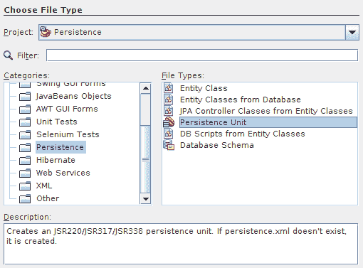
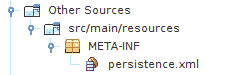
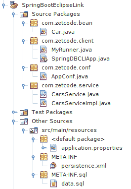

# EclipseLink 简介

原文：http://zetcode.com/java/eclipselink/

在本教程中，我们学习 EclipseLink 的基础。 在示例中，我们使用 Derby 和 Spring Boot。 这些项目是使用 NetBeans 构建的。 ZetCode 拥有用于 MySQL Java 的完整电子书： [MySQL Java 编程电子书](/ebooks/mysqljava/)。

## EclipseLink

EclipseLink 是来自 Eclipse Foundation 的开源 Eclipse Persistence Services 项目。 该软件提供了一个可扩展的框架，该框架允许 Java 开发人员与各种数据服务进行交互，包括数据库，Web 服务，对象 XML 映射和企业信息系统。 EclipseLink 基于 TopLink 产品，Oracle 从该产品中贡献了源代码来创建 EclipseLink 项目。 EclipseLink 是 Java Persistence API 的参考实现。

Java 持久性 API &lt;abbr&gt;（JPA）&lt;/abbr&gt; 是 Java 应用编程接口规范，它描述了使用 Java 的应用中关系数据的管理。 Java 持久性查询语言&lt;abbr&gt;（JPQL）&lt;/abbr&gt; 是独立于平台的面向对象的查询语言。 它是 JPA 规范的一部分。 JPQL 用于对关系数据库中存储的实体进行查询。 它在很大程度上受到 SQL 的启发，其查询在语法上类似于 SQL 查询，但是针对 JPA 实体对象而不是直接针对数据库表进行操作。

实体是 Java 类，将与 JPA 保持在一起。 它必须用`javax.persistence.Entity`注释修饰。 此外，它必须具有`@Id`批注和`@GeneratedValue`，批注定义实体的主键的唯一 ID，该`@GeneratedValue`定义生成主键的策略。 `@Table`批注指定实体映射到的数据库表。

`persistence.xml`是 JPA 中的标准配置文件。 它必须包含在包含实体 bean 的 JAR 文件内的`META-INF`目录中。 在此文件中，我们定义了持久性单元，这些持久性单元定义了由应用中的实体管理器实例管理的所有实体类的集合。 EntityManager 是管理实体的持久状态的类。

## EclipseLink 读取数据

第一个示例是 Java 命令行程序，该程序从`Cars`表中检索所有行。 我们创建一个新的 NetBeans Java Maven 项目。

`pom.xml`

```
<?xml version="1.0" encoding="UTF-8"?>
<project xmlns="http://maven.apache.org/POM/4.0.0" 
         xmlns:xsi="http://www.w3.org/2001/XMLSchema-instance" 
         xsi:schemaLocation="http://maven.apache.org/POM/4.0.0 http://maven.apache.org/xsd/maven-4.0.0.xsd">
    <modelVersion>4.0.0</modelVersion>
    <groupId>com.zetcode</groupId>
    <artifactId>Persistence</artifactId>
    <version>1.0-SNAPSHOT</version>
    <packaging>jar</packaging>

    <properties>
        <project.build.sourceEncoding>UTF-8</project.build.sourceEncoding>
        <maven.compiler.source>1.8</maven.compiler.source>
        <maven.compiler.target>1.8</maven.compiler.target>
    </properties>

    <dependencies>

        <dependency>
            <groupId>org.eclipse.persistence</groupId>
            <artifactId>eclipselink</artifactId>
            <version>2.6.4</version>
        </dependency>

        <dependency>
            <groupId>mysql</groupId>
            <artifactId>mysql-connector-java</artifactId>
            <version>5.1.40</version>
        </dependency>

    </dependencies>

</project>

```

在`pom.xml`文件中，我们定义了两个依赖项：`eclipselink`和`derbyclient`。

<figure>

<figcaption>Figure: Creating persistence.xml file</figcaption>

</figure>

要创建`persistence.xml`，请在项目文件上单击鼠标右键，选择“新建—其他”，然后选择“持久性”类别。 有一个持久性单元选项。

`persistence.xml`

```
<?xml version="1.0" encoding="UTF-8"?>
<persistence version="2.1" xmlns="http://xmlns.jcp.org/xml/ns/persistence" 
             xmlns:xsi="http://www.w3.org/2001/XMLSchema-instance" 
             xsi:schemaLocation="http://xmlns.jcp.org/xml/ns/persistence http://xmlns.jcp.org/xml/ns/persistence/persistence_2_1.xsd">
    <persistence-unit name="cars-pu" transaction-type="RESOURCE_LOCAL">
        <provider>org.eclipse.persistence.jpa.PersistenceProvider</provider>
        <exclude-unlisted-classes>false</exclude-unlisted-classes>

        <properties>
            <property name="javax.persistence.jdbc.driver" value="org.apache.derby.jdbc.ClientDriver"/>
            <property name="javax.persistence.jdbc.url" value="jdbc:derby://localhost:1527/testdb"/>
            <property name="javax.persistence.jdbc.user" value="app"/>
            <property name="javax.persistence.jdbc.password" value="app"/>

            <property name="javax.persistence.schema-generation.database.action"
                      value="drop-and-create"/>
            <property name="javax.persistence.sql-load-script-source" value="META-INF/sql/data.sql"/>            

        </properties>
    </persistence-unit>

</persistence>

```

在`persistence.xml`文件中，我们定义了一个名为`cars-pu`的持久性单元。 我们定义一个持久性提供程序，它是一个 Derby 数据库。

```
<property name="javax.persistence.schema-generation.database.action"
            value="drop-and-create"/>

```

设置此属性后，EclipseLink 将删除并创建数据库表。 `Cars`表是从提供的元数据创建的。

```
<property name="javax.persistence.sql-load-script-source" value="META-INF/sql/data.sql"/>       

```

在这里，我们指定 SQL 文件，该文件将数据填充到表中。

<figure>

<figcaption>Figure: The persistence.xml file</figcaption>

</figure>

`persistence.xml`文件位于`META-INF`子目录中

`data.sql`

```
INSERT INTO CARS(Name, Price) VALUES('Audi', 52642);
INSERT INTO CARS(Name, Price) VALUES('Mercedes', 57127);
INSERT INTO CARS(Name, Price) VALUES('Skoda', 9000);
INSERT INTO CARS(Name, Price) VALUES('Volvo', 29000);
INSERT INTO CARS(Name, Price) VALUES('Bentley', 350000);
INSERT INTO CARS(Name, Price) VALUES('Citroen', 21000);
INSERT INTO CARS(Name, Price) VALUES('Hummer', 41400);
INSERT INTO CARS(Name, Price) VALUES('Volkswagen', 21600);

```

这是用八行填充`Cars`表的 SQL。

`Car.java`

```
package com.zetcode;

import java.io.Serializable;
import javax.persistence.Entity;
import javax.persistence.GeneratedValue;
import javax.persistence.GenerationType;
import javax.persistence.Id;
import javax.persistence.Table;

@Entity
@Table(name="Cars")
public class Car implements Serializable {

    @Id
    @GeneratedValue(strategy = GenerationType.IDENTITY)
    private Long Id;
    private String name;
    private int price;

    public Long getId() {
        return Id;
    }

    public void setId(Long Id) {
        this.Id = Id;
    }

    public String getName() {
        return name;
    }

    public void setName(String name) {
        this.name = name;
    }

    public int getPrice() {
        return price;
    }

    public void setPrice(int price) {
        this.price = price;
    }
}

```

这是我们的实体类。 它用`@Entity`注释修饰。

```
@Table(name="Cars")

```

`@Table`批注引用 Derby 数据库中的`Cars`表。

`DBClient.java`

```
package com.zetcode;

import java.util.List;
import javax.persistence.EntityManager;
import javax.persistence.EntityManagerFactory;
import javax.persistence.Persistence;
import javax.persistence.Query;

public class DBClient {

    public static void main(String[] args) {

        EntityManagerFactory emf = Persistence.createEntityManagerFactory("cars-pu");
        EntityManager eman = emf.createEntityManager();

        try {

            String sql = "SELECT c FROM Car c";

            Query query = eman.createQuery(sql);
            List<Car> cars = query.getResultList();

            for (Car car : cars) {
                System.out.printf("%d ", car.getId());
                System.out.printf("%s ", car.getName());
                System.out.println(car.getPrice());
            }

        } finally {

            eman.close();
            emf.close();
        }
    }
}

```

这是一个 Java 控制台应用，它在实体管理器的帮助下从`Cars`表中检索所有行。

```
EntityManagerFactory emf = Persistence.createEntityManagerFactory("cars-pu");

```

在 JEE 容器之外使用 EclipseLink 之类的 JPA 提供程序时，我们必须通过`EntityManagerFactory`创建一个实体管理器。 使用持久性单元名称作为参数，通过`Persistence.createEntityManagerFactory()`方法创建工厂。

```
EntityManager eman = emf.createEntityManager();

```

从`EntityManagerFactory`中，我们使用`createEntityManager()`方法创建一个`EntityManager`。 创建的`EntityManager`是应用管理的实体管理器。

```
String sql = "SELECT c FROM Car c";

```

看起来像 SQL 代码，但不是。 它是 Java 持久性查询语言（JPQL）语句的示例。 它从数据库表返回所有`Car`实体。

```
Query query = eman.createQuery(sql);

```

使用`createQuery()`方法创建`Query`对象。

```
List<Car> cars = query.getResultList();

```

从查询对象中，我们获得`Car`对象的列表。

```
} finally {

    eman.close();
    emf.close();
}

```

对于由应用管理的实体管理器，我们必须显式关闭资源。

```
1 Audi 52642
2 Mercedes 57127
3 Skoda 9000
4 Volvo 29000
5 Bentley 350000
6 Citroen 21000
7 Hummer 41400
8 Volkswagen 21600

```

启动 Derby，构建应用并执行它之后，我们得到此输出。

## EclipseLink 保存新行

在第二个示例中，我们将一个新的汽车对象保存到数据库中。 `pom.xml`，`persistence.xml`和`Car.java`与前面示例中使用的相同。

`DBClient2.java`

```
package com.zetcode;

import javax.persistence.EntityManager;
import javax.persistence.EntityManagerFactory;
import javax.persistence.Persistence;

public class DBClient2 {

    public static void main(String[] args) {

        EntityManagerFactory efact = Persistence.createEntityManagerFactory("cars-pu");
        EntityManager eman = efact.createEntityManager();

        try {

            eman.getTransaction().begin();

            Car car = new Car();
            car.setName("Toyota");
            car.setPrice(26700);

            eman.persist(car);
            eman.getTransaction().commit();

        } finally {

            eman.close();
            efact.close();
        }
    }
}

```

该示例创建一个新的汽车对象并将其保存在数据库中。

```
eman.getTransaction().begin();

```

JEE 容器外部不提供自动事务管理； 因此，我们必须手动创建一个新事务。

```
Car car = new Car();
car.setName("Toyota");
car.setPrice(26700);

```

创建一个新的汽车实体。 该 ID 将由 Derby 生成。

```
eman.persist(car);

```

`persist()`方法将实体保存到数据库中。

```
eman.getTransaction().commit();

```

事务已提交。

## EclipseLink 的 Spring Boot 示例

在此示例中，我们将 EclipseLink 集成到 Spring Boot 应用中。 Spring 是流行的 Java 应用框架。 Spring Boot 是 Spring 的解决方案，用于创建独立的，生产级的基于 Spring 的应用。 这是一个新的解决方案，可以以最少的工作量创建 Spring 应用。

以下示例的资源也可从作者的 Github [存储库](https://github.com/janbodnar/Spring-Boot-EclipseLink)中获得。

<figure>

<figcaption>Figure: Spring Boot project</figcaption>

</figure>

这是 NetBeans 中的 Spring Boot 项目。

`pom.xml`

```
<?xml version="1.0" encoding="UTF-8"?>
<project xmlns="http://maven.apache.org/POM/4.0.0" 
            xmlns:xsi="http://www.w3.org/2001/XMLSchema-instance" 
            xsi:schemaLocation="http://maven.apache.org/POM/4.0.0 http://maven.apache.org/xsd/maven-4.0.0.xsd">

    <modelVersion>4.0.0</modelVersion>
    <groupId>com.zetcode</groupId>
    <artifactId>SpringBootEclipseLink</artifactId>
    <version>1.0-SNAPSHOT</version>
    <packaging>jar</packaging>
    <properties>
        <project.build.sourceEncoding>UTF-8</project.build.sourceEncoding>
        <maven.compiler.source>1.8</maven.compiler.source>
        <maven.compiler.target>1.8</maven.compiler.target>
    </properties>

    <parent>
        <groupId>org.springframework.boot</groupId>
        <artifactId>spring-boot-starter-parent</artifactId>
        <version>1.4.3.RELEASE</version>
        <relativePath />
    </parent>  

    <dependencies>

        <dependency>
            <groupId>org.eclipse.persistence</groupId>
            <artifactId>eclipselink</artifactId>
            <version>2.6.4</version>
        </dependency>

        <dependency>
            <groupId>mysql</groupId>
            <artifactId>mysql-connector-java</artifactId>
        </dependency>    

        <dependency>
            <groupId>org.springframework.boot</groupId>
            <artifactId>spring-boot-starter-data-jpa</artifactId>
            <exclusions>
                <exclusion>
                    <artifactId>hibernate-entitymanager</artifactId>
                    <groupId>org.hibernate</groupId>
                </exclusion>
            </exclusions>
        </dependency>       

        <dependency>
            <groupId>org.hibernate</groupId>
            <artifactId>hibernate-validator</artifactId>
        </dependency>                        

        <dependency>
            <groupId>org.springframework.boot</groupId>
            <artifactId>spring-boot-starter</artifactId>
        </dependency>
        <dependency>
            <groupId>org.eclipse.persistence</groupId>
            <artifactId>
                org.eclipse.persistence.jpa.modelgen.processor
            </artifactId>
            <version>2.5.2</version>
            <scope>provided</scope>
        </dependency>
    </dependencies>    

</project>

```

这是 Maven 项目文件。 我们具有 EclipseLink，Derby，Hibernate Validator 和 Spring Boot 的依赖项。

`application.properties`

```
# Derby
spring.datasource.driverClassName=org.apache.derby.jdbc.ClientDriver
spring.datasource.url=jdbc:derby://localhost:1527/testdb
spring.datasource.username=app
spring.datasource.password=app

```

在`application.properties`文件中，我们定义了 Derby 的数据源。

`persistence.xml`

```
<?xml version="1.0" encoding="UTF-8"?>
<persistence version="2.1" xmlns="http://xmlns.jcp.org/xml/ns/persistence" 
             xmlns:xsi="http://www.w3.org/2001/XMLSchema-instance" 
             xsi:schemaLocation="http://xmlns.jcp.org/xml/ns/persistence http://xmlns.jcp.org/xml/ns/persistence/persistence_2_1.xsd">

    <persistence-unit name="cars-pu" transaction-type="RESOURCE_LOCAL">
        <provider>org.eclipse.persistence.jpa.PersistenceProvider</provider>
        <exclude-unlisted-classes>false</exclude-unlisted-classes>

        <properties>
            <property name="javax.persistence.jdbc.url" value="jdbc:derby://localhost:1527/testdb"/>
            <property name="javax.persistence.jdbc.user" value="app"/>
            <property name="javax.persistence.jdbc.driver" value="org.apache.derby.jdbc.ClientDriver"/>
            <property name="javax.persistence.jdbc.password" value="app"/>
            <property name="javax.persistence.schema-generation.database.action"
                      value="drop-and-create"/>
            <property name="javax.persistence.sql-load-script-source" value="META-INF/sql/data.sql"/>       
        </properties>
    </persistence-unit>

</persistence>

```

在`persistence.xml`文件中，我们创建一个持久性单元。 它称为`cars-pu`。 我们还让 EclipseLink 为我们创建一个数据库表。

`data.sql`

```
INSERT INTO CARS(Name, Price) VALUES('Audi', 52642)
INSERT INTO CARS(Name, Price) VALUES('Mercedes', 57127)
INSERT INTO CARS(Name, Price) VALUES('Skoda', 9000)
INSERT INTO CARS(Name, Price) VALUES('Volvo', 29000)
INSERT INTO CARS(Name, Price) VALUES('Bentley', 350000)
INSERT INTO CARS(Name, Price) VALUES('Citroen', 21000)
INSERT INTO CARS(Name, Price) VALUES('Hummer', 41400)
INSERT INTO CARS(Name, Price) VALUES('Volkswagen', 21600)

```

EclipseLink 将使用此 SQL 文件用数据填充自动创建的表。

`AppConf.java`

```
package com.zetcode.conf;

import javax.persistence.EntityManager;
import javax.persistence.EntityManagerFactory;
import javax.persistence.Persistence;
import org.springframework.context.annotation.Bean;
import org.springframework.context.annotation.Configuration;

@Configuration
public class AppConf {

    @Bean
    public EntityManager entityManager(EntityManagerFactory entityManagerFactory) {
        return entityManagerFactory.createEntityManager();
    }

    @Bean
    public EntityManagerFactory createEntityManagerFactory() {
        return Persistence.createEntityManagerFactory("cars-pu");
    }
}

```

在`AppConf`中创建了两个 bean：`EntityManagerFactory`和`EntityManager`。 `EntityManager`将被注入`CarsServiceImpl`中。

`Car.java`

```
package com.zetcode.bean;

import javax.persistence.Entity;
import javax.persistence.GeneratedValue;
import javax.persistence.GenerationType;
import javax.persistence.Id;
import javax.persistence.NamedQueries;
import javax.persistence.NamedQuery;
import javax.persistence.Table;

@Entity
@Table(name="Cars")
@NamedQueries({
    @NamedQuery(name = "Car.findAll", query = "SELECT c FROM Car c"),
    @NamedQuery(name = "Car.findByName", query = "SELECT c FROM Car c WHERE c.name = :name")
})
public class Car {

    @Id
    @GeneratedValue(strategy = GenerationType.IDENTITY)
    private Long Id;
    private String name;
    private int price;

    public Long getId() {
        return Id;
    }

    public void setId(Long Id) {
        this.Id = Id;
    }

    public String getName() {
        return name;
    }

    public void setName(String name) {
        this.name = name;
    }

    public int getPrice() {
        return price;
    }

    public void setPrice(int price) {
        this.price = price;
    }
}

```

这是我们的`Entity` bean。

```
@NamedQueries({
    @NamedQuery(name = "Car.findAll", query = "SELECT c FROM Car c"),
    @NamedQuery(name = "Car.findByName", query = "SELECT c FROM Car c WHERE c.name = :name")
})

```

该类用命名查询注释，这是 JPQL 语句，用于检索所有汽车对象并按名称查找汽车。

`CarsService.java`

```
package com.zetcode.service;

import com.zetcode.bean.Car;
import java.util.List;

public interface CarsService {

    public void saveCar(Car car);

    public Car findCarByName(String name);

    public List<Car> findAll();
}

```

在`CarsService`界面中，我们定义了通过实体管理器访问数据库的合同方法。

`CarsServiceImpl.java`

```
package com.zetcode.service;

import com.zetcode.bean.Car;
import java.util.List;
import javax.persistence.EntityManager;
import javax.persistence.PersistenceContext;
import javax.persistence.Query;
import org.springframework.stereotype.Component;

@Component
public class CarsServiceImpl implements CarsService {

    @PersistenceContext
    EntityManager em;

    @Override
    public void saveCar(Car car) {

        em.getTransaction().begin();
        em.persist(car);
        em.getTransaction().commit();
    }

    @Override
    public Car findCarByName(String name) {

        Query query = em.createNamedQuery("Car.findByName");

        query.setParameter("name", name);
        Car car = (Car) query.getSingleResult();

        return car;
    }

    @Override
    public List<Car> findAll() {

        Query query = em.createNamedQuery("Car.findAll");

        List<Car> cars = query.getResultList();

        return cars;
    }
}

```

`CarsServiceImpl`是一个业务服务类，它实现以下方法：保存汽车，按汽车名称查找汽车，以及从数据库中检索所有汽车。

```
@PersistenceContext
EntityManager em;

```

将`EntityManager`与`@PersistenceContext`批注一起注入到类中。

```
@Override
public void saveCar(Car car) {

    em.getTransaction().begin();
    em.persist(car);
    em.getTransaction().commit();
}

```

`saveCar()`方法通过`EntityManager's` `persist()`方法将汽车保存到数据库中。 `persist()`方法放置在手动创建的事务中。

```
@Override
public Car findCarByName(String name) {

    Query query = em.createNamedQuery("Car.findByName");

    query.setParameter("name", name);
    Car car = (Car) query.getSingleResult();

    return car;
}

```

`findCarByName()`方法通过其名称查找汽车。 `createNamedQuery()`创建一个命名查询； 它引用`Car`实体类中定义的命名查询。 使用`setParameter()`方法将参数设置为命名查询。

```
@Override
public List<Car> findAll() {

    Query query = em.createNamedQuery("Car.findAll");

    List<Car> cars = query.getResultList();

    return cars;
}

```

创建一个命名查询`Car.findAll`。 查询的`getResultList()`返回已检索汽车的列表。

`MyRunner.java`

```
package com.zetcode.client;

import com.zetcode.bean.Car;
import java.util.List;
import org.springframework.beans.factory.annotation.Autowired;
import org.springframework.boot.CommandLineRunner;
import org.springframework.dao.EmptyResultDataAccessException;
import org.springframework.stereotype.Component;
import com.zetcode.service.CarsService;

@Component
public class MyRunner implements CommandLineRunner {

    @Autowired
    private CarsService crs;

    @Override
    public void run(String... args) throws Exception {

        try {
            Car car = crs.findCarByName("Citroen");
            System.out.printf("ID: %d%n", car.getId());
            System.out.printf("Name: %s%n", car.getName());
            System.out.printf("Price: %d%n", car.getPrice());

        } catch (EmptyResultDataAccessException e) {
            System.out.println("Car was not found");
        }

        List<Car> cars = crs.findAll();

        for (Car car: cars) {
            System.out.printf("%d ", car.getId());
            System.out.printf("%s ", car.getName());
            System.out.println(car.getPrice());
        }
    }
}

```

`MyRunner`是 Spring Boot CLI 应用的命令行运行程序。 我们寻找雪铁龙汽车，并从数据库中检索所有汽车。

```
@Autowired
private CarsService crs;

```

`CarsService` bean 被注入到`MyRunner`类中。

```
Car car = crs.findCarByName("Citroen");

```

该服务的`findCarByName()`寻找一辆名为雪铁龙的汽车。

```
List<Car> cars = crs.findAll();

```

服务的`findAll()`方法从数据库中检索所有汽车。

`SpringDBCLIApp.java`

```
package com.zetcode.client;

import org.springframework.boot.SpringApplication;
import org.springframework.boot.autoconfigure.EnableAutoConfiguration;
import org.springframework.context.annotation.ComponentScan;

@EnableAutoConfiguration
@ComponentScan(basePackages="com.zetcode")
public class SpringDBCLIApp {

    public static void main(String[] args) {

        SpringApplication.run(SpringDBCLIApp.class, args);
    }
}

```

`SpringDBCLIApp`设置 Spring Boot CLI 应用。

在本教程中，我们介绍了 EclipseLink JPA 提供程序。 ZetCode 具有以下相关教程： [Spring JdbcTemplate 教程](/db/jdbctemplate/)， [Hibernate Derby 教程](/db/hibernatederby/)， [Java 教程](/lang/java/)和 [EJB 简介](/java/ejb/)。