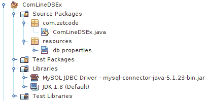
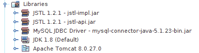

# Java 中的数据源

原文：http://zetcode.com/java/datasource/

在本教程中，我们学习如何在 Java 中设置数据源。 我们使用 MySQL 数据库系统。 ZetCode 拥有用于 MySQL Java 的完整电子书： [MySQL Java 编程电子书](/ebooks/mysqljava/)。

我们使用 MySQL Connector / J 驱动程序。 它是 MySQL 的官方 JDBC 驱动程序。

用 Java 创建到数据库的连接有两种基本方法：a）使用驱动程序管理器，b）使用数据源。 与驱动程序管理器相比，数据源具有几个优点：

*   它支持分布式交易
*   它提供了一种连接池技术
*   它可以由服务器（即应用程序外部）进行管理

当在 Java 类中创建和关闭连接时，驱动程序管理器会影响应用程序性能。 驱动程序管理器可用于简单的测试应用程序中。 对于复杂的应用程序，始终建议使用数据源。 请参阅 [MySQL Java 教程](/db/mysqljava/)，以了解如何在 Java 应用程序中使用驱动程序管理器。

通常，将基于 Java 命名和目录接口（JNDI）API 向实现数据源接口的对象注册命名服务。

## JDBC

JDBC 是 Java 编程语言的 API，用于定义客户端如何访问数据库。 它提供了查询和更新数据库中数据的方法。 JDBC 面向关系数据库。 从技术角度来看，API 是`java.sql`包中的一组类。 要将 JDBC 与特定数据库一起使用，我们需要该数据库的 JDBC 驱动程序。

## 的 MySQL

MySQL 是领先的开源数据库管理系统。 它是一个多用户，多线程的数据库管理系统。 MySQL 在网络上特别流行。 MySQL 有两个版本：MySQL 服务器系统和 MySQL 嵌入式系统。

```
mysql> CREATE DATABASE testdb;
Query OK, 1 row affected (0.02 sec)

```

我们创建一个新的`testdb`数据库。 在本教程中，我们只需要一个数据库对象。 我们将不使用表格。 我们将使用`SELECT VERSION()`语句获取 MySQL 数据库的版本。

## 命令行应用

在此示例中，我们使用命令行 Java 应用程序连接到数据库。

<figure>

<figcaption>Figure: Project structure</figcaption>

</figure>

这就是 NetBeans 中项目结构的样子。

`MysqlDataSource`是用于创建数据源的类。

`db.properties`

```
# mysql properties
mysql.driver=com.mysql.jdbc.Driver
mysql.url=jdbc:mysql://localhost:3306/testdb
mysql.username=testuser
mysql.password=test623

```

这些是 MySQL 数据库的属性。 `db.properties`文件位于此项目的`src/resources`子目录中。

`ComLineDSEx.java`

```
package com.zetcode;

import com.mysql.jdbc.jdbc2.optional.MysqlConnectionPoolDataSource;
import com.mysql.jdbc.jdbc2.optional.MysqlDataSource;
import java.io.FileInputStream;
import java.io.FileNotFoundException;
import java.io.IOException;
import java.sql.Connection;
import java.sql.ResultSet;
import java.sql.SQLException;
import java.sql.PreparedStatement;
import java.util.Properties;

public class ComLineDSEx {

    public static MysqlDataSource getMySQLDataSource() throws
            FileNotFoundException, IOException {

        Properties props = new Properties();
        FileInputStream fis = null;
        MysqlDataSource ds = null;

        fis = new FileInputStream("src/resources/db.properties");
        props.load(fis);

        ds = new MysqlConnectionPoolDataSource();
        ds.setURL(props.getProperty("mysql.url"));
        ds.setUser(props.getProperty("mysql.username"));
        ds.setPassword(props.getProperty("mysql.password"));

        return ds;
    }

    public static void main(String[] args) throws IOException, SQLException {

        Connection con = null;
        PreparedStatement pst = null;
        ResultSet rs = null;

        MysqlDataSource ds = getMySQLDataSource();

        try {

            con = ds.getConnection();
            pst = con.prepareStatement("SELECT VERSION()");
            rs = pst.executeQuery();

            if (rs.next()) {

                String version = rs.getString(1);
                System.out.println(version);
            }

        } finally {

            if (rs != null) {
                rs.close();
            }

            if (pst != null) {
                pst.close();
            }

            if (con != null) {
                con.close();
            }
        }
    }
}

```

在此示例中，我们使用数据源连接到数据库并获取 MySQL 的版本。

```
fis = new FileInputStream("src/main/Resources/db.properties");
props.load(fis);

```

从具有`FileInputStream`类的`db.properties`文件中读取数据库属性。

```
ds = new MysqlConnectionPoolDataSource();
ds.setURL(props.getProperty("mysql.url"));
ds.setUser(props.getProperty("mysql.username"));
ds.setPassword(props.getProperty("mysql.password"));

```

创建`MysqlConnectionPoolDataSource`并设置数据源属性。

```
con = ds.getConnection();

```

使用`getConnection()`方法从数据源创建连接对象。

```
pst = con.prepareStatement("SELECT VERSION()");

```

创建一条 SQL 语句。 `SELECT VERSION()`命令返回 MySQL 的版本。

```
rs = pst.executeQuery();

```

查询被执行。 它返回一个结果集。

```
if (rs.next()) {

    String version = rs.getString(1);
    System.out.println(version);
}

```

我们从结果集中获取第一个值，并将其打印到控制台。

```
} finally {

    if (rs != null) {
        rs.close();
    }

    if (pst != null) {
        pst.close();
    }

    if (con != null) {
        con.close();
    }
}

```

最后，资源被释放。

## Tomcat 中的 Web 应用程序

我们创建了一个 Web 应用程序，它将检索 MySQL 的版本。 该应用程序已部署在 Tomcat 上。

<figure>

<figcaption>Figure: Project libraries</figcaption>

</figure>

在我们的项目中，我们使用 JSTL 和 MySQL 驱动程序 JAR。 JavaServer Pages 标准标记库&lt;abbr&gt;（JSTL）&lt;/abbr&gt; 是有用的 JSP 标记的集合，这些标记提供了许多 JSP 文件所共有的核心功能。

`context.xml`

```
<?xml version="1.0" encoding="UTF-8"?>
<Context path="/TomcatDSEx">

    <Resource name="jdbc/testdb" 
              auth="Container"
              type="javax.sql.DataSource" 
              username="testuser" 
              password="test623"              
              driverClassName="com.mysql.jdbc.Driver"
              url="jdbc:mysql://localhost:3306/testdb"
              maxActive="10" 
              maxIdle="4"/>

</Context>

```

对于 Tomcat Web 服务器，我们在`context.xml`文件中创建一个新资源。 该文件位于`META-INF`目录中。

`web.xml`

```
<?xml version="1.0" encoding="UTF-8"?>

<web-app xmlns="http://xmlns.jcp.org/xml/ns/javaee"
         xmlns:xsi="http://www.w3.org/2001/XMLSchema-instance"
         xsi:schemaLocation="http://xmlns.jcp.org/xml/ns/javaee http://xmlns.jcp.org/xml/ns/javaee/web-app_3_1.xsd"
         version="3.1">
 <resource-ref>
      <description>DB Connection</description>
      <res-ref-name>jdbc/testdb</res-ref-name>
      <res-type>javax.sql.DataSource</res-type>
      <res-auth>Container</res-auth>
  </resource-ref>
</web-app>

```

然后，在`web.xml`文件中，创建对资源的引用。 在我们的应用程序中，我们将使用逻辑名称`jdbc/testdb`引用数据源。

`index.jsp`

```
<%@page contentType="text/html" pageEncoding="UTF-8"%>
<%@taglib prefix="c" uri="http://java.sun.com/jsp/jstl/core" %>
<!DOCTYPE html>
<html>
    <head>
        <meta http-equiv="Content-Type" content="text/html; charset=UTF-8">
        <title>JSP Page</title>
    </head>
    <body>
        <c:redirect url="/Version"/>
    </body>
</html>

```

`index.jsp`文件重定向到`Version` Servlet。

`showVersion.jsp`

```
<%@page contentType="text/html" pageEncoding="UTF-8"%>
<%@taglib prefix="c" uri="http://java.sun.com/jsp/jstl/core" %>
<!DOCTYPE html>
<html>
    <head>
        <meta http-equiv="Content-Type" content="text/html; charset=UTF-8">
        <title>MySQL version</title>
    </head>
    <body>
        MySQL version: <c:out value="${version}"/>

    </body>
</html>

```

`showVersion.jsp`是一个 UI 元素，用于显示从数据库检索的数据。

```
MySQL version: <c:out value="${version}"/>

```

JSTL 的`&lt;c:out&gt;`标记用于输出响应的值。

`Version.java`

```
package com.zetcode.version;

import com.zetcode.version.service.DBVersionService;
import java.io.IOException;
import javax.servlet.RequestDispatcher;
import javax.servlet.ServletException;
import javax.servlet.annotation.WebServlet;
import javax.servlet.http.HttpServlet;
import javax.servlet.http.HttpServletRequest;
import javax.servlet.http.HttpServletResponse;

@WebServlet(name = "Version", urlPatterns = {"/Version"})
public class Version extends HttpServlet {

    protected void processRequest(HttpServletRequest request, HttpServletResponse response)
            throws ServletException, IOException {
        response.setContentType("text/html;charset=UTF-8");

        String page = "/showVersion.jsp";

        String version = DBVersionService.getMySQLVersion();

        request.setAttribute("version", version);

        RequestDispatcher disp = getServletContext().getRequestDispatcher(page);
        disp.forward(request, response);
    }

    @Override
    protected void doGet(HttpServletRequest request, HttpServletResponse response)
            throws ServletException, IOException {
        processRequest(request, response);
    }

    @Override
    protected void doPost(HttpServletRequest request, HttpServletResponse response)
            throws ServletException, IOException {
        processRequest(request, response);
    }

    @Override
    public String getServletInfo() {
        return "Returns version of MySQL";
    }
}

```

`Version` Servlet 调用服务方法来获取 MySQL 的版本。 返回的值设置为请求对象的属性。

```
String page = "/showVersion.jsp";

```

最后，Servlet 指向`showVersion.jsp`文件。

```
String version = DBVersionService.getMySQLVersion();

```

调用服务方法来获取 MySQL 的版本。

```
request.setAttribute("version", version);

```

使用`setAttribute()`方法将版本值设置为请求对象。

```
RequestDispatcher disp = getServletContext().getRequestDispatcher(page);
disp.forward(request, response);

```

我们调度到`showVersion.jsp`文件。

`DBVersionService.java`

```
package com.zetcode.version.service;

import com.zetcode.version.Version;
import com.zetcode.version.util.ServiceLocator;
import java.sql.Connection;
import java.sql.ResultSet;
import java.sql.SQLException;
import java.sql.Statement;
import java.util.logging.Level;
import java.util.logging.Logger;
import javax.sql.DataSource;

public class DBVersionService {

    public static String getMySQLVersion() {

        String version = "no version";

        DataSource ds = ServiceLocator.getDataSource("java:comp/env/jdbc/testdb");
        Connection con = null;

        try {
            con = ds.getConnection();
            Statement stm = con.createStatement();
            ResultSet rs = stm.executeQuery("SELECT VERSION()");

            if (rs.next()) {

                version = rs.getString(1);
            }

        } catch (SQLException ex) {
            Logger.getLogger(Version.class.getName()).log(Level.SEVERE, null, ex);
        } finally {
            if (con != null) {
                try {
                    con.close();
                } catch (SQLException ex) {
                    Logger.getLogger(DBVersionService.class.getName()).log(Level.SEVERE, null, ex);
                }
            }
        }

        return version;
    }
}

```

`DBVersionService`是一个服务类，其中包含获取 MySQL 版本的方法。

```
DataSource ds = ServiceLocator.getDataSource("java:comp/env/jdbc/testdb");

```

数据源是使用`ServiceLocator`类创建的。

```
con = ds.getConnection();
Statement stm = con.createStatement();
ResultSet rs = stm.executeQuery("SELECT VERSION()");

if (rs.next()) {

    version = rs.getString(1);
}

```

在这里，我们有用于连接到数据库并执行 SQL 语句的 JDBC 代码。

`ServiceLocator.java`

```
package com.zetcode.version.util;

import java.util.logging.Level;
import java.util.logging.Logger;
import javax.naming.Context;
import javax.naming.InitialContext;
import javax.naming.NamingException;
import javax.sql.DataSource;

public class ServiceLocator {

    public static DataSource getDataSource(String jndiName) {

        Context ctx = null;
        DataSource ds = null;

        try {
            ctx = new InitialContext();
            ds = (DataSource) ctx.lookup(jndiName);
        } catch (NamingException ex) {
            Logger.getLogger(ServiceLocator.class.getName()).log(Level.SEVERE, null, ex);
        }

        return ds;
    }
}

```

`ServiceLocator`通过其给定的 JNDI 名称查找数据源，并将其返回给调用方。

```
$ curl localhost:8084/TomcatDSEx/Version

<!DOCTYPE html>
<html>
    <head>
        <meta http-equiv="Content-Type" content="text/html; charset=UTF-8">
        <title>MySQL version</title>
    </head>
    <body>
        MySQL version: 5.5.49-0ubuntu0.14.04.1

    </body>
</html>

```

该应用程序将响应一个包含 MySQL 版本的 HTML 页面。

这是 Java 教程中的数据源。 您可能也对 [JDBI 教程](/db/jdbi/)， [MyBatis 教程](/db/mybatis/)， [SQL 查询标记教程](/java/sqlquerytag/)或 [MySQL 教程](/databases/mysqltutorial/)感兴趣。