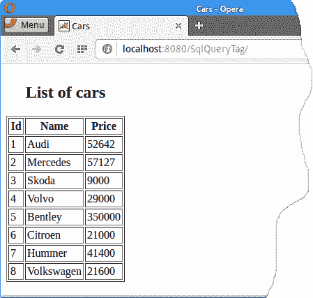

# JSTL 中的 SQL 查询标记

原文：http://zetcode.com/java/sqlquerytag/

在本教程中，我们将学习如何使用 JSTL 的 SQL 查询标记。

## JSTL

JavaServer Pages 标准标记库&lt;abbr&gt;（JSTL）&lt;/abbr&gt; 是有用的 JSP 标记的集合，这些标记提供了许多 JSP 文件所共有的核心功能。 `&lt;sql:query&gt;`标记执行 SQL SELECT 语句，并将结果保存在范围变量中。

通常，不建议从 JSP 页面访问数据库。 但是，对于简单的应用程序和测试，它可能会很有用。 在我们的应用程序中，我们将使用 JSTL 的 SQL 查询标记从 MySQL 数据库检索数据。 该项目是使用 Maven 构建的。 我们将应用程序部署在 Tomcat 上。

## 创建一个 MySQL 数据库

首先，我们在 MySQL 中创建`testdb`数据库和`Cars`表。

`cars_mysql.sql`

```
DROP TABLE IF EXISTS Cars;
CREATE TABLE Cars(Id INT PRIMARY KEY AUTO_INCREMENT, 
                  Name TEXT, Price INT) ENGINE=InnoDB;

INSERT INTO Cars(Name, Price) VALUES('Audi', 52642);
INSERT INTO Cars(Name, Price) VALUES('Mercedes', 57127);
INSERT INTO Cars(Name, Price) VALUES('Skoda', 9000);
INSERT INTO Cars(Name, Price) VALUES('Volvo', 29000);
INSERT INTO Cars(Name, Price) VALUES('Bentley', 350000);
INSERT INTO Cars(Name, Price) VALUES('Citroen', 21000);
INSERT INTO Cars(Name, Price) VALUES('Hummer', 41400);
INSERT INTO Cars(Name, Price) VALUES('Volkswagen', 21600);

```

这是在 MySQL 中创建`Cars`表的 SQL。

要创建数据库和表，我们使用`mysql`监视工具。

```
$ sudo service mysql start

```

MySQL 用`sudo service mysql start`命令启动。

```
$ mysql -u testuser -p 

```

我们使用`mysql`监视器连接到数据库。

```
mysql> CREATE DATABASE testdb;
Query OK, 1 row affected (0.02 sec)

```

`CREATE DATABASE`语句创建一个名为`testdb`的新数据库。

```
mysql> USE testdb;
mysql> SOURCE cars_mysql.sql

```

使用`source`命令，加载并执行`cars_mysql.sql`文件。

```
mysql> SELECT * FROM Cars;
+----+------------+--------+
| Id | Name       | Price  |
+----+------------+--------+
|  1 | Audi       |  52642 |
|  2 | Mercedes   |  57127 |
|  3 | Skoda      |   9000 |
|  4 | Volvo      |  29000 |
|  5 | Bentley    | 350000 |
|  6 | Citroen    |  21000 |
|  7 | Hummer     |  41400 |
|  8 | Volkswagen |  21600 |
+----+------------+--------+
8 rows in set (0.00 sec)

```

我们验证数据。 请参阅 [MySQL 教程](/databases/mysqltutorial/)，以了解有关 MySQL 的更多信息。

## 使用 Maven 启动项目

Apache Maven 是一个软件项目管理和理解工具。

```
$ mvn archetype:generate -DgroupId=com.zetcode -DartifactId=SqlQueryTag 
    -DarchetypeArtifactId=maven-archetype-webapp -DinteractiveMode=false

```

使用`maven-archetype-webapp`，我们创建了 Web 应用程序的框架。

```
$ cd SqlQueryTag/
$ tree
.
├── pom.xml
└── src
    └── main
        ├── resources
        └── webapp
            ├── index.jsp
            └── WEB-INF
                └── web.xml

5 directories, 3 files

```

Maven 创建了这个项目结构。

```
$ mkdir src/main/webapp/META-INF
$ touch src/main/webapp/META-INF/context.xml

```

我们创建一个`META-INF`目录和`context.xml`文件。

## 应用

应用程序连接到先前创建的`Cars`表，并检索其所有行。 要连接到数据库表，我们使用`&lt;sql:query&gt;`标签。

Maven 项目对象模型（POM）文件是保存在名为`pom.xml`的文件中的 Maven 项目的 XML 表示。

`pom.xml`

```
<project xmlns="http://maven.apache.org/POM/4.0.0" xmlns:xsi="http://www.w3.org/2001/XMLSchema-instance"
  xsi:schemaLocation="http://maven.apache.org/POM/4.0.0 http://maven.apache.org/maven-v4_0_0.xsd">
  <modelVersion>4.0.0</modelVersion>
  <groupId>com.zetcode</groupId>
  <artifactId>SqlQueryTag</artifactId>
  <packaging>war</packaging>
  <version>1.0-SNAPSHOT</version>
  <name>SqlQueryTag Maven Webapp</name>
  <url>http://maven.apache.org</url>
  <dependencies>
    <dependency>
        <groupId>jstl</groupId>
        <artifactId>jstl</artifactId>
        <version>1.2</version>
    </dependency>    

    <dependency>
        <groupId>mysql</groupId>
        <artifactId>mysql-connector-java</artifactId>
        <version>5.1.39</version>
    </dependency>        

  </dependencies>
  <build>

    <finalName>SqlQueryTag</finalName>
  </build>
</project>

```

在`pom.xml`文件中，我们声明 MySQL 驱动程序和 JSTL 库的依赖关系。

`context.xml`

```
<?xml version="1.0" encoding="UTF-8"?>
<Context path="/SqlQueryTag" >

    <Resource name="jdbc/testdb" 
              auth="Container"
              type="javax.sql.DataSource" 
              username="testuser" 
              password="test623"              
              driverClassName="com.mysql.jdbc.Driver"
              url="jdbc:mysql://localhost:3306/testdb"
              maxActive="10" 
              maxIdle="4"/>
</Context>

```

`context.xml`文件是 Web 应用程序的 Tomcat 配置文件。 在`context.xml`文件中，我们定义了一个数据源。 请参阅 Java 教程中的[数据源以了解有关数据源的更多信息。](/java/datasource/)

`web.xml`

```
<?xml version="1.0" encoding="UTF-8"?>

<web-app xmlns="http://xmlns.jcp.org/xml/ns/javaee"
         xmlns:xsi="http://www.w3.org/2001/XMLSchema-instance"
         xsi:schemaLocation="http://xmlns.jcp.org/xml/ns/javaee http://xmlns.jcp.org/xml/ns/javaee/web-app_3_1.xsd"
         version="3.1">
    <session-config>
        <session-timeout>
            30
        </session-timeout>
    </session-config>
</web-app>

```

我们提供了一个标准的部署描述符。 请注意，Maven 可能会创建与您的 JSTL JAR 不兼容的部署描述符。

`index.jsp`

```
<%@ taglib uri="http://java.sun.com/jsp/jstl/sql" prefix="sql" %>
<%@ taglib uri="http://java.sun.com/jsp/jstl/core" prefix="c" %>
<%@page contentType="text/html" pageEncoding="UTF-8"%>
<!DOCTYPE html>
<html>
    <head>
        <meta http-equiv="Content-Type" content="text/html; charset=UTF-8">
        <title>Cars</title>
    </head>

    <sql:query var="carsList" dataSource="jdbc/testdb">
        SELECT * FROM Cars
    </sql:query>    

    <body>
        <div align="center">
            <table border="1" cellpadding="2">
                <caption><h2>List of cars</h2></caption>
                <tr>
                    <th>Id</th>
                    <th>Name</th>
                    <th>Price</th>
                </tr>
                <c:forEach var="car" items="${carsList.rows}">
                    <tr>
                        <td><c:out value="${car.Id}" /></td>
                        <td><c:out value="${car.Name}" /></td>
                        <td><c:out value="${car.Price}" /></td>
                    </tr>
                </c:forEach>
            </table>
        </div>
    </body>
</html>

```

在`index.jsp`文件中，我们连接到数据库，从`Cars`表中检索数据，并将其显示在 HTML 表中。

```
<%@ taglib uri="http://java.sun.com/jsp/jstl/sql" prefix="sql" %>
<%@ taglib uri="http://java.sun.com/jsp/jstl/core" prefix="c" %>

```

我们需要声明 JSTL 核心和 sql 模块。

```
<sql:query var="carsList" dataSource="jdbc/testdb">
    SELECT * FROM Cars
</sql:query> 

```

使用`&lt;sql:query&gt;`标记，执行`SELECT * FROM Cars`语句。 数据存储在`carsList`变量中。 数据源由`dataSource`参数指定。

```
<c:forEach var="car" items="${carsList.rows}">
    <tr>
        <td><c:out value="${car.Id}" /></td>
        <td><c:out value="${car.Name}" /></td>
        <td><c:out value="${car.Price}" /></td>
    </tr>
</c:forEach>

```

`&lt;c:forEach&gt;`变量通过`carsList`变量，`&lt;c:out&gt;`输出当前值。

## 构建和部署

现在，我们将构建和部署该应用程序。

```
$ mvn package

```

我们建立项目。

```
$ mysql start/running, process 6030
$ $TOMCAT_HOME/bin/startup.sh

```

我们启动 MySQL 和 Tomcat。

```
$ cp target/SqlQueryTag.war $TOMCAT_HOME/webapps

```

我们部署应用程序。

<figure>

<figcaption>Figure: Displaying cars</figcaption>

</figure>

我们在浏览器中导航到该应用程序，然后从数据库中获取数据。

这是 SQL 查询标记教程。 我们已经使用 JSTL，JSP，MySQL，Tomcat 和 Maven 构建了一个 Web 应用程序。 您可能还需要检查 [JSTL forEach 标签](/articles/jstlforeach/)，[验证过滤器教程](/java/validationfilter/)， [JDBI 教程](/db/jdbi/)， [MySQL 教程](/databases/mysqltutorial/)或 [Apache Derby 教程](/db/apachederbytutorial/)。