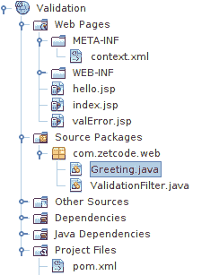
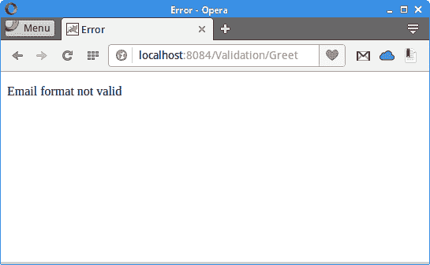

# Java 验证过滤器

原文：http://zetcode.com/java/validationfilter/

在本教程中，我们将展示如何验证用户在 Web 应用中输入的数据。 验证是一项常见的任务，并包含在 Java Web 框架（如 Stripes，Ninja 框架或 Play 框架）中。 在本教程中，我们将使用简单的自定义验证过滤器来验证数据。 来源可从作者的 [Github 仓库](https://github.com/janbodnar/ValidationFilter)中获得。

过滤器是一个对象，它对对资源的请求或对资源的响应（或两者）执行过滤任务。 过滤器以`doFilter()`方法执行过滤。

筛选器可用于各种任务，例如身份验证，日志记录，数据压缩，图像转换或加密。 在我们的示例中，我们使用过滤器来验证输入数据。

在我们的应用中，我们有一个 HTML 表单，该表单接受用户的输入。 该表单具有两个输入标签：用户名和电子邮件。 输入正在使用过滤器进行验证。 为了验证电子邮件格式，我们使用 Apache Commons Validator。 该项目是使用 NetBeans IDE 中的 Maven 构建的。 我们将应用部署在 Tomcat 上。



Figure: Structure


该图显示了 NetBeans 中的项目结构。 我们有三个 JSP 页面，两个 J​​ava 类和两个 XML 配置文件。

`pom.xml`

```java
<?xml version="1.0" encoding="UTF-8"?>
<project xmlns="http://maven.apache.org/POM/4.0.0" 
         xmlns:xsi="http://www.w3.org/2001/XMLSchema-instance" 
         xsi:schemaLocation="http://maven.apache.org/POM/4.0.0 
                        http://maven.apache.org/xsd/maven-4.0.0.xsd">

    <modelVersion>4.0.0</modelVersion>

    <groupId>com.zetcode</groupId>
    <artifactId>Validation</artifactId>
    <version>1.0-SNAPSHOT</version>
    <packaging>war</packaging>

    <name>Validation</name>

    <dependencies>
        <dependency>
            <groupId>javax</groupId>
            <artifactId>javaee-web-api</artifactId>
            <version>7.0</version>
            <scope>provided</scope>
        </dependency>

        <dependency>
            <groupId>jstl</groupId>
            <artifactId>jstl</artifactId>
            <version>1.2</version>
        </dependency>

        <dependency>
            <groupId>commons-validator</groupId>
            <artifactId>commons-validator</artifactId>
            <version>1.5.1</version>
        </dependency>

    </dependencies>

    <build>
        <plugins>
            <plugin>
                <groupId>org.apache.maven.plugins</groupId>
                <artifactId>maven-compiler-plugin</artifactId>
                <version>3.1</version>
                <configuration>
                    <source>1.8</source>
                    <target>1.8</target>
                    <compilerArguments>
                        <endorseddirs>${endorsed.dir}</endorseddirs>
                    </compilerArguments>
                </configuration>
            </plugin>
            <plugin>
                <groupId>org.apache.maven.plugins</groupId>
                <artifactId>maven-war-plugin</artifactId>
                <version>2.3</version>
                <configuration>
                    <failOnMissingWebXml>false</failOnMissingWebXml>
                </configuration>
            </plugin>

        </plugins>
    </build>

</project>

```

这是`pom.xml`构建文件。 它包含 JSTL 和 Apache Commons Validator 依赖关系的依赖关系。

`context.xml`

```java
<?xml version="1.0" encoding="UTF-8"?>
<Context path="/Validation"/>

```

在`context.xml`文件中，我们指定应用的上下文路径。 它用于唯一标识应用。

`index.jsp`

```java
<%@page contentType="text/html" pageEncoding="UTF-8"%>
<!DOCTYPE html>
<html>
    <head>
        <meta http-equiv="Content-Type" content="text/html; charset=UTF-8">
        <title>Validation</title>
    </head>
    <body>

        <p>
            Enter your name and email:
        </p>

        <form method="post" action="Greet">

            Name: <input type="text" name="username"> <br>
            Email: <input type="text" name="email"> <br>

            <input type="submit" value="Submit"> 

        </form>

    </body>
</html>

```

`index.jsp`是应用的入口点。 它具有带有两个字段的 HTML 表单。 在这些字段中输入的值将由应用验证。

```java
<form method="post" action="Greet">
...
</form>

```

提交表单后，将调用`Greet` Servlet。 在到达 Servlet 之前，过滤器将处理请求。

`hello.jsp`

```java
<%@page contentType="text/html" pageEncoding="UTF-8"%>
<%@ taglib prefix="c" uri="http://java.sun.com/jsp/jstl/core" %>
<!DOCTYPE html>
<html>
    <head>
        <meta http-equiv="Content-Type" content="text/html; charset=UTF-8">
        <title>Greeting</title>
    </head>
    <body>
        Hello <c:out value="${param.username}"/>! <br>
        Your email is <c:out value="${param.email}"/>.
    </body>
</html>

```

当输入数据通过验证测试时，将显示`hello.jsp`页面。 显示输入的数据。

`valError.jsp`

```java
<%@page contentType="text/html" pageEncoding="UTF-8"%>
<%@ taglib prefix="c" uri="http://java.sun.com/jsp/jstl/core" %>
<!DOCTYPE html>
<html>
    <head>
        <meta http-equiv="Content-Type" content="text/html; charset=UTF-8">
        <title>Error</title>
    </head>
    <body>
        <p>
            <c:out value="${errMsg}"/>
        </p>
    </body>
</html>

```

如果验证失败，则显示`valError.jsp`。 它显示了存储在`errMsg`属性中的错误消息。 该属性在验证过滤器中设置。

`ValidationFilter.java`

```java
package com.zetcode.web;

import java.io.IOException;
import javax.servlet.Filter;
import javax.servlet.FilterChain;
import javax.servlet.FilterConfig;
import javax.servlet.RequestDispatcher;
import javax.servlet.ServletException;
import javax.servlet.ServletRequest;
import javax.servlet.ServletResponse;
import javax.servlet.annotation.WebFilter;
import org.apache.commons.validator.routines.EmailValidator;

@WebFilter(filterName = "ValidationFilter", urlPatterns = {"/Greet"})
public class ValidationFilter implements Filter {

    public ValidationFilter() { }

    @Override
    public void doFilter(ServletRequest request, ServletResponse response,
            FilterChain chain)
            throws IOException, ServletException {

        String erpg = "valError.jsp";

        String userName = request.getParameter("username");
        String email = request.getParameter("email");
        boolean valid = EmailValidator.getInstance().isValid(email);

        if (userName == null || "".equals(userName)
                || email == null || "".equals(email)) {

            request.setAttribute("errMsg", "One or both fields are empty");

            RequestDispatcher rd = request.getRequestDispatcher(erpg);
            rd.include(request, response);

        } else if (!valid) {

            request.setAttribute("errMsg", "Email format not valid");
            RequestDispatcher rd = request.getRequestDispatcher(erpg);
            rd.include(request, response);
        } else {

            chain.doFilter(request, response); 
        }

    }

    @Override
    public void destroy() { }

    @Override
    public void init(FilterConfig filterConfig) { }

}

```

数据验证在`ValidationFilter`类中执行。

```java
@WebFilter(filterName = "ValidationFilter", urlPatterns = {"/Greet"})

```

`@WebFilter`注释声明一个 servlet 过滤器。 过滤器将应用于指定的 URL 模式。 在我们的例子中，它在`Greet` servlet 调用之前被调用。

```java
public class ValidationFilter implements Filter {

```

过滤器实现`Filter`接口。

```java
@Override
public void doFilter(ServletRequest request, ServletResponse response,
        FilterChain chain)
        throws IOException, ServletException {
...         
}

```

实际工作以`doFilter()`方法完成。

```java
String userName = request.getParameter("username");
String email = request.getParameter("email");

```

通过`getParameter()`方法，我们获得了 HTML 表单发送的数据。

```java
boolean valid = EmailValidator.getInstance().isValid(email);

```

使用 Apache Commons Validator 的`EmailValidator`，我们检查电子邮件格式的有效性。

```java
if (userName == null || "".equals(userName)
        || email == null || "".equals(email)) {

    request.setAttribute("errMsg", "One or both fields are empty");

    RequestDispatcher rd = request.getRequestDispatcher(erpg);
    rd.include(request, response);

} else if (!valid) {

    request.setAttribute("errMsg", "Email format not valid");
    RequestDispatcher rd = request.getRequestDispatcher(erpg);
    rd.include(request, response);
} else {

    chain.doFilter(request, response); 
}

```

如果数据未能通过验证，则使用`RequestDispatcher`将处理分派到错误页面。 否则，请求将继续其行进到目的地 servlet。

`Greeting.java`

```java
package com.zetcode.web;

import java.io.IOException;
import javax.servlet.RequestDispatcher;
import javax.servlet.ServletException;
import javax.servlet.annotation.WebServlet;
import javax.servlet.http.HttpServlet;
import javax.servlet.http.HttpServletRequest;
import javax.servlet.http.HttpServletResponse;

@WebServlet(name = "Greeting", urlPatterns = {"/Greet"})
public class Greeting extends HttpServlet {

    @Override
    protected void doPost(HttpServletRequest request, HttpServletResponse response)
            throws ServletException, IOException {
        response.setContentType("text/html;charset=UTF-8");

        String page = "/hello.jsp";
        RequestDispatcher disp = getServletContext().getRequestDispatcher(page);
        disp.forward(request, response);
    }
}

```

`Greeting` servlet 仅将请求与`RequestDispatcher`一起调度到`hello.jsp`页面。



Figure: Error message


如果电子邮件格式不正确，则应用将以错误消息响应。

这是验证过滤器教程。 我们已经使用 JSTL，JSP，Apache Commons Validator，Tomcat 和 Maven 构建了一个 Web 应用。 您可能还需要查看一些相关的教程： [SQL 查询标记教程](/java/sqlquerytag/)， [Java 教程](/lang/java/)，[读取 WAR 中的 CSV 文件](/articles/warcsv/)和 [Stripes 教程](/java/stripes/)。