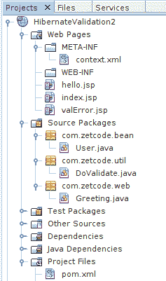
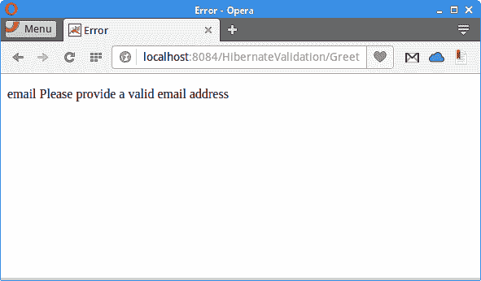

# Hibernate 验证器

原文：http://zetcode.com/java/hibernatevalidator/

在本教程中，我们展示了如何使用 Hibernate 验证器来验证数据。 验证从用户那里收到的输入以保持数据完整性是应用逻辑的重要组成部分。 验证被合并到 Java Web 框架中，例如 Stripes，Ninja 框架或 Play 框架。

## Bean 验证

Bean 验证是 Java EE 6 平台中引入的验证模型。 约束通过以 JavaBeans 组件的字段，方法或类上的注解形式的约束来支持 Bean 验证模型。 也可以使用 XML 验证描述符。

## Hibernate 验证器定义

Hibernate 验证器是 Bean 验证的参考实现。 Hibernate Validator 允许表达和验证应用约束。 默认的元数据源是注解，可以通过使用 XML 进行覆盖和扩展。 它不依赖于特定的应用层或编程模型，并且可用于服务器和客户端应用编程。

## Hibernate 验证器命令行应用

在下面的示例中，我们在一个简单的命令行应用中使用了 Hibernate Validator。

`pom.xml`

```java
<?xml version="1.0" encoding="UTF-8"?>
<project xmlns="http://maven.apache.org/POM/4.0.0" 
         xmlns:xsi="http://www.w3.org/2001/XMLSchema-instance" 
         xsi:schemaLocation="http://maven.apache.org/POM/4.0.0 http://maven.apache.org/xsd/maven-4.0.0.xsd">

    <modelVersion>4.0.0</modelVersion>
    <groupId>com.zetcode</groupId>
    <artifactId>HibernateValidation</artifactId>
    <version>1.0-SNAPSHOT</version>
    <packaging>jar</packaging>
    <properties>
        <project.build.sourceEncoding>UTF-8</project.build.sourceEncoding>
        <maven.compiler.source>1.8</maven.compiler.source>
        <maven.compiler.target>1.8</maven.compiler.target>
    </properties>

    <dependencies>
        <dependency>
            <groupId>javax.el</groupId>
            <artifactId>javax.el-api</artifactId>
            <version>2.2.4</version>
        </dependency>
        <dependency>
            <groupId>org.glassfish.web</groupId>
            <artifactId>javax.el</artifactId>
            <version>2.2.4</version>
        </dependency>

        <dependency>
            <groupId>org.hibernate</groupId>
            <artifactId>hibernate-validator-cdi</artifactId>
            <version>5.2.4.Final</version>
        </dependency>

        <dependency>
            <groupId>org.projectlombok</groupId>
            <artifactId>lombok</artifactId>
            <version>1.16.8</version>
            <scope>provided</scope>
        </dependency>        

    </dependencies>

</project>

```

Maven `pom.xml`包含 Hibernate Validator 和 Lombok 库的依赖项。 龙目岛用于减少一些样板。

`Car.java`

```java
package com.zetcode.bean;

import javax.validation.constraints.Max;
import javax.validation.constraints.Min;
import javax.validation.constraints.NotNull;
import javax.validation.constraints.Size;
import lombok.Data;

@Data
public class Car {

    private Long Id;

    @NotNull
    @Size(min=4, max=50)
    private String name;

    @Min(value = 1000)
    @Max(value = 5000000, message="There is no such expensive car")
    private int price;

    public Car() {}

    public Car(String name, int price) {

        this.name = name;
        this.price = price;
    } 
}

```

我们有一个`Car` bean，我们在其中验证数据。

```java
@Data
public class Car {

```

`Car` bean 用 lombok 的`@Data`注解修饰。 它会自动创建获取器和设置器方法，`equals()`方法，`toString()`方法和`hashCode()`方法。

```java
@NotNull
@Size(min=4, max=50)
private String name;

```

`@NotNull`注解指出`name`属性可能不是`null`。 `@Size`注解设置属性的最小和最大大小。

```java
@Min(value = 1000)
@Max(value = 5000000, message="There is no such expensive car")
private int price;

```

`@Min`约束设置`price`属性的最小值。 `message`元素用于创建错误消息。

`ClientApp.java`

```java
package com.zetcode.client;

import com.zetcode.bean.Car;
import java.util.Set;
import javax.validation.ConstraintViolation;
import javax.validation.Validation;
import javax.validation.Validator;
import javax.validation.ValidatorFactory;

public class ClientApp {

    private static Validator validator;

    public static void main(String[] args) {

        Car car1 = new Car("Volvo", 29000);
        Car car2 = new Car("Skoda", 900);
        Car car3 = new Car(null, 29000);
        Car car4 = new Car("Cit", 21000);
        Car car5 = new Car("Bentley", 8000000);

        ValidatorFactory factory = Validation.buildDefaultValidatorFactory();
        validator = factory.getValidator();

        validate(car1);
        validate(car2);
        validate(car3);
        validate(car4);
        validate(car5);        
    }

    public static void validate(Car car) {

        Set<ConstraintViolation<Car>> cvs = validator.validate(car);

        for (ConstraintViolation<Car> cv : cvs) {
            System.out.println(cv.getPropertyPath() + ": " + cv.getMessage());
        }        
    }
}

```

在客户端应用中，我们创建五个汽车对象并对其进行验证。

```java
Car car1 = new Car("Volvo", 29000);
Car car2 = new Car("Skoda", 900);
Car car3 = new Car(null, 29000);
Car car4 = new Car("Cit", 21000);
Car car5 = new Car("Bentley", 8000000);

```

将创建五个汽车对象。 四辆车的值未通过验证过程。 例如，斯柯达汽车的价格太低； 即低于最小值 1000。

```java
ValidatorFactory factory = Validation.buildDefaultValidatorFactory();
validator = factory.getValidator();

```

验证工厂与`buildDefaultValidatorFactory()`方法一起使用。 在工厂，我们使用`getValidator()`方法获得了验证器。 建议缓存验证器工厂，因为创建起来很昂贵。

```java
Set<ConstraintViolation<Car>> cvs = validator.validate(car);

```

使用验证程序的`validate()`方法验证汽车。

```java
for (ConstraintViolation<Car> cv : cvs) {
    System.out.println(cv.getPropertyPath() + ": " + cv.getMessage());
}

```

我们将打印错误消息以了解违反约束的情况。

```java
price: must be greater than or equal to 1000
name: may not be null
name: size must be between 4 and 50
price: There is no such expensive car

```

运行应用时，我们会收到这些错误消息。

## Hibernate 验证器 Web 应用

在第二个示例中，我们在 Web 应用中利用了 Hibernate Validator。 该应用部署在 Apache Tomcat 服务器上。 该应用的来源可从作者的 [Github 仓库](https://github.com/janbodnar/HibernateValidator)中获得。



图：项目结构


该图显示了 NetBeans 中的项目结构。

`context.xml`

```java
<?xml version="1.0" encoding="UTF-8"?>
<Context path="/HibernateValidation"/>

```

`context.xml`文件包含应用的上下文路径。

`pom.xml`

```java
<?xml version="1.0" encoding="UTF-8"?>
<project xmlns="http://maven.apache.org/POM/4.0.0" 
         xmlns:xsi="http://www.w3.org/2001/XMLSchema-instance" 
         xsi:schemaLocation="http://maven.apache.org/POM/4.0.0 http://maven.apache.org/xsd/maven-4.0.0.xsd">

    <modelVersion>4.0.0</modelVersion>

    <groupId>com.zetcode</groupId>
    <artifactId>HibernateValidation2</artifactId>
    <version>1.0-SNAPSHOT</version>
    <packaging>war</packaging>

    <name>HibernateValidation2</name>

    <dependencies>

        <dependency>
            <groupId>javax</groupId>
            <artifactId>javaee-web-api</artifactId>
            <version>7.0</version>
            <scope>provided</scope>
        </dependency>

        <dependency>
            <groupId>jstl</groupId>
            <artifactId>jstl</artifactId>
            <version>1.2</version>
        </dependency>

        <dependency>
            <groupId>javax.el</groupId>
            <artifactId>javax.el-api</artifactId>
            <version>2.2.4</version>
        </dependency>
        <dependency>
            <groupId>org.glassfish.web</groupId>
            <artifactId>javax.el</artifactId>
            <version>2.2.4</version>
        </dependency>

        <dependency>
            <groupId>org.hibernate</groupId>
            <artifactId>hibernate-validator-cdi</artifactId>
            <version>5.2.4.Final</version>
        </dependency>        

        <dependency>
            <groupId>org.projectlombok</groupId>
            <artifactId>lombok</artifactId>
            <version>1.16.8</version>
            <scope>provided</scope>
        </dependency>           

    </dependencies>

    <build>
        <plugins>
            <plugin>
                <groupId>org.apache.maven.plugins</groupId>
                <artifactId>maven-compiler-plugin</artifactId>
                <version>3.1</version>
                <configuration>
                    <source>1.8</source>
                    <target>1.8</target>

                </configuration>
            </plugin>
            <plugin>
                <groupId>org.apache.maven.plugins</groupId>
                <artifactId>maven-war-plugin</artifactId>
                <version>2.3</version>
                <configuration>
                    <failOnMissingWebXml>false</failOnMissingWebXml>
                </configuration>
            </plugin>
        </plugins>
    </build>

</project>

```

Maven `pom.xml`包含 Java EE Web API，Hibernate Validator 和 Lombok 库的依赖项。

`index.jsp`

```java
<%@page contentType="text/html" pageEncoding="UTF-8"%>
<!DOCTYPE html>
<html>
    <head>
        <meta http-equiv="Content-Type" content="text/html; charset=UTF-8">
        <title>Validation</title>
    </head>
    <body>

        <p>
            Enter your name and email:
        </p>

        <form method="post" action="Greet">

            Name: <input type="text" name="username"> <br>
            Email: <input type="text" name="email"> <br>

            <input type="submit" value="Submit"> 

        </form>

    </body>
</html>

```

`index.jsp`是我们应用的入口。 它包含一个带有两个字段的 HTML 表单：用户名和电子邮件。 在这些字段中输入的值将由应用验证。

```java
<form method="post" action="Greet">
...
</form>

```

提交表单后，将调用`Greet` Servlet。

`hello.jsp`

```java
<%@page contentType="text/html" pageEncoding="UTF-8"%>
<%@ taglib prefix="c" uri="http://java.sun.com/jsp/jstl/core" %>
<!DOCTYPE html>
<html>
    <head>
        <meta http-equiv="Content-Type" content="text/html; charset=UTF-8">
        <title>Greeting</title>
    </head>
    <body>
        Hello <c:out value="${param.username}"/>! <br>
        Your email is <c:out value="${param.email}"/>.
    </body>
</html>

```

当输入数据通过验证测试时，将显示`hello.jsp`页面。 显示输入的数据。

`valError.jsp`

```java
<%@page contentType="text/html" pageEncoding="UTF-8"%>
<%@ taglib prefix="c" uri="http://java.sun.com/jsp/jstl/core" %>
<!DOCTYPE html>
<html>
    <head>
        <meta http-equiv="Content-Type" content="text/html; charset=UTF-8">
        <title>Error</title>
    </head>
    <body>
        <p>
            <c:forEach var="err" items="${errMsg}">
                <c:out value="${err}"/>
                <br>
            </c:forEach>
        </p>
    </body>
</html>

```

如果验证失败，则显示`valError.jsp`。 它显示了存储在`errMsg`属性中的错误消息。 该属性是在验证过程中设置的。

`User.java`

```java
package com.zetcode.bean;

import javax.validation.constraints.Pattern;
import lombok.Data;
import org.hibernate.validator.constraints.NotEmpty;

@Data
public class User {

    @NotEmpty
    private String name;

    @NotEmpty
    @Pattern(regexp="^[a-zA-Z0-9._-]+@[a-zA-Z0-9-]+\\.[a-zA-Z.]{2,5}", 
            message="Please provide a valid email address")    
    private String email;
}

```

`User` bean 用 Lombok 和 Hibernate Validator 注解修饰。

```java
@NotEmpty
private String name;

```

`@NotEmpty`注解导致用户名不能为空。

```java
@NotEmpty
@Pattern(regexp="^[a-zA-Z0-9._-]+@[a-zA-Z0-9-]+\\.[a-zA-Z.]{2,5}", 
        message="Please provide a valid email address")    
private String email;

```

电子邮件不能为空，并且必须匹配给定的模式。 用`@Pattern`注解设置模式。

`DoValidate.java`

```java
package com.zetcode.util;

import com.zetcode.bean.User;
import java.util.ArrayList;
import java.util.List;
import java.util.Set;
import javax.validation.ConstraintViolation;
import javax.validation.Validation;
import javax.validation.Validator;
import javax.validation.ValidatorFactory;

public class DoValidate {

    public static  List<String> validate(User user) {

        List<String> errors = new ArrayList();

        ValidatorFactory factory = Validation.buildDefaultValidatorFactory();
        Validator validator = factory.getValidator();

        Set<ConstraintViolation<User>> cvs = validator.validate(user);

        if (!cvs.isEmpty()) {

            for (ConstraintViolation<User> cv : cvs) {

                StringBuilder err = new StringBuilder();
                err.append(cv.getPropertyPath());
                err.append(" ");
                err.append(cv.getMessage());
                errors.add(err.toString());
            }
        }

        return errors;
    }
}

```

验证在`DoValidate`工具类中执行。

```java
if (!cvs.isEmpty()) {

    for (ConstraintViolation<User> cv : cvs) {

        StringBuilder err = new StringBuilder();
        err.append(cv.getPropertyPath());
        err.append(" ");
        err.append(cv.getMessage());
        errors.add(err.toString());
    }
}

```

当违反约束时，我们将创建错误消息列表。 `getMessage()`方法获取约束冲突的错误消息。

```java
return errors;

```

错误消息列表将返回给调用方。 如果未检测到违规，则该列表为空。

`Greeting.java`

```java
package com.zetcode.web;

import com.zetcode.bean.User;
import com.zetcode.util.DoValidate;
import java.io.IOException;
import java.util.List;
import javax.servlet.RequestDispatcher;
import javax.servlet.ServletException;
import javax.servlet.annotation.WebServlet;
import javax.servlet.http.HttpServlet;
import javax.servlet.http.HttpServletRequest;
import javax.servlet.http.HttpServletResponse;

@WebServlet(name = "Greeting", urlPatterns = {"/Greet"})
public class Greeting extends HttpServlet {

    @Override
    protected void doPost(HttpServletRequest request, 
            HttpServletResponse response) 
            throws ServletException, IOException {

        response.setContentType("text/html;charset=UTF-8");

        String page = "/hello.jsp";

        String username = request.getParameter("username");
        String email = request.getParameter("email");

        User user = new User();
        user.setName(username);
        user.setEmail(email);

        List<String> errors = DoValidate.validate(user);

        if (!errors.isEmpty()) {

            request.setAttribute("errMsg", errors);

            page = "/valError.jsp";

        } else {

            request.setAttribute("user", user);
        }

        RequestDispatcher disp = getServletContext().getRequestDispatcher(page);
        disp.forward(request, response);
    }
}

```

`Greeting` Servlet 检索请求数据并调用`DoValidate.validate()`工具方法。 取决于验证的结果，该 servlet 调度到`hello.jsp`或`valError.jsp`页面。



图：错误消息


如果电子邮件格式不正确，则应用将以错误消息响应。

这是验证过滤器教程。 我们使用 Hibernate Validator，JSTL，JSP，Apache Tomcat 和 Maven 构建了一个控制台和一个 Web 应用。 您可能还需要查看一些相关的教程： [Java 验证过滤器教程](/java/validationfilter/)， [Java 教程](/lang/java/)或 [Stripes 教程](/java/stripes/)。