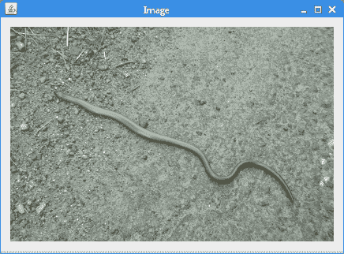
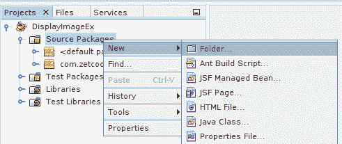
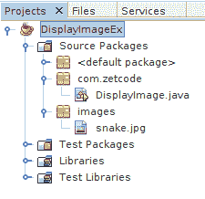
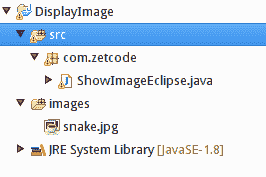

# 用 Java 显示图像

原文：http://zetcode.com/java/displayimage/

在 Java 中显示图像教程介绍了如何在 Java 中显示图像。 我们展示了如何使用命令行工具 Ant，Maven，NetBeans 和 Eclipse 构建项目。 源代码和图像可在作者的 [Github 存储库](https://github.com/janbodnar/Display-Image)中获得。

初学者程序员经常在项目中显示图像时遇到问题。 问题在于正确识别图像文件的路径。 关键部分是要认识到图像文件的相对路径是从项目目录开始的。 创建本教程的目的是使事情变得清楚。

以下示例显示了该应用的屏幕截图。



Figure: Displaying image in Java


## 源代码

在这里，我们提供了用于在 Java 中显示图像的源代码。

`DisplayImage.java`

```java
package com.zetcode;

import java.awt.Container;
import java.awt.EventQueue;
import javax.swing.GroupLayout;
import javax.swing.ImageIcon;
import javax.swing.JComponent;
import javax.swing.JFrame;
import javax.swing.JLabel;

public class DisplayImage extends JFrame {

    public DisplayImage() {

        initUI();
    }

    private void initUI() {       

        ImageIcon ii = loadImage();

        JLabel label = new JLabel(ii);

        createLayout(label);

        setTitle("Image");
        setLocationRelativeTo(null);
        setDefaultCloseOperation(EXIT_ON_CLOSE);
    }

    private ImageIcon loadImage() {

        ImageIcon ii = new ImageIcon("simg/snake.jpg");
        return ii;
    }

    private void createLayout(JComponent... arg) {

        Container pane = getContentPane();
        GroupLayout gl = new GroupLayout(pane);
        pane.setLayout(gl);

        gl.setAutoCreateContainerGaps(true);

        gl.setHorizontalGroup(gl.createSequentialGroup()
                .addComponent(arg[0])
        );

        gl.setVerticalGroup(gl.createParallelGroup()
                .addComponent(arg[0])
        );

        pack();
    }

    public static void main(String[] args) {

        EventQueue.invokeLater(() -> {
            DisplayImage ex = new DisplayImage();
            ex.setVisible(true);
        });
    }
}

```

该示例创建一个 Java Swing 应用，并使用`ImageIcon`组件显示图像。

```java
private ImageIcon loadImage() {

    ImageIcon ii = new ImageIcon("simg/snake.jpg");
    return ii;
}

```

重要的部分在这里。 `ImageIcon`采用图像的文件路径。 该文件路径取决于我们使用的构建工具。

## 使用命令行工具显示图像

第一个示例使用命令行工具构建 Java 应用。

```java
$ mkdir bin
$ mkdir -p src/main/com/zetcode/
$ mkdir src/maimg
$ cp ~/Pictures/snake.jpg src/maimg/

```

我们创建项目结构并将图像复制到 images 目录。

```java
private ImageIcon loadImage() {

    ImageIcon ii = new ImageIcon("src/maimg/snake.jpg");
    return ii;
}

```

在命令行应用中，我们使用了`src/maimg/snake.jpg`路径。

```java
$ tree
.
├── bin
└── src
    └── main
        ├── com
        │   └── zetcode
        │       └── DisplayImage.java
        └── images
            └── snake.jpg

6 directories, 2 files

```

这就是项目目录结构的样子。

```java
$ javac -d bin src/main/com/zetcode/DisplayImage.java 

```

该应用使用`javac`工具进行编译。

```java
$ tree
.
├── bin
│   └── com
│       └── zetcode
│           └── DisplayImage.class
└── src
    └── main
        ├── com
        │   └── zetcode
        │       └── DisplayImage.java
        └── images
            └── snake.jpg

8 directories, 3 files

```

编译源代码后，我们在`bin/com/zetcode`子目录中创建了一个 Java 类文件。

```java
$ java -cp bin com.zetcode.DisplayImage 

```

我们使用`java`命令运行该应用。

## 使用 Ant 构建项目

在本节中，我们将使用 Ant 构建工具来创建项目。

```java
$ mkdir -p src/main/com/zetcode/
$ mkdir src/maimg
$ cp ~/Pictures/snake.jpg src/maimg/

```

我们创建目录并复制图像文件。

```java
$ tree
.
├── build.xml
└── src
    └── main
        ├── com
        │   └── zetcode
        │       └── DisplayImage.java
        └── images
            └── snake.jpg

5 directories, 3 files

```

使用`tree`命令，显示项目的目录结构。

`build.xml`

```java
<?xml version="1.0"?>
<project name="DisplayImage" default="compile">

  <target name="init">
        <mkdir dir="build/classes"/>
  </target>

  <target name="compile" depends="init">
        <javac includeantruntime="false" srcdir="src" destdir="build/classes"/>
  </target>

  <target name="clean">        
        <delete dir="build"/>
  </target>
</project>

```

这是 Ant 构建文件。 我们有创建目录，编译源代码和清理的任务。

```java
private ImageIcon loadImage() {

    ImageIcon ii = new ImageIcon("src/maimg/snake.jpg");
    return ii;
}

```

我们使用`src/maimg/snake.jpg`路径。

```java
$ ant
Buildfile: /home/janbodnar/prog/javaimages/displayimageant/build.xml

init:

compile:
    [javac] Compiling 1 source file to /home/janbodnar/prog/javaimages/displayimageant/build/classes

BUILD SUCCESSFUL
Total time: 2 seconds

```

我们建立项目。

```java
$ java -cp build/classes/ com.zetcode.DisplayImage

```

该应用启动。

## 在 NetBeans 中显示图像

在 NetBeans 中，我们创建一个 Java 应用。

我们创建一个新文件夹。 我们右键单击“源包”，然后选择“新建—文件夹”。



Figure: Creating a folder in NetBeans


我们将文件夹称为`images`。 其父目录为`src`。 使用拖放操作，将`snake.jpg`文件复制到`images`子目录。

```java
private ImageIcon loadImage() {

    ImageIcon ii = new ImageIcon("simg/snake.jpg");
    return ii;
}

```

在 NetBeans 中，我们使用了`simg/snake.jpg`路径。

```java
System.out.println(System.getProperty("user.dir"));

```

该应用的当前工作目录是项目目录，在本例中为`DisplayImageEx`。 我们可以使用`user.dir`系统属性找出当前的工作目录。 `src`目录是项目目录的子目录。



Figure: Project structure in NetBeans


该图显示了 NetBeans 中的实际项目结构。

## 在 Eclipse 中显示图像

在 Eclipse 中，我们创建一个 Java 项目。 我们在项目节点上单击鼠标右键，然后选择“新建—源文件夹”。

我们将文件夹名称称为`images`。 与 NetBeans 不同，它的父目录是项目文件夹。 使用拖放操作，将`snake.jpg`文件复制到`images`子目录。

```java
private ImageIcon loadImage() {

    ImageIcon ii = new ImageIcon("images/snake.jpg");
    return ii;
}

```

在 Eclipse 中，我们使用了`images/snake.jpg`路径。



Figure: Project structure in Eclipse


该图显示了 Eclipse 中的实际项目结构。

这是 Java 教程中的 Displaying image。 我们已经构建了一个 Swing 应用，该应用使用命令行工具，Ant，NetBeans 和 Eclipse 显示图像。 您可能还需要查看 [ImageIcon 教程](/java/imageicon/)，[在 Java 中读写 ICO 文件](/articles/javaico/)， [Java Swing 教程](/tutorials/javaswingtutorial/)， [Java 2D 教程](/gfx/java2d/)， 或 [Java 游戏教程](/tutorials/javagamestutorial/)。