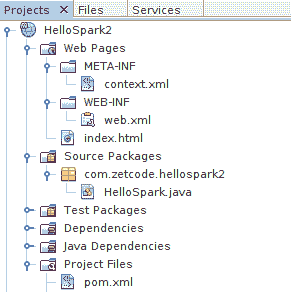

# Spark Java 简介

原文：http://zetcode.com/java/spark/

这是 Spark Java Web 框架的入门教程。 我们介绍了 Spark Java 框架，并提供了三个代码示例。

## Spark Java

Spark 是一个 Java 微框架，用于以最小的工作量在 Java 8 中创建 Web 应用。 Spark 框架是为快速开发而构建的简单，轻量级的 Java Web 框架。 它的灵感来自流行的 Ruby 微框架 Sinatra 。

Spark 广泛使用 Java 8 的 lambda 表达式，这使 Spark 应用不再那么冗长。 与其他 Java Web 框架相比，Spark 不使用大量的 XML 文件或注释。

## 路由

Spark 应用包含一组路由。 路由将 URL 模式映射到 Java 处理器。

路由包含三个部分：

*   动词，包括获取，发布，放置，删除，开头，跟踪，连接和选项
*   诸如/ first 或/ hello /：name 之类的路径
*   回调（请求，响应）-&gt; {}

## 首个应用

第一个应用返回一条简单消息。 Gradle 用于构建应用。

```java
$ tree
.
├── build.gradle
└── src
    └── main
        └── java
            └── com
                └── zetcode
                    └── firstspark
                        └── FirstSpark.java

```

这是项目结构。 Gradle 的 Java 插件期望 Java 生产代码位于`src/main/java`目录中。

`build.gradle`

```java
apply plugin: 'java'
apply plugin: 'application'

archivesBaseName = "first"
version = '1.0'
mainClassName = "com.zetcode.firstspark.FirstSpark"

repositories {
  mavenCentral()
}

dependencies {
  compile 'com.sparkjava:spark-core:2.5'
  compile 'org.slf4j:slf4j-simple:1.7.6'
}

```

这是 Gradle 构建文件。 它包括 Spark 核心组件和 slf4j 简单记录器的依赖项。

`FirstSpark.java`

```java
package com.zetcode.firstspark;

import static spark.Spark.get;

public class FirstSpark {
    public static void main(String[] args) {
        get("/first", (req, res) -> "First Spark application");
    }
}

```

应用将“ First Spark 应用消息”返回到 GET 请求。 当我们运行应用时，Spark 将启动嵌入式 Jetty Web 服务器。

```java
get("/first", (req, res) -> "First Spark application");

```

`get()`方法映射 HTTP GET 请求的路由。 在 Spark 术语中，路由是处理器。路由是映射到处理器的 URL 模式。 处理器可以是物理文件，也可以是

```java
$ gradle build

```

我们使用`gradle build`命令构建应用。

```java
$ gradle run

```

我们使用`gradle run`命令运行该应用。 嵌入式 Jetty 服务器启动。

```java
$ curl localhost:4567/first
First Spark application

```

我们使用`curl`工具将 GET 请求发送到服务器。 内置嵌入式 Jetty 服务器默认情况下侦听端口 4567。

## 你好应用

第二个应用将向用户打招呼。 客户端发送带有 URL 的名称，应用向用户打招呼。

`build.gradle`

```java
apply plugin: 'java'
apply plugin: 'application'

archivesBaseName = "hello"
version = '1.0'
mainClassName = "com.zetcode.hellospark.HelloSpark"

repositories {
  mavenCentral()
}

dependencies {
  compile 'com.sparkjava:spark-core:2.5'
  compile 'org.slf4j:slf4j-simple:1.7.6'
}

```

这是应用的 Gradle 构建文件。

```java
$ tree
.
├── build.gradle
└── src
    └── main
        └── java
            └── com
                └── zetcode
                    └── hellospark
                        └── HelloSpark.java

6 directories, 2 files

```

这是项目结构。

`HelloSpark.java`

```java
package com.zetcode.hellospark;

import static spark.Spark.get;

public class HelloSpark {
    public static void main(String[] args) {
        get("/hello/:name", (req, res) -> "Hello " + req.params(":name"));
    }
}

```

Spark 应用检索请求参数，生成一条消息，然后将其返回给调用方。

```java
get("/hello/:name", (req, res) -> "Hello " + req.params(":name"));

```

`params()`方法返回提供的路由模式参数的值。

```java
$ gradle build run

```

我们构建并运行该应用。

```java
$ curl localhost:4567/hello/Peter
Hello Peter

```

我们向服务器发送请求； URL 包含一个名称。 该应用发回问候。

## 在 Tomcat 中运行 Spark 应用

默认情况下，Spark 应用在嵌入式 Jetty 服务器中运行。 在此示例中，我们显示了如何在 Tomcat 中运行 Spark Java 应用。 这次我们使用 Maven 构建工具并在 NetBeans 中创建一个项目。



Figure: NetBeans project structure


该图显示了该项目在 NetBeans 中的外观。

`pom.xml`

```java
<?xml version="1.0" encoding="UTF-8"?>
<project xmlns="http://maven.apache.org/POM/4.0.0" xmlns:xsi="http://www.w3.org/2001/XMLSchema-instance" 
         xsi:schemaLocation="http://maven.apache.org/POM/4.0.0 http://maven.apache.org/xsd/maven-4.0.0.xsd">
    <modelVersion>4.0.0</modelVersion>

    <groupId>com.zetcode</groupId>
    <artifactId>HelloSpark2</artifactId>
    <version>1.0-SNAPSHOT</version>
    <packaging>war</packaging>

    <name>HelloSpark2</name>

    <properties>
        <endorsed.dir>${project.build.directory}/endorsed</endorsed.dir>
        <project.build.sourceEncoding>UTF-8</project.build.sourceEncoding>
    </properties>

    <dependencies>

        <dependency>
            <groupId>com.sparkjava</groupId>
            <artifactId>spark-core</artifactId>
            <version>2.5</version>
        </dependency>
        <dependency>
            <groupId>org.slf4j</groupId>
            <artifactId>slf4j-simple</artifactId>
            <version>1.7.21</version>
        </dependency>

    </dependencies>

    <build>
        <plugins>
            <plugin>
                <groupId>org.apache.maven.plugins</groupId>
                <artifactId>maven-compiler-plugin</artifactId>
                <version>3.1</version>
                <configuration>
                    <source>1.8</source>
                    <target>1.8</target>
                    <compilerArguments>
                        <endorseddirs>${endorsed.dir}</endorseddirs>
                    </compilerArguments>
                </configuration>
            </plugin>
            <plugin>
                <groupId>org.apache.maven.plugins</groupId>
                <artifactId>maven-war-plugin</artifactId>
                <version>2.3</version>
                <configuration>
                    <failOnMissingWebXml>false</failOnMissingWebXml>
                </configuration>
            </plugin>
        </plugins>
    </build>

</project>

```

这是 Maven 构建文件。

`context.xml`

```java
<?xml version="1.0" encoding="UTF-8"?>
<Context path="/HelloSpark2"/>

```

这是`context.xml`文件。

`web.xml`

```java
<?xml version="1.0" encoding="UTF-8"?>

<web-app xmlns="http://xmlns.jcp.org/xml/ns/javaee"
         xmlns:xsi="http://www.w3.org/2001/XMLSchema-instance"
         xsi:schemaLocation="http://xmlns.jcp.org/xml/ns/javaee http://xmlns.jcp.org/xml/ns/javaee/web-app_3_1.xsd"
         version="3.1">

    <welcome-file-list>
        <welcome-file>index.html</welcome-file>
    </welcome-file-list>    

    <filter>
        <filter-name>SparkFilter</filter-name>
        <filter-class>spark.servlet.SparkFilter</filter-class>
        <init-param>
            <param-name>applicationClass</param-name>
            <param-value>com.zetcode.hellospark2.HelloSpark</param-value>
        </init-param>
    </filter>

    <filter-mapping>
        <filter-name>SparkFilter</filter-name>
        <url-pattern>/*</url-pattern>
    </filter-mapping>

</web-app>

```

在`web.xml`部署描述符中，我们指定`spark.servlet.SparkFilter`。

`HelloSpark.java`

```java
package com.zetcode.hellospark2;

import static spark.Spark.get;
import spark.servlet.SparkApplication;

public class HelloSpark implements SparkApplication {

    @Override
    public void init() {

        get("/hello/:name", (request, response) -> "Hello " + request.params(":name"));
    }
}

```

我们实现`SparkApplication`接口，并在`init()`方法中指定路由。

最后，我们运行 Tomcat Web 服务器。

```java
$ curl localhost:8084/HelloSpark2/hello/Peter
Hello Peter

```

NetBeans 的内置 Tomcat 侦听端口 8084。

## 模板引擎

Spark 没有自己的模板系统。 它使用第三方引擎。 在以下两个示例中，我们使用 Thymeleaf 和 FreeMarker。

### 使用 Thymeleaf

在以下示例中，我们将把 Thymeleaf 模板引擎集成到我们的 Spark 应用中。 Thymeleaf 是适用于 Web 和独立环境的现代服务器端 Java 模板引擎。

```java
$ tree
.
├── build.gradle
└── src
    └── main
        ├── java
        │   └── com
        │       └── zetcode
        │           └── thymeleaf
        │               └── SparkThymeleaf.java
        └── resources
            └── templates
                └── hello.html

```

这是项目的目录结构。 模板文件位于`src/main/resources/templates`目录中。

`build.gradle`

```java
apply plugin: 'java'
apply plugin: 'application'

archivesBaseName = "sparkthymeleaf"
version = '1.0'
mainClassName = "com.zetcode.thymeleaf.SparkThymeleaf"

repositories {
  mavenCentral()
}

dependencies {
  compile 'com.sparkjava:spark-core:2.5'
  compile 'org.slf4j:slf4j-simple:1.7.6'
  compile 'com.sparkjava:spark-template-thymeleaf:2.3'
}

```

在这里，我们有 Gradle 构建文件，其中包含`spark-template-thymeleaf`依赖项。

`SparkThymeleaf.java`

```java
package com.zetcode.thymeleaf;

import java.util.HashMap;
import java.util.Map;
import spark.ModelAndView;
import spark.Request;
import spark.Response;
import spark.template.thymeleaf.ThymeleafTemplateEngine;
import static spark.Spark.get;
import static spark.Spark.staticFileLocation;

public class SparkThymeleaf {

    public static void main(String[] args) {

        get("/hello/:name", SparkThymeleaf::message, new ThymeleafTemplateEngine());
    }

    public static ModelAndView message(Request req, Response res) {

        Map<String, Object> params = new HashMap<>();
        params.put("name", req.params(":name"));
        return new ModelAndView(params, "hello");
    }
}

```

应用读取请求参数并将其放入`ModelAndView`对象。

```java
get("/hello/:name", SparkThymeleaf::message, new ThymeleafTemplateEngine());

```

`ThymeleafTemplateEngine`的实例传递给`get()`方法。

`hello.html`

```java
<pre class="code">
<!DOCTYPE html>
<html lang="en" xmlns="http://www.w3.org/1999/xhtml" xmlns:th="http://www.thymeleaf.org">
<head>
    <meta charset="UTF-8"></meta>
    <title>Hello user</title>
</head>
<body>
<p th:inline="text">Hello, [[${name}]]!</p>
</body>
</html>

```

这是`hello.html`模板文件。 它引用随`ModelAndView`对象传递的名称变量。

```java
$ curl localhost:4567/hello/Peter
<!DOCTYPE html>

<html lang="en" xmlns="http://www.w3.org/1999/xhtml">
<head>
    <meta charset="UTF-8" />
    <title>Hello user</title>
</head>
<body>
<p>Hello, Peter!</p>
</body>
</html>

```

我们得到这个输出。

### FreeMarker

在以下示例中，我们将把 FreeMarker 模板引擎集成到我们的 Spark 应用中。 FreeMarker 是一个完善的 Java 模板引擎。

```java
$ tree
.
├── build.gradle
└── src
    └── main
        ├── java
        │   └── com
        │       └── zetcode
        │           └── SparkFreeMarker.java
        └── resources
            └── views
                └── hello.ftl

```

这是项目的目录结构。 模板文件位于`src/main/resources/views`目录中。

`build.gradle`

```java
apply plugin: 'application'

sourceCompatibility = '1.8'
version = '1.0'
mainClassName = "com.zetcode.SparkFreeMarker"

repositories {
    mavenCentral()

}

dependencies {
  compile 'com.sparkjava:spark-core:2.5.5'
  compile 'org.slf4j:slf4j-simple:1.7.24'
  compile 'com.sparkjava:spark-template-freemarker:2.5.5'
}

```

在这里，我们有 Gradle 构建文件，其中包含`spark-template-freemarker`依赖项。

`SparkFreeMarker.java`

```java
package com.zetcode;

import freemarker.template.Configuration;
import freemarker.template.Version;
import java.io.IOException;
import java.util.HashMap;
import java.util.Map;
import spark.ModelAndView;
import spark.Request;
import spark.Response;
import static spark.Spark.get;
import spark.template.freemarker.FreeMarkerEngine;

public class SparkFreeMarker {

    public static void main(String[] args) throws IOException {

        Configuration conf = new Configuration(new Version(2, 3, 23));
        conf.setClassForTemplateLoading(SparkFreeMarker.class, "/views");

        get("/hello/:name", SparkFreeMarker::message, new FreeMarkerEngine(conf));
    }

    public static ModelAndView message(Request req, Response res) {

        Map<String, Object> params = new HashMap<>();
        params.put("name", req.params(":name"));
        return new ModelAndView(params, "hello.ftl");
    }
}

```

我们为 FreeMarker 设置了相同的应用。

```java
Configuration conf = new Configuration(new Version(2, 3, 23));
conf.setClassForTemplateLoading(SparkFreeMarker.class, "/views");

```

我们用`Configuration`类配置 FreeMarker。 模板文件将放置在`views`目录中，该目录必须位于类路径上。

```java
get("/hello/:name", SparkFreeMarker::message, new FreeMarkerEngine(conf));

```

`FreeMarkerEngine`传递给`get()`方法。

`hello.ftl`

```java
<!DOCTYPE html>
<html>
    <head>
        <title>Home page</title>
        <meta charset="UTF-8">
        <meta name="viewport" content="width=device-width, initial-scale=1.0">
    </head>
    <body>
        <p>Hello ${name}</p>
    </body>
</html>

```

这是`hello.ftl`模板文件； 它引用随`ModelAndView`对象传递的名称变量。

```java
$ curl localhost:4567/hello/Lucy
<!DOCTYPE html>
<html>
    <head>
        <title>Home page</title>
        <meta charset="UTF-8">
        <meta name="viewport" content="width=device-width, initial-scale=1.0">
    </head>
    <body>
        <p>Hello Lucy</p>
    </body>
</html>

```

这是输出。

在本教程中，我们介绍了 Spark Java 框架。 您可能也对相关教程感兴趣： [Java 教程](/lang/java/)，[游戏介绍](/java/play/)，[Stripes 介绍](/java/stripes/)或 [Jtwig 教程](/java/jtwig/)。