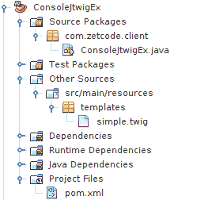
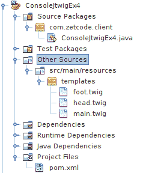
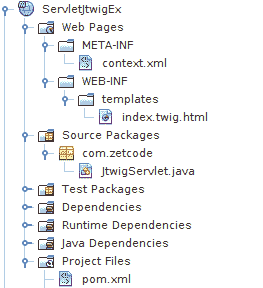
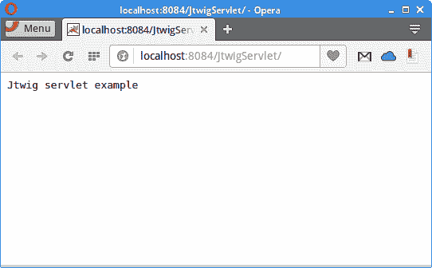
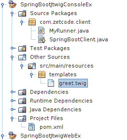
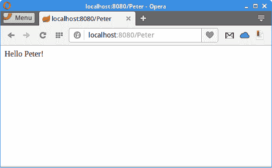

# Jtwig 教程

原文：http://zetcode.com/java/jtwig/

这是 Jtwig Java 模板引擎的入门教程。 我们介绍 Jtwig 模板引擎，并创建几个控制台和 Web 应用。 Maven 用于构建我们的示例。 NetBeans 用于管理应用。

Jtwig 是 Java 编程语言的现代模板引擎。 它是模块化，可配置且易于使用的模板引擎。 它的灵感来自 Django 的模板引擎。 Jtwig 的主页是 [jtwig.org](http://jtwig.org) 。

模板引擎将静态数据与动态数据结合起来以产生内容。 模板是内容的中间表示。 它指定如何生成输出。

模板引擎的优点是：

*   关注点分离，
*   避免重复代码，
*   更容易在视图之间切换，
*   可重用性。

Jtwig 不限于 HTML 页面的模板； 它也可以用于纯文本。

## 控制台应用

前四个应用是控制台应用。 我们在 NetBeans 中创建新的 Maven Java 应用。 他们使用以下 Maven 构建文件：

`Excerpt from pom.xml`

```
<repositories>
    <repository>
        <id>jcenter</id>
        <url>https://jcenter.bintray.com/</url>
    </repository>
</repositories>    

<dependencies>
    <dependency>
        <groupId>org.jtwig</groupId>
        <artifactId>jtwig-core</artifactId>
        <version>5.58</version>
    </dependency>
    <dependency>
        <groupId>org.slf4j</groupId>
        <artifactId>slf4j-simple</artifactId>
        <version>1.7.21</version>
    </dependency>
</dependencies>    

```

在 Maven `pom.xml`文件中，我们为 Jtwig 和`jtwig-core`和`slf4j-simple`依赖项指定存储库。

### 变量

在第一个应用中，我们探索 Jtwig `set`命令。 `set`命令允许在 Jtwig 模板中指定分配操作。 它将表达式的结果分配给指定的变量。



Figure: Java console project structure in NetBeans


这是 NetBeans 中的项目结构。

`ConsoleJtwigEx.java`

```
package com.zetcode.client;

import org.jtwig.JtwigModel;
import org.jtwig.JtwigTemplate;

public class ConsoleJtwigEx {

    public static void main(String[] args) {

        JtwigTemplate template
                = JtwigTemplate.classpathTemplate("templates/simple.twig");
        JtwigModel model = JtwigModel.newModel();

        template.render(model, System.out);
    }
}

```

我们创建一个处理 Jtwig 模板文件的 Java 控制台应用。

```
JtwigTemplate template
        = JtwigTemplate.classpathTemplate("templates/simple.twig");

```

创建了`JtwigTemplate`。 它加载位于`src/main/java/resources/templates`目录中的`simple.twig`模板文件。

```
JtwigModel model = JtwigModel.newModel();

```

`JtwigModel`已创建。 该模型是键和值对的容器，这些键和值对与模板结合生成输出。

```
template.render(model, System.out);

```

`render()`方法创建最终输出。 它使用模型并将其输出到系统输出。

`simple.twig`

```

{{ v -}}


{{ a[1] -}}


{{ m["k1"] }}

```

在`simple.twig`文件中，我们使用`set`命令定义三个变量并显示它们。

```


```

Jtwig 代码岛以``结尾。

```
{{ v -}}

```

Jtwig 使用`{{`和`}}`显示表达式和变量的值。 `-`是可选的空格控制字符。 在这里，它删除了代码岛后的空白。

```
6
2
apple

```

这是应用的输出。

### 你好应用

在第二个应用中，我们将一个变量传递给模板。

`ConsoleJtwigEx2.java`

```
package com.zetcode.client;

import org.jtwig.JtwigModel;
import org.jtwig.JtwigTemplate;

public class ConsoleJtwigEx2 {

    public static void main(String[] args) {

        JtwigTemplate template = 
                JtwigTemplate.classpathTemplate("templates/hello.twig");
        JtwigModel model = JtwigModel.newModel().with("name", "Peter");

        template.render(model, System.out);
    }
}

```

使用`with()`方法，我们将变量传递给模板文件。

`hello.twig`

```
Hello {{ name }}

```

在模板中，我们显示变量。

```
Hello Peter

```

这是示例的输出。

### 传递列表

在下一个应用中，我们将值列表传递给模板。

`Excerpt from pom.xml`

```
<dependencies>
    <dependency>
        <groupId>org.jtwig</groupId>
        <artifactId>jtwig-core</artifactId>
        <version>5.58</version>
    </dependency>
    <dependency>
        <groupId>org.slf4j</groupId>
        <artifactId>slf4j-simple</artifactId>
        <version>1.7.21</version>
    </dependency>

    <dependency>
        <groupId>com.google.guava</groupId>
        <artifactId>guava</artifactId>
        <version>19.0</version>
    </dependency>

</dependencies>

```

除了`jtwi-core`和`slf4j-simple`库外，我们还将`guava`库添加到项目依赖项中。

`ConsoleJtwigEx3.java`

```
package com.zetcode.client;

import com.google.common.collect.Lists;
import java.util.List;
import org.jtwig.JtwigModel;
import org.jtwig.JtwigTemplate;

public class ConsoleJtwigEx3 {

    public static void main(String[] args) {

        List<String> names = Lists.newArrayList("Jan", "Peter", "Jane");

        JtwigTemplate template = 
                JtwigTemplate.classpathTemplate("templates/friends.twig");
        JtwigModel model = JtwigModel.newModel().with("names", names);

        template.render(model, System.out);
    }    
}

```

在代码示例中，我们将名称列表传递给模板。

```
List<String> names = Lists.newArrayList("Jan", "Peter", "Jane");

```

使用 Google Guava，我们创建了一个名称列表。

```
JtwigModel model = JtwigModel.newModel().with("names", names);

```

该列表将传递到模板。

`friends.twig`

```

    {{ name }}


```

使用`for`命令，我们浏览列表并显示其元素。

### 包含模板

使用`include`命令，我们可以包含其他模板文件。



Figure: Java console project structure in NetBeans 2


`templates`目录中有三个文件。

`ConsoleEx4.java`

```
package com.zetcode.client;

import org.jtwig.JtwigModel;
import org.jtwig.JtwigTemplate;

public class ConsoleJtwigEx4 {

    public static void main(String[] args) {

        JtwigTemplate template
             = JtwigTemplate.classpathTemplate("templates/main.twig");
        JtwigModel model = JtwigModel.newModel();

        template.render(model, System.out);
    }
}

```

该示例加载`main.twig`模板，其中包括其他两个模板。

`foot.twig`

```
Footer.

```

这是`foot.twig`模板。

`head.twig`

```
Header.

```

这是`head.twig`模板。

`main.twig`

```


Main content.



```

这是`main.twig`模板。 它包括`foot.twig`和`head.twig`模板。

```
Header.

Main content.

Footer.

```

This is the output of the example.

## Jtwig servlet 示例

在下面的示例中，我们在标准 Java Web 应用中使用 Jtwig。 该应用打包到`war`文件中，并部署在 NetBeans 的内置 Tomcat 服务器上。

在 NetBeans 中，我们创建一个新的 Maven Web 应用。



Figure: Jtwig servlet project structure in NetBeans


这是 NetBeans 中 Jtwig servlet 示例的项目结构。

`context.xml`

```
<?xml version="1.0" encoding="UTF-8"?>
<Context path="/JtwigServlet"/>

```

这是`context.xml`文件。

`pom.xml`

```
<?xml version="1.0" encoding="UTF-8"?>
<project xmlns="http://maven.apache.org/POM/4.0.0" 
         xmlns:xsi="http://www.w3.org/2001/XMLSchema-instance" 
         xsi:schemaLocation="http://maven.apache.org/POM/4.0.0 
                http://maven.apache.org/xsd/maven-4.0.0.xsd">

    <modelVersion>4.0.0</modelVersion>
    <groupId>com.zetcode</groupId>
    <artifactId>ServletJtwigEx</artifactId>
    <version>1.0-SNAPSHOT</version>
    <packaging>war</packaging>
    <properties>
        <project.build.sourceEncoding>UTF-8</project.build.sourceEncoding>
        <maven.compiler.source>1.8</maven.compiler.source>
        <maven.compiler.target>1.8</maven.compiler.target>
    </properties>    

    <name>ServletJtwigEx</name>

    <repositories>
        <repository>
            <id>jcenter</id>
            <url>https://jcenter.bintray.com/</url>
        </repository>
    </repositories>    

    <dependencies>
        <dependency>
            <groupId>javax</groupId>
            <artifactId>javaee-web-api</artifactId>
            <version>7.0</version>
            <scope>provided</scope>
        </dependency>

        <dependency>
            <groupId>org.jtwig</groupId>
            <artifactId>jtwig-web</artifactId>
            <version>1.52</version>
        </dependency>        
    </dependencies>

    <build>
        <plugins>
            <plugin>
                <groupId>org.apache.maven.plugins</groupId>
                <artifactId>maven-war-plugin</artifactId>
                <version>2.3</version>
                <configuration>
                    <failOnMissingWebXml>false</failOnMissingWebXml>
                </configuration>
            </plugin>
        </plugins>
    </build>

</project>

```

这是`pom.xml`文件。 我们使用`jtwig-web`依赖项。

`JtwigServlet.java`

```
package com.zetcode;

import java.io.IOException;
import javax.servlet.ServletException;
import javax.servlet.annotation.WebServlet;
import javax.servlet.http.HttpServlet;
import javax.servlet.http.HttpServletRequest;
import javax.servlet.http.HttpServletResponse;
import org.jtwig.web.servlet.JtwigRenderer;

@WebServlet(name = "JtwigServlet", urlPatterns = {""})
public class JtwigServlet extends HttpServlet {

    private final JtwigRenderer renderer = JtwigRenderer.defaultRenderer();

    @Override
    protected void service(HttpServletRequest request, HttpServletResponse response) 
            throws ServletException, IOException {

        renderer.dispatcherFor("/WEB-INF/templates/index.twig.html")
                .with("greet", "Jtwig servlet example")
                .render(request, response);
    }
}

```

我们设置 servlet 并将其分发到模板文件。 我们将`greet`变量传递给模板。

```
@WebServlet(name = "JtwigServlet", urlPatterns = {""})

```

`JtwigServlet`映射到应用的上下文根。

`index.twig.html`

```
{{ greet }}

```

`index.twig.html`文件位于`WEB-INF/templates`目录中。 模板显示`greet`变量。



Figure: Jtwig servlet example


我们在 Opera 网络浏览器中显示应用输出。 NetBeans 中的内置 Tomcat 在 8084 端口上运行。

## Spring Boot

Spring 是流行的 Java 应用框架。 Spring Boot 是通过最小的努力来创建独立的，生产级的基于 Spring 的应用的产物。

### Spring Boot 命令行应用

在下一个应用中，我们将 Jtwig 集成到 Spring Boot 命令行应用中。 它是放置在 Spring Boot 框架中的控制台应用。



Figure: Spring Boot project structure in NetBeans


这是在 NetBeans 中使用 Jtwig 的 Spring Boot 应用的项目结构。

`pom.xml`

```
<?xml version="1.0" encoding="UTF-8"?>
<project xmlns="http://maven.apache.org/POM/4.0.0" 
         xmlns:xsi="http://www.w3.org/2001/XMLSchema-instance" 
         xsi:schemaLocation="http://maven.apache.org/POM/4.0.0 
            http://maven.apache.org/xsd/maven-4.0.0.xsd">

    <modelVersion>4.0.0</modelVersion>
    <groupId>com.zetcode</groupId>
    <artifactId>SpringBootJtwigConsoleEx</artifactId>
    <version>1.0-SNAPSHOT</version>
    <packaging>jar</packaging>
    <properties>
        <project.build.sourceEncoding>UTF-8</project.build.sourceEncoding>
        <maven.compiler.source>1.8</maven.compiler.source>
        <maven.compiler.target>1.8</maven.compiler.target>
    </properties>

    <repositories>
        <repository>
            <id>jcenter</id>
            <url>https://jcenter.bintray.com/</url>
        </repository>
    </repositories>

    <parent>
        <groupId>org.springframework.boot</groupId>
        <artifactId>spring-boot-starter-parent</artifactId>
        <version>1.3.5.RELEASE</version>
        <relativePath />
    </parent>      

    <dependencies>

        <dependency>
            <groupId>org.jtwig</groupId>
            <artifactId>jtwig-core</artifactId>
            <version>5.58</version>
        </dependency>        

        <dependency>
            <groupId>org.springframework.boot</groupId>
            <artifactId>spring-boot-starter</artifactId>
        </dependency>     

    </dependencies>
    <name>SpringBootJtwigConsoleEx</name>
</project>

```

这是 Maven 构建文件。 它包括 Spring Boot 和 Jtwig 的依赖项。

`SpringBootClient.java`

```
package com.zetcode.client;

import org.springframework.boot.SpringApplication;
import org.springframework.boot.autoconfigure.EnableAutoConfiguration;
import org.springframework.context.annotation.ComponentScan;

@EnableAutoConfiguration
@ComponentScan(basePackages="com.zetcode")
public class SpringBootClient {

    public static void main(String[] args) {

        SpringApplication.run(SpringBootClient.class, args);
    }
}

```

`SpringBootClient`设置 Spring Boot 应用。 `@EnableAutoConfiguration`注释启用 Spring Application Context 的自动配置，尝试猜测和配置我们可能需要的 bean。

`MyRunner.java`

```
package com.zetcode.client;

import org.jtwig.JtwigModel;
import org.jtwig.JtwigTemplate;
import org.springframework.boot.CommandLineRunner;
import org.springframework.stereotype.Component;

@Component
public class MyRunner implements CommandLineRunner {

    @Override
    public void run(String... args) throws Exception {

        JtwigTemplate template = 
                JtwigTemplate.classpathTemplate("templates/greet.twig");
        JtwigModel model = JtwigModel.newModel().with("name", "Peter");

        template.render(model, System.out);        
    }
}

```

`MyRunner`是 Spring Boot 应用的命令行运行程序。 我们加载并渲染模板。

`greet.twig`

```
Hello {{name}}!

```

这是`greet.twig`模板文件。

```
Hello Peter!

```

This is the output of the application.

### Spring Boot Web 应用

本教程的最后一个示例使用 Jtwig 模板引擎创建了一个 Spring Boot Web 应用。 请注意，我们正在 NetBeans 中创建 Java SE Maven 应用，而不是 Java Web Maven 应用。 这是因为我们已将 Tomcat 嵌入到我们的 JAR 文件中。

`pom.xml`

```
<?xml version="1.0" encoding="UTF-8"?>
<project xmlns="http://maven.apache.org/POM/4.0.0" 
         xmlns:xsi="http://www.w3.org/2001/XMLSchema-instance" 
         xsi:schemaLocation="http://maven.apache.org/POM/4.0.0 
                http://maven.apache.org/xsd/maven-4.0.0.xsd">

    <modelVersion>4.0.0</modelVersion>
    <groupId>com.zetcode</groupId>
    <artifactId>SpringBootJtwigWebEx</artifactId>
    <version>1.0-SNAPSHOT</version>
    <packaging>jar</packaging>
    <properties>
        <project.build.sourceEncoding>UTF-8</project.build.sourceEncoding>
        <maven.compiler.source>1.8</maven.compiler.source>
        <maven.compiler.target>1.8</maven.compiler.target>
    </properties>

    <repositories>
        <repository>
            <id>jcenter</id>
            <url>https://jcenter.bintray.com/</url>
        </repository>
    </repositories>

    <parent>
        <groupId>org.springframework.boot</groupId>
        <artifactId>spring-boot-starter-parent</artifactId>
        <version>1.3.5.RELEASE</version>
        <relativePath />
    </parent>         

    <dependencies>
        <dependency>
            <groupId>org.springframework.boot</groupId>
            <artifactId>spring-boot-starter</artifactId>
        </dependency> 

        <dependency>
            <groupId>org.springframework</groupId>
            <artifactId>spring-web</artifactId>
        </dependency>

        <dependency>
            <groupId>org.jtwig</groupId>
            <artifactId>jtwig-spring-boot-starter</artifactId>
            <version>5.55</version>
        </dependency>

        <dependency>
            <groupId>org.slf4j</groupId>
            <artifactId>slf4j-simple</artifactId>
            <version>1.7.21</version>
        </dependency>           
    </dependencies>    

</project>

```

在`pom.xml`文件中，我们具有以下依赖性：`spring-boot-starter`，`spring-web`，`jtwig-spring-boot-starter`和`slf4j-simple`。

`MyController.java`

```
package com.zetcode.controller;

import org.springframework.boot.SpringApplication;
import org.springframework.boot.autoconfigure.EnableAutoConfiguration;
import org.springframework.stereotype.Controller;
import org.springframework.ui.ModelMap;
import org.springframework.web.bind.annotation.PathVariable;
import org.springframework.web.bind.annotation.RequestMapping;

@Controller
@EnableAutoConfiguration
public class MyController {

    @RequestMapping("/{name}")
    public String indexAction (ModelMap model, @PathVariable("name") String name) {

        model.addAttribute("name", name);
        return "index";
    }

    public static void main(String[] args) throws Exception {
        SpringApplication.run(MyController.class, args);
    }
}

```

这是 Spring Boot Web 应用的控制器类。 控制器从请求中读取一个属性，并将其放入模型中。 然后，控制器将映射解析为模板文件。

`index.twig`

```
Hello {{name}}!

```

这是`index.twig`文件。



Figure: Spring Boot web example


Spring Boot 启动一个嵌入式 Tomcat 服务器，侦听端口 8080。

本教程专门针对 Jtwig 模板引擎。 您可能也对相关教程感兴趣： [FreeMarker 教程](/java/freemarker/)， [Java 教程](/lang/java/)，[游戏简介](/java/play/)， [Spark 简介](/java/spark/)或[条纹介绍](/java/stripes/)。