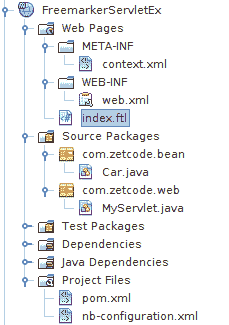
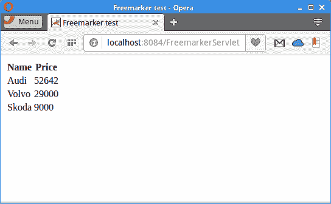
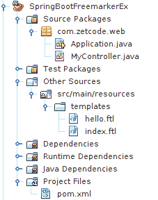
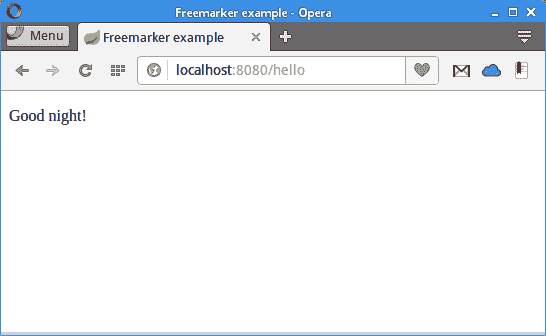

# FreeMarker 教程

原文：http://zetcode.com/java/freemarker/

这是 FreeMarker Java 模板引擎的入门教程。 我们介绍了 FreeMarker 模板引擎，并创建了几个控制台和 Web 应用。 Maven 用于构建我们的示例。 NetBeans 用于管理应用。

## 目录


1.  [FreeMarker 模板引擎](#free)
2.  [控制台应用](#cons)
3.  [FreeMarker 指令](#dire)
4.  [Servlet 和 FreeMarker](#serv)
5.  [Spark 和 FreeMarker](#spark)
6.  [Spring 和 FreeMarker](#spring) 


FreeMarker 是 Java 编程语言的模板引擎。 模板以 FreeMarker 模板语言（FTL）编写。 FreeMarker 的主页是 [freemarker.org](http://freemarker.org) 。

## FreeMarker 模板引擎

模板引擎将静态数据与动态数据结合起来以产生内容。 模板是内容的中间表示。 它指定如何生成输出。

模板引擎的优点是：

*   关注点分离，
*   避免重复代码，
*   更容易在视图之间切换，
*   可重用性。

按照惯例，FreeMarker 模板文件的扩展名为`.ftl`。

FreeMarker 不仅限于 HTML 页面的模板； 它可以用于生成电子邮件，配置文件，源代码等。

## FreeMarker 控制台应用

前两个应用是控制台应用。 我们在 NetBeans 中创建新的 Maven Java 应用。 他们使用以下 Maven 构建文件：

```java
<dependency>
    <groupId>org.freemarker</groupId>
    <artifactId>freemarker</artifactId>
    <version>2.3.23</version>
</dependency>       

```

在 Maven `pom.xml`文件中，我们指定 FreeMarker 依赖项。

### FreeMarker 插值

插值是放在`${ }`字符之间的表达式。 FreeMarker 会将输出中的插值替换为大括号内表达式的实际值。

在下面的示例中，我们使用 FreeMarker 模板文件来生成简单的文本输出。


图：NetBeans 中的 Java 控制台项目结构

这是 NetBeans 中的项目结构。

`FreeMarkerConsoleEx.java`

```java
package com.zetcode;

import freemarker.template.Configuration;
import freemarker.template.Template;
import freemarker.template.TemplateException;
import freemarker.template.Version;
import java.io.IOException;
import java.io.StringWriter;
import java.util.HashMap;
import java.util.Map;

public class FreeMarkerConsoleEx {

    public static void main(String[] args) throws IOException,
            TemplateException {

        Configuration cfg = new Configuration(new Version("2.3.23"));

        cfg.setClassForTemplateLoading(FreeMarkerConsoleEx.class, "/");
        cfg.setDefaultEncoding("UTF-8");

        Template template = cfg.getTemplate("test.ftl");

        Map<String, Object> templateData = new HashMap<>();
        templateData.put("msg", "Today is a beautiful day");

        try (StringWriter out = new StringWriter()) {

            template.process(templateData, out);
            System.out.println(out.getBuffer().toString());

            out.flush();
        }
    }
}

```

该示例将简单文本打印到控制台。 最终文本由模板引擎处理。

```java
Configuration cfg = new Configuration(new Version("2.3.23"));

```

`Configuration`用于设置 FreeMarker 设置； 它以 FreeMarker 库的版本为参数。

```java
cfg.setClassForTemplateLoading(FreeMarkerConsoleEx.class, "/");

```

`setClassForTemplateLoading()`设置将使用其方法来加载模板的类。

```java
Template template = cfg.getTemplate("test.ftl");

```

使用`getTemplate()`方法，我们检索`test.ftl`模板文件。

```java
Map<String, Object> templateData = new HashMap<>();
templateData.put("msg", "Today is a beautiful day");

```

数据模型已创建。 来自模型的数据将被动态放置到 FreeMarker 模板文件中。

```java
try (StringWriter out = new StringWriter()) {

    template.process(templateData, out);
    System.out.println(out.getBuffer().toString());

    out.flush();
}

```

`process()`方法使用提供的数据模型执行模板，并将生成的输出写入提供的写入器。

`test.ftl`

```java
The message is: ${msg}

```

`test.ftl`模板文件包含一个插值； 它将替换为生成的字符串。

```java
The message is: Today is a beautiful day

```

这是应用的输出。

### 用 FreeMarker 列出一个集合

`#list`指令列出了数据集合。

下一个示例生成汽车列表。

`Car.java`

```java
package com.zetcode.bean;

public class Car {

    private String name;
    private int price;

    public Car() {
    }

    public Car(String name, int price) {

        this.name = name;
        this.price = price;
    }

    public String getName() {
        return name;
    }

    public void setName(String name) {
        this.name = name;
    }

    public int getPrice() {
        return price;
    }

    public void setPrice(int price) {
        this.price = price;
    }
}

```

我们有一个`Car` bean。 它具有两个属性：名称和价格。

`FreeMarkerConsoleEx2.java`

```java
package com.zetcode;

import com.zetcode.bean.Car;
import freemarker.template.Configuration;
import freemarker.template.Template;
import freemarker.template.TemplateException;
import freemarker.template.Version;
import java.io.IOException;
import java.io.StringWriter;
import java.util.ArrayList;
import java.util.HashMap;
import java.util.List;
import java.util.Map;

public class FreeMarkerConsoleEx2 {

    public static void main(String[] args) throws IOException,
            TemplateException {

        Configuration cfg = new Configuration(new Version("2.3.23"));

        cfg.setClassForTemplateLoading(FreeMarkerConsoleEx2.class, "/");
        cfg.setDefaultEncoding("UTF-8");

        Template template = cfg.getTemplate("test.ftl");

        Map<String, Object> templateData = new HashMap<>();

        Car c1 = new Car("Audi", 52642);
        Car c2 = new Car("Volvo", 29000);
        Car c3 = new Car("Skoda", 9000);

        List<Car> cars = new ArrayList<>();
        cars.add(c1);
        cars.add(c2);
        cars.add(c3);        

        templateData.put("cars", cars);

        try (StringWriter out = new StringWriter()) {

            template.process(templateData, out);
            System.out.println(out.getBuffer().toString());

            out.flush();
        }
    }
}

```

此示例是一个 Java 控制台程序，该程序使用 FreeMarker 动态创建包含汽车列表的文本输出。

```java
Map<String, Object> templateData = new HashMap<>();

Car c1 = new Car("Audi", 52642);
Car c2 = new Car("Volvo", 29000);
Car c3 = new Car("Skoda", 9000);

List<Car> cars = new ArrayList<>();
cars.add(c1);
cars.add(c2);
cars.add(c3);        

templateData.put("cars", cars);

```

在这里，我们创建`Car`对象的`ArrayList`并将其放入数据模型。

`test.ftl`

```java
<#list cars as car>
${car.name}: ${car.price}
</#list>  

```

模板文件包含一个`#list`指令，该指令打印汽车对象的属性。 使用点字符访问属性。

```java
Audi: 52,642
Volvo: 29,000
Skoda: 9,000

```

这是示例的输出。

## FreeMarker 指令

FreeMarker 指令是执行动作的特殊标记。 指令有两种：内置指令和自定义指令。

`<#assign>`标签创建一个新的普通变量。 可以使用`${}`构造对其进行访问。 变量在模板中创建。 如果数据模型中有一个同名变量，则模板变量会将其隐藏。

`assignment.ftl`

```java
<#assign name = "Robert">

His name is ${name}.

```

`<#assign>`指令创建一个新的`name`变量。 变量的值使用`${name}`语法打印。

```java
His name is Robert.

```

该示例打印此行。

可以使用`<#if>`，`<#elseif>`和`<#else>`伪指令完成模板节的条件处理。

`conditions.ftl`

```java
<#assign value = 4>

<#if value < 0>
  The number is negative
<#elseif value == 0>  
  The number is zero
<#else>
  The number is positive
</#if>

```

该示例创建一个新的`value`变量，并使用条件指令来测试该值。

```java
The number is positive

```

这是输出。

`<#list>`指令用于遍历序列。

`listing.ftl`

```java
<#assign colours = ["red", "green", "blue", "yellow"]>

<#list colours as col>
${col}
</#list>

```

在示例中，我们将新的颜色名称序列分配给`colours`变量。 `<#list>`指令遍历集合并打印每个项目。

```java
red
green
blue
yellow

```

该示例给出了此输出。

`listing2.ftl`

```java
<#assign items = {"pens": 3, "cups": 2, "tables": 1}>

<#list items?values as v>
${v}
</#list>

<#list items?keys as k>
${k}
</#list>

```

在此示例中，我们创建一个哈希变量，并使用`<#list>`输出哈希的值和键。

```java
3
2
1

pens
cups
tables

```

The example gives this output.

当我们使用对空格不敏感的格式（例如 HTML 或 XML）时，`<#compress>`指令会删除多余的空格

`compressing.ftl`

```java
<#assign value="\t\tweather\n\n">

<#compress>
${value}
        Today is a wonderful day.
   1 2   3       4     5     
</#compress>

```

我们的文本带有空格，制表符和换行符。

```java
weather
Today is a wonderful day.
1 2 3 4 5

```

该程序删除了所有多余的空白。

## FreeMarker Servlet 示例

在下面的示例中，我们在标准 Java Web 应用中使用 FreeMarker。 该应用打包到`war`文件中，并部署在 NetBeans 的内置 Tomcat 服务器上。

在 NetBeans 中，我们创建一个新的 Maven Web 应用。



图：NetBeans 中的 FreeMarker servlet 项目结构

这是 NetBeans 中 FreeMarker servlet 示例的项目结构。

```java
<dependency>
    <groupId>org.freemarker</groupId>
    <artifactId>freemarker</artifactId>
    <version>2.3.23</version>
</dependency>

<dependency>
    <groupId>javax</groupId>
    <artifactId>javaee-web-api</artifactId>
    <version>7.0</version>
    <scope>provided</scope>
</dependency>

```

在`pom.xml`文件中，我们具有这两个依赖关系。

`context.xml`

```java
<?xml version="1.0" encoding="UTF-8"?>
<Context path="/FreemarkerServletEx"/>

```

这是`context.xml`文件。

`web.xml`

```java
<?xml version="1.0" encoding="UTF-8"?>
<web-app version="3.1" xmlns="http://xmlns.jcp.org/xml/ns/javaee" 
    xmlns:xsi="http://www.w3.org/2001/XMLSchema-instance" 
    xsi:schemaLocation="http://xmlns.jcp.org/xml/ns/javaee http://xmlns.jcp.org/xml/ns/javaee/web-app_3_1.xsd">

    <servlet>
        <servlet-name>freemarker</servlet-name>
        <servlet-class>freemarker.ext.servlet.FreemarkerServlet</servlet-class>

        <init-param>
            <param-name>TemplatePath</param-name>
            <param-value>/</param-value>
        </init-param>
        <init-param>
            <param-name>NoCache</param-name>
            <param-value>true</param-value>
        </init-param>
        <init-param>
            <param-name>ResponseCharacterEncoding</param-name>
            <param-value>fromTemplate</param-value>
        </init-param>
        <init-param>
            <param-name>ExceptionOnMissingTemplate</param-name>
            <param-value>true</param-value>
        </init-param>
        <init-param>
            <param-name>incompatible_improvements</param-name>
            <param-value>2.3.23</param-value>
        </init-param>
        <init-param>
            <param-name>template_exception_handler</param-name>
            <param-value>html_debug</param-value>
        </init-param>
        <init-param>
            <param-name>template_update_delay</param-name>
            <param-value>0 s</param-value>
        </init-param>
        <init-param>
            <param-name>default_encoding</param-name>
            <param-value>UTF-8</param-value>
        </init-param>
        <init-param>
            <param-name>output_encoding</param-name>
            <param-value>UTF-8</param-value>
        </init-param>
        <init-param>
            <param-name>locale</param-name>
            <param-value>en_US</param-value>
        </init-param>
        <init-param>
            <param-name>number_format</param-name>
            <param-value>0.##########</param-value>
        </init-param>
        <load-on-startup>1</load-on-startup>
    </servlet>

    <servlet-mapping>
        <servlet-name>freemarker</servlet-name>
        <url-pattern>*.ftl</url-pattern>
    </servlet-mapping>

    <security-constraint>
        <web-resource-collection>
            <web-resource-name>FreeMarker MVC Views</web-resource-name>
            <url-pattern>*.ftl</url-pattern>
        </web-resource-collection>
        <auth-constraint>
        </auth-constraint>
    </security-constraint>

    <session-config>
        <session-timeout>
            30
        </session-timeout>
    </session-config>
</web-app>

```

在`web.xml`文件中，我们设置并配置了 FreeMarker servlet。 有关每个选项的说明，请参考 FreeMarker 文档。

`Car.java`

```java
package com.zetcode.bean;

public class Car {

    private String name;
    private int price;

    public Car() {
    }

    public Car(String name, int price) {

        this.name = name;
        this.price = price;
    }

    public String getName() {
        return name;
    }

    public void setName(String name) {
        this.name = name;
    }

    public int getPrice() {
        return price;
    }

    public void setPrice(int price) {
        this.price = price;
    }
}

```

这是`Car` bean，具有有关汽车对象的基本数据。

`MyServlet.java`

```java
package com.zetcode.web;

import com.zetcode.bean.Car;
import java.io.IOException;
import java.util.ArrayList;
import java.util.List;
import javax.servlet.ServletException;
import javax.servlet.annotation.WebServlet;
import javax.servlet.http.HttpServlet;
import javax.servlet.http.HttpServletRequest;
import javax.servlet.http.HttpServletResponse;

@WebServlet(name = "MyServlet", urlPatterns = {"/"})
public class MyServlet extends HttpServlet {

    @Override
    protected void doGet(HttpServletRequest request, HttpServletResponse response)
            throws ServletException, IOException {

        response.setContentType("text/html;charset=UTF-8");

        Car c1 = new Car("Audi", 52642);
        Car c2 = new Car("Volvo", 29000);
        Car c3 = new Car("Skoda", 9000);

        List<Car> cars = new ArrayList<>();
        cars.add(c1);
        cars.add(c2);
        cars.add(c3);

        request.setAttribute("cars", cars);

        request.getRequestDispatcher("/index.ftl").forward(request, response);

    }
}

```

我们设置 servlet 并将其分发到模板文件。 我们创建了一个`ArrayList`汽车并将其设置为请求。

`index.ftl`

```java
<!DOCTYPE html>
<html>
    <head>
        <title>FreeMarker test</title>
        <meta charset="UTF-8">
        <meta name="viewport" content="width=device-width, initial-scale=1.0">
        </head>
    <body>

        <table>
            <tr>
                <th>Name</th>  
                <th>Price</th>
            </tr>        

            <#list cars as car>
                <tr>
                    <td>${car.name}</td> 
                    <td>${car.price}</td>
                </tr>
            </#list>        
        </table>                
    </body>
</html>

```

`index.ftl`文件位于`src/main/webapp`目录中。 使用`#list`指令，我们显示了`cars`系列的所有元素。



图：FreeMarker servlet 示例

我们在 Opera 网络浏览器中显示应用输出。 NetBeans 中的内置 Tomcat 在 8084 端口上运行。

## FreeMarker 与 Spark

Spark 是为快速开发而构建的简单轻便的 Java Web 框架。 默认情况下，Spark 在嵌入式 Jetty Web 服务器上运行，但可以配置为在其他 Web 服务器上运行。 为了将 FreeMarker 与 Spark 集成，我们使用`spark-template-freemarker`，这是 Spark 的 Freemarker 模板引擎实现。

```java
$ tree
.
├── pom.xml
└── src
    ├── main
    │   ├── java
    │   │   └── com
    │   │       └── zetcode
    │   │           └── SparkFreeMarker.java
    │   └── resources
    │       └── views
    │           └── hello.ftl
    └── test
        └── java

```

这是项目结构。

`pom.xml`

```java
<?xml version="1.0" encoding="UTF-8"?>
<project xmlns="http://maven.apache.org/POM/4.0.0" 
         xmlns:xsi="http://www.w3.org/2001/XMLSchema-instance" 
         xsi:schemaLocation="http://maven.apache.org/POM/4.0.0 
        http://maven.apache.org/xsd/maven-4.0.0.xsd">

    <modelVersion>4.0.0</modelVersion>
    <groupId>com.zetcode</groupId>
    <artifactId>SparkFreeMarker</artifactId>
    <version>1.0-SNAPSHOT</version>
    <packaging>jar</packaging>
    <properties>
        <project.build.sourceEncoding>UTF-8</project.build.sourceEncoding>
        <maven.compiler.source>1.8</maven.compiler.source>
        <maven.compiler.target>1.8</maven.compiler.target>
    </properties>

    <dependencies>

        <dependency>
            <groupId>com.sparkjava</groupId>
            <artifactId>spark-template-freemarker</artifactId>
            <version>2.5.5</version>
        </dependency>

        <dependency>
            <groupId>org.slf4j</groupId>
            <artifactId>slf4j-simple</artifactId>
            <version>1.7.24</version>
        </dependency>

        <dependency>
            <groupId>com.sparkjava</groupId>
            <artifactId>spark-core</artifactId>
            <version>2.5.5</version>
        </dependency>

    </dependencies>

    <build>
        <finalName>SparkFreeMarker</finalName>

        <plugins>
            <plugin>
                <artifactId>maven-assembly-plugin</artifactId>
                <executions>
                    <execution>
                        <phase>package</phase>
                        <goals>
                            <goal>single</goal>
                        </goals>
                    </execution>
                </executions>
                <configuration>
                    <archive>
                        <manifest>
                            <addClasspath>true</addClasspath>
                            <mainClass>com.zetcode.SparkFreeMarker</mainClass>
                        </manifest>
                    </archive>
                    <descriptorRefs>
                        <descriptorRef>jar-with-dependencies</descriptorRef>
                    </descriptorRefs>
                </configuration>
            </plugin>
        </plugins> 

    </build>

</project>

```

`pom.xml`文件包含 Spark 模块和 FreeMarker 的依赖项。

`SparkFreeMarker.java`

```java
package com.zetcode;

import freemarker.template.Configuration;
import freemarker.template.Version;
import java.io.IOException;
import java.util.HashMap;
import java.util.Map;
import spark.ModelAndView;
import spark.Request;
import spark.Response;
import static spark.Spark.get;
import spark.template.freemarker.FreeMarkerEngine;

public class SparkFreeMarker {

    public static void main(String[] args) throws IOException {

        Configuration conf = new Configuration(new Version(2, 3, 23));
        conf.setClassForTemplateLoading(SparkFreeMarker.class, "/views");

        get("/hello/:name", SparkFreeMarker::message, new FreeMarkerEngine(conf));
    }

    public static ModelAndView message(Request req, Response res) {

        Map<String, Object> params = new HashMap<>();
        params.put("name", req.params(":name"));
        return new ModelAndView(params, "hello.ftl");
    }
}

```

我们为 FreeMarker 设置了相同的应用。

```java
Configuration conf = new Configuration(new Version(2, 3, 23));
conf.setClassForTemplateLoading(SparkFreeMarker.class, "/views");

```

我们用`Configuration`类配置 FreeMarker。 模板文件将放置在`views`目录中，该目录必须位于类路径上。

```java
get("/hello/:name", SparkFreeMarker::message, new FreeMarkerEngine(conf));

```

`FreeMarkerEngine`传递给`get()`方法。

```java
public static ModelAndView message(Request req, Response res) {

    Map<String, Object> params = new HashMap<>();
    params.put("name", req.params(":name"));
    return new ModelAndView(params, "hello.ftl");
}

```

`ModelAndView`用于设置视图名称和要渲染的模型对象。

`hello.ftl`

```java
<!DOCTYPE html>
<html>
    <head>
        <title>Home page</title>
        <meta charset="UTF-8">
        <meta name="viewport" content="width=device-width, initial-scale=1.0">
    </head>
    <body>
        <p>Hello ${name}</p>
    </body>
</html>

```

这是`hello.ftl`模板文件； 它引用随`ModelAndView`对象传递的名称变量。

```java
$ mvn package

```

我们使用`mvn package`命令构建项目。

```java
$ java -jar target/SparkFreeMarkejar-with-dependencies.jar 

```

我们运行程序。 `maven-assembly-plugin`允许创建具有所有依赖项的可执行 JAR。

```java
$ curl localhost:4567/hello/Thomas
<!DOCTYPE html>
<html>
    <head>
        <title>Home page</title>
        <meta charset="UTF-8">
        <meta name="viewport" content="width=device-width, initial-scale=1.0">
    </head>
    <body>
        <p>Hello Thomas</p>
    </body>
</html>

```

这是输出。

## FreeMarker 与 Spring

Spring 是流行的 Java 应用框架。 Spring Boot 是通过最小的努力来创建独立的，生产级的基于 Spring 的应用的产物。

### 经典 Spring 应用

在以下示例中，我们将 FreeMarker 集成到经典的 Spring 应用中。

```java
├── pom.xml
└── src
    ├── main
    │   ├── java
    │   │   └── com
    │   │       └── zetcode
    │   │           ├── service
    │   │           │   ├── IVersionService.java
    │   │           │   └── VersionService.java
    │   │           └── web
    │   │               └── MyController.java
    │   ├── resources
    │   │   └── my.properties
    │   └── webapp
    │       ├── META-INF
    │       │   └── context.xml
    │       └── WEB-INF
    │           ├── spring-servlet.xml
    │           ├── views
    │           │   ├── index.ftl
    │           │   └── version.ftl
    │           └── web.xml
    └── test
        └── java

```

这是我们经典的 Spring 应用的项目结构。

`pom.xml`

```java
<?xml version="1.0" encoding="UTF-8"?>
<project xmlns="http://maven.apache.org/POM/4.0.0" 
         xmlns:xsi="http://www.w3.org/2001/XMLSchema-instance" 
         xsi:schemaLocation="http://maven.apache.org/POM/4.0.0 
                             http://maven.apache.org/xsd/maven-4.0.0.xsd">

    <modelVersion>4.0.0</modelVersion>

    <groupId>com.zetcode</groupId>
    <artifactId>ClassicSpringFreeMarker</artifactId>
    <version>1.0-SNAPSHOT</version>
    <packaging>war</packaging>

    <name>ClassicSpringFreeMarker</name>

    <properties>
        <project.build.sourceEncoding>UTF-8</project.build.sourceEncoding>
        <maven.compiler.source>1.8</maven.compiler.source>
        <maven.compiler.target>1.8</maven.compiler.target>    
    </properties>

    <dependencies>

        <dependency>
            <groupId>org.freemarker</groupId>
            <artifactId>freemarker</artifactId>
            <version>2.3.23</version>
        </dependency>         

        <dependency>
            <groupId>org.springframework</groupId>
            <artifactId>spring-context-support</artifactId>
            <version>4.3.6.RELEASE</version>
        </dependency>           

        <dependency>
            <groupId>org.springframework</groupId>
            <artifactId>spring-webmvc</artifactId>
            <version>4.3.6.RELEASE</version>
        </dependency>

        <dependency>
            <groupId>org.springframework</groupId>
            <artifactId>spring-web</artifactId>
            <version>4.3.6.RELEASE</version>
        </dependency>

        <dependency>
            <groupId>org.springframework</groupId>
            <artifactId>spring-core</artifactId>
            <version>4.3.6.RELEASE</version>
        </dependency>  
    </dependencies>

    <build>
        <plugins>

            <plugin>
                <groupId>org.apache.maven.plugins</groupId>
                <artifactId>maven-war-plugin</artifactId>
                <version>2.3</version>
                <configuration>
                    <failOnMissingWebXml>false</failOnMissingWebXml>
                </configuration>
            </plugin>

        </plugins>
    </build>

</project>

```

`pom.xml`文件包含 Spring 模块和 FreeMarker 的依赖项。

`web.xml`

```java
<?xml version="1.0" encoding="UTF-8"?>

<web-app xmlns="http://xmlns.jcp.org/xml/ns/javaee"
         xmlns:xsi="http://www.w3.org/2001/XMLSchema-instance"
         xsi:schemaLocation="http://xmlns.jcp.org/xml/ns/javaee 
                             http://xmlns.jcp.org/xml/ns/javaee/web-app_3_1.xsd"
         version="3.1">

    <servlet>
        <servlet-name>spring</servlet-name>
        <servlet-class>
            org.springframework.web.servlet.DispatcherServlet
        </servlet-class>
        <load-on-startup>1</load-on-startup>
    </servlet>

    <servlet-mapping>
        <servlet-name>spring</servlet-name>
        <url-pattern>*.html</url-pattern>
    </servlet-mapping>    

    <session-config>
        <session-timeout>
            30
        </session-timeout>
    </session-config>
</web-app>

```

在`web.xml`文件中，我们定义了 Spring `DispatcherServlet`，它是 HTTP 请求处理器的中央调度器。

`spring-servlet.xml`

```java
<beans xmlns="http://www.springframework.org/schema/beans"
       xmlns:xsi="http://www.w3.org/2001/XMLSchema-instance"
       xmlns:context="http://www.springframework.org/schema/context"
       xmlns:mvc="http://www.springframework.org/schema/mvc"
       xsi:schemaLocation="http://www.springframework.org/schema/beans
        http://www.springframework.org/schema/beans/spring-beans.xsd
        http://www.springframework.org/schema/context
        http://www.springframework.org/schema/context/spring-context.xsd
        http://www.springframework.org/schema/mvc
        http://www.springframework.org/schema/mvc/spring-mvc.xsd">

    <context:component-scan base-package="com.zetcode"/>
    <context:property-placeholder location="classpath*:my.properties"/>

    <!--freemarker config--> 
    <bean id="freemarkerConfig" class="org.springframework.web.servlet.view.freemarker.FreeMarkerConfigurer">
        <property name="templateLoaderPath" value="/WEB-INF/views/"/>
    </bean>

    <bean id="viewResolver" class="org.springframework.web.servlet.view.freemarker.FreeMarkerViewResolver">
        <property name="cache" value="true"/>
        <property name="prefix" value=""/>
        <property name="suffix" value=".ftl"/>
    </bean>  

</beans>

```

在 spring servlet 上下文 XML 文件中，我们定义了两个 bean：`freemarkerConfig`和`viewResolver`。 这些是 FreeMarker 的配置 bean。 `spring-servlet.xml`位于`WEB-INF`中。

```java
<context:component-scan base-package="com.zetcode" />

```

Spring 将扫描`com.zetcode`包中的组件。

```java
<context:property-placeholder location="classpath*:my.properties"/>

```

`<context:property-placeholder>`元素注册一个`PropertySourcesPlaceholderConfigurer`，该元素允许使用`@Value`注解设置属性。 `location`属性指示在哪里查找属性。

`my.properties`

```java
app.version: "1.0"

```

在`my.properties`文件中，我们有一个键/值对。 该值是应用的版本。 该文件位于`usr/main/resources`目录中。

`IVersionService.java`

```java
package com.zetcode.service;

public interface IVersionService {

    public String getVersion();
}

```

`IVersionService`接口包含一个方法协定：`getVersion()`。

`VersionService.java`

```java
package com.zetcode.service;

import org.springframework.beans.factory.annotation.Value;
import org.springframework.stereotype.Service;

@Service
public class VersionService implements IVersionService {

    @Value("${app.version}")
    private String appVersion;

    @Override
    public String getVersion() {

        return appVersion;
    }
}

```

`VersionService`返回应用的版本。

```java
@Value("${app.version}")
private String appVersion;

```

位于`my.properties`文件中的`app.version`键的值被注入到`appVersion`属性中。

`MyController.java`

```java
package com.zetcode.web;

import com.zetcode.service.VersionService;
import org.springframework.beans.factory.annotation.Autowired;
import org.springframework.stereotype.Controller;
import org.springframework.ui.Model;
import org.springframework.web.bind.annotation.RequestMapping;
import org.springframework.web.bind.annotation.RequestMethod;
import org.springframework.web.servlet.ModelAndView;

@Controller
public class MyController {

    @Autowired
    private VersionService versionService;

    @RequestMapping("/index")
    public String index(Model model) {

        return "index";
    }

    @RequestMapping(value = "/version", method = RequestMethod.GET)
    public ModelAndView version() {

        String version = versionService.getVersion();

        ModelAndView model = new ModelAndView("version");
        model.addObject("version", version);

        return model;
    }
}

```

这是控制器类。

```java
@RequestMapping(value = "/version", method = RequestMethod.GET)
public ModelAndView version() {

    String version = versionService.getVersion();

    ModelAndView model = new ModelAndView("version");
    model.addObject("version", version);

    return model;
}

```

在`version`方法（当带有`/version` URL 的请求到达时被调用）中，我们调用`VersionService`的`getVersion()`方法并将该值传递到`ModelAndView`中。 处理将分派到`version.ftl`模板文件，在该文件中插入版本值。

`index.ftl`

```java
<!DOCTYPE html>
<html>
    <head>
        <title>Home page</title>
        <meta charset="UTF-8">
        <meta name="viewport" content="width=device-width, initial-scale=1.0">
    </head>
    <body>
        <p>Show application version <a href="version.html">version</a></p>
    </body>
</html>

```

这是`index.ftl`文件。 它具有一个链接，该链接向服务器发送请求以获取应用的版本。

`version.ftl`

```java
<!DOCTYPE html>
<html>
    <head>
        <title>Home page</title>
        <meta charset="UTF-8">
        <meta name="viewport" content="width=device-width, initial-scale=1.0">
    </head>
    <body>
        <p>Application version: ${version}</p>
    </body>
</html>

```

`version.ftl`模板文件用于建立服务器对客户端的响应。

### 使用 FreeMarker 的 Spring Boot Web 应用

在下一个应用中，我们将 FreeMarker 集成到 Spring Boot Web 应用中。



图：NetBeans 中的 Spring Boot Web 项目结构

这是在 NetBeans 中使用 FreeMarker 的 Spring Boot Web 应用的项目结构。 请注意，我们正在 NetBeans 中创建 Java SE Maven 应用，而不是 Java Web Maven 应用。 这是因为我们已将 Tomcat 嵌入到我们的 JAR 文件中。

`pom.xml`

```java
<?xml version="1.0" encoding="UTF-8"?>
<project xmlns="http://maven.apache.org/POM/4.0.0" 
         xmlns:xsi="http://www.w3.org/2001/XMLSchema-instance" 
         xsi:schemaLocation="http://maven.apache.org/POM/4.0.0 http://maven.apache.org/xsd/maven-4.0.0.xsd">

    <modelVersion>4.0.0</modelVersion>
    <groupId>com.zetcode</groupId>
    <artifactId>SpringBootFreemarkerEx</artifactId>
    <version>1.0-SNAPSHOT</version>
    <packaging>jar</packaging>
    <properties>
        <project.build.sourceEncoding>UTF-8</project.build.sourceEncoding>
        <maven.compiler.source>1.8</maven.compiler.source>
        <maven.compiler.target>1.8</maven.compiler.target>
    </properties>

    <parent>
        <groupId>org.springframework.boot</groupId>
        <artifactId>spring-boot-starter-parent</artifactId>
        <version>1.4.2.RELEASE</version>
    </parent>

    <dependencies>

        <dependency>
            <groupId>org.springframework.boot</groupId>
            <artifactId>spring-boot-starter-freemarker</artifactId>
        </dependency>        

    </dependencies>

    <build>
        <plugins>
            <plugin>
                <groupId>org.springframework.boot</groupId>
                <artifactId>spring-boot-maven-plugin</artifactId>
            </plugin>
        </plugins>
    </build>       
</project>

```

这是 Maven 构建文件。 它包括 Spring Boot 和 FreeMarker 的依赖项。 无需在 Spring Boot 中配置 FreeMarker。 在 POM 文件中找到 FreeMarker 依赖关系后，Spring Boot 会自动进行配置。 `spring-boot-maven-plugin`创建带有嵌入式容器（默认为 Tomcat）的可执行 JAR。

`SpringBootClient.java`

```java
package com.zetcode.web;

import org.springframework.boot.SpringApplication;
import org.springframework.boot.autoconfigure.SpringBootApplication;

@SpringBootApplication
public class Application  {

    public static void main(String[] args) {
        SpringApplication.run(Application.class, args);
    }
}

```

`Application`设置 Spring Boot 应用。 `@SpringBootApplication`注解执行三件事：1）将类定义为配置类，2）启用自动配置，3）启用组件扫描。

`MyController.java`

```java
package com.zetcode.web;

import org.springframework.stereotype.Controller;
import org.springframework.ui.Model;
import org.springframework.web.bind.annotation.GetMapping;
import org.springframework.web.bind.annotation.RequestParam;

@Controller
public class MyController {

    @GetMapping("/")
    public String index(Model model) {
        return "index";
    }    

    @GetMapping("/hello")
    public String hello(Model model, @RequestParam(value="msg", required=false, 
            defaultValue="Freemarker") String msg) {

        model.addAttribute("message", msg);
        return "hello";
    }    
}

```

这是 Spring Boot Web 应用的控制器类。 控制器具有两个映射。 第一个映射解析为`index.ftl`文件，第二个映射解析为`hello.ftl`文件。

`index.ftl`

```java
<!DOCTYPE html>
<html>
    <head>
        <title>Spring Boot Form</title>
        <meta charset="UTF-8">
        <meta name="viewport" content="width=device-width, initial-scale=1.0">
    </head>
    <body>
        <form action="/hello" method="get">
            <p>Message: <input type="text" name="msg"></p>
            <p>
                <input type="submit" value="Submit"> 
                <input type="reset" value="Reset">
            </p>
        </form>
    </body>
</html>

```

这是`index.ftl`文件。 它具有 HTML 表单，可将​​消息发送到服务器。

`hello.ftl`

```java
<!DOCTYPE html>
<html lang="en">
<head>
    <meta charset="UTF-8">
    <title>Freemarker example</title>
</head>
<body>
    <p>${message}<p>
</body>
</html>

```

服务器以一条消息回应给客户端。 响应是从`hello.ftl`模板文件创建的。



图：Spring Boot Web 示例

Spring Boot 启动一个嵌入式 Tomcat 服务器，监听端口 8080。

本教程专门针对 FreeMarker 模板引擎。 您可能也对相关教程感兴趣： [Servlet FreeMarker `JDBCTemplate`教程](/articles/servletfreemarker/)， [Spring Boot Groovy CLI 教程](/springboot/groovycli/)， [Jtwig 教程](/java/jtwig/)， [Java 教程](/lang/java/) ，[游戏简介](/java/play/)， [Spark 简介](/java/spark/)或 [Stripes 简介](/java/stripes/)。