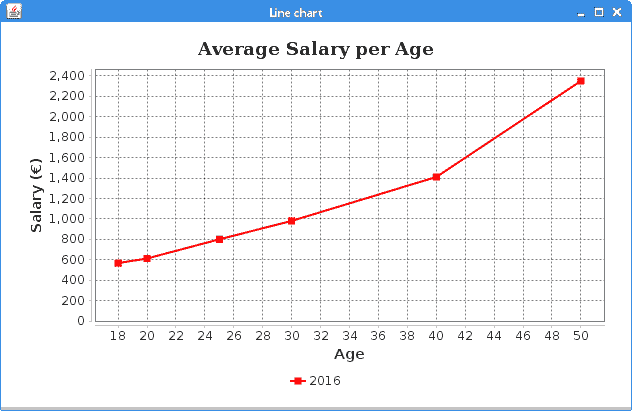
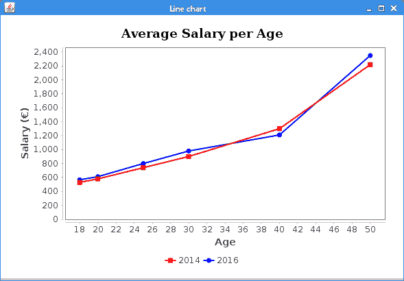
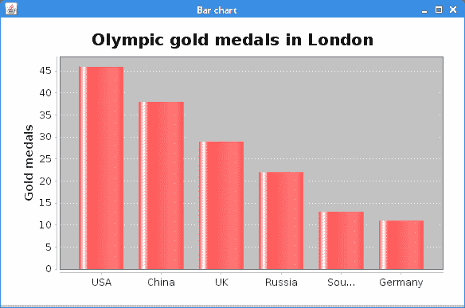
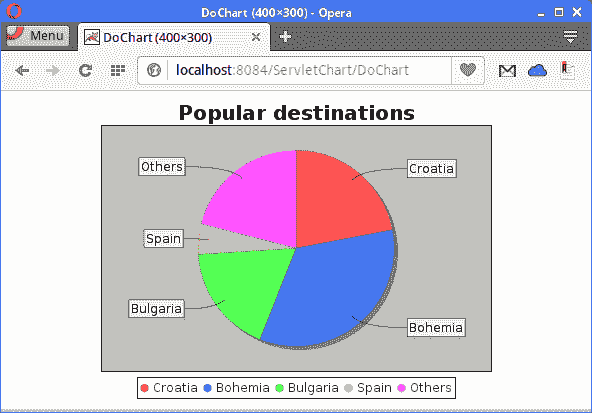

# JFreeChart 教程

原文：http://zetcode.com/java/jfreechart/

在本教程中，我们学习如何使用 JFreeChart。 我们展示了如何创建各种类型的图表。 图表显示在 Swing 应用中，并保存到图像文件中。 我们使用 Java Servlet 在 Web 浏览器中创建和呈现图表，并从 MySQL 数据库检索图表数据。

## JFreeChart 库

图表是一种以简单方式显示信息的图形，通常使用直线和曲线来显示金额。 JFreeChart 是用于创建图表的流行 Java 库。 JFreeChart 允许创建各种交互式和非交互式图表。 我们可以创建折线图，条形图，面积图，散点图，饼图，甘特图和各种专用图，例如风向图或气泡图。

JFreeChart 可以广泛地定制； 它允许修改图表项目的颜色和绘制，图例，线条或标记的样式。 它会自动绘制轴刻度和图例。 图表具有内置功能，可使用鼠标放大。 现有的图表可以通过库在其数据集合上具有的侦听器轻松更新。 它支持多种输出格式，包括 PNG，JPEG，PDF 和 SVG。

JFreeChart 由 David Gilbert 于 2000 年创立。如今，JFreeChart 是 Java 开发人员中使用最广泛的图表库。

## JFreeChart Maven 依赖项

```java
<dependency>
    <groupId>org.jfree</groupId>
    <artifactId>jfreechart</artifactId>
    <version>1.0.19</version>
</dependency>

```

对于我们的项目，我们使用此 Maven 依赖项。

## JFreeChart 折线图

折线图是一种基本类型的图表，它将信息显示为由直线段连接的一系列数据点。 JavaFX 中的折线图是使用`ChartFactory.createXYLineChart()`创建的。

`LineChartEx.java`

```java
package com.zetcode.linechartex;

import java.awt.BasicStroke;
import java.awt.Color;
import java.awt.Font;
import javax.swing.BorderFactory;
import javax.swing.JFrame;
import javax.swing.SwingUtilities;
import org.jfree.chart.ChartFactory;
import org.jfree.chart.ChartPanel;
import org.jfree.chart.JFreeChart;
import org.jfree.chart.axis.NumberAxis;
import org.jfree.chart.block.BlockBorder;
import org.jfree.chart.plot.PlotOrientation;
import org.jfree.chart.plot.XYPlot;
import org.jfree.chart.renderer.xy.XYLineAndShapeRenderer;
import org.jfree.chart.title.TextTitle;
import org.jfree.data.xy.XYDataset;
import org.jfree.data.xy.XYSeries;
import org.jfree.data.xy.XYSeriesCollection;

public class LineChartEx extends JFrame {

    public LineChartEx() {

        initUI();
    }

    private void initUI() {

        XYDataset dataset = createDataset();
        JFreeChart chart = createChart(dataset);
        ChartPanel chartPanel = new ChartPanel(chart);
        chartPanel.setBorder(BorderFactory.createEmptyBorder(15, 15, 15, 15));
        chartPanel.setBackground(Color.white);
        add(chartPanel);

        pack();
        setTitle("Line chart");
        setLocationRelativeTo(null);
        setDefaultCloseOperation(JFrame.EXIT_ON_CLOSE);
    }

    private XYDataset createDataset() {

        XYSeries series = new XYSeries("2016");
        series.add(18, 567);
        series.add(20, 612);
        series.add(25, 800);
        series.add(30, 980);
        series.add(40, 1410);
        series.add(50, 2350);

        XYSeriesCollection dataset = new XYSeriesCollection();
        dataset.addSeries(series);

        return dataset;
    }

    private JFreeChart createChart(XYDataset dataset) {

        JFreeChart chart = ChartFactory.createXYLineChart(
                "Average salary per age", 
                "Age", 
                "Salary (€)", 
                dataset, 
                PlotOrientation.VERTICAL,
                true, 
                true, 
                false 
        );

        XYPlot plot = chart.getXYPlot();

        XYLineAndShapeRenderer renderer = new XYLineAndShapeRenderer();
        renderer.setSeriesPaint(0, Color.RED);
        renderer.setSeriesStroke(0, new BasicStroke(2.0f));

        plot.setRenderer(renderer);
        plot.setBackgroundPaint(Color.white);

        plot.setRangeGridlinesVisible(true);
        plot.setRangeGridlinePaint(Color.BLACK);

        plot.setDomainGridlinesVisible(true);
        plot.setDomainGridlinePaint(Color.BLACK);

        chart.getLegend().setFrame(BlockBorder.NONE);

        chart.setTitle(new TextTitle("Average Salary per Age",
                        new Font("Serif", java.awt.Font.BOLD, 18)
                )
        );

        return chart;

    }

    public static void main(String[] args) {

        SwingUtilities.invokeLater(() -> {
            LineChartEx ex = new LineChartEx();
            ex.setVisible(true);
        });
    }
}

```

在示例中，我们创建了一个折线图，显示每个年龄段的平均工资。

```java
XYSeries series = new XYSeries("2016");
series.add(18, 567);
series.add(20, 612);
series.add(25, 800);
...

```

`XYSeries`表示形式为（x，y）的零个或多个数据项的序列。

```java
XYSeriesCollection dataset = new XYSeriesCollection();
dataset.addSeries(series);

```

该系列将添加到`XYSeriesCollection`中，该`XYSeriesCollection`是可以用作数据集的`XYSeries`对象的集合。

```java
JFreeChart chart = ChartFactory.createXYLineChart(
        "Average salary per age", 
        "Age", 
        "Salary (€)", 
        dataset, 
        PlotOrientation.VERTICAL,
        true, 
        true, 
        false 
);

```

`ChartFactory.createXYLineChart()`创建一个新的折线图。 该方法的参数是：图表标题，X 轴标签，Y 轴标签，数据，绘图方向和三个标志，指示是否显示图例，工具提示和 URL。

```java
XYPlot plot = chart.getXYPlot();

```

我们可以参考该图以对其进行自定义。

```java
XYLineAndShapeRenderer renderer = new XYLineAndShapeRenderer();
renderer.setSeriesPaint(0, Color.RED);
renderer.setSeriesStroke(0, new BasicStroke(2.0f));
plot.setRenderer(renderer);

```

在这里，我们为图表线设置了笔划和颜色。 `XYLineAndShapeRenderer`是将数据点与线连接和/或在每个数据点绘制形状的对象。 渲染器通过`setRenderer()`方法设置。

```java
plot.setBackgroundPaint(Color.white);

```

`setBackgroundPaint()`设置绘图区域的背景颜色。

```java
plot.setRangeGridlinesVisible(true);
plot.setRangeGridlinePaint(Color.BLACK);

plot.setDomainGridlinesVisible(true);
plot.setDomainGridlinePaint(Color.BLACK);

```

我们显示网格线并将其涂成黑色。

```java
chart.getLegend().setFrame(BlockBorder.NONE);

```

我们删除图例周围的边框。

```java
chart.setTitle(new TextTitle("Average Salary per Age",
                new Font("Serif", java.awt.Font.BOLD, 18)
        )
);

```

我们使用新字体创建图表标题。



Figure: Line chart


## 带有两个序列的折线图

在第二个示例中，我们创建具有两个数据序列的折线图。

`LineChartEx2.java`

```java
package com.zetcode.linechartex2;

import java.awt.BasicStroke;
import java.awt.Color;
import java.awt.Font;
import javax.swing.BorderFactory;
import javax.swing.JFrame;
import javax.swing.SwingUtilities;
import org.jfree.chart.ChartFactory;
import org.jfree.chart.ChartPanel;
import org.jfree.chart.JFreeChart;
import org.jfree.chart.block.BlockBorder;
import org.jfree.chart.plot.PlotOrientation;
import org.jfree.chart.plot.XYPlot;
import org.jfree.chart.renderer.xy.XYLineAndShapeRenderer;
import org.jfree.chart.title.TextTitle;
import org.jfree.data.xy.XYDataset;
import org.jfree.data.xy.XYSeries;
import org.jfree.data.xy.XYSeriesCollection;

public class LineChartEx2 extends JFrame {

    public LineChartEx2() {

        initUI();
    }

    private void initUI() {

        XYDataset dataset = createDataset();
        JFreeChart chart = createChart(dataset);
        ChartPanel chartPanel = new ChartPanel(chart);
        chartPanel.setBorder(BorderFactory.createEmptyBorder(15, 15, 15, 15));
        chartPanel.setBackground(Color.white);
        add(chartPanel);

        pack();
        setTitle("Line chart");
        setLocationRelativeTo(null);
        setDefaultCloseOperation(JFrame.EXIT_ON_CLOSE);
    }

    private XYDataset createDataset() {

        XYSeries series1 = new XYSeries("2014");
        series1.add(18, 530);
        series1.add(20, 580);
        series1.add(25, 740);
        series1.add(30, 901);
        series1.add(40, 1300);
        series1.add(50, 2219);

        XYSeries series2 = new XYSeries("2016");
        series2.add(18, 567);
        series2.add(20, 612);
        series2.add(25, 800);
        series2.add(30, 980);
        series2.add(40, 1210);
        series2.add(50, 2350);        

        XYSeriesCollection dataset = new XYSeriesCollection();
        dataset.addSeries(series1);
        dataset.addSeries(series2);

        return dataset;
    }

    private JFreeChart createChart(final XYDataset dataset) {

        JFreeChart chart = ChartFactory.createXYLineChart(
                "Average salary per age", 
                "Age", 
                "Salary (€)", 
                dataset, 
                PlotOrientation.VERTICAL,
                true, 
                true, 
                false
        );

        XYPlot plot = chart.getXYPlot();

        XYLineAndShapeRenderer renderer = new XYLineAndShapeRenderer();

        renderer.setSeriesPaint(0, Color.RED);
        renderer.setSeriesStroke(0, new BasicStroke(2.0f));

        renderer.setSeriesPaint(1, Color.BLUE);
        renderer.setSeriesStroke(1, new BasicStroke(2.0f));        

        plot.setRenderer(renderer);
        plot.setBackgroundPaint(Color.white);

        plot.setRangeGridlinesVisible(false);
        plot.setDomainGridlinesVisible(false);

        chart.getLegend().setFrame(BlockBorder.NONE);

        chart.setTitle(new TextTitle("Average Salary per Age",
                        new Font("Serif", Font.BOLD, 18)
                )
        );

        return chart;
    }

    public static void main(String[] args) {

        SwingUtilities.invokeLater(() -> {
            LineChartEx2 ex = new LineChartEx2();
            ex.setVisible(true);
        });
    }
}

```

该示例绘制具有两个数据系列的折线图。

```java
XYSeries series1 = new XYSeries("2014");
series1.add(18, 530);
series1.add(20, 580);
series1.add(25, 740);
...

```

我们创建第一个系列； 其中包含 2014 年的数据。

```java
XYSeries series2 = new XYSeries("2016");
series2.add(18, 567);
series2.add(20, 612);
series2.add(25, 800);
...

```

创建第二个数据系列； 其中包含 2016 年的数据。

```java
XYSeriesCollection dataset = new XYSeriesCollection();
dataset.addSeries(series1);
dataset.addSeries(series2);

```

通过`addSeries()`方法将系列添加到`XYSeriesCollection`。

```java
renderer.setSeriesPaint(0, Color.RED);
renderer.setSeriesStroke(0, new BasicStroke(2.0f));

renderer.setSeriesPaint(1, Color.BLUE);
renderer.setSeriesStroke(1, new BasicStroke(2.0f)); 

```

一根线涂成红色，另一根线涂成蓝色。

```java
plot.setRangeGridlinesVisible(false);
plot.setDomainGridlinesVisible(false);

```

网格线已关闭。



Figure: Line chart with two series


## 将图表保存到图像

`ChartUtilities`是 JFreeChart 的实用程序方法的集合。 它包括将图表转换为图像格式并创建简单的 HTML 图像映射的方法。

`LineChartToPNGEx.java`

```java
package com.zetcode.linecharttopngex;

import java.io.File;
import java.io.IOException;
import org.jfree.chart.ChartFactory;
import org.jfree.chart.ChartUtilities;
import org.jfree.chart.JFreeChart;
import org.jfree.chart.plot.PlotOrientation;
import org.jfree.data.xy.XYSeries;
import org.jfree.data.xy.XYSeriesCollection;

public class LineChartToPNGEx {

    public static void main(String[] args) throws IOException {

        XYSeries series1 = new XYSeries("2014");
        series1.add(18, 530);
        series1.add(20, 580);
        series1.add(25, 740);
        series1.add(30, 901);
        series1.add(40, 1300);
        series1.add(50, 2219);

        XYSeriesCollection dataset = new XYSeriesCollection();
        dataset.addSeries(series1);

        JFreeChart chart = ChartFactory.createXYLineChart(
                "Average salary per age", 
                "Age", 
                "Salary (€)", 
                dataset, 
                PlotOrientation.VERTICAL,
                true, 
                true, 
                false 
        );

        ChartUtilities.saveChartAsPNG(new File("line_chart.png"), chart, 450, 400);
    }
}

```

该示例创建一个折线图并将其保存到 PNG 文件中。

```java
ChartUtilities.saveChartAsPNG(new File("line_chart.png"), chart, 450, 400);

```

`ChartUtilities.saveChartAsPNG()`将图表保存为 PNG 格式的指定文件。

## JFreeChart 区域图

区域图以图形方式显示随时间变化的定量数据。 在 JFreeChart 中使用`ChartFactory.createAreaChart()`方法创建面积图。

`AreaChartEx.java`

```java
package com.zetcode.areachartex;

import java.awt.Color;
import java.awt.Font;
import javax.swing.BorderFactory;
import javax.swing.JFrame;
import javax.swing.SwingUtilities;
import org.jfree.chart.ChartFactory;
import org.jfree.chart.ChartPanel;
import org.jfree.chart.JFreeChart;
import org.jfree.chart.plot.CategoryPlot;
import org.jfree.chart.plot.PlotOrientation;
import org.jfree.chart.renderer.AreaRendererEndType;
import org.jfree.chart.renderer.category.AreaRenderer;
import org.jfree.chart.title.TextTitle;
import org.jfree.data.category.CategoryDataset;
import org.jfree.data.general.DatasetUtilities;

public class AreaChartEx extends JFrame {

    public AreaChartEx() {

        initUI();
    }

    private void initUI() {

        CategoryDataset dataset = createDataset();

        JFreeChart chart = createChart(dataset);
        ChartPanel chartPanel = new ChartPanel(chart);
        chartPanel.setBorder(BorderFactory.createEmptyBorder(15, 15, 15, 15));
        chartPanel.setBackground(Color.white);
        add(chartPanel);

        pack();
        setTitle("Area chart");
        setLocationRelativeTo(null);
        setDefaultCloseOperation(JFrame.EXIT_ON_CLOSE);
    }

    private CategoryDataset createDataset() {

        double[][] data = new double[][]{
            {82502, 84026, 85007, 86216, 85559, 84491, 87672,
                88575, 89837, 90701}
        };

        CategoryDataset dataset = DatasetUtilities.createCategoryDataset(
                new String[]{"Oil"}, new String[]{"2004", "2005", "2006",
                    "2007", "2008", "2009", "2010", "2011", "2012", "2013"}, 
                data
        );

        return dataset;
    }

    private JFreeChart createChart(CategoryDataset dataset) {

        JFreeChart chart = ChartFactory.createAreaChart(
                "Oil consumption",
                "Time",
                "Thousands bbl/day",
                dataset,
                PlotOrientation.VERTICAL,
                false,
                true,
                true
        );

        CategoryPlot plot = (CategoryPlot) chart.getPlot();
        plot.setForegroundAlpha(0.3f);

        AreaRenderer renderer = (AreaRenderer) plot.getRenderer();
        renderer.setEndType(AreaRendererEndType.LEVEL);

        chart.setTitle(new TextTitle("Oil consumption",
                new Font("Serif", java.awt.Font.BOLD, 18))
        );

        return chart;
    }

    public static void main(String[] args) {

        SwingUtilities.invokeLater(() -> {
            AreaChartEx ex = new AreaChartEx();
            ex.setVisible(true);
        });
    }
}

```

该示例显示了一个区域图，该区域图按年份显示了世界原油消耗量。

```java
double[][] data = new double[][]{
    {82502, 84026, 85007, 86216, 85559, 84491, 87672,
        88575, 89837, 90701}
};

CategoryDataset dataset = DatasetUtilities.createCategoryDataset(
        new String[]{"Oil"}, new String[]{"2004", "2005", "2006",
            "2007", "2008", "2009", "2010", "2011", "2012", "2013"}, 
        data
);

```

使用`DatasetUtilities.createCategoryDataset()`方法创建数据集。 与类别关联的类别数据集值。 在我们的示例中，我们有数年与石油消耗有关。

```java
CategoryPlot plot = (CategoryPlot) chart.getPlot();
plot.setForegroundAlpha(0.3f);

```

我们使用`setForegroundAlpha()`方法使图表透明。

```java
AreaRenderer renderer = (AreaRenderer) plot.getRenderer();
renderer.setEndType(AreaRendererEndType.LEVEL);

```

我们调整图表的结尾。


Figure: Area chart


## JFreeChart 条形图

条形图显示带有矩形条的分组数据，其长度与它们所代表的值成比例。 条形图可以垂直或水平绘制。

`BarChartEx.java`

```java
package com.zetcode.barchartex;

import java.awt.Color;
import javax.swing.BorderFactory;
import javax.swing.JFrame;
import javax.swing.SwingUtilities;
import org.jfree.chart.ChartFactory;
import org.jfree.chart.ChartPanel;
import org.jfree.chart.JFreeChart;
import org.jfree.chart.plot.PlotOrientation;
import org.jfree.data.category.CategoryDataset;
import org.jfree.data.category.DefaultCategoryDataset;

public class BarChartEx extends JFrame {

    public BarChartEx() {

        initUI();
    }

    private void initUI() {

        CategoryDataset dataset = createDataset();

        JFreeChart chart = createChart(dataset);
        ChartPanel chartPanel = new ChartPanel(chart);
        chartPanel.setBorder(BorderFactory.createEmptyBorder(15, 15, 15, 15));
        chartPanel.setBackground(Color.white);
        add(chartPanel);

        pack();
        setTitle("Bar chart");
        setLocationRelativeTo(null);
        setDefaultCloseOperation(JFrame.EXIT_ON_CLOSE);
    }

    private CategoryDataset createDataset() {

        DefaultCategoryDataset dataset = new DefaultCategoryDataset();
        dataset.setValue(46, "Gold medals", "USA");
        dataset.setValue(38, "Gold medals", "China");
        dataset.setValue(29, "Gold medals", "UK");
        dataset.setValue(22, "Gold medals", "Russia");
        dataset.setValue(13, "Gold medals", "South Korea");
        dataset.setValue(11, "Gold medals", "Germany");

        return dataset;
    }

    private JFreeChart createChart(CategoryDataset dataset) {

        JFreeChart barChart = ChartFactory.createBarChart(
                "Olympic gold medals in London",
                "",
                "Gold medals",
                dataset,
                PlotOrientation.VERTICAL,
                false, true, false);

        return barChart;
    }

    public static void main(String[] args) {

        SwingUtilities.invokeLater(() -> {
            BarChartEx ex = new BarChartEx();
            ex.setVisible(true);
        });
    }

}

```

该代码示例使用条形图显示了 2012 年伦敦每个国家/地区的奥运金牌数量。

```java
DefaultCategoryDataset dataset = new DefaultCategoryDataset();
dataset.setValue(46, "Gold medals", "USA");
dataset.setValue(38, "Gold medals", "China");
dataset.setValue(29, "Gold medals", "UK");
dataset.setValue(22, "Gold medals", "Russia");
dataset.setValue(13, "Gold medals", "South Korea");
dataset.setValue(11, "Gold medals", "Germany");

```

我们使用`DefaultCategoryDataset`创建数据集。

```java
JFreeChart barChart = ChartFactory.createBarChart(
        "Olympic gold medals in London",
        "",
        "Gold medals",
        dataset,
        PlotOrientation.VERTICAL,
        false, true, false);

```

使用`ChartFactory.createBarChart()`方法创建条形图。



Figure: Bar chart


## JFreeChart 饼图

饼图是一种圆图，分为多个切片以说明数值比例。 使用 JFreeChart 中的`ChartFactory.createPieChart()`方法创建一个饼图。

`PieChartEx.java`

```java
package com.zetcode.piechartex;

import java.awt.Color;
import javax.swing.BorderFactory;
import javax.swing.JFrame;
import javax.swing.SwingUtilities;
import org.jfree.chart.ChartFactory;
import org.jfree.chart.ChartPanel;
import org.jfree.chart.JFreeChart;
import org.jfree.data.general.DefaultPieDataset;

public class PieChartEx extends JFrame {

    public PieChartEx() {

        initUI();
    }

    private void initUI() {

        DefaultPieDataset dataset = createDataset();

        JFreeChart chart = createChart(dataset);
        ChartPanel chartPanel = new ChartPanel(chart);
        chartPanel.setBorder(BorderFactory.createEmptyBorder(15, 15, 15, 15));
        chartPanel.setBackground(Color.white);
        add(chartPanel);

        pack();
        setTitle("Pie chart");
        setLocationRelativeTo(null);
        setDefaultCloseOperation(JFrame.EXIT_ON_CLOSE);
    }

    private DefaultPieDataset createDataset() {

        DefaultPieDataset dataset = new DefaultPieDataset();
        dataset.setValue("Apache", 52);
        dataset.setValue("Nginx", 31);
        dataset.setValue("IIS", 12);
        dataset.setValue("LiteSpeed", 2);
        dataset.setValue("Google server", 1);
        dataset.setValue("Others", 2);

        return dataset;
    }

    private JFreeChart createChart(DefaultPieDataset dataset) {

        JFreeChart barChart = ChartFactory.createPieChart(
                "Web servers market share",
                dataset,
                false, true, false);

        return barChart;
    }

    public static void main(String[] args) {

        SwingUtilities.invokeLater(() -> {
            PieChartEx ex = new PieChartEx();
            ex.setVisible(true);
        });
    }
}

```

该示例使用饼图来显示 Web 服务器的市场份额。

```java
DefaultPieDataset dataset = new DefaultPieDataset();
dataset.setValue("Apache", 52);
dataset.setValue("Nginx", 31);
dataset.setValue("IIS", 12);
...

```

`DefaultPieDataset`用于创建数据集。

```java
JFreeChart barChart = ChartFactory.createPieChart(
        "Web servers market share",
        dataset,
        false, true, false);

```

使用`ChartFactory.createPieChart()`方法创建一个新的饼图。

## Servlet 中的 JFreeChart

在以下示例中，我们使用 Java servlet 创建饼图。 该图表在 Web 浏览器中呈现。

`DoChart.java`

```java
package com.zetcode.servletchart;

import java.awt.BasicStroke;
import java.awt.Color;
import java.io.IOException;
import java.io.OutputStream;
import javax.servlet.ServletException;
import javax.servlet.annotation.WebServlet;
import javax.servlet.http.HttpServlet;
import javax.servlet.http.HttpServletRequest;
import javax.servlet.http.HttpServletResponse;
import org.jfree.chart.ChartFactory;
import org.jfree.chart.ChartUtilities;
import org.jfree.chart.JFreeChart;
import org.jfree.data.general.DefaultPieDataset;

@WebServlet(name = "DoChart", urlPatterns = {"/DoChart"})
public class DoChart extends HttpServlet {

    @Override
    protected void doGet(HttpServletRequest request, HttpServletResponse response)
            throws ServletException, IOException {

        response.setContentType("image/png");

        OutputStream outputStream = response.getOutputStream();

        JFreeChart chart = getChart();
        int width = 500;
        int height = 350;

        ChartUtilities.writeChartAsPNG(outputStream, chart, width, height);
    }

    public JFreeChart getChart() {

        DefaultPieDataset dataset = new DefaultPieDataset();
        dataset.setValue("Croatia", 22);
        dataset.setValue("Bohemia", 34);
        dataset.setValue("Bulgaria", 18);
        dataset.setValue("Spain", 5);
        dataset.setValue("Others", 21);

        JFreeChart chart = ChartFactory.createPieChart("Popular destinations", 
                dataset, true, false, false);

        chart.setBorderVisible(false);

        return chart;
    }
}

```

`DoChart` Servlet 创建一个饼图并将其发送到客户端。

```java
response.setContentType("image/png");

```

`setContentType()`将内容设置为 PNG 图像。

```java
OutputStream outputStream = response.getOutputStream();

```

使用`getOutputStream()`方法，我们得到一个输出流。 这是我们向其发送数据的隧道。

```java
ChartUtilities.writeChartAsPNG(outputStream, chart, width, height);

```

`ChartUtilities.writeChartAsPNG()`将二进制数据写入输出字符串。



Figure: A pie chart in a browser


## 显示来自 MySQL 数据库的数据

`JDBCCategoryDataset`是对数据库 JDBC 结果集的`CategoryDataset`实现。 通过使用字符串 SQL 查询调用`executeQuery()`来填充数据集。

`medals.sql`

```java
DROP TABLE IF EXISTS GoldMedalsLondon;

CREATE TABLE GoldMedalsLondon (
  Id int(11) NOT NULL AUTO_INCREMENT,
  Country text,
  Medals int(11) DEFAULT NULL,
  PRIMARY KEY (Id)
) ENGINE=InnoDB AUTO_INCREMENT=7 DEFAULT CHARSET=latin1;

LOCK TABLES GoldMedalsLondon WRITE;
INSERT INTO GoldMedalsLondon VALUES (1,'USA',46),(2,'China',38),(3,'UK',29),
  (4,'Russia',22),(5,'South Korea',13),(6,'Germany',11);
UNLOCK TABLES;

```

我们将这些数据存储在 MySQL 数据库表中。

```java
mysql> SELECT * FROM GoldMedalsLondon;
+----+-------------+--------+
| Id | Country     | Medals |
+----+-------------+--------+
|  1 | USA         |     46 |
|  2 | China       |     38 |
|  3 | UK          |     29 |
|  4 | Russia      |     22 |
|  5 | South Korea |     13 |
|  6 | Germany     |     11 |
+----+-------------+--------+
6 rows in set (0.00 sec)

```

我们使用`mysql`工具显示数据。

`MySQLChartEx.java`

```java
package com.zetcode.mysqlchartex;

import java.io.File;
import java.io.IOException;
import java.sql.Connection;
import java.sql.DriverManager;
import java.sql.SQLException;
import org.jfree.chart.ChartFactory;
import org.jfree.chart.ChartUtilities;
import org.jfree.chart.JFreeChart;
import org.jfree.chart.plot.PlotOrientation;
import org.jfree.data.jdbc.JDBCCategoryDataset;

public class MySQLChartEx {

    private static JDBCCategoryDataset dataset;

    public static void main(String[] args) throws IOException, SQLException {

        Connection con = null;

        String url = "jdbc:mysql://localhost:3306/testdb";
        String user = "testuser";
        String password = "test623";

        try {

            con = DriverManager.getConnection(url, user, password);
            dataset = new JDBCCategoryDataset(con);
            dataset.executeQuery("SELECT Country, Medals FROM GoldMedalsLondon");

        } finally {

            if (con != null) {
                con.close();
            }
        }

        JFreeChart barChart = ChartFactory.createBarChart(
                "Olympic Gold medals in London",
                "",
                "Gold medals",
                dataset,
                PlotOrientation.VERTICAL,
                false, true, false);

        ChartUtilities.saveChartAsPNG(new File("medals.png"), barChart, 450, 400);
    }
}

```

该示例从 MySQL 表检索数据，创建条形图，然后将其保存到 PNG 图像中。

```java
con = DriverManager.getConnection(url, user, password);
dataset = new JDBCCategoryDataset(con);

```

`JDBCCategoryDataset`已创建； 它以数据库连接为参数。

```java
dataset.executeQuery("SELECT Country, Medals FROM GoldMedalsLondon");

```

`executeQuery()`通过针对现有数据库连接执行提供的查询来填充数据集。 SQL 查询必须至少返回两列。 第一列是类别名称，其余列是值。

```java
JFreeChart barChart = ChartFactory.createBarChart(
        "Olympic Gold medals in London",
        "",
        "Gold medals",
        dataset,
        PlotOrientation.VERTICAL,
        false, true, false);

```

条形图已创建。

```java
ChartUtilities.saveChartAsPNG(new File("medals.png"), barChart, 450, 400);

```

条形图通过`ChartUtilities.saveChartAsPNG()`方法保存到 PNG 文件中。

本教程专门针对 JFreeChart 库。 您可能也对相关教程感兴趣： [Java Swing 教程](/tutorials/javaswingtutorial/)， [Java 2D 教程](/gfx/java2d/)， [Java PDFBox 教程](/java/pdfbox/)或 [Java 教程](/lang/java/)。 也可以在 JavaFX 中创建[图表。](/gui/javafx/charts)