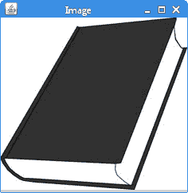
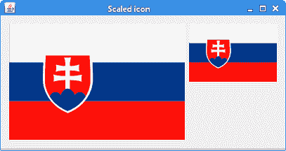
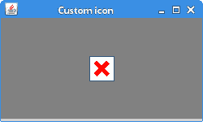
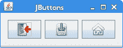
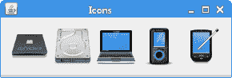
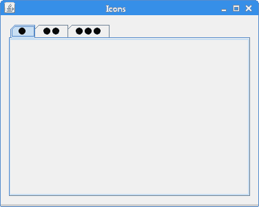

# `ImageIcon`教程

原文：http://zetcode.com/java/imageicon/

在本教程中，我们将使用`ImageIcon`。 我们将绘制一个图标，缩放一个图标，创建一个自定义图标，并将图标放入各种 Swing 组件中。

## `ImageIcon`

`Icon`是固定大小的小图片，通常用于装饰组件。 `ImageIcon`是`Icon`界面的实现，可从图像绘制图标。 可以从 URL，文件名或字节数组创建图像。

```java
paintIcon(Component c, Graphics g, int x, int y)

```

`Icon's` `paintIcon()`方法在指定位置绘制图标。

## `ImageIcon`构造函数

`ImageIcon`具有多个构造函数，包括：

*   `ImageIcon(byte[] imageData)`-从字节数组创建`ImageIcon`。
*   `ImageIcon(Image image`）—从图像对象创建`ImageIcon`。
*   `ImageIcon(String filename)`-创建一个`ImageIcon`指定的文件。
*   `ImageIcon(URL location)`-从指定的 URL 创建一个`ImageIcon`。

`ImageIcon`可以处理 PNG，JPEG 和 GIF 图像。 如果要使用 BMP 或 ICO 图像，可以使用 image4j 库。

## 绘制图标

在第一个示例中，我们将在面板上绘制一个图标。

`PaintingIconEx.java`

```java
package com.zetcode;

import java.awt.Container;
import java.awt.Dimension;
import java.awt.EventQueue;
import java.awt.Graphics;
import javax.swing.GroupLayout;
import javax.swing.ImageIcon;
import javax.swing.JComponent;
import javax.swing.JFrame;
import javax.swing.JPanel;

class DrawingPanel extends JPanel {

    private ImageIcon icon;

    public DrawingPanel() {

        loadImage();
        initPanel();
    }

    private void loadImage() {

        icon = new ImageIcon("book.jpg");
    }

    private void initPanel() {

        int w = icon.getIconWidth();
        int h = icon.getIconHeight();
        setPreferredSize(new Dimension(w, h));
    }    

    @Override
    public void paintComponent(Graphics g) {
        super.paintComponent(g);

        icon.paintIcon(this, g, 0, 0);
    }
}

public class PaintingIconEx extends JFrame {

    public PaintingIconEx() {

        initUI();
    }

    private void initUI() {

        DrawingPanel dpnl = new DrawingPanel();

        createLayout(dpnl);

        setTitle("Image");
        setLocationRelativeTo(null);
        setDefaultCloseOperation(JFrame.EXIT_ON_CLOSE);
    }

    private void createLayout(JComponent... arg) {

        Container pane = getContentPane();
        GroupLayout gl = new GroupLayout(pane);
        pane.setLayout(gl);

        gl.setHorizontalGroup(gl.createSequentialGroup()
                .addComponent(arg[0])
        );

        gl.setVerticalGroup(gl.createParallelGroup()
                .addComponent(arg[0])
        );

        pack();
    }

    public static void main(String[] args) {

        EventQueue.invokeLater(() -> {
            JFrame ex = new PaintingIconEx();
            ex.setVisible(true);
        });
    }
}

```

该示例将文件系统中的图像加载到`ImageIcon`中并将其绘制在`JPanel`组件上。

```java
private void loadImage() {

    icon = new ImageIcon("book.jpg");
}

```

我们将 JPG 图像加载到`ImageIcon`中。 该图像位于项目根目录中。

```java
private void initPanel() {

    int w = icon.getIconWidth();
    int h = icon.getIconHeight();
    setPreferredSize(new Dimension(w, h));
}

```

在`initPanel()`方法中，我们使用`getIconWidth()`和`getIconHeight()`方法确定图标的宽度和高度。 我们设置面板的首选大小以匹配图标大小。

```java
@Override
public void paintComponent(Graphics g) {
    super.paintComponent(g);

    icon.paintIcon(this, g, 0, 0);
}

```

在`paintComponent()`方法中，我们使用`paintIcon()`方法在面板上绘制图标。



Figure: Painting icon


## 缩放图像

以下示例显示了缩放图像的简单方法。

`ImageIconScaleEx.java`

```java
package com.zetcode;

import java.awt.Container;
import java.awt.EventQueue;
import java.awt.Image;
import javax.swing.GroupLayout;
import javax.swing.ImageIcon;
import javax.swing.JComponent;
import javax.swing.JFrame;
import static javax.swing.JFrame.EXIT_ON_CLOSE;
import javax.swing.JLabel;

public class ImageIconScaleEx extends JFrame {

    public ImageIconScaleEx() {

        initUI();
    }

    private void initUI() {

        ImageIcon originalIcon = new ImageIcon("slovakia.png");
        JLabel originalLabel = new JLabel(originalIcon);

        int width = originalIcon.getIconWidth() / 2;
        int height = originalIcon.getIconHeight() / 2;

        Image scaled = scaleImage(originalIcon.getImage(), width, height);

        ImageIcon scaledIcon = new ImageIcon(scaled);

        JLabel newLabel = new JLabel(scaledIcon);

        createLayout(originalLabel, newLabel);

        setTitle("Scaled icon");
        setLocationRelativeTo(null);
        setDefaultCloseOperation(EXIT_ON_CLOSE);
    }

    private Image scaleImage(Image image, int w, int h) {

        Image scaled = image.getScaledInstance(w, h, Image.SCALE_SMOOTH);

        return scaled;
    }

    private void createLayout(JComponent... arg) {

        Container pane = getContentPane();
        GroupLayout gl = new GroupLayout(pane);
        pane.setLayout(gl);

        gl.setAutoCreateContainerGaps(true);
        gl.setAutoCreateGaps(true);

        gl.setHorizontalGroup(gl.createSequentialGroup()
                .addComponent(arg[0])
                .addComponent(arg[1])
        );

        gl.setVerticalGroup(gl.createParallelGroup()
                .addComponent(arg[0])
                .addComponent(arg[1])
        );

        pack();
    }

    public static void main(String[] args) {

        EventQueue.invokeLater(() -> {
            ImageIconScaleEx ex = new ImageIconScaleEx();
            ex.setVisible(true);
        });
    }
}  

```

窗口上显示了两个图像：原始图像及其旁边的缩放图像。

```java
ImageIcon originalIcon = new ImageIcon("slovakia.png");

```

我们将 PNG 图像读取到`ImageIcon`中。 该图像位于项目根目录中。

```java
int width = originalIcon.getIconWidth() / 2;
int height = originalIcon.getIconHeight() / 2;

```

我们使用`getIconWidth()`和`getIconHeight()`方法获得原始图像的宽度和高度。

```java
Image scaled = scaleImage(originalIcon.getImage(), width, height);

```

我们将图标的`Image`，其 with 和 height 传递给`scaleImage()`方法，在其中执行缩放操作。

```java
private Image scaleImage(Image image, int w, int h) {

    Image scaled = image.getScaledInstance(w, h, Image.SCALE_SMOOTH);

    return scaled;
}

```

`getScaledInstance()`创建`Image`的缩放版本。 我们使用`Image.SCALE_SMOOTH`缩放操作，该操作对图像平滑度的优先级高于缩放速度。

```java
ImageIcon scaledIcon = new ImageIcon(scaled);

JLabel newLabel = new JLabel(scaledIcon);

```

我们从`Image`创建一个`ImageIcon`，并将其传递给`JLabel`组件。



Figure: Scaling image


## 自定义图标

Swing 绘画 API 也可以用于创建自定义图标。 图形上下文将传递给`paintIcon()`方法。

`CustomIconEx.java`

```java
package com.zetcode;

import java.awt.BasicStroke;
import java.awt.Color;
import java.awt.Component;
import java.awt.EventQueue;
import java.awt.Graphics;
import java.awt.Graphics2D;
import javax.swing.Icon;
import javax.swing.JFrame;
import javax.swing.JLabel;

class MissingIcon implements Icon {

    private final int WIDTH = 32;
    private final int HEIGHT = 32;

    private final BasicStroke stroke = new BasicStroke(5);

    @Override
    public void paintIcon(Component c, Graphics g, int x, int y) {

        doDrawing(g, x, y);
    }

    public void doDrawing(Graphics g, int x, int y) {

        Graphics2D g2d = (Graphics2D) g.create();

        g2d.setColor(Color.white);
        g2d.fillRect(x + 1, y + 1, WIDTH - 2, HEIGHT - 2);

        g2d.setColor(Color.darkGray);
        g2d.drawRect(x + 1, y + 1, WIDTH - 2, HEIGHT - 2);

        g2d.setColor(Color.red);

        g2d.setStroke(stroke);
        g2d.drawLine(x + 10, y + 10, x + WIDTH - 10, y + HEIGHT - 10);
        g2d.drawLine(x + 10, y + HEIGHT - 10, x + WIDTH - 10, y + 10);

        g2d.dispose();
    }

    @Override
    public int getIconWidth() {
        return WIDTH;
    }

    @Override
    public int getIconHeight() {
        return HEIGHT;
    }
}

class MyLabel extends JLabel {

    public MyLabel(Icon icon) {
        super(icon);
    }

    @Override
    public boolean isOpaque() {
        return true;
    }
}

public class CustomIconEx extends JFrame {

    public CustomIconEx() {

        initUI();
    }

    private void initUI() {

        JLabel lbl = new MyLabel(new MissingIcon());
        lbl.setBackground(Color.gray);
        add(lbl);

        setSize(250, 150);
        setTitle("Custom icon");
        setLocationRelativeTo(null);
        setDefaultCloseOperation(JFrame.EXIT_ON_CLOSE);
    }

    public static void main(String[] args) {

        EventQueue.invokeLater(() -> {
            CustomIconEx ex = new CustomIconEx();
            ex.setVisible(true);
        });
    }
}

```

该示例创建一个缺少的自定义图标，并在带有`JLabel`的窗口上显示该图标。

```java
class MissingIcon implements Icon {

```

要创建自定义图标，我们实现`Icon`界面。

```java
@Override
public int getIconWidth() {
    return WIDTH;
}

@Override
public int getIconHeight() {
    return HEIGHT;
}

```

我们重写`getIconWidth()`和`getIconHeight()`方法，它们确定图标的大小。

```java
@Override
public void paintIcon(Component c, Graphics g, int x, int y) {

    doDrawing(g, x, y);
}

```

我们覆盖了`paintIcon()`方法，在该方法中绘制了图标。 `Graphics`对象提供了许多绘制 2D 形状并获取有关应用图形环境的信息的方法。

```java
public void doDrawing(Graphics g, int x, int y) {

    Graphics2D g2d = (Graphics2D) g.create();

    g2d.setColor(Color.white);
    g2d.fillRect(x + 1, y + 1, WIDTH - 2, HEIGHT - 2);

    g2d.setColor(Color.darkGray);
    g2d.drawRect(x + 1, y + 1, WIDTH - 2, HEIGHT - 2);

    g2d.setColor(Color.red);

    g2d.setStroke(stroke);
    g2d.drawLine(x + 10, y + 10, x + WIDTH - 10, y + HEIGHT - 10);
    g2d.drawLine(x + 10, y + HEIGHT - 10, x + WIDTH - 10, y + 10);

    g2d.dispose();
}

```

在`doDrawing()`方法内部，我们绘制了图标。 该过程与`paintComponent()`方法中的绘制相同。 `Graphics2D`类扩展了`Graphics`类，以提供对几何，坐标转换，颜色管理和文本布局的更复杂的控制。

```java
class MyLabel extends JLabel {

    public MyLabel(Icon icon) {
        super(icon);
    }

    @Override
    public boolean isOpaque() {
        return true;
    }
}

```

我们有一个自定义的`MyLabel`组件。 我们将其设为不透明，即标签具有背景。

```java
JLabel lbl = new MyLabel(new MissingIcon());

```

图标设置为标签组件。



Figure: Missing custom icon


## `ImageIcon`按钮

可以将`ImageIcons`放置在`JButton`组件上。

`ImageIconButtonsEx.java`

```java
package com.zetcode;

import java.awt.Container;
import java.awt.EventQueue;
import javax.swing.GroupLayout;
import javax.swing.ImageIcon;
import javax.swing.JButton;
import javax.swing.JComponent;
import javax.swing.JFrame;
import static javax.swing.JFrame.EXIT_ON_CLOSE;

public class ImageIconButtonsEx extends JFrame {

    public ImageIconButtonsEx() {

        initUI();
    }

    private void initUI() {

        ImageIcon quitIcon = new ImageIcon("quit.png");
        ImageIcon saveIcon = new ImageIcon("save.png");
        ImageIcon homeIcon = new ImageIcon("home.png");

        JButton quitBtn = new JButton(quitIcon);
        JButton saveBtn = new JButton(saveIcon);
        JButton homeBtn = new JButton(homeIcon);

        createLayout(quitBtn, saveBtn, homeBtn);

        setTitle("JButtons");
        setLocationRelativeTo(null);
        setDefaultCloseOperation(EXIT_ON_CLOSE);
    }

    private void createLayout(JComponent... arg) {

        Container pane = getContentPane();
        GroupLayout gl = new GroupLayout(pane);
        pane.setLayout(gl);

        gl.setAutoCreateContainerGaps(true);
        gl.setAutoCreateGaps(true);

        gl.setHorizontalGroup(gl.createSequentialGroup()
                .addComponent(arg[0])
                .addComponent(arg[1])
                .addComponent(arg[2])
        );

        gl.setVerticalGroup(gl.createParallelGroup()
                .addComponent(arg[0])
                .addComponent(arg[1])
                .addComponent(arg[2])
        );

        gl.linkSize(arg[0], arg[1], arg[2]);

        pack();
    }

    public static void main(String[] args) {

        EventQueue.invokeLater(() -> {
            ImageIconButtonsEx ex = new ImageIconButtonsEx();
            ex.setVisible(true);
        });
    }
}

```

我们有三个按钮。 它们每个都显示一个`ImageIcon`。

```java
ImageIcon quitIcon = new ImageIcon("quit.png");
ImageIcon saveIcon = new ImageIcon("save.png");
ImageIcon homeIcon = new ImageIcon("home.png");

```

创建了三个`ImageIcons`。 我们将文件名传递给每个构造函数。 PNG 文件位于项目根目录中。

```java
JButton quitBtn = new JButton(quitIcon);
JButton saveBtn = new JButton(saveIcon);
JButton homeBtn = new JButton(homeIcon);

```

`JButton`组件接受`ImageIcon`作为参数。



Figure: Image buttons


## `JFrame`图标

`JFrame`组件可以在其标题栏中显示一个图标。 它显示在标题栏的左侧。

`FrameIconEx.java`

```java
package com.zetcode;

import java.awt.EventQueue;
import javax.swing.ImageIcon;
import javax.swing.JFrame;
import static javax.swing.JFrame.EXIT_ON_CLOSE;

public class FrameIconEx extends JFrame {

    public FrameIconEx() {

        initUI();
    }

    private void initUI() {

        ImageIcon webIcon = new ImageIcon("web.png");

        setIconImage(webIcon.getImage());

        setTitle("Icon");
        setSize(300, 200);
        setLocationRelativeTo(null);
        setDefaultCloseOperation(EXIT_ON_CLOSE);
    }

    public static void main(String[] args) {

        EventQueue.invokeLater(() -> {
            FrameIconEx ex = new FrameIconEx();
            ex.setVisible(true);
        });
    }
}

```

`web.png`是一个很小的 22x22px 图像文件。

```java
ImageIcon webIcon = new ImageIcon("web.png");

```

我们从位于项目根目录中的 PNG 文件创建一个`ImageIcon`。

```java
setIconImage(webIcon.getImage());

```

`setIconImage()`设置要显示为该窗口图标的图像。 `getImage()`返回图标的`Image`。


Figure: Icon


## `JLabel`中的`ImageIcon`

在下面的示例中，我们将`ImageIcons`放入`JLabel`组件中。

`ImageIconLabelEx.java`

```java
package com.zetcode;

import java.awt.Container;
import java.awt.EventQueue;
import javax.swing.GroupLayout;
import javax.swing.ImageIcon;
import javax.swing.JComponent;
import javax.swing.JFrame;
import static javax.swing.JFrame.EXIT_ON_CLOSE;
import javax.swing.JLabel;

public class ImageIconLabelEx extends JFrame {

    public ImageIconLabelEx() {

        initUI();
    }

    private void initUI() {

        JLabel lbl1 = new JLabel(new ImageIcon("cpu.png"));
        JLabel lbl2 = new JLabel(new ImageIcon("drive.png"));
        JLabel lbl3 = new JLabel(new ImageIcon("laptop.png"));
        JLabel lbl4 = new JLabel(new ImageIcon("player.png"));
        JLabel lbl5 = new JLabel(new ImageIcon("pda.png"));

        createLayout(lbl1, lbl2, lbl3, lbl4, lbl5);

        setTitle("Icons");
        setLocationRelativeTo(null);
        setDefaultCloseOperation(EXIT_ON_CLOSE);
    }

    private void createLayout(JComponent... arg) {

        Container pane = getContentPane();
        GroupLayout gl = new GroupLayout(pane);
        pane.setLayout(gl);        

        gl.setAutoCreateContainerGaps(true);
        gl.setAutoCreateGaps(true);

        gl.setHorizontalGroup(gl.createSequentialGroup()
                .addComponent(arg[0])
                .addComponent(arg[1])
                .addComponent(arg[2])
                .addComponent(arg[3])
                .addComponent(arg[4])
        );

        gl.setVerticalGroup(gl.createParallelGroup()
                .addComponent(arg[0])
                .addComponent(arg[1])
                .addComponent(arg[2])
                .addComponent(arg[3])
                .addComponent(arg[4])
        );

        pack();
    }    

    public static void main(String[] args) {

        EventQueue.invokeLater(() -> {
            ImageIconLabelEx ex = new ImageIconLabelEx();
            ex.setVisible(true);
        });
    }
}

```

项目根目录中有五个 PNG 文件。 它们显示在`JLabel`组件的窗口中。

```java
JLabel lbl1 = new JLabel(new ImageIcon("cpu.png"));
JLabel lbl2 = new JLabel(new ImageIcon("drive.png"));
JLabel lbl3 = new JLabel(new ImageIcon("laptop.png"));
JLabel lbl4 = new JLabel(new ImageIcon("player.png"));
JLabel lbl5 = new JLabel(new ImageIcon("pda.png"));

```

`JLabel`具有一个构造函数，该构造函数将`ImageIcon`作为参数。



Figure: Icons in labels


## `JTabbedPane`中的`ImageIcon`

`JTabbedPane`是 Swing 组件，允许用户通过单击选项卡在一组组件之间切换。 这些选项卡可以包含`ImageIcons`。

`ImageIconTabbedPaneEx`

```java
package com.zetcode;

import java.awt.Container;
import java.awt.Dimension;
import java.awt.EventQueue;
import javax.swing.GroupLayout;
import javax.swing.ImageIcon;
import javax.swing.JComponent;
import javax.swing.JFrame;
import static javax.swing.JFrame.EXIT_ON_CLOSE;
import javax.swing.JPanel;
import javax.swing.JTabbedPane;

public class ImageIconTabbedPaneEx extends JFrame {

    public ImageIconTabbedPaneEx() {

        initUI();
    }

    private void initUI() {

        ImageIcon icon1 = new ImageIcon("dot1.png");
        ImageIcon icon2 = new ImageIcon("dot2.png");
        ImageIcon icon3 = new ImageIcon("dot3.png");

        JTabbedPane tbp = new JTabbedPane();
        tbp.setPreferredSize(new Dimension(350, 250));

        tbp.addTab("", icon1, new JPanel());
        tbp.addTab("", icon2, new JPanel());
        tbp.addTab("", icon3, new JPanel());

        createLayout(tbp);

        setTitle("Icons");
        setLocationRelativeTo(null);
        setDefaultCloseOperation(EXIT_ON_CLOSE);
    }

    private void createLayout(JComponent... arg) {

        Container pane = getContentPane();
        GroupLayout gl = new GroupLayout(pane);
        pane.setLayout(gl);        

        gl.setAutoCreateContainerGaps(true);
        gl.setAutoCreateGaps(true);

        gl.setHorizontalGroup(gl.createSequentialGroup()
                .addComponent(arg[0])
        );

        gl.setVerticalGroup(gl.createParallelGroup()
                .addComponent(arg[0])
        );

        pack();
    }    

    public static void main(String[] args) {

        EventQueue.invokeLater(() -> {
            ImageIconTabbedPaneEx ex = new ImageIconTabbedPaneEx();
            ex.setVisible(true);
        });
    }
}  

```

该示例在`JTabbedPane`组件的选项卡中显示`ImageIcons`。

```java
ImageIcon icon1 = new ImageIcon("dot1.png");

```

`ImageIcon`已创建。

```java
JTabbedPane tbp = new JTabbedPane();

```

`JTabbedPane`已创建。

```java
tbp.addTab("", icon1, new JPanel());

```

`addTab()`方法的第二个参数是`ImageIcon`。



Figure: JTabbedPane icons


本教程专门针对 Java `ImageIcon`。 您可能也对相关教程感兴趣：[用 Java 读写 ICO 图像](/articles/javaico/)， [Java Swing 教程](/tutorials/javaswingtutorial/)， [Java 教程](/lang/java/)，[用 Java 显示图像](/java/displayimage/) 。