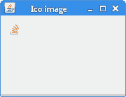

# 用 Java 读写 ICO 图像

原文：http://zetcode.com/articles/javaico/

在本文中，我们展示了如何在 Java 中读取和写入 ICO 图像。

ICO 是在 Microsoft Windows 上的图标中使用的图像文件格式。 ICO 文件包含一个或多个具有多种尺寸和颜色深度的小图像，因此可以适当缩放它们。 ICO 文件也经常用于网络上的收藏夹图标。

要使用 Java 读写 ICO 文件，我们使用 image4j 图片库。 可以从 [image4j.sourceforge.net](http://image4j.sourceforge.net) 下载用于 image4j 的 JAR。

## 将 PNG 转换为 ICO

在以下示例中，我们将 PNG 图像转换为 ICO 图像。

`ConvertToIcoEx.java`

```
package com.zetcode;

import java.awt.image.BufferedImage;
import java.io.File;
import java.io.IOException;
import javax.imageio.ImageIO;
import net.sf.image4j.codec.ico.ICOEncoder;

public class ConvertToIcoEx {

    public static void main(String[] args) throws IOException {

        BufferedImage bi = ImageIO.read(new File("laptop.png"));

        ICOEncoder.write(bi, new File("laptop.ico"));
    }
}

```

我们使用`ImageIO.read()`方法将 PNG 文件读入`BufferedImage`。 `BufferedImage`是存储在内存中的像素矩形。 它是 Swing 中最重要的图像类型之一。

```
ICOEncoder.write(bi, new File("laptop.ico"));

```

`ICOEncoder.write()`将 PNG 转换为 ICO 文件。

## 将 ICO 转换为 PNG

在第二个示例中，我们将 ICO 图像转换为 PNG 图像。

`ConvertIcoToPngEx.java`

```
package com.zetcode;

import java.awt.image.BufferedImage;
import java.io.File;
import java.io.IOException;
import java.util.List;
import javax.imageio.ImageIO;
import net.sf.image4j.codec.ico.ICODecoder;

public class ConvertIcoToPngEx {

    public static void main(String[] args) throws IOException {

        List<BufferedImage> images = ICODecoder.read(new File("favicon.ico"));

        ImageIO.write(images.get(0), "png", new File("favicon.png"));
    }
}

```

我们使用`ICODecoder.read()`方法将 ICO 文件读入`BufferedImage`。 通过`ImageIO.write()`方法将`BufferedImage`写入 PNG 文件。

## 下载 ICO 文件

在下一个示例中，我们从网站下载 ICO 文件，将其转换为`ImageIcon`，并在`JLabel`组件中显示。

`DownloadIcoEx.java`

```
package com.zetcode;

import java.awt.Container;
import java.awt.EventQueue;
import java.awt.image.BufferedImage;
import java.io.IOException;
import java.io.InputStream;
import java.net.MalformedURLException;
import java.net.URL;
import java.util.List;
import java.util.logging.Level;
import java.util.logging.Logger;
import javax.swing.GroupLayout;
import javax.swing.ImageIcon;
import javax.swing.JComponent;
import javax.swing.JFrame;
import static javax.swing.JFrame.EXIT_ON_CLOSE;
import javax.swing.JLabel;
import net.sf.image4j.codec.ico.ICODecoder;

/**
 * The example downloads a favicon and displays it in a JLabel.
 *
 * @author Jan Bodnar
 * @website zetcode.com
 */
public class DownloadIcoEx extends JFrame {

    public DownloadIcoEx() {

        initUI();
    }

    private void initUI() {

        List<BufferedImage> images = readImage();

        ImageIcon icon = new ImageIcon(images.get(0));
        JLabel lbl = new JLabel(icon);

        createLayout(lbl);

        setTitle("Ico image");
        setLocationRelativeTo(null);
        setDefaultCloseOperation(EXIT_ON_CLOSE);
    }

    private List<BufferedImage> readImage() {

        List<BufferedImage> images = null;

        try {
            String path = "http://stackoverflow.com/favicon.ico";
            InputStream istr = new URL(path).openStream();
            images = ICODecoder.read(istr);

        } catch (MalformedURLException ex) {
            Logger.getLogger(DownloadIcoEx.class.getName()).log(Level.SEVERE, null, ex);
        } catch (IOException ex) {
            Logger.getLogger(DownloadIcoEx.class.getName()).log(Level.SEVERE, null, ex);
        }

        return images;
    }

    private void createLayout(JComponent... arg) {

        Container pane = getContentPane();
        GroupLayout gl = new GroupLayout(pane);
        pane.setLayout(gl);

        gl.setAutoCreateContainerGaps(true);

        gl.setHorizontalGroup(gl.createSequentialGroup()
                .addComponent(arg[0])
                .addGap(150)
        );

        gl.setVerticalGroup(gl.createParallelGroup()
                .addComponent(arg[0])
                .addGap(100)
        );

        pack();
    }

    public static void main(String[] args) {

        EventQueue.invokeLater(() -> {
            DownloadIcoEx ex = new DownloadIcoEx();
            ex.setVisible(true);
        });
    }
}

```

该示例从 StackOverflow 网站下载了一个图标。

```
String path = "http://stackoverflow.com/favicon.ico";
InputStream istr = new URL(path).openStream();

```

我们从 URL 创建一个`InputStream`。

```
images = ICODecoder.read(istr);

```

`ICODecoder.read()`从`InputStream`读取到`BufferedImage`

```
ImageIcon icon = new ImageIcon(images.get(0));

```

从`BufferedImage`创建一个`ImageIcon`。

```
JLabel lbl = new JLabel(icon);

```

将`ImageIcon`放入`JLabel`。

<figure>

<figcaption>Figure: Favicon</figcaption>

</figure>

在本文中，我们已使用 image4j 库读取和写入 ICO 图像。

您可能也对以下相关教程感兴趣： [Java 教程](/lang/java/)， [Java Swing 教程](/tutorials/javaswingtutorial/)或 [Android 教程](/mob/android/)。