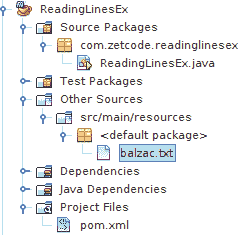

# Google Guava 简介

原文：http://zetcode.com/articles/guava/

本教程是 Guava 库的简介。 我们看一下 Guava 库的一些有趣的功能。

## Guava 

Google Guava 是 Java 通用库的开源集合，主要由 Google 工程师开发。 Google 有许多 Java 项目。 Guava 是解决那些项目中遇到的许多常见问题的解决方案，其中包括集合，数学，函数习语，输入&输出和字符串等领域。

Guava 的某些功能已经包含在 JDK 中。 例如`String.join()`方法已引入 JDK 8。

## Guava  Maven 依赖

在我们的示例中，我们使用以下 Maven 依赖关系。

```java
<dependency>
    <groupId>com.google.guava</groupId>
    <artifactId>guava</artifactId>
    <version>19.0</version>
</dependency>

```

## Guava 初始化集合

Guava 允许在一行中初始化集合。 JDK 8 不支持集合字面值。

`InitializeCollectionEx.java`

```java
package com.zetcode.initializecollectionex;

import com.google.common.collect.ImmutableMap;
import com.google.common.collect.Lists;
import java.util.List;
import java.util.Map;

public class InitializeCollectionEx {

    public static void main(String[] args) {

        Map items = ImmutableMap.of("coin", 3, "glass", 4, "pencil", 1);

        items.entrySet()
                .stream()
                .forEach(System.out::println);

        List<String> fruits = Lists.newArrayList("orange", "banana", "kiwi", 
                "mandarin", "date", "quince");

        for (String fruit: fruits) {
            System.out.println(fruit);
        }
    }
}

```

在示例中，我们使用 Guava 的工厂方法创建映射和列表。

```java
Map items = ImmutableMap.of("coin", 3, "glass", 4, "pencil", 1);

```

使用`ImmutableMap.of()`方法创建一个新映射。

```java
List<String> fruits = Lists.newArrayList("orange", "banana", "kiwi", 
        "mandarin", "date", "quince");

```

使用`Lists.newArrayList()`方法创建一个新的字符串列表。

```java
coin=3
glass=4
pencil=1
orange
banana
kiwi
mandarin
date
quince

```

这是示例的输出。

## Guava `MoreObjects.toStringHelper()`

`MoreObjects.toStringHelper()`有助于轻松创建具有一致格式的`toString()`方法，它使我们可以控制所包含的字段。

`Car.java`

```java
package com.zetcode.tostringex.beans;

import com.google.common.base.MoreObjects;

public class Car {

    private long Id;
    private String Name;
    private int Price;

    public Car(long Id, String Name, int Price) {
        this.Id = Id;
        this.Name = Name;
        this.Price = Price;
    }

    public long getId() {
        return Id;
    }

    public void setId(long Id) {
        this.Id = Id;
    }

    public String getName() {
        return Name;
    }

    public void setName(String Name) {
        this.Name = Name;
    }

    public int getPrice() {
        return Price;
    }

    public void setPrice(int Price) {
        this.Price = Price;
    }

   @Override
    public String toString() {
        return MoreObjects.toStringHelper(Car.class)
            .add("id", Id)
            .add("name", Name)
            .add("price", Price)
            .toString();
    }    
}

```

这是一个`Car` bean。 它包含`toString()`方法，该方法给出对象的字符串表示形式。

```java
@Override
public String toString() {
    return MoreObjects.toStringHelper(Car.class)
        .add("id", Id)
        .add("name", Name)
        .add("price", Price)
        .toString();
}  

```

除了使用字符串之外，我们还提供了`MoreObjects.toStringHelper()`方法更简洁的解决方案。

`ToStringEx.java`

```java
package com.zetcode.tostringex;

import com.zetcode.tostringex.beans.Car;

public class ToStringEx {

    public static void main(String[] args) {

        Car car1 = new Car(1, "Audi", 52642);
        Car car2 = new Car(2, "Mercedes", 57127);
        Car car3 = new Car(3, "Skoda", 9000);

        System.out.println(car1);
        System.out.println(car2);
        System.out.println(car3);
    }
}

```

我们创建三个汽车对象，并将它们传递给`System.out.println()`方法。 该方法调用对象的`toString()`方法。

```java
Car{id=1, name=Audi, price=52642}
Car{id=2, name=Mercedes, price=57127}
Car{id=3, name=Skoda, price=9000}

```

This is the output of the example.

## Guava `FluentIterable`

`FluentIterable`提供了一个强大而简单的 API，可以流畅地操作`Iterable`实例。 它允许我们以各种方式过滤和转换集合。

`Car.java`

```java
package com.zetcode.fluentiterable.beans;

import com.google.common.base.MoreObjects;

public class Car {

    private long Id;
    private String Name;
    private int Price;

    public Car(long Id, String Name, int Price) {
        this.Id = Id;
        this.Name = Name;
        this.Price = Price;
    }

    public long getId() {
        return Id;
    }

    public void setId(long Id) {
        this.Id = Id;
    }

    public String getName() {
        return Name;
    }

    public void setName(String Name) {
        this.Name = Name;
    }

    public int getPrice() {
        return Price;
    }

    public void setPrice(int Price) {
        this.Price = Price;
    }

   @Override
    public String toString() {
        return MoreObjects.toStringHelper(Car.class)
            .add("id", Id)
            .add("name", Name)
            .add("price", Price)
            .toString();
    }    
}

```

在此示例中，我们有一个`Car` bean。

`FluentIterableEx.java`

```java
package com.zetcode.fluentiterable;

import com.google.common.base.Functions;
import com.google.common.base.Predicate;
import com.google.common.collect.FluentIterable;
import com.google.common.collect.Lists;
import com.zetcode.fluentiterable.beans.Car;
import java.util.List;

public class FluentIterableEx {

    public static void main(String[] args) {

        List<Car> cars = Lists.newArrayList(new Car(1, "Audi", 52642),
                new Car(2, "Mercedes", 57127), new Car(3, "Skoda", 9000),
                new Car(4, "Volvo", 29000));

        Predicate<Car> byPrice = car -> car.getPrice() <= 30000;

        List<String> results = FluentIterable.from(cars)
                .filter(byPrice)
                .transform(Functions.toStringFunction())
                .toList();

        System.out.println(results);
    }
}

```

在代码示例中，我们有一个汽车对象列表。 我们通过将列表减少为仅适用于价格低于 30000 辆的汽车来对其进行改造。

```java
List<Car> cars = Lists.newArrayList(new Car(1, "Audi", 52642),
        new Car(2, "Mercedes", 57127), new Car(3, "Skoda", 9000),
        new Car(4, "Volvo", 29000));

```

创建`Car`对象的列表。 JDK 中没有集合字面值。 我们使用 Guava 中的`Lists.newArrayList()`初始化列表。

```java
Predicate<Car> byPrice = car -> car.getPrice() <= 30000;

```

创建了`Predicate`。 谓词是一个返回布尔值的函数。 该谓词确定汽车是否比 30000 便宜。

```java
List<String> results = FluentIterable.from(cars)
        .filter(byPrice)
        .transform(Functions.toStringFunction())
        .toList();

```

从`cars`集合创建一个`FluentIterable`。 谓词函数应用于`FluentIterable`。 检索到的元素将转换为元素列表； 元素是从`toString()`函数返回的字符串。

```java
[Car{id=3, name=Skoda, price=9000}, Car{id=4, name=Volvo, price=29000}]

```

This is the output of the example.

## Guava 谓词

一般而言，谓词是关于正确或错误的陈述。

如果要测试的对象引用不是`null`，则`Predicates.notNull()`返回一个求值为`true`的谓词。

`PredicateEx.java`

```java
package com.zetcode.predicateex;

import com.google.common.base.Predicates;
import com.google.common.collect.Iterables;
import com.google.common.collect.Lists;
import java.util.List;

public class PredicateEx {

    public static void main(String[] args) {

        List<Integer> values = Lists.newArrayList(3, null, 4, 7, 
                8, null, 7);

        Iterable<Integer> filtered = Iterables.filter(values, 
                Predicates.notNull());

        for (Integer i: filtered) {
            System.out.println(i);
        }
    }
}

```

在第一个示例中，我们使用谓词从集合中排除`null`值。

```java
List<Integer> values = Lists.newArrayList(3, null, 4, 7, 
        8, null, 7);

```

使用 Guava 的`Lists.newArrayList()`，我们创建了`Integer`值的列表。 该列表包含两个`nulls`。

```java
Iterable<Integer> filtered = Iterables.filter(values, 
        Predicates.notNull());

```

我们通过应用`Predicates.notNull()`过滤值。 `Iterables.filter`返回一个可迭代的对象。

```java
for (Integer i: filtered) {
    System.out.println(i);
}

```

我们遍历过滤列表并打印其元素。

```java
3
4
7
8
7

```

This is the output of the example.

第二个示例按特定的文本模式过滤集合。 在编程中，谓词通常用于过滤数据。

`PredicateEx2.java`

```java
package com.zetcode.predicateex;

import com.google.common.base.Predicates;
import com.google.common.collect.Collections2;
import com.google.common.collect.Lists;
import java.util.Collection;
import java.util.List;

public class PredicateEx2 {

    public static void main(String[] args) {

        List<String> items = Lists.newArrayList("coin", "book",
                "cup", "purse", "bottle");
        Collection<String> result  = Collections2.filter(items, 
                Predicates.containsPattern("o"));

        for (String item: result) {
            System.out.println(item);
        }
    }
}

```

该代码示例创建一个项目列表，然后按特定模式过滤该列表。

```java
Collection<String> result = Collections2.filter(items, 
        Predicates.containsPattern("o"));

```

`Predicates.containsPattern()`返回一个谓词，该谓词查找包含字符`"o"`的项目。 谓词将传递给`Collections2.filter()`方法。

```java
coin
book
bottle

```

这三个词符合标准。

## Guava `readLines()`

`Files.readLines()`允许一次性读取文件中的所有行。



图：NetBeans 项目结构


该图显示了项目结构在 NetBeans 中的外观。

`balzac.txt`

```java
Honoré de Balzac, original name Honoré Balzac (born May 20, 1799, Tours, 
France—died August 18, 1850, Paris) French literary artist who produced 
a vast number of novels and short stories collectively called 
La Comédie humaine (The Human Comedy). He helped to establish the traditional 
form of the novel and is generally considered to be one of the greatest 
novelists of all time.

```

我们在`src/main/resources`目录中有此文本文件。

`ReadingLinesEx.java`

```java
package com.zetcode.readinglinesex;

import com.google.common.base.Charsets;
import com.google.common.io.Files;
import java.io.File;
import java.io.IOException;
import java.util.List;

public class ReadingLinesEx {

    public static void main(String[] args) throws IOException {

        String fileName = "src/main/resources/balzac.txt";

        List<String> lines = Files.readLines(new File(fileName), 
                Charsets.UTF_8);

        for (String line: lines) {
            System.out.println(line);
        }
    }
}

```

该示例从`balzac.txt`文件读取所有行，并将它们打印到控制台。

```java
String fileName = "src/main/resources/balzac.txt";

```

文件名位于`src/main/resource`目录中。

```java
List<String> lines = Files.readLines(new File(fileName), 
        Charsets.UTF_8);

```

使用`Files.readLines()`方法，我们从`balzac.txt`文件中读取所有行。 这些行存储在字符串列表中。

```java
for (String line: lines) {
    System.out.println(line);
}

```

我们遍历列表并打印其元素。

## 使用 Guava 创建一个新文件

`Files.touch()`方法用于创建新文件或更新现有文件上的时间戳。 该方法类似于 Unix `touch`命令。

`TouchFileEx.java`

```java
package com.zetcode.touchfileex;

import com.google.common.io.Files;
import java.io.File;
import java.io.IOException;

public class TouchFileEx {

    public static void main(String[] args) throws IOException {

        String newFileName = "newfile.txt";

        Files.touch(new File(newFileName));
    }
}

```

该示例在项目的根目录中创建`newfile.txt`。

## 用 Guava 写入文件

`Files.write()`方法将数据写入文件。

`WriteToFileEx.java`

```java
package com.zetcode.writetofileex;

import com.google.common.io.Files;
import java.io.File;
import java.io.IOException;

public class WriteToFileEx {

    public static void main(String[] args) throws IOException {

        String fileName = "fruits.txt";
        File file = new File(fileName);

        String content = "banana, orange, lemon, apple, plum";

        Files.write(content.getBytes(), file);
    }
}

```

该示例将由水果名称组成的字符串写入`fruits.txt`文件。 该文件在项目根目录中创建。

## 用 Guava 连接字符串

`Joiner`用分隔符将文本片段（指定为数组，`Iterable`，可变参数或`Map`）连接在一起。

`StringJoinerEx.java`

```java
package com.zetcode.stringjoinerex;

import com.google.common.base.Joiner;
import com.google.common.collect.Lists;
import java.util.List;

public class StringJoinerEx {

    public static void main(String[] args) {

        List<String> myList = Lists.newArrayList("8", "2", "7", "10");

        String result = Joiner.on(",").join(myList);

        System.out.println(result);
    }
}

```

在示例中，我们用逗号将列表中的元素连接起来。

```java
8,2,7,10

```

This is the output of the example.

## 用 Guava 分割字符串

`Splitter`通过识别分隔符序列的出现，从输入字符串中提取不重叠的子字符串。

`StringSplitterEx.java`

```java
package com.zetcode.stringsplitterex;

import com.google.common.base.Splitter;
import java.util.List;

public class StringSplitterEx {

    public static void main(String[] args) {

        String input = "There is a dog in the garden.";

        List<String> words = Splitter.on(" ").splitToList(input);

        for (String word: words) {
            System.out.println(word);
        }
    }
}

```

该示例使用`Splitter`将句子拆分为单词。

```java
String input = "There is a dog in the garden.";

```

我们有一个由七个词组成的句子。

```java
List<String> words = Splitter.on(" ").splitToList(input);

```

分隔符是一个空格字符。 `splitToList()`方法将输入拆分为字符串列表。

第二个示例将输入分为三个子字符串。

`StringSplitterEx2.java`

```java
package com.zetcode.stringsplitterex2;

import com.google.common.base.Splitter;
import java.util.List;

public class StringSplitterEx2 {

    public static void main(String[] args) {

        String input = "coin, pencil, chair, bottle, soap";

        List<String> words = Splitter.on(",")
                .trimResults()
                .limit(3)
                .splitToList(input);

        for (String word: words) {
            System.out.println(word);
        }
    }
}

```

此外，还对单词进行了修剪。

```java
coin
pencil
chair, bottle, soap

```

这是输出。

## Guava 先决条件

前提条件是简单的静态方法，将在我们自己的方法开始时调用它们以验证正确的参数和状态。 该方法在失败时抛出`IllegalArgumentException`。

`PreconditionsEx.java`

```java
package com.zetcode.preconditionex;

import static com.google.common.base.Preconditions.checkArgument;
import com.google.common.base.Splitter;
import java.io.BufferedReader;
import java.io.IOException;
import java.io.InputStreamReader;
import java.util.List;

public class PreconditionsEx {

    public static void main(String[] args) throws IOException {

        BufferedReader br = new BufferedReader(new InputStreamReader(System.in));
        System.out.print("Enter items: ");
        String input = br.readLine();

        List<String> items = Splitter.on(" ").splitToList(input);
        OutputItems(items);
    }

    public static void OutputItems(List<String> items) {
        checkArgument(items != null, "The list must not be null");
        checkArgument(!items.isEmpty(), "The list must not be empty");

        for (String item: items) {
            System.out.println(item);
        }
    }
}

```

该示例使用两个前提条件。

```java
BufferedReader br = new BufferedReader(new InputStreamReader(System.in));
System.out.print("Enter items: ");
String input = br.readLine();

```

我们从用户那里读取输入。 我们希望有一个单词列表。

```java
List<String> items = Splitter.on(" ").splitToList(input);
OutputItems(items);

```

将指定的单词拆分为一个列表，并将该列表传递给`OutputItems()`方法

```java
checkArgument(items != null, "The list must not be null");
checkArgument(!items.isEmpty(), "The list must not be empty");

```

在`OutputItems()`方法中，我们检查列表是否不为空。 使用`checkArgument()`方法，我们可以确保表达式的有效性； 例如该列表不为空。

## 用 Guava 计算阶乘

Guava 还提供用于进行数学计算的工具。 `BigIntegerMath.factorial()`计算阶乘。

`FactorialEx.java`

```java
package com.zetcode.factorialex;

import com.google.common.math.BigIntegerMath;

public class FactorialEx {

    public static void main(String[] args) {

        System.out.println(BigIntegerMath.factorial(100));
    }
}

```

该示例显示数字 100 的阶乘。

```java
93326215443944152681699238856266700490715968264381621468592963895217599993229915608941463976156518286253697920827223758251185210916864000000000000000000000000

```

This is the output of the example.

## 用 Guava 计算二项式

`BigIntegerMath.binomial()`返回`n`和`k`的二项式系数。

`FactorialEx.java`

```java
package com.zetcode.binomialex;

import com.google.common.math.BigIntegerMath;
import java.math.BigInteger;

public class BinomialEx {

    public static void main(String[] args) {

        BigInteger bigInt = BigIntegerMath.binomial(4, 2);
        System.out.println(bigInt);
    }
}

```

该示例显示 4 和 2 的二项式。

## Guava `CharMatcher`

`CharMatcher`提供了一些基本的文本处理方法。

`CharMatcherEx.java`

```java
package com.zetcode.charmatcherex;

import com.google.common.base.CharMatcher;

public class CharMatcherEx {

    public static void main(String[] args) {

        String input = "Peter17";

        CharMatcher matcher = CharMatcher.JAVA_LETTER;
        String result = matcher.retainFrom(input);

        System.out.println(result);
    }
}

```

该示例从输入字符串中删除所有非字母字符。 `retainFrom()`方法按顺序返回包含字符序列的所有匹配字符的字符串。

```java
Peter

```

两位数字被删除。

在第二个示例中，我们计算输入字符串中的字符数。

`CharMatcherEx2.java`

```java
package com.zetcode.charmatcherex2;

import com.google.common.base.CharMatcher;

public class CharMatcherEx2 {

    public static void main(String[] args) {

        String input = "Beautiful sunny day";

        int n1  = CharMatcher.is('n').countIn(input);
        System.out.format("Number of n characters: %d%n", n1);

        int n2  = CharMatcher.is('i').countIn(input);
        System.out.format("Number of i characters: %d", n2);
    }
}

```

该示例计算输入字符串中'n'和'i'字符的数量。

```java
int n1  = CharMatcher.is('n').countIn(input);

```

`countIn()`方法返回在字符序列中找到的匹配字符数。

```java
Number of n characters: 2
Number of i characters: 1

```

This is the output of the example.

`CharMatcher.whitespace()`确定字符是否为空格。

`CharMatcherEx3.java`

```java
package com.zetcode.charmatcherex3;

import com.google.common.base.CharMatcher;

public class CharMatcherEx3 {

    public static void main(String[] args) {

        String input = "   yogurt \t";

        String result = CharMatcher.whitespace().trimFrom(input);

        System.out.println(input + " and bread" );
        System.out.println(result + " and bread");
    }
}

```

在第三个示例中，我们从字符串中删除空格。

```java
String result = CharMatcher.whitespace().trimFrom(input);

```

空格从输入字符串中删除。

```java
   yogurt        and bread
yogurt and bread

```

This is the output of the example.

## Guava `Range`

`Range`可以轻松创建各种范围。 范围或间隔定义了连续值范围周围的边界； 例如 1 到 10 之间的整数（含 1 和 10）。

`RangeEx.java`

```java
package com.zetcode.rangeex;

import com.google.common.collect.Range;

public class RangeEx {

    public static void main(String[] args) {

        Range<Integer> range1 = Range.closed(3, 8);
        System.out.println(range1);

        Range<Integer> range2 = Range.openClosed(3, 8);
        System.out.println(range2);

        Range<Integer> range3 = Range.closedOpen(3, 8);
        System.out.println(range3);
    }
}

```

在示例中，我们创建了三个整数间隔。

```java
[3‥8]
(3‥8]
[3‥8)

```

This is the output of the example.

在本文中，我们使用了 Google Guava 库。

您可能也对以下相关教程感兴趣：[用 Java 阅读文本文件](/articles/javareadtext/)， [Java 教程](/lang/java/)，[用 Java 过滤列表](/articles/javafilterlist/)， [Java8 的`StringJoiner`](/articles/java8stringjoiner/)或 [Opencsv 教程](/articles/opencsv/)。