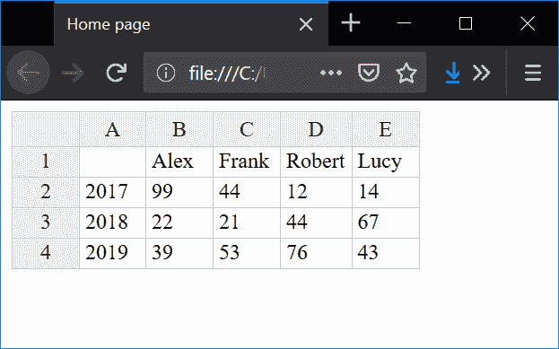

# Handsontable 教程

> 原文： [http://zetcode.com/javascript/handsontable/](http://zetcode.com/javascript/handsontable/)

Handsontable 教程展示了如何使用 Handsontable 模块在 JavaScript 中创建数据网格。

## 可调

Handsontable 是一个 JavaScript 库，用于在 JavaScript 中创建数据网格。 它创造了类似电子表格的体验。

在本教程中，我们将使用 Handsontable 和 Gulp4。我们正在使用 Handsontable 组件的社区版本。

## 安装 Handsontable

首先，我们安装 Handsontable

```
$ node -v
v11.5.0

```

我们使用 Node 版本 11.5.0。

```
$ npm init -y

```

我们启动一个新的 Node 应用。

```
$ npm i handsontable 

```

我们安装 Handsontable。

```
$ npm i --global gulp-cli
$ npm i gulp --save-dev
$ npm i --save-dev gulp-minify

```

我们安装`gulp-cli`，`gulp`和`gulp-minify`模块。 您也可以运行`npm link gulp`在全局安装的`gulp`中创建符号链接。

```
$ mkdir -p src/js

```

我们创建`src/js`目录。 在`src/js`子目录中，我们将具有`main.js`文件。

## Handsontable 的例子

在下面的示例中，我们使用 Handsontable 生成一个数据网格。 我们使用 Gulp 来管理文件。

```
├───build
│   │   index.html
│   ├───css
│   │       handsontable.full.min.css
│   └───js
│           handsontable.full.min.js
│           main-min.js
├───node_modules
└───src
│   │   index.html
│   │
└───────js
            main.js

gulpfile.js
package-lock.json
package.json        

```

这是使用 Gulp 构建后的项目结构。

`src/js/main.js`

```
let data = [
  ["", "Alex", "Frank", "Robert", "Lucy"],
  ["2017", 99, 44, 12, 14],
  ["2018", 22, 21, 44, 67],
  ["2019", 39, 53, 76, 43]
];

let container = document.getElementById('example');
let hot = new Handsontable(container, {
  data: data,
  rowHeaders: true,
  colHeaders: true,
  licenseKey: 'non-commercial-and-evaluation'
});

```

在`main.js`文件中，我们创建`Handsontable`的实例。 我们将数据添加到表中并进行配置。

`src/index.html`

```
<!DOCTYPE html>
<html lang="en">
<head>
    <meta charset="UTF-8">
    <meta name="viewport" content="width=device-width, initial-scale=1.0">
    <meta http-equiv="X-UA-Compatible" content="ie=edge">
    <script src="js/handsontable.full.min.js"></script>
    <link rel="stylesheet" href="css/handsontable.full.min.css">   
    <title>Home page</title>
</head>
<body>

<div id="example"></div>

<script src="js/main-min.js"></script>

</body>
</html>

```

数据网格显示在此文件中。 它替代了`div`组件。 我们包括 Handsontable 依赖项和我们的最小主 JavaScript 文件。

`gulpfile.js`

```
const gulp = require("gulp");
const minify = require("gulp-minify");

gulp.task('copyHtml', () => {
  return gulp.src('src/index.html')
    .pipe(gulp.dest('build'))
})

gulp.task('copyJS', () => {
  return gulp.src('node_modules/handsontable/dist/handsontable.full.min.js')
    .pipe(gulp.dest('build/js'))
})

gulp.task('copyCSS', () => {
  return gulp.src('node_modules/handsontable/dist/handsontable.full.min.css')
    .pipe(gulp.dest('build/css'))
})

gulp.task('minify', () => {
  return gulp.src('src/js/main.js', { allowEmpty: true }) 
    .pipe(minify({noSource: true}))
    .pipe(gulp.dest('build/js'))
})

gulp.task('default', gulp.series(['copyHtml', 'minify', 'copyJS', 'copyCSS']));

```

`gulpfile.js`将文件复制并处理到`build`目录中。

```
$ gulp
[10:30:03] Using gulpfile ~\Documents\javascript\hndstable\gulpfile.js
[10:30:03] Starting 'default'...
[10:30:03] Starting 'copyHtml'...
[10:30:03] Finished 'copyHtml' after 31 ms
[10:30:03] Starting 'minify'...
[10:30:03] Finished 'minify' after 35 ms
[10:30:03] Starting 'copyJS'...
[10:30:03] Finished 'copyJS' after 132 ms
[10:30:03] Starting 'copyCSS'...
[10:30:03] Finished 'copyCSS' after 13 ms
[10:30:03] Finished 'default' after 217 ms  

```

我们运行`gulp`命令。 它执行其任务，并在`build`目录中准备页面。

```
$ firefox build/index.html

```

我们从`build`目录运行该页面。



Figure: Displaying data in Handsontable component

在本教程中，我们使用了 Handsontable 在 JavaScript 中创建数据网格。

您可能也对以下相关教程感兴趣： [Moment.js 教程](/javascript/momentjs/)， [Datatables JSON 服务器教程](/articles/datatablesjsonserver/)， [JSONServer 教程](/javascript/jsonserver/)，[从 URL 中读取 JSON JavaScript](/articles/javascriptjsonurl/) ， [JavaScript Snake 教程](/javascript/snake/)， [JQuery 教程](/web/jquery/)， [Node Sass 教程](/javascript/nodesass/)， [Lodash 教程](/javascript/lodash/)。