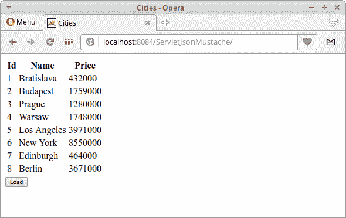



# JavaScript Mustache 教程

> 原文： [http://zetcode.com/javascript/mustache/](http://zetcode.com/javascript/mustache/)

在 JavaScript Mustache 教程中，我们展示了如何使用 Mustache 模板引擎。

## Mustache

Mustache 是一个简单的 Web 模板系统。 它可用于许多编程语言，包括 JavaScript 和 Java。 Mustache 被描述为一种无逻辑的模板引擎，因为它没有任何明确的控制流语句，例如`if`和`else`条件语句或`for`循环。 可以使用节标记处理列表和 lambda 来实现循环和条件评估。

JSON（JavaScript 对象表示法）是一种轻量级的数据交换格式。 人类很容易读写，机器也很容易解析和生成。 `application/json`是 JSON 的官方 Internet 媒体类型。 JSON 文件扩展名是`.json`。

jQuery 是一个 JavaScript 库，用于处理 DOM。 使用 jQuery，我们可以查找，选择，遍历和操作 HTML 文档的各个部分。

```js
<script src="https://cdnjs.cloudflare.com/ajax/libs/mustache.js/2.3.0/mustache.min.js"></script>

```

Mustache 是​​一个 JavaScript 库，可以从 CDN（内容交付网络）引用。

## Mustache 基本模板示例

在第一个示例中，我们有一个基本的模板示例。

`basic.html`

```js
<!DOCTYPE html>
<html lang="en">
<head>
<title>JavaScript Mustache template</title>

<meta charset="UTF-8">
<meta name="viewport" content="width=device-width, initial-scale=1">

<script src="https://code.jquery.com/jquery-3.2.1.min.js"></script>
<script src="https://cdnjs.cloudflare.com/ajax/libs/mustache.js/2.3.0/mustache.min.js"></script>

</head>

<body>

<div id="mypanel"></div>

<button id="btn">Load</button>

<script>
$("#btn").on('click', function() {

    var data = { name: "Jonathan" };
    var template = "Hello {{ name }}";

    var text = Mustache.render(template, data);        

    $("#mypanel").html(text);
});
</script>

</body>
</html>

```

单击该按钮，我们会在页面上写一条消息。

```js
<script src="https://code.jquery.com/jquery-3.2.1.min.js"></script>
<script src="https://cdnjs.cloudflare.com/ajax/libs/mustache.js/2.3.0/mustache.min.js"></script>

```

在示例中，我们使用 JQuery 和 Mustache JavaScript 库。

```js
$("#btn").on('click', function() {
...
}

```

我们创建一个对按钮单击事件做出反应的处理器。

```js
var data = { name: "Jonathan" };

```

这是数据。

```js
var template = "Hello {{ name }}";

```

这是 Moustache 模板。 `{{ name }}`是一个 Moustache 标签，已被数据值替换。

```js
var text = Mustache.render(template, data); 

```

最终输出使用`Mustache.render()`函数渲染。 模板引擎将模板与数据连接起来以生成输出。

```js
$("#mypanel").html(text);

```

呈现的文本将被写入面板元素。

## Mustache 使用模板标签

在第二个示例中，我们使用模板标记。 当前使用的是`<script type="text/template">`，但是在不久的将来它将被`<template>`标签取代。 标记包含客户端内容，该内容不会在加载页面时呈现，而是在运行时使用 JavaScript 实例化。

`json_url.html`

```js
<!DOCTYPE html>
<html lang="en">
<head>
<title>JavaScript Mustache template</title>

<meta charset="UTF-8">
<meta name="viewport" content="width=device-width, initial-scale=1">

<script src="https://code.jquery.com/jquery-3.2.1.min.js"></script>
<script src="https://cdnjs.cloudflare.com/ajax/libs/mustache.js/2.3.0/mustache.min.js"></script>

</head>

<body>

<script id="mp_template" type="text/template">
    Date: {{ time }} 
    <br> 
    Time: {{ date }} 
    <br> 
    Unix time: {{ milliseconds_since_epoch }}
</script>

<div id="mypanel"></div>

<button id="btn">Load</button>

<script>

    $(function() { 

        $("#btn").on('click', function() {

            $.getJSON('http://time.jsontest.com', function(data) {

                    var template = $("#mp_template").html();
                    var text = Mustache.render(template, data);

                    $("#mypanel").html(text);
            });
        });
    }); 
</script>

```

在此示例中，我们向`time.jsontest.com`发送请求，该请求返回具有三个属性的 JSON 响应：`time`，`date`和`milliseconds_since_epoch`（Unix 时间）。

```js
<script id="mp_template" type="text/template">
    Date: {{ time }} 
    <br> 
    Time: {{ date }} 
    <br> 
    Unix time: {{ milliseconds_since_epoch }}
</script>

```

我们在`<script id="mp_template" type="text/template">`标签内定义模板。

```js
$.getJSON('http://time.jsontest.com', function(data) {

```

使用`$.getJSON()`，我们使用 GET HTTP 请求从服务器加载 JSON 编码的数据。

```js
var template = $("#mp_template").html();

```

使用 JQuery 的`html()`方法，我们可以获得模板数据。

```js
var text = Mustache.render(template, data);      

```

输出使用`Mustache.render()`呈现。

```js
$("#mypanel").html(text);

```

最终文本将写入面板元素。

## 带有 Java Servlet 的 Mustache

在第三个示例中，我们使用 servlet 创建一个 Java Web 应用。

```js
$ tree
.
├── pom.xml
└── src
    ├── main
    │   ├── java
    │   │   └── com
    │   │       └── zetcode
    │   │           ├── bean
    │   │           │   └── City.java
    │   │           └── web
    │   │               └── GetCities.java
    │   └── webapp
    │       ├── index.html
    │       ├── META-INF
    │       │   └── context.xml
    │       └── WEB-INF
    └── test
        └── java

```

这是项目结构。

`pom.xml`

```js
<?xml version="1.0" encoding="UTF-8"?>
<project xmlns="http://maven.apache.org/POM/4.0.0" 
         xmlns:xsi="http://www.w3.org/2001/XMLSchema-instance" 
         xsi:schemaLocation="http://maven.apache.org/POM/4.0.0 
http://maven.apache.org/xsd/maven-4.0.0.xsd">

    <modelVersion>4.0.0</modelVersion>

    <groupId>com.zetcode</groupId>
    <artifactId>ServletJsonMustache</artifactId>
    <version>1.0-SNAPSHOT</version>
    <packaging>war</packaging>

    <name>ServletJsonMustache</name>

    <properties>
        <project.build.sourceEncoding>UTF-8</project.build.sourceEncoding>
        <maven.compiler.source>1.8</maven.compiler.source>
        <maven.compiler.target>1.8</maven.compiler.target>
    </properties>

    <dependencies>
        <dependency>
            <groupId>javax.servlet</groupId>
            <artifactId>javax.servlet-api</artifactId>
            <version>3.1.0</version>
            <scope>provided</scope>
        </dependency>
        <dependency>
            <groupId>com.google.code.gson</groupId>
            <artifactId>gson</artifactId>
            <version>2.8.0</version>
        </dependency>

    </dependencies>

    <build>
        <plugins>
            <plugin>
                <groupId>org.apache.maven.plugins</groupId>
                <artifactId>maven-war-plugin</artifactId>
                <version>2.3</version>
                <configuration>
                    <failOnMissingWebXml>false</failOnMissingWebXml>
                </configuration>
            </plugin>

        </plugins>
    </build>
</project>

```

这是 Maven POM 文件。 我们有两个工件：用于 Java servlet 的`javax.servlet-api`和用于 Java JSON 处理的`gson`。

`context.xml`

```js
<?xml version="1.0" encoding="UTF-8"?>
<Context path="/ServletJsonMustache"/>

```

在 Tomcat `context.xml`文件中，我们定义了上下文路径。 它是 Web 应用的名称。

`City.java`

```js
package com.zetcode.bean;

public class City {

    private Long id;
    private String name;
    private int population;

    public City() {
    }

    public City(Long id, String name, int population) {
        this.id = id;
        this.name = name;
        this.population = population;
    }

    public Long getId() {
        return id;
    }

    public void setId(Long id) {
        this.id = id;
    }

    public String getName() {
        return name;
    }

    public void setName(String name) {
        this.name = name;
    }

    public int getPopulation() {
        return population;
    }

    public void setPopulation(int population) {
        this.population = population;
    }

    @Override
    public String toString() {
        return "City{" + "id=" + id + ", name=" + name + 
                ", population=" + population + '}';
    }
}

```

这是`City` bean。 它具有三个属性：id，名称和人口。

`GetCities.java`

```js
package com.zetcode.web;

import com.google.gson.Gson;
import com.zetcode.bean.City;
import java.io.IOException;
import java.util.ArrayList;
import java.util.List;
import javax.servlet.ServletException;
import javax.servlet.ServletOutputStream;
import javax.servlet.annotation.WebServlet;
import javax.servlet.http.HttpServlet;
import javax.servlet.http.HttpServletRequest;
import javax.servlet.http.HttpServletResponse;

@WebServlet(name = "GetCities", urlPatterns = {"/GetCities"})
public class GetCities extends HttpServlet {

    private static final List<City> cities;

    static {

        cities = new ArrayList<>();
        cities.add(new City(1L, "Bratislava", 432000));
        cities.add(new City(2L, "Budapest", 1759000));
        cities.add(new City(3L, "Prague", 1280000));
        cities.add(new City(4L, "Warsaw", 1748000));
        cities.add(new City(5L, "Los Angeles", 3971000));
        cities.add(new City(6L, "New York", 8550000));
        cities.add(new City(7L, "Edinburgh", 464000));
        cities.add(new City(8L, "Berlin", 3671000));
    }

    @Override
    protected void doGet(HttpServletRequest request, HttpServletResponse response)
            throws ServletException, IOException {

        response.setContentType("application/json;charset=UTF-8");

        try (ServletOutputStream os = response.getOutputStream()) {
            os.print(new Gson().toJson(cities));
        }
    }
}

```

这是`GetCities` servlet。

```js
response.setContentType("application/json;charset=UTF-8");

```

响应对象的内容类型设置为`application/json`。

```js
try (ServletOutputStream os = response.getOutputStream()) {
    os.print(new Gson().toJson(cities));
}

```

我们使用`Gson`库将 Java 列表转换为 JSON 数组。 将该数组写入响应输出流。 数组未命名。

`index.html`

```js
<!DOCTYPE html>
<html>
    <head>
        <title>Cities</title>
        <meta charset="UTF-8">
        <meta name="viewport" content="width=device-width, initial-scale=1">
        <script src="https://code.jquery.com/jquery-3.2.1.min.js"></script>
        <script src="https://cdnjs.cloudflare.com/ajax/libs/mustache.js/2.3.0/mustache.min.js"></script>
    </head>
    <body>
        <script id="mp_template" type="text/template">
            <table>
                <thead>
                    <tr>
                        <th>Id</th>
                        <th>Name</th>
                        <th>Price</th>
                    </tr>
                </thead>

                <tbody>
                {{#.}}
                    <tr>
                        <td>{{id}}</td>
                        <td>{{name}}</td>
                        <td>{{population}}</td>
                    </tr>
                {{/.}}    
                </tbody>
            </table>
        </script>

        <div id="mypanel"></div>

        <button id="btn">Load</button>

        <script>

            $(function () {

                $("#btn").on('click', function () {

                    $.getJSON('http://localhost:8084/ServletJsonMustache/GetCities', function (cities) {

                        var template = $("#mp_template").html();
                        var text = Mustache.render(template, cities);

                        $("#mypanel").html(text);
                    });
                });
            });
        </script>
    </body>
</html>

```

这是主页。

```js
<script id="mp_template" type="text/template">
...
</script>

```

胡子模板放置在`<script id="mp_template" type="text/template">`标签中。

```js
<tbody>
{{#.}}
    <tr>
        <td>{{id}}</td>
        <td>{{name}}</td>
        <td>{{population}}</td>
    </tr>
{{/.}}    
</tbody>

```

使用`{{#.}} {{/.}}`语法，我们遍历了 servlet 返回的未命名 JSON 数组，并用值替换了 Mustache 标签。

```js
$.getJSON('http://localhost:8084/ServletJsonMustache/GetCities', function (cities) {

```

使用`$.getJSON()`，我们称为`GetCities` Servlet。 该 Servlet 返回 JSON 数据，并使用 Mustache 处理。

### 命名 JSON 数组

如果我们想命名返回的 JSON 数组，可以使用以下代码：

```js
Gson gson = new GsonBuilder().create();
JsonArray jarray = gson.toJsonTree(cities).getAsJsonArray();
JsonObject jsonObject = new JsonObject();
jsonObject.add("cities", jarray);

os.print(jsonObject.toString());

```

在 Servlet 中，我们将 JSON 数组放入另一个 JSON 对象中，并将属性命名为`cities`。

```js
<tbody>
{{#cities}}
    <tr>
        <td>{{id}}</td>
        <td>{{name}}</td>
        <td>{{population}}</td>
    </tr>
{{/cities}}    
</tbody>

```

在 Mustache 模板中，我们使用以下语法：`{{#cities}} {{/cities}}`。



图：使用 Mustache 从 Servlet 渲染JSON数据

在本教程中，我们使用了 Mustache 模板引擎。

您可能也对以下相关教程感兴趣： [JSON 服务器教程](/javascript/jsonserver/)，[从 JavaScript 中的 URL 读取 JSON](/articles/javascriptjsonurl/) ， [JQuery 教程](/web/jquery/)， [Node.js 教程](/javascript/nodejs/) 或 [jQuery 自动完成教程](/articles/jqueryautocomplete/)或[使用 jQuery `DatePicker`](/articles/jquerydatepicker/) 。

