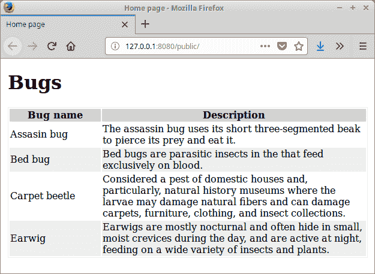

# Node Sass 教程

> 原文： [http://zetcode.com/javascript/nodesass/](http://zetcode.com/javascript/nodesass/)

Node Sass 教程展示了如何使用 node-sass 模块。 node-sass 模块用于将 Sass 代码转换为 CSS 代码。

## 萨斯

Sass 是一种预处理器脚本语言，可解释或编译为级联样式表（CSS）。 Sass 包含两种语法。 较早的语法使用缩进来分隔代码块，并使用换行符来分隔规则。 较新的语法 SCSS 使用类似于 CSS 的块格式。 它使用花括号来表示代码块，并使用分号来分隔块内的行。

传统上，缩进语法和 SCSS 文件分别具有扩展名`.sass`和`.scss`。

## 节点萨斯

Node-sass 是一个库，提供了 Node.js 与 LibSass（流行的样式表预处理器 Sass 的 C 版本）的绑定。 它允许我们将 SCSS 文件本地编译为 CSS。

## Node Sass 示例

在下面的示例中，我们创建一个使用`node-sass`模块的简单 Web 项目。

```
$ mkdir sass
$ mkdir public/css

```

在项目目录中，我们创建三个子目录。 在`sass`目录中，我们将有 SCSS 代码。 SCSS 代码将转换为 CSS，然后移至`public/css`目录。

```
$ nodejs -v
v9.11.2

```

我们使用 Node 版本 9.11.2。

```
$ npm init

```

我们启动一个新的 Node 应用。

```
$ npm i node-sass

```

我们安装`node-sass`模块。 我们使用该模块来监视 SCSS 文件并将其自动转换为 CSS 代码。

```
$ npm install -g live-server

```

另外，我们安装`live-server`，这是一个具有实时重载功能的小型开发服务器。

`package.json`

```
{
  "name": "js-nodesass",
  "version": "1.0.0",
  "description": "node-sass example",
  "main": "index.js",
  "scripts": {
    "sass": "node-sass -w sass -o public/css"
  },
  "author": "Jan Bodnar",
  "license": "BSD",
  "dependencies": {
    "node-sass": "^4.9.0"
  }
}

```

在`package.json`文件中，我们创建一个运行`node-sass`模块的脚本。 它将监视`sass`目录，并将编译后的代码输出到`public/css`目录。

`public/index.html`

```
<!DOCTYPE html>
<html lang="en">
<head>
    <meta charset="UTF-8">
    <meta name="viewport" content="width=device-width, initial-scale=1.0">
    <link rel="stylesheet" href="css/main.css">
    <title>Home page</title>
</head>
<body>

<div class="container">

    <h1>Bugs</h1>

    <table>

        <tr>
            <th>Bug name</th>
            <th>Description</th>
        </tr>

        <tr>
            <td>Assasin bug</td>
            <td>The assassin bug uses its short three-segmented beak to pierce 
                its prey and eat it.</td>
        </tr>

        <tr>
            <td>Bed bug</td>
            <td>Bed bugs are parasitic insects in the that feed exclusively 
                on blood.</td>
        </tr>

        <tr>
            <td>Carpet beetle</td>
            <td>Considered a pest of domestic houses and, particularly, natural 
                history museums where the larvae may damage natural fibers and 
                can damage carpets, furniture, clothing, and insect collections.</td>
        </tr>

        <tr>
            <td>Earwig</td>
            <td>Earwigs are mostly nocturnal and often hide in small, moist 
                crevices during the day, and are active at night, feeding on 
                a wide variety of insects and plants.</td>
        </tr>

    </table>

</div>    

</body>
</html>

```

这是一个包含一些数据的 HTML 文件。 本文档使用 CSS 文件设置样式。

```
<link rel="stylesheet" href="css/main.css">

```

CSS 代码是从`css/main`目录加载的。

`sass/main.scss`

```
$myfont: Georgia 1.1em;
$table_head_col: #ccc;
$table_row_col: #eee;
$table_bor_col: #eee;
$container_width: 700px;
$first_col_width: 150px;

div.container {

    margin: auto; 
    font: $myfont;
    width: $container_width;
}

table {

    tr:nth-child(odd) {background: $table_row_col}

    td:first-child {width: $first_col_width}

    th {
        background-color: $table_head_col;
    }

    border: 1px solid $table_bor_col;
}

```

这是我们的 SCSS 代码。 我们设置容器和桌子的样式。 该代码使用两个重要的 SCSS 功能：变量和嵌套。

```
$ npm run sass

```

我们运行`sass`脚本。

```
$ live-server --open=public

```

最后，我们启动开发服务器。



Figure: Sample application

在本教程中，我们使用了`node-sass`模块。 我们在一个简单的 Web 应用中使用了该模块，将其 SCSS 代码编译为 CSS 代码。

您可能也对以下相关教程感兴趣： [Liquid.js 教程](/javascript/liquidjs/)， [JSON Server 教程](/javascript/jsonserver/)， [Gulp Sass 教程](/gulp/sass/)， [jQuery Autocomplete 教程](/articles/jqueryautocomplete/)或[使用 jQuery DatePicker](/articles/jquerydatepicker/) 。