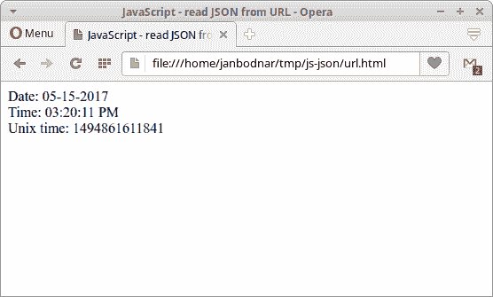

# 在 JavaScript 中从 URL 读取 JSON

> 原文： [http://zetcode.com/articles/javascriptjsonurl/](http://zetcode.com/articles/javascriptjsonurl/)

在 JavaScript 教程的“从 URL 读取 JSON”中，我们从提供的 URL 中读取 JSON 格式的数据。 我们使用 JQuery，Fetch API 和`XMLHttpRequest`。

统一资源定位符（URL）是对 Web 资源的引用，该资源指定了它在计算机网络上的位置以及用于检索它的机制。 网络资源是可以通过网络获取的任何数据，例如 HTML 文档，PDF 文件，PNG 图像，JSON 数据或纯文本。

JSON（JavaScript 对象表示法）是一种轻量级的数据交换格式。 人类很容易读写，机器也很容易解析和生成。 JSON 的官方 Internet 媒体类型为`application/json`。 JSON 文件扩展名是`.json`。

在我们的示例中，我们使用`http://time.jsontest.com`中的 JSON 数据。

```js
{
   "time": "11:27:26 AM",
   "milliseconds_since_epoch": 1494934046126,
   "date": "05-16-2017"
}

```

GET 请求返回此 JSON 字符串。

## 使用 JQuery 读取 JSON

jQuery 是一个 JavaScript 库，用于处理 DOM。 使用 jQuery，我们可以查找，选择，遍历和操作 HTML 文档的各个部分。

JQuery `$.getJSON()`方法使用 GET HTTP 请求从服务器加载 JSON 编码的数据。

```js
jQuery.getJSON( url [, data ] [, success ] )

```

这是方法签名。 `url`参数是一个字符串，其中包含将请求发送到的 URL。 `data`是随请求发送到服务器的普通对象或字符串。 `success`是一个回调函数，如果请求成功，则执行该函数。

```js
$.ajax({
  dataType: "json",
  url: url,
  data: data,
  success: success
});

```

`$.getJSON()`是上述调用的简写。

`js_read_json_url.html`

```js
<!DOCTYPE html>
<html lang="en">
<head>
<title>JavaScript - read JSON from URL</title>
    <script src="https://code.jquery.com/jquery-3.2.1.min.js"></script>
</head>

<body>
    <div class="mypanel"></div>

    <script>
    $.getJSON('http://time.jsontest.com', function(data) {

        var text = `Date: ${data.date}<br>
                    Time: ${data.time}<br>
                    Unix time: ${data.milliseconds_since_epoch}`

        $(".mypanel").html(text);
    });
    </script>

</body>
</html>

```

在示例中，我们从`http://time.jsontest.com`读取 JSON 数据。 返回的对象具有三个属性：日期，时间和 unix 纪元。

```js
var text = `Date: ${data.date}<br>
            Time: ${data.time}<br>
            Unix time: ${data.milliseconds_since_epoch}`

```

我们使用 JavaScript 模板字符串构建消息。

```js
$(".mypanel").html(text);

```

使用 JQuery 的`html()`方法，我们将文本附加到`div`标签。



图：使用 JQuery 从 URL 读取 JSON

在图中，我们可以看到当前日期，时间和 Unix 时间。

## 使用 Fetch API 读取 JSON

Fetch API 是用于提取资源的接口。 它类似于`XMLHttpRequest`，但其 API 提供了更强大和灵活的功能集。

```js
<script>
fetch('http://time.jsontest.com')
    .then(res => res.json())
    .then((out) => {
        console.log('Output: ', out);
}).catch(err => console.error(err));
</script>

```

该示例使用 Fetch API 读取 JSON 数据，并将返回的数据打印到控制台。 要查看输出，我们需要激活浏览器的开发者控制台。

`fetch()`方法采用一个强制性参数，即我们要获取的资源的路径。 它返回一个解析为请求响应的`promise`。

## 使用`XMLHttpRequest`读取 JSON

`XMLHttpRequest` API 提供了用于在客户端和服务器之间传输数据的客户端功能。 它提供了一种从 URL 检索数据的简便方法，而无需刷新整个页面。 结果，网页必须仅更新页面的一部分而不破坏用户正在做的事情。 `XMLHttpRequest`在 AJAX 编程中大量使用。

```js
<script>

var getJSON = function(url, callback) {

    var xhr = new XMLHttpRequest();
    xhr.open('GET', url, true);
    xhr.responseType = 'json';

    xhr.onload = function() {

        var status = xhr.status;

        if (status == 200) {
            callback(null, xhr.response);
        } else {
            callback(status);
        }
    };

    xhr.send();
};

getJSON('http://time.jsontest.com',  function(err, data) {

    if (err != null) {
        console.error(err);
    } else {

        var text = `Date: ${data.date}
Time: ${data.time}
Unix time: ${data.milliseconds_since_epoch}`

        console.log(text);
    }
});

</script>

```

本示例使用`XMLHttpRequest`读取 JSON 数据。

```js
var xhr = new XMLHttpRequest();

```

创建了`XMLHttpRequest`的新实例。

```js
xhr.open('GET', url, true);

```

`open()`方法初始化一个请求。

```js
xhr.responseType = 'json';

```

`responseType`值定义响应类型。

```js
xhr.onload = function() {

    var status = xhr.status;

    if (status == 200) {
        callback(null, xhr.response);
    } else {
        callback(status);
    }
};

```

在`onload()`方法中，我们等待服务器的响应。

```js
xhr.send();

```

`send()`方法发送请求； 默认情况下，该请求是异步的。

在本教程中，我们已经使用 JQuery，Fetch API 和`XMLHttpRequest`在 JavaScript 中读取了 JSON 数据。

您可能也对以下相关教程感兴趣： [JQuery 教程](/web/jquery/)， [JavaScript Mustache 教程](/javascript/mustache/)， [JavaScript 中的 JSON 数组循环](/javascript/jsonforeach/)， [jQuery 自动完成教程](/articles/jqueryautocomplete/)或[使用 jQuery `DatePicker`](/articles/jquerydatepicker/) 。