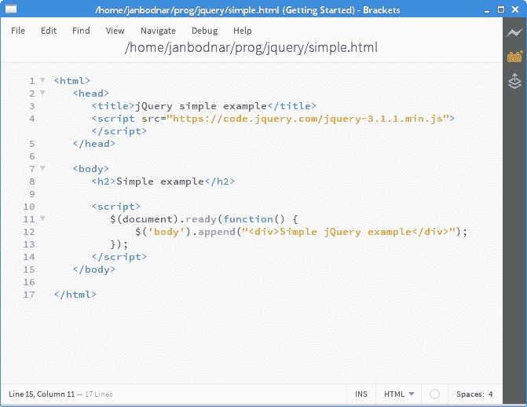
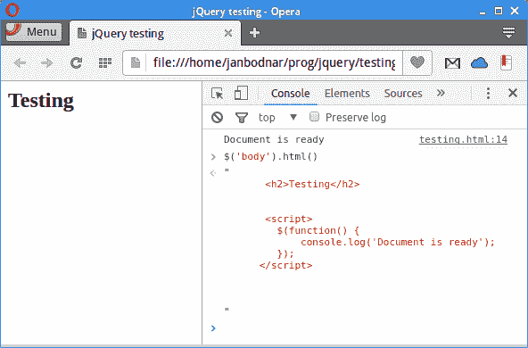
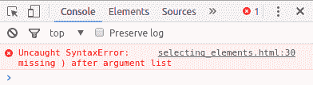
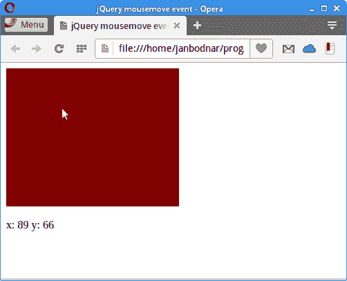
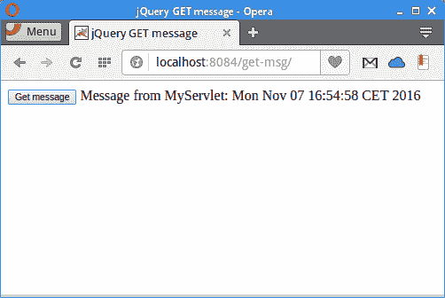

# jQuery 教程

> 原文： [https://zetcode.com/web/jquery/](https://zetcode.com/web/jquery/)

在本教程中，我们将学习 jQuery 的基础知识。 我们将展示 jQuery 库，展示如何下载和包含 jQuery，解释各种 jQuery 选择器，展示如何绑定事件，展示各种 jQuery 效果，以及处理异步事件。

当我们要创建一个网站时，我们需要使用特定的技术。 HTML 创建网页的结构。 CSS 负责网页的外观。 JavaScript 为网页带来了活力。

超文本标记语言（HTML），级联样式表（CSS）和 JavaScript 构成了万维网的三项基石技术。 jQuery 是 JavaScript 的抽象； 它使使用 JavaScript 的工作更加轻松。

## HTML 文件

一个网站由多个网页组成。 每个网页都是一个 HTML 文档。 HTML 文档是一种文本文档，其结构由超文本标记语言定义。 要创建文档结构，我们使用 HTML 标签，例如`&lt;div&gt;`，`&lt;h2&gt;`或`&lt;body&gt;`。 HTML 文档具有`.html`或`.htm`扩展名。


Figure: Source of a simple HTML document

Web 浏览器使我们能够查看每个 HTML 文档的 HTML 源。 HTML 文档由两部分组成：头和正文。 HTML 元素以层次结构进行组织-HTML 标记具有其父代，子代和同级兄弟。

## 文档对象模型（DOM）

文档对象模型（DOM）是 HTML 文档的编程接口。 它定义了用于操纵文档结构，样式和内容的功能。 DOM 将 HTML 文档表示为节点的树形结构，其中每个节点都是代表文档一部分的对象。 节点是具有属性和方法的对象。 这些实体可以通过 JavaScript 及其 jQuery 库进行访问。

## jQuery

jQuery 是一个 JavaScript 库，用于处理 DOM。 使用 jQuery，我们可以查找，选择，遍历和操作 HTML 文档的各个部分。 这些部分也称为 DOM 元素。 jQuery 是当今使用最广泛的 JavaScript 库。 据估计，在前 1000 万个网站中，有三分之二使用了该网站。 jQuery 最初是由 John Resig 创建的。 jQuery 是根据 MIT 许可获得许可的免费开源软件。

使用 jQuery 进行开发的原则是：

*   JavaScript 和 HTML 的分离。
*   简洁明了。
*   消除跨浏览器的不兼容性。
*   可扩展性。

## 选择 jQuery 库

jQuery 库本质上是一个小文件。 为了在我们的项目中使用 jQuery，我们可以从项目的[网站](https://jquery.com/download/)上下载文件，或者使用内容分发网络（CDN）。

有几种选择。 首先，有多个可用的 jQuery 版本。 文件名中提到了库的版本。 当前有三个版本分支：1.x，2.x 和 3.x。 出于教育目的，最好选择最新版本的 jQuery 库。 然后，我们需要在库的生产和开发版本之间进行选择。 生产版本已压缩，并且在库名称中带有`min`字。 压缩或缩小的版本的大小已减小，但提供相同的功能。 开发版本易于阅读并带有注释。

```
jquery-3.1.1.js
jquery-3.1.1.min.js

```

第一个文件是 jQuery 库 3.1.1 的开发版本。 第二个文件是 jQuery 库 3.1.1 版的生产版本。

此外，还有所谓的库的瘦版本。 精简版的库名称中带有`slim`字。 它们不包括 AJAX 功能，效果和当前不建议使用的代码。

```
jquery-3.1.1.slim.js
jquery-3.1.1.slim.min.js

```

第一个文件是 jQuery 库 3.1.1 的苗条开发版本。 第二个文件是 jQuery 库 3.1.1 的精简生产版本。

在本教程中，将使用 jQuery 3.1.1 的缩小版。

## 在 HTML 文档中包含 jQuery

通过链接到本地​​副本或公共服务器上可用的版本之一，可以将 jQuery 库包含在文档中。 为了包括 jQuery 库，我们使用`&lt;script&gt;`标签。 该文件通常位于`&lt;/body&gt;`标签之前，位于文档的开头或底部。

```
<script src="jquery-3.1.1.min.js"></script>

```

在这种情况下，我们包括 jQuery 库的本地副本。

```
<script src="https://code.jquery.com/jquery-3.1.1.min.js"></script>  

```

在这里，我们包含来自`code.jquery.com`上公共可用存储库的库。

有几个著名的 jQuery 公共存储库。 这些存储库也称为内容交付网络（CDN）。 使用 CDN 可以带来一些性能优势。

```
<script src="https://code.jquery.com/jquery-3.1.1.min.js"></script> 
<script src="http://ajax.aspnetcdn.com/ajax/jQuery/jquery-3.1.1.min.js"></script>
<script src="https://ajax.googleapis.com/ajax/libs/jquery/3.1.1/jquery.min.js"></script> 

```

在这里，我们有 jQuery，Google 和 Microsoft CDN。

## 选择文本编辑器

一个好的文本编辑器将帮助我们有效地编写代码。 文本编辑器提供语法高亮显示，代码完成，自动缩进等功能。 支持 jQuery 的文本编辑器包括括号，Sublime Text，Kwrite，Gedit，Notepad ++，PSPad 或 TextMate。



Figure: Brackets text editor

上图显示了一个在 Brackets 文本编辑器中使用 jQuery 的小型 HTML 文档。 Brackets 是用于 Web 开发的现代文本编辑器。 它是用 JavaScript 编写的。 它是专门为 Web 设计师和前端开发人员创建的。

## 准备好文件后

当文档准备就绪时，即已经构建了它的 DOM 并且可以安全地对其进行操作，jQuery 会触发`$(document).ready()`事件。 我们将 jQuery 代码放入此事件的处理程序中。

```
$(document).ready(function() {
    // jQuery code
});

$(function() { 
    // jQuery code 
});

```

这些是文档就绪的事件处理程序； 两者是等效的。 第二种方法是创建 jQuery 文档就绪事件处理程序的推荐方法。

`simple.html`

```
<html>
   <head>
      <title>jQuery simple example</title>         
      <meta charset="utf-8">  
      <script src="https://code.jquery.com/jquery-3.1.1.min.js"></script>          
   </head>

   <body>
       <h2>Simple example</h2>

      <script>
         $(function() { 
             $('body').append("<div>Simple jQuery example</div>");
         });
      </script>        
   </body>

</html>

```

该示例在`&lt;body&gt;`标签的末尾附加了`&lt;div&gt;`标签。

```
$('body').append("<div>Simple jQuery example</div>");

```

`$('body')`选择文档中的`&lt;body&gt;`标签。 `append()`方法将`&lt;div&gt;`标签附加在`&lt;body&gt;`标签的末尾。

## 测试与调试

浏览器包含供开发人员进行测试和调试的工具。 在 Opera，Firefox 和 Chrome 浏览器中，通过 `Ctrl + Shift + I` 启动开发者控制台。



Figure: Developer console

在控制台窗口中，我们可以看到从`console.log()`方法输出的错误消息。 它可用于评估 JavaScript 语句，检查和记录对象和属性。 在上图中，我们可以看到 jQuery `html()`方法的输出，该方法获取`&lt;body&gt;`元素的 HTML 代码。 输出显示在控制台窗口中。

```
<script>
    $(function() { 
        console.log('Document is ready');
    });
</script>  

```

`console.log()`方法可用于调试输出。



Figure: Syntax error

在上图中，我们可以看到 jQuery 语法错误被捕获并显示在开发人员控制台窗口中。

## jQuery 选择器

jQuery 选择器用于选择 HTML 文档中满足某些条件的元素。 条件可以是它们的名称，ID，类名称，属性或它们的组合。

以下是可用选择器的部分列表：

*   $（“ *”）-选择所有元素
*   $（“# first”）—用`id="first`选择元素
*   $（“。intro”）—选择带有`class="intro"`的所有元素
*   $（“ div”）-选择所有`&lt;div&gt;`元素
*   $（“ h2，div，p”）-选择所有`&lt;h2&gt;, &lt;div&gt;, &lt;p&gt;`元素
*   $（“ li：first”）—选择第一个`&lt;li&gt;`元素
*   $（“ li：last”）—选择最后一个`&lt;li&gt;`元素
*   $（“ li：even”）—选择所有偶数`&lt;li&gt;`元素
*   $（“ li：odd”）-选择所有奇数`&lt;li&gt;`元素
*   $（“：empty”）-选择所有为空的元素
*   $（“：focus”）-选择当前具有焦点的元素

在下面的示例中，我们将使用`:root`选择器，该选择器选择`&lt;html&gt;`标签。

`root_selector.html`

```
<!DOCTYPE html>
<html>
   <head>
      <title>jQuery root selector example</title>
      <meta charset="utf-8">        
      <style>          
           .mycol { background-color: gray; border: 1px solid gray }
      </style>      

      <script src="https://code.jquery.com/jquery-3.1.1.min.js"></script>         

   </head>

   <body>      
      <p>
          A paragraph.
      </p>

      <script>
         $(function() { 

             $(":root").addClass("mycol");

         });
      </script>       
   </body>

</html>

```

在示例中，文档的背景更改为灰色。

```
$(":root").addClass("mycol");

```

使用`:root`选择器，选择文档的根元素，然后使用`addClass()`方法向其中添加一个类。

`selecting_elements.html`

```
<!DOCTYPE html>
<html>
    <head>
        <title>jQuery selecting elements</title>
        <meta charset="utf-8">         
        <script src="https://code.jquery.com/jquery-3.1.1.min.js"></script>         

    </head>

    <body>

        <p>Operating systems:</p>

        <ul id="mylist" style="width:150px">
            <li>Solaris</li>
            <li>FreeBSD</li>
            <li>Debian</li>                      
            <li>NetBSD</li>           
            <li>Windows</li>         
            <li>Mac OS X</li>
        </ul>

        <script>
            $(function() {

                $("#mylist").css("border", "1px dashed gray"); 
                $("li:odd").css("color", "blue"); 
            });
        </script>
    </body>

</html>

```

在此示例中，我们有一个操作系统列表。 该列表带有蓝色虚线边框，并且每个奇数元素都有灰色背景。

```
$("#mylist").css("border", "1px dotted blue"); 

```

`$("#mylist")`选择器选择 ID 等于“ mylist”的标签。 使用`css()`方法，我们可以修改标签的外观。

```
$("li:odd").css("background-color", "gray"); 

```

使用`$("li:odd")`选择器，我们选择所有奇数`&lt;li&gt;`标签，然后使用`css()`方法对其进行修改。


Figure: Selecting document elements

在图中，我们可以看到列表周围的虚线边框和每隔一个列表元素的蓝色文本颜色。

## 链接方式

jQuery 允许链接方法调用。 方法链是对 jQuery 对象的 jQuery 方法调用的连续序列。

`chaining.html`

```
<!DOCTYPE html>
<html>
    <head>
        <title>jQuery chaining methods</title>
        <meta charset="utf-8">                   
        <script src="https://code.jquery.com/jquery-3.1.1.min.js"></script>         

        <style>
            .mypanel { width:150px; height:100px; background-color:blue }
        </style>

    </head>

    <body>
        <div class="mypanel"></div>

        <script>
            $(function() { 
                $(".mypanel").hide(1500).show(1500).hide(1500).show(1500);
            });
        </script>    
    </body>    
</html>

```

在该示例中，我们有一个显示和隐藏两次的面板。 用`show()`方法显示一个面板，用`hide()`方法隐藏一个面板。

```
$(".mypanel").hide(1500).show(1500).hide(1500).show(1500) 

```

在这里，我们看到了四个方法调用的链。 每个调用都返回一个 jQuery 对象，我们可以在该对象上调用另一个方法。

## 获取和设置内容

`text()`方法获取匹配元素集中每个元素的组合文本内容（包括它们的后代），或设置匹配元素的文本内容。

`getting_setting_content.html`

```
<html>
    <head>
        <title>jQuery getting, setting elements</title>       
        <meta charset="utf-8">               
        <script src="https://code.jquery.com/jquery-3.1.1.min.js"></script>          
    </head>

    <body>
        <h2>Red car</h2>

        <h3></h3>

        <script>
            $(function() { 
                var cont = $("h2").text();
                $("h3").text(cont);
            });
        </script>        
   </body>
</html>

```

在示例中，我们获取`&lt;h2&gt;`标签的内容并将其设置为`&lt;h3&gt;`标签； 换句话说，我们将内容从第一个元素复制到第二个元素。

```
var cont = $("h2").text();

```

通过`text()`方法，我们获得`&lt;h2&gt;`标签的内容。

```
$("h3").text(cont);

```

在这一行中，我们将先前检索的内容设置为`&lt;h3&gt;`标签。

## 绑定事件

`on()`方法将一个或多个事件的事件处理程序功能插入到当前选定的元素集。 当启动均匀（例如按钮单击）时，将触发事件处理程序。

`event_binding.html`

```
<!DOCTYPE html>
<html>
    <head>
        <title>jQuery event binding example</title>

        <script src="https://code.jquery.com/jquery-3.1.1.min.js"></script>   

        <style>
            .mypanel { width:150px; height:100px; background-color:maroon }
        </style>      

    </head>

    <body>      

        <button id="btn">Toggle</button>
        <br>
        <br>

        <div class="mypanel"></div>

        <script>
             $(function() { 

                 $("#btn").on('click', function() {

                     $(".mypanel").slideToggle(2000);
                 });
             });
        </script>    
    </body>
</html>

```

在示例中，我们将事件处理程序绑定到按钮元素上的 click 事件。

```
<button id="btn">Toggle</button>

```

这是触发点击事件的按钮。

```
<script>
    $(function() { 

        $("#btn").on('click', function() {

            $(".mypanel").slideToggle(2000);
        });
    });
</script>

```

我们为按钮元素注册一个`click`事件。 该事件触发一个函数，该函数在`&lt;div&gt;`元素上调用`slideToggle()`方法。 `slideToggle()`方法以滑动方式显示或隐藏匹配的元素。

## 鼠标移动事件

当鼠标指针移至文档区域上方时，将触发鼠标移动事件。 事件处理程序函数接收一个事件对象，其中包含与事件类型有关的数据。 在我们的例子中，它将包含鼠标指针的 x 和 y 坐标。

`mouse_move_event.html`

```
<!DOCTYPE html>
<html>
    <head>
        <title>jQuery mousemove event</title>

        <script src="https://code.jquery.com/jquery-3.1.1.min.js"></script>   

        <style>
            .mypanel { width:250px; height:200px; background-color:maroon }
        </style>      

    </head>

    <body>      

        <div class="mypanel"></div>

        <br>
        <div id="log"></div>

        <script>
             $(function() { 

                 $(".mypanel").mousemove(function(e) {

                     var msg = "x: " + e.pageX + " y: " + e.pageY;  

                     $("#log").text(msg);
                 });
             });
        </script>    
    </body>
</html>

```

如果我们将鼠标指针放在`&lt;div&gt;`元素的区域上，则该示例显示它的 x 和 y 坐标。

```
<div class="mypanel"></div>

```

我们将在此元素的区域上监听鼠标移动事件。

```
<div id="log"></div>

```

坐标将显示在该记录的`&lt;div&gt;`元素中。

```
$(".mypanel").mousemove(function(e) {

    var msg = "x: " + e.pageX + " y: " + e.pageY;  

    $("#log").text(msg);
});

```

我们将事件处理程序绑定到鼠标移动事件。 在事件处理程序内部，我们使用`pageX`和`pageY`属性确定 x 和 y 坐标，并使用`text()`方法更新日志记录元素。 `mousemove()`方法是`on("mousemove", handler)`方法的快捷方式。



Figure: Mouse move event

## 事件来源

事件源是触发事件的元素。 在事件处理程序内部，我们可以使用`$(this)`语法引用事件源。

`event_source.html`

```
<!DOCTYPE html>
<html>
    <head>
        <title>jQuery event source example</title>

        <script src="https://code.jquery.com/jquery-3.1.1.min.js"></script>   

        <style>
            .mybtn { }
        </style>      

    </head>

    <body>      

        <button class="mybtn">Button 1</button>
        <button class="mybtn">Button 2</button>
        <button class="mybtn">Button 3</button>
        <br>
        <br>

        <div class="messages"></div>

        <script>
            $(function() { 

                $(".mybtn").on('click', function() {

                    var btn_lbl = $(this).text();

                    $(".messages").text(btn_lbl + " clicked");
                });
            });
        </script>    
    </body>   
</html>

```

在示例中，我们有三个按钮。 每个按钮具有相同的事件处理程序。 当我们单击一个按钮时，会显示一条消息； 它告诉您单击了哪个按钮。

```
<button class="mybtn">Button 1</button>
<button class="mybtn">Button 2</button>
<button class="mybtn">Button 3</button>

```

这三个按钮具有相同的事件处理程序。

```
<script>
    $(function() { 

        $(".mybtn").on('click', function() {

            var btn_lbl = $(this).text();

            $(".messages").text(btn_lbl + " clicked");
        });
    });
</script> 

```

类选择器`$(".mybtn")`选择所有三个按钮。 我们将 click 事件处理程序附加到按钮上。 我们使用`$(this)`构造引用事件源，并使用`text()`方法确定事件的标签。 按钮的名称用于构建消息，该消息显示在下面的`&lt;div&gt;`元素中。


Figure: Event source

在图中，我们可以看到在按钮下方显示的消息中单击了哪个按钮。

## 移除元素

`remove()`方法从 DOM 中删除匹配的元素集。

`remove_element.html`

```
<!DOCTYPE html>
<html>
    <head>
        <title>jQuery removing element</title>

        <script src="https://code.jquery.com/jquery-3.1.1.min.js"></script>         

        <style>

            div { display: flex; align-items: center; justify-content: center; 
                  width:150px; height:80px; margin:3px; border: 1px solid gray 
            }

        </style>

    </head>

    <body>

        <button id="btnf">Remove first</button>
        <button id="btnl">Remove last</button>     

        <div>Panel 1</div>
        <div>Panel 2</div>
        <div>Panel 3</div>
        <div>Panel 4</div>
        <div>Panel 5</div>
        <div>Panel 6</div>

        <script>
            $(function() { 

                $('#btnf').click(function() {

                    $('div:first').remove();
                });

                $('#btnl').click(function() {

                    $('div:last').remove();            
                });            

            });
        </script>    
    </body>        
</html>

```

在示例中，我们有两个按钮和六个面板。 第一个按钮删除第一个面板，第二个按钮删除最后一个面板。

```
$('#btnf').click(function() {

    $('div:first').remove();
});

```

`div:first`选择器选择第一个`&lt;div&gt;`元素，然后`remove()`方法将其从 DOM 中删除。

## jQuery `is()`方法

`is()`方法针对选择器，元素或 jQuery 对象检查当前匹配的元素集，如果这些元素中的至少一个与给定参数匹配，则返回`true`。

`condition.html`

```
<!DOCTYPE html>
<html>
    <head>
        <title>First jQuery example</title>

        <script src="https://code.jquery.com/jquery-3.1.1.min.js"></script>

        <style>
            div { display: flex; align-items: center; text-align: center; width:150px;
                    height:100px; margin:3px; border: 1px solid gray }
        </style>

    </head>

    <body>

        <div id="pnl1">Panel 1</div>

        <div id="pnl2">Panel 2</div>

        <div id="pnl3">Panel 3</div>

        <div id="pnl4">Panel 4</div>      

        <script>
            $(function() { $("div").on('click', function() {

                    if ($(this).is('#pnl3')) {
                        console.log("Cannot hide panel 3");
                    } else {
                        $(this).hide(2000);
                    }
                });
            });
        </script>    

    </body>
</html>

```

在示例中，我们有四个面板。 单击面板上的面板开始消失。 第三面板不消失。

```
<script>
    $(function() { $("div").on('click', function() {

            if ($(this).is('#pnl3')) {
                console.log("Cannot hide panel 3");
            } else {
                $(this).hide(2000);
            }
        });
    });
</script>    

```

`$(this)`语法引用事件源，即我们单击其上的面板。 使用`is()`方法，我们检查元素是否为面板 3； 如果是面板 3，我们会在控制台上打印一条消息，并且不要将其隐藏。 其他面板用`hide()`方法隐藏。

## 特效

在本节中，我们将展示一些基本的 jQuery 效果。

### jQuery 滑动效果

`slideUp()`方法以向上滑动显示匹配的元素，而`slideDown()`方法以向下滑动显示。 方法的第一个参数是持续时间； 它是一个字符串或数字，确定动画将运行多长时间。 字符串可以是`'slow'`或`'fast'`； 默认值为 400 毫秒。

`sliding.html`

```
<!DOCTYPE html>
<html>
    <head>
        <title>jQuery sliding example</title>

        <script src="https://code.jquery.com/jquery-3.1.1.min.js"></script>         

        <style>
            .mypanel { width:150px; margin-top:10px; 
                height:100px; background-color:maroon }
        </style>

    </head>

    <body>

        <button id="btnSlideUp">Slide up</button>
        <button id="btnSlideDown">Slide down</button>

        <div class="mypanel"></div>

        <script>
            $(function() { 

                $('#btnSlideUp').click(function() {

                    $('.mypanel').slideUp('show');
                });

                $('#btnSlideDown').click(function() {

                    $('.mypanel').slideDown('show');
                });
            });            
        </script>    
    </body>    
</html>

```

在示例中，我们有两个按钮。 一个按钮将向上滑动面板，另一个按钮将向下滑动面板。

```
$('#btnSlideUp').click(function() {

    $('.mypanel').slideUp('show');
});

```

`slideUp()`方法以向上滑动的方式为选定的元素设置动画； 该元素将从窗口中消失。

```
$('#btnSlideDown').click(function() {

    $('.mypanel').slideDown('show');
});

```

`slideDown()`方法以向下滑动的方式对元素进行动画处理，该元素出现在窗口中。

### `animate()`方法

`animate()`方法对一组 CSS 属性执行自定义动画。 该方法的第一个参数称为属性。 它是动画将朝其移动的 CSS 属性和值的对象。 第二个参数是持续时间。

`animation.html`

```
<!DOCTYPE html>
<html>
    <head>
        <title>jQuery animation example</title>

        <script src="https://code.jquery.com/jquery-3.1.1.min.js"></script>         

        <style>
              .mypanel { position: relative; width:150px; margin-top:10px; 
                  height:100px; background-color:maroon }
        </style>

    </head>

    <body>
        <button id="leftBtn">«</button>
        <button id="rightBtn">»</button>

        <div class="mypanel"></div>

        <script>
            $(function() { 

                $("#rightBtn").click(function() {
                    $(".mypanel").animate({ "left": "+=250px" }, "slow" );
                });

                $( "#leftBtn" ).click(function(){
                    $(".mypanel").animate({ "left": "-=250px" }, "slow" );
                });
            });            
        </script>    
    </body>        
</html>

```

在示例中，我们有两个按钮。 第一个按钮将面板向左移动，第二个按钮将其向右移动。

```
$("#rightBtn").click(function() {
    $(".mypanel").animate({ "left": "+=250px" }, "slow" );
});

```

这会将面板缓慢向左移动 250 像素。

```
$( "#leftBtn" ).click(function(){
    $(".mypanel").animate({ "left": "-=250px" }, "slow" );
});

```

这会将面板缓慢向右移动 250 像素。

### jQuery 淡入淡出效果

`fadeIn()`方法通过将匹配的元素淡化为不透明来显示它们。 `fadeOut()`方法通过将匹配的元素淡化为透明来隐藏它们。

`fading.html`

```
<!DOCTYPE html>
<html>
    <head>
        <title>jQuery fading example</title>

        <script src="https://code.jquery.com/jquery-3.1.1.min.js"></script>         

        <style>
            .mypanel { width:150px; margin-top:10px; 
                height:100px; background-color:maroon }
        </style>

    </head>

    <body>

        <button id="fadeOutBtn">Fade out</button>
        <button id="fadeInBtn">Fade in</button>

        <div class="mypanel"></div>

        <script>
            $(function() { 

                $('#fadeOutBtn').click(function() {

                    $('.mypanel').fadeOut('slow');
                });

                $('#fadeInBtn').click(function() {

                    $('.mypanel').fadeIn('slow');
                });
            });            
        </script>    
    </body>    
</html>

```

在示例中，我们有两个按钮。 一个按钮淡入面板； 第二个按钮淡出面板。

```
$('#fadeOutBtn').click(function() {

    $('.mypanel').fadeOut('slow');
});

```

此功能使用`fadeOut()`方法淡出匹配的元素。

```
$('#fadeInBtn').click(function() {

    $('.mypanel').fadeIn('slow');
});

```

此功能通过`fadeIn()`方法淡入匹配的元素。

## jQuery `$.get()`方法

`$.get()`方法使用 HTTP GET 请求从服务器请求数据。 该请求是异步 GET 请求。

在本节中，我们将创建一个 Java Web 应用。 单击一个按钮，将 AJAX GET 请求发送到 Java Servlet，该 Java Servlet 会以一条消息进行响应。

`index.html`

```
<!DOCTYPE html>
<html>
    <head>
        <title>jQuery GET message</title>
        <meta charset="UTF-8">
        <meta name="viewport" content="width=device-width, initial-scale=1.0">
        <script src="https://code.jquery.com/jquery-3.1.1.min.js"></script>
    </head>
    <body>

        <button id="btn">Get message</button>
        <span id="log"></span>

        <script>
            $(function () {
                $("#btn").click(function () {

                    $.get("MyServlet", function (data) {
                        $("#log").text(data);
                    });
                });
            });
        </script>          
    </body>
</html>

```

我们有一个按钮，单击该按钮即可发送异步 GET 请求。

```
$(function () {
    $("#btn").click(function () {

        $.get("MyServlet", function (data) {
            $("#log").text(data);
        });
    });
});

```

`$.get()`方法的第一个参数是将请求发送到的 URL 字符串。 第二个参数是一个回调函数，如果请求成功，则执行该函数。 在回调函数内部，我们将返回的数据设置为 logging 元素。

`MyServlet.java`

```
package com.zetcode.web;

import java.io.IOException;
import java.io.PrintWriter;
import java.util.Date;
import javax.servlet.ServletException;
import javax.servlet.annotation.WebServlet;
import javax.servlet.http.HttpServlet;
import javax.servlet.http.HttpServletRequest;
import javax.servlet.http.HttpServletResponse;

@WebServlet(name = "MyServlet", urlPatterns = {"/MyServlet"})
public class MyServlet extends HttpServlet {

    @Override
    protected void doGet(HttpServletRequest request, HttpServletResponse response)
            throws ServletException, IOException {

        response.setContentType("text/plain;charset=UTF-8");

        try (PrintWriter out = response.getWriter()) {

            Date date = new Date();
            out.printf("Message from MyServlet: %s", date);
        }        
    }
}

```

这是一个响应消息的 Java servlet。 该消息包含当前日期。



Figure: jQuery asynchronous GET request

单击按钮，该按钮旁边的日志记录元素中将显示一条消息。

## jQuery `when()`方法

jQuery `when()`方法执行具有异步事件的回调函数。

`showing_hiding.html`

```
<!DOCTYPE html>
<html>
    <head>
        <title>jQuery showing/hiding elements</title>
        <meta charset="utf-8">                  
        <script src="https://code.jquery.com/jquery-3.1.1.min.js"></script>

        <style>
            div { display:flex; align-items:center; text-align:center; width:150px;
                    height:100px; margin:3px; border: 1px solid gray }
        </style>

    </head>

    <body>

        <button id="btn1">Hide all</button>

        <div id="pnl1">Panel 1</div>
        <div id="pnl2">Panel 2</div>
        <div id="pnl3">Panel 3</div>
        <div id="pnl4">Panel 4</div>   

        <script>
            $(function() { $("#btn1").click(function() {

                    var task = $("div").toggle(3000);

                    $.when(task).done(function() {
                        if ($("#btn1").text().match("^Hide")) {
                            $("#btn1").text("Show all");
                        } else {
                            $("#btn1").text("Hide all");
                        }
                    });
                });
            });
        </script>    
    </body>    
</html>

```

在示例中，我们有一个按钮来隐藏/显示所有四个面板。 隐藏/显示元素的过程需要一些时间。 任务结束后，按钮的标签将相应更改：从全部隐藏到全部显示，反之亦然。

```
var task = $("div").toggle(3000);

```

创建一个新任务； 这需要 3 秒钟才能完成。 `toggle()`方法显示或隐藏匹配的元素。

```
$.when(task).done(function() {

```

任务完成后将调用该函数。

```
if ($("#btn1").text().match("^Hide")) {
    $("#btn1").text("Show all");
} else {
    $("#btn1").text("Hide all");
}

```

现在，使用正则表达式，我们更改按钮的标签。

在本教程中，我们使用了 jQuery 库。

您可能也对以下相关教程感兴趣： [jQuery Autocomplete 教程](/articles/jqueryautocomplete/)， [Cheerio 教程](/javascript/cheerio/)，[使用 jQuery DatePicker](/articles/jquerydatepicker/) 和 [Pyquery 教程](/python/pyquery/)。