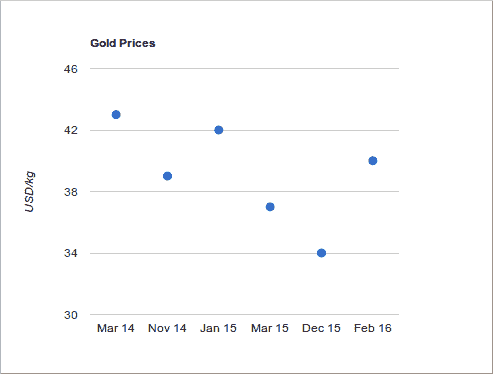
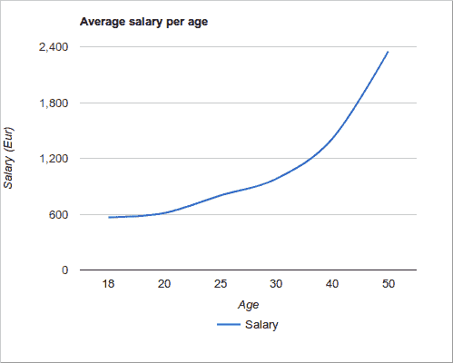

# Google 图表教程

> 原文： [https://zetcode.com/web/googlecharts/](https://zetcode.com/web/googlecharts/)

Google 图表教程是 Google 图表库的入门教程。 它显示了如何使用 Google 图表库在 JavaScript 中创建交互式图表。 在我们的示例中，我们创建了散点图，折线图和饼图。

Google 图表是一种交互式 Web 服务，可根据用户提供的信息创建图形图表。 用户使用嵌入在网页中的 JavaScript 提供数据和格式； 作为响应，服务发送图表图像。 该库提供了大量现成的图表类型。

图表具有一些默认外观，我们可以更改图表的外观。 图表具有高度的交互性，并公开事件，使我们可以将它们连接起来以创建复杂的结构。 图表使用 HTML5 / SVG 技术呈现，以提供跨浏览器和跨平台的兼容性（包括 iPhone，iPad 和 Android）。

## 数据表

图表填充有`DataTable`类。 它是一个二维的可变值表。 它具有用于排序，修改和过滤数据的方法。 可以直接从网页，数据库或任何支持 Chart Tools 数据源协议的数据提供者中填充它。

## 散点图

散点图是一种图形或数学图，使用笛卡尔坐标显示一组数据的两个变量的值。 使用`google.visualization.ScatterChart`创建一个散点图。

`scatter.html`

```
<html>
  <head>
    <script src="https://www.gstatic.com/charts/loader.js"></script>
    <script>

      google.charts.load('current', {'packages':['corechart']});

      google.charts.setOnLoadCallback(drawChart);

      function drawChart() {

          var data = new google.visualization.DataTable();

          data.addColumn('string', 'Date');
          data.addColumn('number', 'Price');

          data.addRows([
              ['Mar 14', 43],
              ['Nov 14', 39],
              ['Jan 15', 42],
              ['Mar 15', 37],
              ['Dec 15', 34],
              ['Feb 16', 40]
          ]);

         var options = {
            title: "Gold Prices",
            width: 600,
            height: 400,
            vAxis: {title: 'USD/kg'},
            legend: { position: "none" }
         };

         var chart = new google.visualization.ScatterChart(document.getElementById('mychart'));
         chart.draw(data, options);
      }
    </script>
  </head>

  <body>
    <div id="mychart"></div>
  </body>

</html>

```

在此示例中，我们创建了一个散点图。

```
<script src="https://www.gstatic.com/charts/loader.js"></script>
<script>

```

我们加载图表 API。

```
google.charts.load('current', {'packages':['corechart']});

```

第一步，我们加载 Visualization API 和`corechart`包。

```
google.charts.setOnLoadCallback(drawChart);

```

我们设置了在加载 Google Visualization API 时运行的回调。

```
function drawChart() {

```

在`drawChart()`函数中，我们创建并填充数据表，生成图表并绘制。

```
var data = new google.visualization.DataTable();

```

我们创建数据表。

```
data.addColumn('string', 'Date');
data.addColumn('number', 'Price');

```

用`addColumn()`方法添加列。 参数是数据类型和标签。

```
data.addRows([
    ['Mar 14', 43],
    ['Nov 14', 39],
    ['Jan 15', 42],
    ['Mar 15', 37],
    ['Dec 15', 34],
    ['Feb 16', 40]
]);

```

数据通过`addRows()`方法添加到数据表中。

```
var options = {
    title: "Gold Prices",
    width: 600,
    height: 400,
    vAxis: {title: 'USD/kg'},
    legend: { position: "none" }
};

```

在这里，我们设置图表选项。 我们为图表赋予标题，设置其尺寸，垂直轴标签并禁用图例。

```
var chart = new google.visualization.ScatterChart(document.getElementById('mychart'));

```

我们使用`google.visualization.ScatterChart`生成图表。 我们将图表选项传递给`draw()`方法。

```
chart.draw(data, options);

```

该图表是用`draw()`方法绘制的。 我们将图表选项传递给`draw()`方法。

```
<body>
  <div id="mychart"></div>
</body>

```

这是将保存图表的标记。



Figure: Scatter chart

## 折线图

折线图是一种基本类型的图表，它将信息显示为由直线段连接的一系列数据点。 使用`google.visualization.LineChart`创建折线图。

`linechart.html`

```
<html>
  <head>
    <script src="https://www.gstatic.com/charts/loader.js"></script>
    <script>

      google.charts.load('current', {'packages':['corechart']});
      google.charts.setOnLoadCallback(drawChart);

      function drawChart() {

        var data = google.visualization.arrayToDataTable([
          ['Age', 'Salary'],
          ['18',  567],
          ['20',  612],
          ['25',  800],
          ['30',  980],
          ['40',  1410],
          ['50',  2350]
        ]);

        var options = {
          title: 'Average salary per age',
          curveType: 'function',
          width:900,
          height:500,
          vAxis: {title: 'Salary (Eur)'},
          hAxis: {title: 'Age'},
          legend: { position: 'bottom' }
        };

        var chart = new google.visualization.LineChart(document.getElementById('mychart'));

        chart.draw(data, options);
      }
    </script>
  </head>
  <body>
    <div id="mychart"></div>
  </body>
</html>

```

在此示例中，我们有一个折线图，显示每个年龄段的平均工资。

```
var data = google.visualization.arrayToDataTable([
    ['Age', 'Salary'],
    ['18',  567],
    ['20',  612],
    ['25',  800],
    ['30',  980],
    ['40',  1410],
    ['50',  2350]
]);

```

`arrayToDataTable()`是使用二维数组并将其转换为`DataTable`的辅助方法。

```
var options = {
    title: 'Average salary per age',
    curveType: 'function',
...    

```

我们可以通过将`curveType`设置为`function`来平滑线条。

```
var chart = new google.visualization.LineChart(document.getElementById('mychart'));

```

折线图是使用`google.visualization.LineChart`生成的。



Figure: Line chart

## 饼形图

饼图是圆形图，将其分成多个切片以说明数值比例。 使用`google.visualization.PieChart`创建饼图。

`piechart.html`

```
<html>
  <head>
    <script type="text/javascript" src="https://www.gstatic.com/charts/loader.js"></script>
    <script type="text/javascript">

      google.charts.load('current', {'packages':['corechart']});

      google.charts.setOnLoadCallback(drawChart);

      function drawChart() {

      var data = new google.visualization.DataTable();
        data.addColumn('string', 'Fruit');
        data.addColumn('number', 'Quantity');
        data.addRows([
          ['Oranges', 38],
          ['Pears', 45],
          ['Plums', 24],
          ['Blueberries', 10]
        ]);

        var options = {
            'title': 'Fruits',
            'titleTextStyle': {
                'fontSize': '22', 
            },
            'width':500,
            'height':400
        };

        var chart = new google.visualization.PieChart(document.getElementById('mychart'));
        chart.draw(data, options);
      }
    </script>
  </head>

  <body>
    <div id="mychart"></div>
  </body>
</html>

```

该示例创建一个饼图。

```
var data = new google.visualization.DataTable();
  data.addColumn('string', 'Fruit');
  data.addColumn('number', 'Quantity');
  data.addRows([
      ['Oranges', 38],
      ['Pears', 45],
      ['Plums', 24],
      ['Blueberries', 10]
]);

```

在图表中，我们显示了可用水果的比例。

```
var options = {
    'title': 'Fruits',
    'titleTextStyle': {
        'fontSize': '22', 
    },
    'width':500,
    'height':400
};

```

在图表选项中，我们设置图表标题，更改默认标题字体大小并设置图表的大小。

```
var chart = new google.visualization.PieChart(document.getElementById('chart_div'));

```

使用`google.visualization.PieChart`创建饼图。


Figure: Pie chart

在本教程中，我们使用 Google 图表库创建了散点图，折线图和饼图。