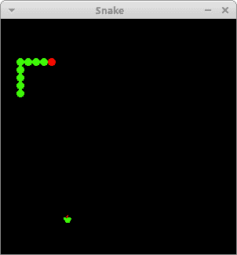

# Kotlin Snake

> 原文： [http://zetcode.com/kotlin/snake/](http://zetcode.com/kotlin/snake/)

Kotlin Snake 游戏教程展示了如何使用 Swing 在 Kotlin 中创建蛇游戏。

源代码和图像可从作者的 Github [Kotlin-Snake-Game](https://github.com/janbodnar/Kotlin-Snake-Game) 存储库中获得。

## Snake

Snake 是较旧的经典视频游戏。 它最初是在 70 年代后期创建的。 后来它被带到 PC 上。 在这个游戏中，玩家控制蛇。 游戏的目的是尽可能多地吃苹果。 当蛇吃了一个苹果时，它的身体就长了。 蛇必须避开墙壁和自己的身体。 该游戏有时称为 Nibbles 。

## Swing

Swing 是 Java 编程语言的主要 GUI 工具包。 它是 JFC（Java 基础类）的一部分，JFC 是用于为 Java 程序提供图形用户界面的 API。

## Kotlin Sname 游戏

蛇的每个关节的大小为 10 像素。 蛇由光标键控制。 最初，蛇具有三个关节。 如果游戏结束，则在面板中间显示“ Game Over”消息。

`Board.kt`

```kt
package com.zetcode

import java.awt.*
import java.awt.event.ActionEvent
import java.awt.event.ActionListener
import java.awt.event.KeyAdapter
import java.awt.event.KeyEvent

import javax.swing.ImageIcon
import javax.swing.JPanel
import javax.swing.Timer

class Board : JPanel(), ActionListener {

    private val boardWidth = 300
    private val boardHeight = 300
    private val dotSize = 10
    private val allDots = 900
    private val randPos = 29
    private val delay = 140

    private val x = IntArray(allDots)
    private val y = IntArray(allDots)

    private var nOfDots: Int = 0
    private var appleX: Int = 0
    private var appleY: Int = 0

    private var leftDirection = false
    private var rightDirection = true
    private var upDirection = false
    private var downDirection = false
    private var inGame = true

    private var timer: Timer? = null
    private var ball: Image? = null
    private var apple: Image? = null
    private var head: Image? = null

    init {

        addKeyListener(TAdapter())
        background = Color.black
        isFocusable = true

        preferredSize = Dimension(boardWidth, boardHeight)
        loadImages()
        initGame()
    }

    private fun loadImages() {

        val iid = ImageIcon("src/main/resources/dot.png")
        ball = iid.image

        val iia = ImageIcon("src/main/resources/apple.png")
        apple = iia.image

        val iih = ImageIcon("src/main/resources/head.png")
        head = iih.image
    }

    private fun initGame() {

        nOfDots = 3

        for (z in 0 until nOfDots) {
            x[z] = 50 - z * 10
            y[z] = 50
        }

        locateApple()

        timer = Timer(delay, this)
        timer!!.start()
    }

    public override fun paintComponent(g: Graphics) {
        super.paintComponent(g)

        doDrawing(g)
    }

    private fun doDrawing(g: Graphics) {

        if (inGame) {

            g.drawImage(apple, appleX, appleY, this)

            for (z in 0 until nOfDots) {
                if (z == 0) {
                    g.drawImage(head, x[z], y[z], this)
                } else {
                    g.drawImage(ball, x[z], y[z], this)
                }
            }

            Toolkit.getDefaultToolkit().sync()

        } else {

            gameOver(g)
        }
    }

    private fun gameOver(g: Graphics) {

        val msg = "Game Over"
        val small = Font("Helvetica", Font.BOLD, 14)
        val fontMetrics = getFontMetrics(small)

        val rh = RenderingHints(
                RenderingHints.KEY_ANTIALIASING,
                RenderingHints.VALUE_ANTIALIAS_ON)

        rh[RenderingHints.KEY_RENDERING] = RenderingHints.VALUE_RENDER_QUALITY

        (g as Graphics2D).setRenderingHints(rh)

        g.color = Color.white
        g.font = small
        g.drawString(msg, (boardWidth - fontMetrics.stringWidth(msg)) / 2, 
            boardHeight / 2)
    }

    private fun checkApple() {

        if (x[0] == appleX && y[0] == appleY) {

            nOfDots++
            locateApple()
        }
    }

    private fun move() {

        for (z in nOfDots downTo 1) {
            x[z] = x[z - 1]
            y[z] = y[z - 1]
        }

        if (leftDirection) {
            x[0] -= dotSize
        }

        if (rightDirection) {
            x[0] += dotSize
        }

        if (upDirection) {
            y[0] -= dotSize
        }

        if (downDirection) {
            y[0] += dotSize
        }
    }

    private fun checkCollision() {

        for (z in nOfDots downTo 1) {

            if (z > 4 && x[0] == x[z] && y[0] == y[z]) {
                inGame = false
            }
        }

        if (y[0] >= boardHeight) {
            inGame = false
        }

        if (y[0] < 0) {
            inGame = false
        }

        if (x[0] >= boardWidth) {
            inGame = false
        }

        if (x[0] < 0) {
            inGame = false
        }

        if (!inGame) {
            timer!!.stop()
        }
    }

    private fun locateApple() {

        var r = (Math.random() * randPos).toInt()
        appleX = r * dotSize

        r = (Math.random() * randPos).toInt()
        appleY = r * dotSize
    }

    override fun actionPerformed(e: ActionEvent) {

        if (inGame) {

            checkApple()
            checkCollision()
            move()
        }

        repaint()
    }

    private inner class TAdapter : KeyAdapter() {

        override fun keyPressed(e: KeyEvent?) {

            val key = e!!.keyCode

            if (key == KeyEvent.VK_LEFT && !rightDirection) {
                leftDirection = true
                upDirection = false
                downDirection = false
            }

            if (key == KeyEvent.VK_RIGHT && !leftDirection) {
                rightDirection = true
                upDirection = false
                downDirection = false
            }

            if (key == KeyEvent.VK_UP && !downDirection) {
                upDirection = true
                rightDirection = false
                leftDirection = false
            }

            if (key == KeyEvent.VK_DOWN && !upDirection) {
                downDirection = true
                rightDirection = false
                leftDirection = false
            }
        }
    }
}

```

首先，我们将定义游戏中使用的属性。

```kt
private val boardWidth = 300
private val boardHeight = 300
private val dotSize = 10
private val allDots = 900
private val randPos = 29
private val delay = 140

```

`boardWidth`和`boardHeight`属性确定电路板的尺寸。 `dotSize`是苹果的大小和蛇的点。 `allDots`属性定义了板上可能的最大点数（900 =（300 * 300）/（10 * 10））。 `randPos`属性用于计算苹果的随机位置。 `delay`属性确定游戏的速度。

```kt
private val x = IntArray(allDots)
private val y = IntArray(allDots)

```

这两个数组存储蛇的所有关节的 x 和 y 坐标。

```kt
private fun loadImages() {

    val iid = ImageIcon("src/main/resources/dot.png")
    ball = iid.image

    val iia = ImageIcon("src/main/resources/apple.png")
    apple = iia.image

    val iih = ImageIcon("src/main/resources/head.png")
    head = iih.image
}

```

在`loadImages()`方法中，我们获得了游戏的图像。 `ImageIcon`类用于显示 PNG 图像。

```kt
private fun initGame() {

    nOfDots = 3

    for (z in 0 until nOfDots) {
        x[z] = 50 - z * 10
        y[z] = 50
    }

    locateApple()

    timer = Timer(delay, this)
    timer!!.start()
}

```

在`initGame()`方法中，我们创建蛇，在板上随机放置一个苹果，然后启动计时器。

```kt
private fun doDrawing(g: Graphics) {

    if (inGame) {

        g.drawImage(apple, appleX, appleY, this)

        for (z in 0 until nOfDots) {
            if (z == 0) {
                g.drawImage(head, x[z], y[z], this)
            } else {
                g.drawImage(ball, x[z], y[z], this)
            }
        }

        Toolkit.getDefaultToolkit().sync()

    } else {

        gameOver(g)
    }
}

```

在`doDrawing()`方法中，我们绘制了苹果和蛇对象。 如果游戏结束，我们将根据消息绘制游戏。

```kt
private fun gameOver(g: Graphics) {

    val msg = "Game Over"
    val small = Font("Helvetica", Font.BOLD, 14)
    val fontMetrics = getFontMetrics(small)

    val rh = RenderingHints(
            RenderingHints.KEY_ANTIALIASING,
            RenderingHints.VALUE_ANTIALIAS_ON)

    rh[RenderingHints.KEY_RENDERING] = RenderingHints.VALUE_RENDER_QUALITY

    (g as Graphics2D).setRenderingHints(rh)

    g.color = Color.white
    g.font = small
    g.drawString(msg, (boardWidth - fontMetrics.stringWidth(msg)) / 2, 
        boardHeight / 2)
}

```

`gameOver()`方法在窗口中间绘制“ Game Over”消息。 我们使用渲染提示来平滑地绘制消息。 我们使用字体指标来获取消息的大小。

```kt
private fun checkApple() {

    if (x[0] == appleX && y[0] == appleY) {

        nOfDots++
        locateApple()
    }
}

```

如果苹果与头部碰撞，我们会增加蛇的关节数。 我们称`locateApple()`方法为随机放置一个新的 Apple 对象。

在`move()`方法中，我们有游戏的密钥算法。 要了解它，请看一下蛇是如何运动的。 我们控制蛇的头。 我们可以使用光标键更改其方向。 其余关节在链上向上移动一个位置。 第二关节移动到第一个关节的位置，第三关节移动到第二个关节的位置，依此类推。

```kt
for (z in nOfDots downTo 1) {
    x[z] = x[z - 1]
    y[z] = y[z - 1]
}

```

该代码将关节向上移动。

```kt
if (leftDirection) {
    x[0] -= dotSize
}

```

这条线将头向左移动。

在`checkCollision()`方法中，我们确定蛇是否击中了自己或撞墙之一。

```kt
for (z in nOfDots downTo 1) {

    if (z > 4 && x[0] == x[z] && y[0] == y[z]) {
        inGame = false
    }
}

```

如果蛇用头撞到其关节之一，则游戏结束。

```kt
if (y[0] >= boardHeight) {
    inGame = false
}

```

如果蛇击中了棋盘的底部，则游戏结束。

`Snake.kt`

```kt
package com.zetcode

import java.awt.EventQueue
import javax.swing.JFrame

class Snake : JFrame() {

    init {

        initUI()
    }

    private fun initUI() {

        add(Board())

        title = "Snake"

        isResizable = false
        pack()

        setLocationRelativeTo(null)
        defaultCloseOperation = JFrame.EXIT_ON_CLOSE
    }

    companion object {

        @JvmStatic
        fun main(args: Array<String>) {

            EventQueue.invokeLater {
                val ex = Snake()
                ex.isVisible = true
            }
        }
    }
}

```

这是主要的类。

```kt
isResizable = false
pack()

```

`isResizable`属性会影响某些平台上`JFrame`容器的插入。 因此，在`pack()`方法之前调用它很重要。 否则，蛇的头部与右边界和底边界的碰撞可能无法正常进行。



Figure: Snake

这是 Kotlin 和 Swing 中的 Snake 游戏。 您可能也对相关教程感兴趣： [Kotlin Swing 教程](/kotlin/swing/)， [Kotlin 读取文件教程](/kotlin/readfile/)和 [Kotlin 写入文件教程](/kotlin/writefile/)。