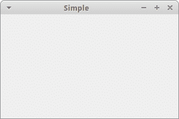
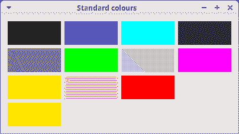
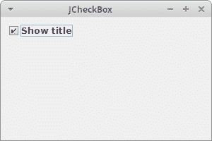
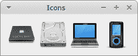
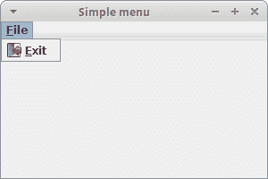

# Kotlin Swing 教程

> 原文： [http://zetcode.com/kotlin/swing/](http://zetcode.com/kotlin/swing/)

Kotlin Swing 教程展示了如何在 Kotlin 中创建 Swing GUI 应用。 代码示例和图像可从作者的 Github [Kotlin-Swing](https://github.com/janbodnar/Kotlin-Swing) 存储库中获得。

Swing 是 Java 编程语言的主要 GUI 工具包。 它是 JFC（Java 基础类）的一部分，JFC 是用于为 Java 程序提供图形用户界面的 API。

## Kotlin Swing `JFrame`

在第一个示例中，我们在屏幕上显示一个基本窗口。 使用`JFrame`创建主应用窗口。

`KotlinSwingSimpleEx.kt`

```kt
package com.zetcode

import java.awt.EventQueue
import javax.swing.*

class KotlinSwingSimpleEx(title: String) : JFrame() {

    init {
        createUI(title)
    }

    private fun createUI(title: String) {

        setTitle(title)

        defaultCloseOperation = JFrame.EXIT_ON_CLOSE
        setSize(300, 200)
        setLocationRelativeTo(null)
    }
}

private fun createAndShowGUI() {

    val frame = KotlinSwingSimpleEx("Simple")
    frame.isVisible = true
}

fun main(args: Array<String>) {
    EventQueue.invokeLater(::createAndShowGUI)
}

```

窗口位于屏幕中央。

```kt
class KotlinSwingSimpleEx(title: String) : JFrame() {

```

`KotlinSwingSimpleEx`继承自`JFrame`组件。 `JFrame`是顶级容器。 容器的目的是保存应用的组件。

```kt
setTitle(title)

```

应用的标题由`setTitle()`设置。

```kt
defaultCloseOperation = JFrame.EXIT_ON_CLOSE

```

`defaultCloseOperation`设置关闭框时默认发生的操作。 在我们的情况下，我们退出该应用。

```kt
setSize(300, 200)

```

我们用`setSize()`设置初始大小。

```kt
setLocationRelativeTo(null)

```

这条线用于使窗口在屏幕上居中。

```kt
val frame = KotlinSwingSimpleEx("Simple")
frame.isVisible = true

```

我们创建应用框架并将其显示在屏幕上。

```kt
EventQueue.invokeLater(::createAndShowGUI)

```

`invokeLater()`方法将应用放置在 Swing 事件队列中。 它用于确保所有 UI 更新都是并发安全的。



Figure: Simple example

## Kotlin Swing `JButton`

在下一个示例中，我们有一个关闭按钮。 使用`JButton`创建一个按钮组件。 当我们单击按钮时，应用终止。

`KotlinSwingCloseButtonEx.kt`

```kt
package com.zetcode

import java.awt.EventQueue
import javax.swing.*

class KotlinSwingCloseButtonEx(title: String) : JFrame() {

    init {
        createUI(title)
    }

    private fun createUI(title: String) {

        setTitle(title)

        val closeBtn = JButton("Close")

        closeBtn.addActionListener { System.exit(0) }

        createLayout(closeBtn)

        defaultCloseOperation = JFrame.EXIT_ON_CLOSE
        setSize(300, 200)
        setLocationRelativeTo(null)
    }

    private fun createLayout(vararg arg: JComponent) {

        val gl = GroupLayout(contentPane)
        contentPane.layout = gl

        gl.autoCreateContainerGaps = true

        gl.setHorizontalGroup(gl.createSequentialGroup()
                .addComponent(arg[0])
        )

        gl.setVerticalGroup(gl.createSequentialGroup()
                .addComponent(arg[0])
        )

        pack()
    }
}

private fun createAndShowGUI() {

    val frame = KotlinSwingCloseButtonEx("Close button")
    frame.isVisible = true
}

fun main(args: Array<String>) {
    EventQueue.invokeLater(::createAndShowGUI)
}

```

我们将`JButton`放置在窗口上，然后向该按钮添加一个动作监听器。

```kt
val closeBtn = JButton("Close")

```

创建一个按钮组件。 构造函数将字符串标签作为参数。

```kt
closeBtn.addActionListener { System.exit(0) }

```

使用`addActionListener()`将动作侦听器添加到按钮。 该操作通过调用`System.exit()`方法来终止应用。

```kt
createLayout(closeBtn)

```

子组件（在我们的情况下是一个按钮）需要放入容器中。 我们将任务委托给`createLayout()`方法。

```kt
val gl = GroupLayout(contentPane)
contentPane.layout = gl

```

`JFrame`的内容窗格是放置子组件的区域。 子级由专门的不可见组件（称为布局管理器）组织。 `BorderLayout`是内容窗格的默认布局管理器。 该管理器非常简单，仅在少数情况下有用。 我们使用功能更强大，更灵活的`GroupLayout`管理器。

```kt
gl.autoCreateContainerGaps = true

```

`autoCreateContainerGaps`属性在组件和容器边缘之间创建间隙。 空间或间隙是每个应用设计的重要组成部分。

```kt
gl.setHorizontalGroup(gl.createSequentialGroup()
        .addComponent(arg[0])
)

gl.setVerticalGroup(gl.createSequentialGroup()
        .addComponent(arg[0])
)

```

`GroupLayout`管理器独立定义每个大小的布局。 第一步，我们沿着水平轴布置组件； 在另一步骤中，我们沿垂直轴布置组件。 在两种布局中，我们都可以顺序或并行排列组件。 在水平布局中，一行组件称为顺序组，而一列组件称为并行组。 在垂直布局中，一列组件称为顺序组，一排组件称为并行组。

在我们的示例中，我们只有一个按钮，因此布局非常简单。 对于每个维度，我们以按钮组件作为参数调用`addComponent()`方法。 （必须为两个维度都添加每个子组件。）


Figure: Close button

## Kotlin Swing `JLabel`

`JLabel`组件用于显示文本，颜色或图像。

`KotlinSwingStandardColoursEx.kt`

```kt
package com.zetcode

import java.awt.Color
import java.awt.Dimension
import java.awt.EventQueue
import javax.swing.GroupLayout
import javax.swing.JFrame
import javax.swing.JLabel
import javax.swing.SwingConstants.LEADING

class KotlinSwingStandardColoursEx(title: String) : JFrame() {

    init {
        createUI(title)
    }

    private fun createUI(title: String) {

        val stdCols = arrayOf<Color>(Color.black, Color.blue, Color.cyan, 
            Color.darkGray, Color.gray, Color.green, Color.lightGray, Color.magenta, 
            Color.orange, Color.pink, Color.red, Color.white, Color.yellow)

        val labels = stdCols.map {
            JLabel("", null, LEADING).apply {

                minimumSize = Dimension(90, 40)
                background = it
                isOpaque = true
            }
        }

        createLayout(labels)

        setTitle(title)
        defaultCloseOperation = JFrame.EXIT_ON_CLOSE
        setLocationRelativeTo(null)
    }

    private fun createLayout(labels: List<JLabel>) {

        val gl = GroupLayout(contentPane)
        contentPane.layout = gl

        gl.autoCreateContainerGaps = true
        gl.autoCreateGaps = true

        gl.setHorizontalGroup(gl.createParallelGroup()
                .addGroup(gl.createSequentialGroup()
                        .addComponent(labels[0])
                        .addComponent(labels[1])
                        .addComponent(labels[2])
                        .addComponent(labels[3]))
                .addGroup(gl.createSequentialGroup()
                        .addComponent(labels[4])
                        .addComponent(labels[5])
                        .addComponent(labels[6])
                        .addComponent(labels[7]))
                .addGroup(gl.createSequentialGroup()
                        .addComponent(labels[8])
                        .addComponent(labels[9])
                        .addComponent(labels[10])
                        .addComponent(labels[11]))
                .addComponent(labels[12])
        )

        gl.setVerticalGroup(gl.createSequentialGroup()
                .addGroup(gl.createParallelGroup()
                        .addComponent(labels[0])
                        .addComponent(labels[1])
                        .addComponent(labels[2])
                        .addComponent(labels[3]))
                .addGroup(gl.createParallelGroup()
                        .addComponent(labels[4])
                        .addComponent(labels[5])
                        .addComponent(labels[6])
                        .addComponent(labels[7]))
                .addGroup(gl.createParallelGroup()
                        .addComponent(labels[8])
                        .addComponent(labels[9])
                        .addComponent(labels[10])
                        .addComponent(labels[11]))
                .addComponent(labels[12])
        )

        pack()
    }
}

private fun createAndShowGUI() {

    val frame = KotlinSwingStandardColoursEx("Standard colours")
    frame.isVisible = true
}

fun main(args: Array<String>) {
    EventQueue.invokeLater(::createAndShowGUI)
}

```

该示例显示了 13 个`JLabel`组件； 每个标签具有不同的背景色。 `JLabel`通常用于显示文本； 但它也可以显示颜色。

```kt
val stdCols = arrayOf<Color>(Color.black, Color.blue, Color.cyan, 
    Color.darkGray, Color.gray, Color.green, Color.lightGray, Color.magenta, 
    Color.orange, Color.pink, Color.red, Color.white, Color.yellow)

```

在这里，我们有一个内置颜色值的数组。

```kt
val labels = stdCols.map {
    JLabel("", null, LEADING).apply {

        minimumSize = Dimension(90, 40)
        background = it
        isOpaque = true
    }
}

```

标签以一定的大小和背景色创建。



Figure: Standard colours

## `JCheckBox`

`JCheckBox`是带有标签的框，该标签具有两种状态：开和关。 如果选中此复选框，则在复选框中用勾号表示。 复选框可用于在启动时显示或隐藏启动屏幕，切换工具栏的可见性等。

通过`JCheckBox`可以使用`ActionListener`或`ItemListener`。 通常使用后一种选项。 `ItemListener`是用于接收项目事件的界面。 对处理项目事件感兴趣的类，例如观察者，实现此接口。 使用组件的`addItemListener()`方法向组件注册观察者对象。 发生项目选择事件时，将调用观察者的`itemStateChanged()`方法。

`KotlinSwingCheckBoxEx.kt`

```kt
package com.zetcode

import java.awt.EventQueue
import java.awt.event.ItemEvent
import javax.swing.GroupLayout
import javax.swing.JCheckBox
import javax.swing.JComponent
import javax.swing.JFrame

class KotlinSwingCheckBoxEx(title: String) : JFrame() {

    init {
        createUI(title)
    }

    private fun createUI(title: String) {

        setTitle(title)

        val checkBox = JCheckBox("Show title", true)

        checkBox.addItemListener { e ->
            val sel: Int = e.stateChange
            if (sel == ItemEvent.SELECTED) {
                setTitle("JCheckBox")
            } else {
                setTitle("")
            }
        }

        createLayout(checkBox)

        defaultCloseOperation = JFrame.EXIT_ON_CLOSE
        setSize(300, 200)
        setLocationRelativeTo(null)
    }

    private fun createLayout(vararg arg: JComponent) {

        val gl = GroupLayout(contentPane)
        contentPane.layout = gl

        gl.autoCreateContainerGaps = true

        gl.setHorizontalGroup(gl.createSequentialGroup()
                .addComponent(arg[0])
        )

        gl.setVerticalGroup(gl.createSequentialGroup()
                .addComponent(arg[0])
        )

        pack()
    }
}

private fun createAndShowGUI() {

    val frame = KotlinSwingCheckBoxEx("JCheckBox")
    frame.isVisible = true
}

fun main(args: Array<String>) {
    EventQueue.invokeLater(::createAndShowGUI)
}

```

我们的代码示例根据是否选中复选框来显示或隐藏窗口的标题。

```kt
val checkBox = JCheckBox("Show title", true)

```

`JCheckBox`已创建。 此构造函数将文本和复选框的状态作为参数。 最初已选中该复选框。

```kt
checkBox.addItemListener { e ->
    val sel: Int = e.stateChange
    if (sel == ItemEvent.SELECTED) {
        setTitle("JCheckBox")
    } else {
        setTitle("")
    }
}

```

项目侦听器随`addItemListener()`添加。 根据复选框的状态，我们显示或隐藏窗口标题。



Figure: JCheckBox

## Kotlin Swing 图标

在下一个示例中，我们在`JLabel`组件中显示图标。

`KotlinSwingLabelIconEx.kt`

```kt
package com.zetcode

import javax.swing.*

class KotlinSwingLabelIconEx(title: String) : JFrame() {

    init {
        createUI(title)
    }

    private fun createUI(title: String) {

        val lbl1 = JLabel(ImageIcon("src/main/resources/cpu.png"))
        val lbl2 = JLabel(ImageIcon("src/main/resources/drive.png"))
        val lbl3 = JLabel(ImageIcon("src/main/resources/laptop.png"))
        val lbl4 = JLabel(ImageIcon("src/main/resources/player.png"))

        createLayout(lbl1, lbl2, lbl3, lbl4)

        setTitle(title)
        defaultCloseOperation = JFrame.EXIT_ON_CLOSE
        setLocationRelativeTo(null)
    }

    private fun createLayout(vararg arg: JComponent) {

        val gl = GroupLayout(contentPane)
        contentPane.layout = gl

        gl.autoCreateContainerGaps = true
        gl.autoCreateGaps = true

        gl.setHorizontalGroup(gl.createSequentialGroup()
                .addComponent(arg[0])
                .addComponent(arg[1])
                .addComponent(arg[2])
                .addComponent(arg[3])
        )

        gl.setVerticalGroup(gl.createParallelGroup()
                .addComponent(arg[0])
                .addComponent(arg[1])
                .addComponent(arg[2])
                .addComponent(arg[3])
        )

        pack()
    }
}

private fun createAndShowGUI() {

    val frame = KotlinSwingLabelIconEx("Icons")
    frame.isVisible = true
}

fun main(args: Array<String>) {
    SwingUtilities.invokeLater(::createAndShowGUI)
}

```

该示例在一行中显示了四个图像。

```kt
val lbl1 = JLabel(ImageIcon("src/main/resources/cpu.png"))

```

图像路径被传递到`ImageIcon`。



Figure: ImageIcon

## Kotlin Swing 菜单示例

`JMenuBar`实现菜单栏。 `JMenu`实现菜单，该菜单是包含`JMenuItems`的弹出窗口，当用户在`JMenuBar`上选择一个项目时显示。 `JMenuItem`实现菜单中的项目。 用户选择它来执行操作。

`KotlinSwingSimpleMenuExEx.kt`

```kt
package com.zetcode

import java.awt.EventQueue
import java.awt.event.ActionEvent
import java.awt.event.KeyEvent
import javax.swing.*

class KotlinSwingSimpleMenuExEx(title: String) : JFrame() {

    init {
        createUI(title)
    }

    private fun createUI(title: String) {

        setTitle(title)

        createMenuBar()

        defaultCloseOperation = JFrame.EXIT_ON_CLOSE
        setSize(300, 200)
        setLocationRelativeTo(null)
    }

    private fun createMenuBar() {

        val menubar = JMenuBar()
        val icon = ImageIcon("src/main/resources/exit.png")

        val file = JMenu("File")
        file.mnemonic = KeyEvent.VK_F

        val eMenuItem = JMenuItem("Exit", icon)
        eMenuItem.mnemonic = KeyEvent.VK_E
        eMenuItem.toolTipText = "Exit application"
        eMenuItem.addActionListener { _: ActionEvent -> System.exit(0) }

        file.add(eMenuItem)
        menubar.add(file)

        jMenuBar = menubar
    }
}

private fun createAndShowGUI() {

    val frame = KotlinSwingSimpleMenuExEx("Simple menu")
    frame.isVisible = true
}

fun main(args: Array<String>) {
    EventQueue.invokeLater(::createAndShowGUI)
}

```

该示例创建一个带有一个菜单项的简单菜单。 选择退出菜单项，我们关闭应用。

```kt
val menubar = JMenuBar()

```

使用`JMenuBar`创建菜单栏。

```kt
val icon = ImageIcon("src/main/resources/exit.png")

```

菜单中显示退出图标。

```kt
val file = JMenu("File")
file.mnemonic = KeyEvent.VK_F

```

使用`JMenu`类创建菜单对象。 也可以通过键盘访问菜单。 要将菜单绑定到特定键，我们使用`setMnemonic()`方法。 在我们的情况下，可以使用`Alt + F + E` 打开菜单。

```kt
eMenuItem.toolTipText = "Exit application"

```

此代码行为菜单项创建工具提示。

```kt
eMenuItem.addActionListener { _: ActionEvent -> System.exit(0) }

```

`JMenuItem`是一种特殊的按钮组件。 我们向它添加一个动作监听器； 选择后将终止应用。

```kt
file.add(eMenuItem)
menubar.add(file)

```

菜单项被添加到菜单对象，菜单对象被插入菜单栏。

```kt
jMenuBar = menubar

```

菜单栏设置为`JFrame`的`jMenubar`属性。



Figure: Simple menu

在本教程中，我们介绍了使用 Kotlin 语言的 Swings 工具包。 您可能也对相关教程感兴趣： [Kotlin Hello World 教程](/kotlin/helloworld/)， [Kotlin 控制流](/kotlin/controlflow/)， [Kotlin 读取文件教程](/kotlin/readfile/)和 [Kotlin 写入文件教程](/kotlin/writefile/) 。