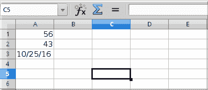
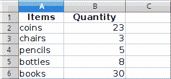
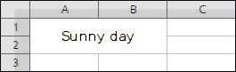
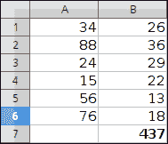
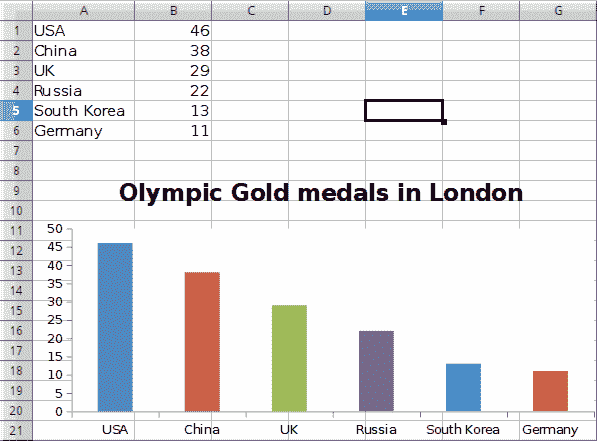

# OpenPyXL 教程

> 原文： [http://zetcode.com/python/openpyxl/](http://zetcode.com/python/openpyxl/)

在本教程中，我们展示如何使用 OpenPyXL 库在 Python 中使用 Excel 文件。

## OpenPyXL

OpenPyXL 是用于读取和写入 Excel 2010 xlsx/xlsm/xltx/xltm 文件的 Python 库。

## Excel xlsx

在本教程中，我们使用 xlsx 文件。 xlsx 是 Microsoft Excel 使用的开放 XML 电子表格文件格式的文件扩展名。 xlsm 文件支持宏。 xlsx 是专有的二进制格式，而 xlsx 是基于 Office Open XML 格式的。

```py
$ sudo pip3 install openpyxl

```

我们使用`pip3`工具安装 OpenPyXL。

## OpenPyXL 创建新文件

在第一个示例中，我们使用 OpenPyXL 创建一个新的 xlsx 文件。

`write_xlsx.py`

```py
#!/usr/bin/env python

from openpyxl import Workbook
import time

book = Workbook()
sheet = book.active

sheet['A1'] = 56
sheet['A2'] = 43

now = time.strftime("%x")
sheet['A3'] = now

book.save("sample.xlsx")

```

在示例中，我们创建一个新的 xlsx 文件。 我们将数据写入三个单元格。

```py
from openpyxl import Workbook

```

从 OpenPyXL 模块，我们导入`Workbook`类。 工作簿是文档所有其他部分的容器。

```py
book = Workbook()

```

我们创建一个新的工作簿。 始终使用至少一个工作表创建一个工作簿。

```py
sheet = book.active

```

我们获得对活动工作表的引用。

```py
sheet['A1'] = 56
sheet['A2'] = 43

```

我们将数值数据写入单元格`A1`和`A2`。

```py
now = time.strftime("%x")
sheet['A3'] = now

```

我们将当前日期写入单元格`A3`。

```py
book.save("sample.xlsx")

```

我们使用`save()`方法将内容写入`sample.xlsx`文件。



图：新文件

## OpenPyXL 写入单元格

写入单元格有两种基本方法：使用工作表的键（例如`A1`或`D3`），或通过`cell()`方法使用行和列表示法。

`write2cell.py`

```py
#!/usr/bin/env python

from openpyxl import Workbook

book = Workbook()
sheet = book.active

sheet['A1'] = 1
sheet.cell(row=2, column=2).value = 2

book.save('write2cell.xlsx')

```

在示例中，我们将两个值写入两个单元格。

```py
sheet['A1'] = 1

```

在这里，我们将数值分配给`A1`单元。

```py
sheet.cell(row=2, column=2).value = 2

```

在这一行中，我们用行和列表示法写入单元格`B2`。

## OpenPyXL 附加值

使用`append()`方法，我们可以在当前工作表的底部附加一组值。

`appending_values.py`

```py
#!/usr/bin/env python

from openpyxl import Workbook

book = Workbook()
sheet = book.active

rows = (
    (88, 46, 57),
    (89, 38, 12),
    (23, 59, 78),
    (56, 21, 98),
    (24, 18, 43),
    (34, 15, 67)
)

for row in rows:
    sheet.append(row)

book.save('appending.xlsx')

```

在示例中，我们将三列数据附加到当前工作表中。

```py
rows = (
    (88, 46, 57),
    (89, 38, 12),
    (23, 59, 78),
    (56, 21, 98),
    (24, 18, 43),
    (34, 15, 67)
)

```

数据存储在元组的元组中。

```py
for row in rows:
    sheet.append(row)

```

我们逐行浏览容器，并使用`append()`方法插入数据行。

## OpenPyXL 读取单元格

在下面的示例中，我们从`sample.xlsx`文件中读取先前写入的数据。

`read_cells.py`

```py
#!/usr/bin/env python

import openpyxl

book = openpyxl.load_workbook('sample.xlsx')

sheet = book.active

a1 = sheet['A1']
a2 = sheet['A2']
a3 = sheet.cell(row=3, column=1)

print(a1.value)
print(a2.value) 
print(a3.value)

```

该示例加载一个现有的 xlsx 文件并读取三个单元格。

```py
book = openpyxl.load_workbook('sample.xlsx')

```

使用`load_workbook()`方法打开文件。

```py
a1 = sheet['A1']
a2 = sheet['A2']
a3 = sheet.cell(row=3, column=1)

```

我们读取`A1`，`A2`和`A3`单元的内容。 在第三行中，我们使用`cell()`方法获取`A3`单元格的值。

```py
$ ./read_cells.py 
56
43
10/26/16

```

这是示例的输出。

## OpenPyXL 读取多个单元格

我们有以下数据表：



图：项目

我们使用范围运算符读取数据。

`read_cells2.py`

```py
#!/usr/bin/env python

import openpyxl

book = openpyxl.load_workbook('items.xlsx')

sheet = book.active

cells = sheet['A1': 'B6']

for c1, c2 in cells:
    print("{0:8} {1:8}".format(c1.value, c2.value))

```

在示例中，我们使用范围运算从两列读取数据。

```py
cells = sheet['A1': 'B6']

```

在这一行中，我们从单元格`A1-B6`中读取数据。

```py
for c1, c2 in cells:
    print("{0:8} {1:8}".format(c1.value, c2.value))

```

`format()`功能用于在控制台上整洁地输出数据。

```py
$ ./read_cells2.py 
Items    Quantity
coins          23
chairs          3
pencils         5
bottles         8
books          30

```

这是程序的输出。

## OpenPyXL 按行迭代

`iter_rows()`方法将工作表中的单元格返回为行。

`iterating_by_rows.py`

```py
#!/usr/bin/env python

from openpyxl import Workbook

book = Workbook()
sheet = book.active

rows = (
    (88, 46, 57),
    (89, 38, 12),
    (23, 59, 78),
    (56, 21, 98),
    (24, 18, 43),
    (34, 15, 67)
)

for row in rows:
    sheet.append(row)

for row in sheet.iter_rows(min_row=1, min_col=1, max_row=6, max_col=3):
    for cell in row:
        print(cell.value, end=" ")
    print()    

book.save('iterbyrows.xlsx')

```

该示例逐行遍历数据。

```py
for row in sheet.iter_rows(min_row=1, min_col=1, max_row=6, max_col=3):

```

我们提供了迭代的边界。

```py
$ ./iterating_by_rows.py 
88 46 57 
89 38 12 
23 59 78 
56 21 98 
24 18 43 
34 15 67 

```

这是示例的输出。

## OpenPyXL 按列迭代

`iter_cols()`方法将工作表中的单元格作为列返回。

`iterating_by_columns.py`

```py
#!/usr/bin/env python

from openpyxl import Workbook

book = Workbook()
sheet = book.active

rows = (
    (88, 46, 57),
    (89, 38, 12),
    (23, 59, 78),
    (56, 21, 98),
    (24, 18, 43),
    (34, 15, 67)
)

for row in rows:
    sheet.append(row)

for row in sheet.iter_cols(min_row=1, min_col=1, max_row=6, max_col=3):
    for cell in row:
        print(cell.value, end=" ")
    print()    

book.save('iterbycols.xlsx')

```

该示例逐列遍历数据。

```py
$ ./iterating_by_columns.py 
88 89 23 56 24 34 
46 38 59 21 18 15 
57 12 78 98 43 67 

```

这是示例的输出。

## 统计

对于下一个示例，我们需要创建一个包含数字的 xlsx 文件。 例如，我们使用`RANDBETWEEN()`函数在 10 列中创建了 25 行数字。

`mystats.py`

```py
#!/usr/bin/env python

import openpyxl
import statistics as stats

book = openpyxl.load_workbook('numbers.xlsx', data_only=True)

sheet = book.active

rows = sheet.rows

values = []

for row in rows:
    for cell in row:
        values.append(cell.value)

print("Number of values: {0}".format(len(values)))
print("Sum of values: {0}".format(sum(values)))
print("Minimum value: {0}".format(min(values)))
print("Maximum value: {0}".format(max(values)))
print("Mean: {0}".format(stats.mean(values)))
print("Median: {0}".format(stats.median(values)))
print("Standard deviation: {0}".format(stats.stdev(values)))
print("Variance: {0}".format(stats.variance(values)))

```

在示例中，我们从工作表中读取所有值并计算一些基本统计信息。

```py
import statistics as stats

```

导入`statistics`模块以提供一些统计功能，例如中值和方差。

```py
book = openpyxl.load_workbook('numbers.xlsx', data_only=True)

```

使用`data_only`选项，我们从单元格而不是公式中获取值。

```py
rows = sheet.rows

```

我们得到所有不为空的单元格行。

```py
for row in rows:
    for cell in row:
        values.append(cell.value)

```

在两个`for`循环中，我们从单元格中形成一个整数值列表。

```py
print("Number of values: {0}".format(len(values)))
print("Sum of values: {0}".format(sum(values)))
print("Minimum value: {0}".format(min(values)))
print("Maximum value: {0}".format(max(values)))
print("Mean: {0}".format(stats.mean(values)))
print("Median: {0}".format(stats.median(values)))
print("Standard deviation: {0}".format(stats.stdev(values)))
print("Variance: {0}".format(stats.variance(values)))

```

我们计算并打印有关值的数学统计信息。 一些功能是内置的，其他功能是通过`statistics`模块导入的。

```py
$ ./mystats.py 
Number of values: 312
Sum of values: 15877
Minimum value: 0
Maximum value: 100
Mean: 50.88782051282051
Median: 54.0
Standard deviation: 28.459203819700967
Variance: 809.9262820512821

```

这是一个示例输出。

## OpenPyXL 过滤器&排序数据

图纸具有`auto_filter`属性，该属性允许设置过滤条件和排序条件。

请注意，OpenPyXL 设置了条件，但是我们必须在电子表格应用中应用它们。

`filter_sort.py`

```py
#!/usr/bin/env python

from openpyxl import Workbook

wb = Workbook()
sheet = wb.active

data = [
    ['Item', 'Colour'],
    ['pen', 'brown'],
    ['book', 'black'],
    ['plate', 'white'],
    ['chair', 'brown'],
    ['coin', 'gold'],
    ['bed', 'brown'],
    ['notebook', 'white'],
]

for r in data:
    sheet.append(r)

sheet.auto_filter.ref = 'A1:B8'
sheet.auto_filter.add_filter_column(1, ['brown', 'white'])
sheet.auto_filter.add_sort_condition('B2:B8')

wb.save('filtered.xlsx')

```

在示例中，我们创建一个包含项目及其颜色的工作表。 我们设置一个过滤器和一个排序条件。

## OpenPyXL 维度

为了获得那些实际包含数据的单元格，我们可以使用维度。

`dimensions.py`

```py
#!/usr/bin/env python

from openpyxl import Workbook

book = Workbook()
sheet = book.active

sheet['A3'] = 39
sheet['B3'] = 19

rows = [
    (88, 46),
    (89, 38),
    (23, 59),
    (56, 21),
    (24, 18),
    (34, 15)
]

for row in rows:
    sheet.append(row)

print(sheet.dimensions)
print("Minimum row: {0}".format(sheet.min_row))
print("Maximum row: {0}".format(sheet.max_row))
print("Minimum column: {0}".format(sheet.min_column))
print("Maximum column: {0}".format(sheet.max_column))

for c1, c2 in sheet[sheet.dimensions]:
    print(c1.value, c2.value)

book.save('dimensions.xlsx')

```

该示例计算两列数据的维数。

```py
sheet['A3'] = 39
sheet['B3'] = 19

rows = [
    (88, 46),
    (89, 38),
    (23, 59),
    (56, 21),
    (24, 18),
    (34, 15)
]

for row in rows:
    sheet.append(row)

```

我们将数据添加到工作表。 请注意，我们从第三行开始添加。

```py
print(sheet.dimensions)

```

`dimensions`属性返回非空单元格区域的左上角和右下角单元格。

```py
print("Minimum row: {0}".format(sheet.min_row))
print("Maximum row: {0}".format(sheet.max_row))

```

使用`min_row`和`max_row`属性，我们可以获得包含数据的最小和最大行。

```py
print("Minimum column: {0}".format(sheet.min_column))
print("Maximum column: {0}".format(sheet.max_column))

```

通过`min_column`和`max_column`属性，我们获得了包含数据的最小和最大列。

```py
for c1, c2 in sheet[sheet.dimensions]:
    print(c1.value, c2.value)

```

我们遍历数据并将其打印到控制台。

```py
$ ./dimensions.py 
A3:B9
Minimum row: 3
Maximum row: 9
Minimum column: 1
Maximum column: 2
39 19
88 46
89 38
23 59
56 21
24 18
34 15

```

这是示例的输出。

## 工作表

每个工作簿可以有多个工作表。


图：床单

让我们有一张包含这三张纸的工作簿。

`sheets.py`

```py
#!/usr/bin/env python

import openpyxl

book = openpyxl.load_workbook('sheets.xlsx')

print(book.get_sheet_names())

active_sheet = book.active
print(type(active_sheet))

sheet = book.get_sheet_by_name("March")
print(sheet.title)

```

该程序可用于 Excel 工作表。

```py
print(book.get_sheet_names())

```

`get_sheet_names()`方法返回工作簿中可用工作表的名称。

```py
active_sheet = book.active
print(type(active_sheet))

```

我们获取活动表并将其类型打印到终端。

```py
sheet = book.get_sheet_by_name("March")

```

我们使用`get_sheet_by_name()`方法获得对工作表的引用。

```py
print(sheet.title)

```

检索到的工作表的标题将打印到终端。

```py
$ ./sheets.py 
['January', 'February', 'March']
<class 'openpyxl.worksheet.worksheet.Worksheet'>
March

```

这是程序的输出。

`sheets2.py`

```py
#!/usr/bin/env python

import openpyxl

book = openpyxl.load_workbook('sheets.xlsx')

book.create_sheet("April")

print(book.sheetnames)

sheet1 = book.get_sheet_by_name("January")
book.remove_sheet(sheet1)

print(book.sheetnames)

book.create_sheet("January", 0)
print(book.sheetnames)

book.save('sheets2.xlsx')

```

在此示例中，我们创建一个新工作表。

```py
book.create_sheet("April")

```

使用`create_sheet()`方法创建一个新图纸。

```py
print(book.sheetnames)

```

图纸名称也可以使用`sheetnames`属性显示。

```py
book.remove_sheet(sheet1)

```

可以使用`remove_sheet()`方法将纸张取出。

```py
book.create_sheet("January", 0)

```

可以在指定位置创建一个新图纸。 在我们的例子中，我们在索引为 0 的位置创建一个新工作表。

```py
$ ./sheets2.py 
['January', 'February', 'March', 'April']
['February', 'March', 'April']
['January', 'February', 'March', 'April']

```

这是程序的输出。

可以更改工作表的背景颜色。

`sheets3.py`

```py
#!/usr/bin/env python

import openpyxl

book = openpyxl.load_workbook('sheets.xlsx')

sheet = book.get_sheet_by_name("March")
sheet.sheet_properties.tabColor = "0072BA"

book.save('sheets3.xlsx')

```

该示例修改了标题为“`March`”的工作表的背景颜色。

```py
sheet.sheet_properties.tabColor = "0072BA"

```

我们将`tabColor`属性更改为新颜色。


图：工作表的背景色

第三工作表的背景色已更改为某种蓝色。

## 合并单元格

单元格可以使用`merge_cells()`方法合并，而可以不使用`unmerge_cells()`方法合并。 当我们合并单元格时，除了左上角的所有单元格都将从工作​​表中删除。

`merging_cells.py`

```py
#!/usr/bin/env python

from openpyxl import Workbook
from openpyxl.styles import Alignment

book = Workbook()
sheet = book.active

sheet.merge_cells('A1:B2')

cell = sheet.cell(row=1, column=1)
cell.value = 'Sunny day'
cell.alignment = Alignment(horizontal='center', vertical='center')

book.save('merging.xlsx')

```

在该示例中，我们合并了四个单元格：`A1`，`B1`，`A2`和`B2`。 最后一个单元格中的文本居中。

```py
from openpyxl.styles import Alignment

```

为了使文本在最后一个单元格中居中，我们使用了`openpyxl.styles`模块中的`Alignment`类。

```py
sheet.merge_cells('A1:B2')

```

我们用`merge_cells()`方法合并四个单元格。

```py
cell = sheet.cell(row=1, column=1)

```

我们得到了最后一个单元格。

```py
cell.value = 'Sunny day'
cell.alignment = Alignment(horizontal='center', vertical='center')

```

我们将文本设置为合并的单元格并更新其对齐方式。



图：合并的单元格

## OpenPyXL 冻结窗格

冻结窗格时，在滚动到工作表的另一个区域时，我们会保持工作表的某个区域可见。

`freezing.py`

```py
#!/usr/bin/env python

from openpyxl import Workbook
from openpyxl.styles import Alignment

book = Workbook()
sheet = book.active

sheet.freeze_panes = 'B2'

book.save('freezing.xlsx')

```

该示例通过单元格`B2`冻结窗格。

```py
sheet.freeze_panes = 'B2'

```

要冻结窗格，我们使用`freeze_panes`属性。

## OpenPyXL 公式

下一个示例显示如何使用公式。 OpenPyXL 不进行计算； 它将公式写入单元格。

`formulas.py`

```py
#!/usr/bin/env python

from openpyxl import Workbook

book = Workbook()
sheet = book.active

rows = (
    (34, 26),
    (88, 36),
    (24, 29),
    (15, 22),
    (56, 13),
    (76, 18)
)

for row in rows:
    sheet.append(row)

cell = sheet.cell(row=7, column=2)
cell.value = "=SUM(A1:B6)"
cell.font = cell.font.copy(bold=True)

book.save('formulas.xlsx')

```

在示例中，我们使用`SUM()`函数计算所有值的总和，并以粗体显示输出样式。

```py
rows = (
    (34, 26),
    (88, 36),
    (24, 29),
    (15, 22),
    (56, 13),
    (76, 18)
)

for row in rows:
    sheet.append(row)

```

我们创建两列数据。

```py
cell = sheet.cell(row=7, column=2)

```

我们得到显示计算结果的单元格。

```py
cell.value = "=SUM(A1:B6)"

```

我们将一个公式写入单元格。

```py
cell.font = cell.font.copy(bold=True)

```

我们更改字体样式。



图：计算值之和

## OpenPyXL 图像

在下面的示例中，我们显示了如何将图像插入到工作表中。

`write_image.py`

```py
#!/usr/bin/env python

from openpyxl import Workbook
from openpyxl.drawing.image import Image

book = Workbook()
sheet = book.active

img = Image("icesid.png")
sheet['A1'] = 'This is Sid'

sheet.add_image(img, 'B2')

book.save("sheet_image.xlsx")

```

在示例中，我们将图像写到一张纸上。

```py
from openpyxl.drawing.image import Image

```

我们使用`openpyxl.drawing.image`模块中的`Image`类。

```py
img = Image("icesid.png")

```

创建一个新的`Image`类。 `icesid.png`图像位于当前工作目录中。

```py
sheet.add_image(img, 'B2')

```

我们使用`add_image()`方法添加新图像。

## OpenPyXL 图表

OpenPyXL 库支持创建各种图表，包括条形图，折线图，面积图，气泡图，散点图和饼图。

根据文档，OpenPyXL 仅支持在工作表中创建图表。 现有工作簿中的图表将丢失。

`create_bar_chart.py`

```py
#!/usr/bin/env python

from openpyxl import Workbook
from openpyxl.chart import (
    Reference,
    Series,
    BarChart
)

book = Workbook()
sheet = book.active

rows = [
    ("USA", 46),
    ("China", 38),
    ("UK", 29),
    ("Russia", 22),
    ("South Korea", 13),
    ("Germany", 11)
]

for row in rows:
    sheet.append(row)

data = Reference(sheet, min_col=2, min_row=1, max_col=2, max_row=6)
categs = Reference(sheet, min_col=1, min_row=1, max_row=6)

chart = BarChart()
chart.add_data(data=data)
chart.set_categories(categs)

chart.legend = None
chart.y_axis.majorGridlines = None
chart.varyColors = True
chart.title = "Olympic Gold medals in London"

sheet.add_chart(chart, "A8")    

book.save("bar_chart.xlsx")

```

在此示例中，我们创建了一个条形图，以显示 2012 年伦敦每个国家/地区的奥运金牌数量。

```py
from openpyxl.chart import (
    Reference,
    Series,
    BarChart
)

```

`openpyxl.chart`模块具有使用图表的工具。

```py
book = Workbook()
sheet = book.active

```

创建一个新的工作簿。

```py
rows = [
    ("USA", 46),
    ("China", 38),
    ("UK", 29),
    ("Russia", 22),
    ("South Korea", 13),
    ("Germany", 11)
]

for row in rows:
    sheet.append(row)

```

我们创建一些数据并将其添加到活动工作表的单元格中。

```py
data = Reference(sheet, min_col=2, min_row=1, max_col=2, max_row=6)

```

对于`Reference`类，我们引用表中代表数据的行。 在我们的案例中，这些是奥运金牌的数量。

```py
categs = Reference(sheet, min_col=1, min_row=1, max_row=6)

```

我们创建一个类别轴。 类别轴是将数据视为一系列非数字文本标签的轴。 在我们的案例中，我们有代表国家名称的文本标签。

```py
chart = BarChart()
chart.add_data(data=data)
chart.set_categories(categs)

```

我们创建一个条形图并为其设置数据和类别。

```py
chart.legend = None
chart.y_axis.majorGridlines = None

```

使用`legend`和`majorGridlines`属性，可以关闭图例和主要网格线。

```py
chart.varyColors = True

```

将`varyColors`设置为`True`，每个条形都有不同的颜色。

```py
chart.title = "Olympic Gold medals in London"

```

为图表设置标题。

```py
sheet.add_chart(chart, "A8")   

```

使用`add_chart()`方法将创建的图表添加到工作表中。



图：条形图

在本教程中，我们使用了 OpenPyXL 库。 我们已经从 Excel 文件中读取数据，并将数据写入 Excel 文件中。

您可能也对以下相关教程感兴趣： [Python 教程](/lang/python/)， [Python CSV 教程](/python/csv/)， [Python SimpleJson 教程](/python/simplejson/)和 [Python 列表推导](/articles/pythonlistcomprehensions/) 。

列出[所有 Python 教程](/all/#python)。