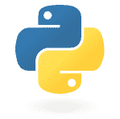

# Python 语言

> 原文： [http://zetcode.com/lang/python/python/](http://zetcode.com/lang/python/python/)

在 Python 编程教程的这一部分中，我们通常讨论 Python 编程语言。 我们展示了如何执行我们的第一个 Python 程序。

## 目标

本教程的目标是使您开始使用 Python 编程语言。 Python 是一门很棒的语言。 对于那些刚接触编程的人来说，这是一种理想的语言。 阅读完本教程后，您将有信心继续自己的学习。 您可以使用 Python 创建脚本，网站，游戏或桌面应用。 即使您不想成为程序员，Python 对于偶尔的程序员或业余爱好者来说也可能是一个很好的工具。

## Python

 Python 是一种通用的，动态的，面向对象的编程语言。 Python 语言的设计目的强调程序员的生产力和代码可读性。 Python 最初是由 Guido van Rossum 开发的。 它于 1991 年首次发布。Python 受 ABC，Haskell，Java，Lisp，Icon 和 Perl 编程语言的启发。 Python 是一种高级通用通用多平台解释型语言。

Python 是一种简约语言。 它最明显的特征之一是它不使用分号或括号。 Python 使用缩进代替。

目前，Python 有两个主要分支：Python 2.x 和 Python3.x。 Python 3.x 打破了与早期版本 Python 的向后兼容性。 它的创建是为了纠正该语言的某些设计缺陷并使其更简洁。 本教程介绍了 Python 3.x 版本。 今天，Python 由世界各地的一大批志愿者维护。 Python 是开源软件。

Python 支持多种编程样式。 它不会强迫程序员采用特定的示例。 它支持过程，面向对象和函数式编程。

Python 编程语言的官方网站是 [python.org](http://python.org)

## Python 实现

正式地，Python 编程语言是一种规范。 Python 的三个主要实现：CPython，IronPython 和 Jython。 CPython 用 C 语言实现。 它是最广泛使用的 Python 实现。 人们谈论 Python 语言时，大多指的是 CPython。 IronPython 用 C# 实现。 它是.NET 框架的一部分。 同样，Jython 是 Java 中 Python 语言的实现。 Jython 程序被转换为 Java 字节码，并由 JVM（Java 虚拟机）执行。 在本教程中，我们将使用 CPython。

## 人气

Python 属于最流行的编程语言。 多项调查将 Python 列为十大语言。 一些非常受欢迎的 Python 项目包括分布式源管理工具 Mercurial，Django Web 框架，PyQt GUI 库或称为 Yum 的包管理工具。

## Python 脚本

Unix 中的每个脚本都以 shebang 开头。 shebang 是脚本中的前两个字符：`#!`。 shebang 之后是解释器的路径，它将执行我们的脚本。 Shebangs 在 Windows 上不起作用； 但是最好将它们包括在 Windows 中，因为我们可能希望程序也可以在 Unix 上运行。

`simple.py`

```py
#!/usr/bin/env python

# simple.py

print("The Python tutorial")

```

这是我们的第一个 Python 脚本。 该脚本会将“Python 教程”字符串打印到控制台。 Python 脚本具有`.py`扩展名。

```py
$ which python
/usr/bin/python

```

我们可以使用`which`命令找出通往 Python 解释器的路径。

Python 脚本可以两种方式运行。

```py
$ python first.py
The Python tutorial

```

Python 脚本作为解释器的参数提供。

```py
$ chmod +x first.py 
$ ./first.py 
The Python tutorial

```

我们使用`chmod`命令使文件可执行。 该程序启动。

下一个示例显示了一个简单的 Ruby 脚本。

`simple.rb`

```py
#!/usr/bin/ruby

# simple.rb

fruits = ["orange", "apple", "pear", "kiwi"]
fruits.each {|fruits| puts fruits}

```

注意 shebang 和通往 Ruby 解释器的路径。

```py
$ ./ruby.rb 
orange
apple
pear
kiwi

```

这是 Ruby 脚本的输出。

最后，我们展示一个小的 Perl 脚本。

`simple.pl`

```py
#!/usr/bin/perl

# simple.pl

$perl = "Practical Extraction and Report Language\n";

print $perl;

```

现在这个概念应该很清楚了。

## Python 读取输入

`input()`函数从输入中读取一行，将其转换为字符串（将尾随换行符分隔），然后将其返回。 该函数带有一个可选参数，该参数将写入到标准输出而没有尾随换行符（如果存在）。

`read_input.py`

```py
#!/usr/bin/env python

# read_input.py

name = input("Enter your name:")
print("Hello", name)

```

该示例显示提示并从控制台读取名称。 然后将问候语打印到控制台。

```py
$ ./read_input.py 
Enter your name:Peter
Hello Peter

```

这是示例的输出。

## Python 命令行参数

Python 程序可以接收命令行参数。 `sys.argv`包含传递给 Python 脚本的命令行参数列表。 `argv[0]`是脚本名称； 其余元素是传递给脚本的参数。

`command_line_arguments.py`

```py
#!/usr/bin/env python

# command_line_arguments.py

import sys

print("Script name:", sys.argv[0])
print("Arguments:", end=" ")

for arg in sys.argv[1:]:
    print(arg, end=" ")

print()

```

该示例显示传递给脚本的命令行参数。

```py
import sys

```

我们导入`sys`模块，该模块具有`argv`变量。

```py
print("Script name:", sys.argv[0])

```

程序名称已打印。

```py
for arg in sys.argv[1:]:
    print(arg, end=" ")

```

我们浏览存储在`sys.argv`中的参数列表，并将其打印到控制台。 使用`end`选项，我们在末尾添加新空格，而不是新行。

```py
print()

```

最后，新行将打印到控制台。

```py
$ ./command_line_arguments.py 1 2 3
Script name: ./command_line_arguments.py
Arguments: 1 2 3 

```

这是示例的示例输出。

在本章中，我们介绍了 Python 语言。