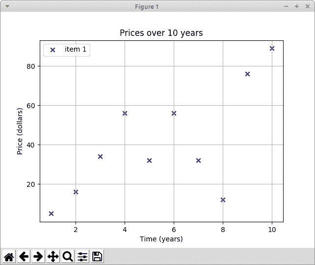
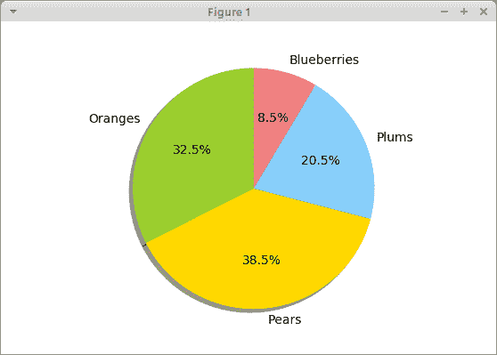

# Matplotlib 教程

> 原文： [http://zetcode.com/python/matplotlib/](http://zetcode.com/python/matplotlib/)

Matplotlib 教程展示了如何使用 Matplotlib 在 Python 中创建图表。 我们创建散点图，折线图，条形图和饼图。

## Matplotlib

Matplotlib 是用于创建图表的 Python 库。 Matplotlib 可用于 Python 脚本，Python 和 IPython shell，jupyter 笔记本，Web 应用服务器以及四个图形用户界面工具包。

## Matplotlib 安装

Matplotlib 是需要安装的外部 Python 库。

```py
$ sudo pip install matplotlib

```

我们可以使用`pip`工具安装该库。

## Matplotlib 散点图

散点图是一种图形或数学图，使用笛卡尔坐标显示一组数据的两个变量的值。

`scatter.py`

```py
#!/usr/bin/python3

import matplotlib.pyplot as plt

x_axis = [1, 2, 3, 4, 5, 6, 7, 8, 9, 10]
y_axis = [5, 16, 34, 56, 32, 56, 32, 12, 76, 89]

plt.title("Prices over 10 years")
plt.scatter(x_axis, y_axis, color='darkblue', marker='x', label="item 1")

plt.xlabel("Time (years)")
plt.ylabel("Price (dollars)")

plt.grid(True)
plt.legend()

plt.show()

```

该示例绘制了一个散点图。 该图表显示了十年内某些商品的价格。

```py
import matplotlib.pyplot as plt

```

我们从`matplotlib`模块导入`pyplot`。 它是创建图表的命令样式函数的集合。 它的操作与 MATLAB 类似。

```py
x_axis = [1, 2, 3, 4, 5, 6, 7, 8, 9, 10]
y_axis = [5, 16, 34, 56, 32, 56, 32, 12, 76, 89]

```

我们有 x 和 y 轴的数据。

```py
plt.title("Prices over 10 years")

```

通过`title()`功能，我们可以为图表设置标题。

```py
plt.scatter(x_axis, y_axis, color='darkblue', marker='x', label="item 1")

```

`scatter()`功能绘制散点图。 它接受 x 和 y 轴，标记的颜色，标记的形状和标签的数据。

```py
plt.xlabel("Time (years)")
plt.ylabel("Price (dollars)")

```

我们为轴设置标签。

```py
plt.grid(True)

```

我们用`grid()`功能显示网格。 网格由许多垂直和水平线组成。

```py
plt.legend()

```

`legend()`功能在轴上放置图例。

```py
plt.show()

```

`show()`功能显示图表。



Figure: Scatter chart

## 两个数据集

在下一个示例中，我们将另一个数据集添加到图表。

`scatter2.py`

```py
#!/usr/bin/python3

import matplotlib.pyplot as plt

x_axis1 = [1, 2, 3, 4, 5, 6, 7, 8, 9, 10]
y_axis1 = [5, 16, 34, 56, 32, 56, 32, 12, 76, 89]

x_axis2 = [1, 2, 3, 4, 5, 6, 7, 8, 9, 10]
y_axis2 = [53, 6, 46, 36, 15, 64, 73, 25, 82, 9] 

plt.title("Prices over 10 years")

plt.scatter(x_axis1, y_axis1, color='darkblue', marker='x', label="item 1")
plt.scatter(x_axis2, y_axis2, color='darkred', marker='x', label="item 2")

plt.xlabel("Time (years)")
plt.ylabel("Price (dollars)")

plt.grid(True)
plt.legend()

plt.show()

```

该图表显示两个数据集。 我们通过标记的颜色来区分它们。

```py
x_axis1 = [1, 2, 3, 4, 5, 6, 7, 8, 9, 10]
y_axis1 = [5, 16, 34, 56, 32, 56, 32, 12, 76, 89]

x_axis2 = [1, 2, 3, 4, 5, 6, 7, 8, 9, 10]
y_axis2 = [53, 6, 46, 36, 15, 64, 73, 25, 82, 9] 

```

我们有两个数据集。

```py
plt.scatter(x_axis1, y_axis1, color='darkblue', marker='x', label="item 1")
plt.scatter(x_axis2, y_axis2, color='darkred', marker='x', label="item 2")

```

我们为每个集合调用`scatter()`函数。

## Matplotlib 折线图

折线图是一种显示图表的图表，该信息显示为一系列数据点，这些数据点通过直线段相连，称为标记。

`linechart.py`

```py
#!/usr/bin/python3

import numpy as np
import matplotlib.pyplot as plt

t = np.arange(0.0, 3.0, 0.01)
s = np.sin(2.5 * np.pi * t)
plt.plot(t, s)

plt.xlabel('time (s)')
plt.ylabel('voltage (mV)')

plt.title('Sine Wave')
plt.grid(True)

plt.show()

```

该示例显示正弦波折线图。

```py
import numpy as np

```

在示例中，我们还需要`numpy`模块。

```py
t = np.arange(0.0, 3.0, 0.01)

```

`arange()`函数返回给定间隔内的均匀间隔的值列表。

```py
s = np.sin(2.5 * np.pi * t)

```

我们获得数据的`sin()`值。

```py
plt.plot(t, s)

```

我们使用`plot()`功能绘制折线图。

## Matplotlib 条形图

条形图显示带有矩形条的分组数据，其长度与它们代表的值成比例。 条形图可以垂直或水平绘制。

`barchart.py`

```py
#!/usr/bin/python3

from matplotlib import pyplot as plt
from matplotlib import style

style.use('ggplot')

x = [0, 1, 2, 3, 4, 5]
y = [46, 38, 29, 22, 13, 11]

fig, ax = plt.subplots()

ax.bar(x, y, align='center')

ax.set_title('Olympic Gold medals in London')
ax.set_ylabel('Gold medals')
ax.set_xlabel('Countries')

ax.set_xticks(x)
ax.set_xticklabels(("USA", "China", "UK", "Russia", 
    "South Korea", "Germany"))

plt.show()

```

该示例绘制了条形图。 它显示了 2012 年伦敦每个国家/地区的奥运金牌数量。

```py
style.use('ggplot')

```

可以使用预定义的样式。

```py
fig, ax = plt.subplots()

```

`subplots()`函数返回图形和轴对象。

```py
ax.bar(x, y, align='center')

```

使用`bar()`功能生成条形图。

```py
ax.set_xticks(x)
ax.set_xticklabels(("USA", "China", "UK", "Russia", 
    "South Korea", "Germany"))

```

我们为 x 轴设置国家/地区名称。

## Matplotlib 饼图

饼图是圆形图，将其分成多个切片以说明数值比例。

`piechart.py`

```py
#!/usr/bin/python3

import matplotlib.pyplot as plt

labels = ['Oranges', 'Pears', 'Plums', 'Blueberries']
quantity = [38, 45, 24, 10]

colors = ['yellowgreen', 'gold', 'lightskyblue', 'lightcoral']

plt.pie(quantity, labels=labels, colors=colors, autopct='%1.1f%%', 
    shadow=True, startangle=90)

plt.axis('equal')

plt.show()

```

该示例创建一个饼图。

```py
labels = ['Oranges', 'Pears', 'Plums', 'Blueberries']
quantity = [38, 45, 24, 10]

```

我们有标签和相应的数量。

```py
colors = ['yellowgreen', 'gold', 'lightskyblue', 'lightcoral']

```

我们为饼图的切片定义颜色。

```py
plt.pie(quantity, labels=labels, colors=colors, autopct='%1.1f%%', 
    shadow=True, startangle=90)

```

饼图是通过`pie()`功能生成的。 `autopct`负责在图表的楔形图中显示百分比。

```py
plt.axis('equal')

```

我们设置了相等的长宽比，以便将饼图绘制为圆形。



Figure: Pie chart

在本教程中，我们使用 Matplotlib 库创建了散点图，折线图，条形图和饼图。

您可能也对以下相关教程感兴趣： [PrettyTable 教程](/python/prettytable/)， [Tkinter 教程](/tkinter/)， [SymPy 教程](/python/sympy/)， [Python 枕头教程](/python/pillow/)， [PyQt5 教程](/gui/pyqt5/)和 [Python 教程](/lang/python/)。