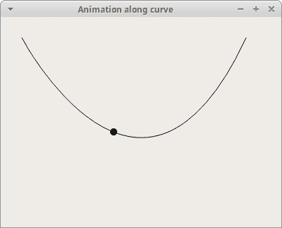

# PyQt 中的`QPropertyAnimation`

> 原文： [http://zetcode.com/pyqt/qpropertyanimation/](http://zetcode.com/pyqt/qpropertyanimation/)

PyQt 中的 QPropertyAnimation 显示了如何使用`QPropertyAnimation`在 PyQt 中创建动画。 在示例中，我们对对象的大小，颜色和位置进行了动画处理。 来源和球图像可以在作者的 Github [仓库](https://github.com/janbodnar/pyqt-qpropertyanimation)中找到。

## `QPropertyAnimation`

`QPropertyAnimation`内插 PyQt 属性。 声明属性的类必须为为`QObject`。

## `QPropertyAnimation`方法

下表显示了一些重要的`QPropertyAnimation`方法：

| 名称 | 描述 |
| --- | --- |
| `start()` | 开始动画 |
| `stop()` | 终止动画 |
| `setStartValue()` | 设置动画的起始值 |
| `setEndValue()` | 设置动画的结束值 |
| `setDuration()` | 设置动画的持续时间，以毫秒为单位 |
| `setKeyValueAt()` | 在给定步骤以给定值创建关键帧 |
| `setLoopCount()` | 设置动画的重复次数 |

## 使用`QPropertyAnimation`设置动画大小

在第一个示例中，我们为小部件的大小设置动画。

`size_anim.py`

```py
#!/usr/bin/python3
# -*- coding: utf-8 -*-

'''
ZetCode Advanced PyQt5 tutorial 

This program animates the size of a
widget with QPropertyAnimation.

Author: Jan Bodnar
Website: zetcode.com 
Last edited: August 2017
'''

from PyQt5.QtWidgets import QWidget, QApplication, QFrame, QPushButton
from PyQt5.QtCore import QRect, QPropertyAnimation
import sys

class Example(QWidget):

    def __init__(self):
        super().__init__()

        self.initUI()

    def initUI(self):

        self.button = QPushButton("Start", self)
        self.button.clicked.connect(self.doAnim)
        self.button.move(30, 30)

        self.frame = QFrame(self)
        self.frame.setFrameStyle(QFrame.Panel | QFrame.Raised)
        self.frame.setGeometry(150, 30, 100, 100)

        self.setGeometry(300, 300, 380, 300)
        self.setWindowTitle('Animation')
        self.show()        

    def doAnim(self):

        self.anim = QPropertyAnimation(self.frame, b"geometry")
        self.anim.setDuration(10000)
        self.anim.setStartValue(QRect(150, 30, 100, 100))
        self.anim.setEndValue(QRect(150, 30, 200, 200))
        self.anim.start()

if __name__ == "__main__":

    app = QApplication([])
    ex = Example()
    ex.show()
    app.exec_()

```

该示例对`QFrame`小部件的大小进行动画处理。

```py
self.button = QPushButton("Start", self)
self.button.clicked.connect(self.doAnim)
self.button.move(30, 30)

```

动画以`QPushButton`开始。

```py
self.anim = QPropertyAnimation(self.frame, b"geometry")

```

`QPropertyAnimation`已创建。 第一个参数是要动画的目标对象； 在我们的例子中，我们为`QFrame`小部件设置了动画。 第二个参数是将要更改的属性。

```py
self.anim.setDuration(10000)

```

`setDuration()`设置动画的持续时间（以毫秒为单位）。

```py
self.anim.setStartValue(QRect(150, 30, 100, 100))
self.anim.setEndValue(QRect(150, 30, 200, 200))

```

使用`setStartValue()`和`setEndValue()`分别定义动画的开始和结束值。

```py
self.anim.start()

```

动画从`start()`方法开始。

## 使用`QPropertyAnimation`设置颜色的动画

下面的示例对小部件的颜色进行动画处理。 由于没有颜色属性，因此我们必须创建一个。

`color_anim.py`

```py
#!/usr/bin/python3
# -*- coding: utf-8 -*-

'''
ZetCode Advanced PyQt5 tutorial 

This programs animates the color of a QLabel.

Author: Jan Bodnar
Website: zetcode.com 
Last edited: August 2017
'''

from PyQt5.QtWidgets import (QWidget, QApplication, QPushButton, 
        QLabel, QHBoxLayout, QSizePolicy)
from PyQt5.QtGui import QColor
from PyQt5.QtCore import QPropertyAnimation, pyqtProperty
import sys

class MyLabel(QLabel):

    def __init__(self, text):
        super().__init__(text)

    def _set_color(self, col):

        palette = self.palette()
        palette.setColor(self.foregroundRole(), col)
        self.setPalette(palette)

    color = pyqtProperty(QColor, fset=_set_color)

class Example(QWidget):

    def __init__(self):
        super().__init__()

        self.initUI()

    def initUI(self):     

        hbox = QHBoxLayout(self)

        self.button = QPushButton("Start", self)
        self.button.setSizePolicy(QSizePolicy.Fixed, QSizePolicy.Fixed)
        hbox.addWidget(self.button)

        hbox.addSpacing(40)

        self.label = MyLabel("Summer")
        font = self.label.font()
        font.setPointSize(35)
        self.label.setFont(font)
        hbox.addWidget(self.label)

        self.anim = QPropertyAnimation(self.label, b"color")
        self.anim.setDuration(2500)
        self.anim.setLoopCount(2)
        self.anim.setStartValue(QColor(0, 0, 0))
        self.anim.setEndValue(QColor(255, 255, 255))

        self.button.clicked.connect(self.anim.start)

        self.setGeometry(300, 300, 380, 250)
        self.setWindowTitle('Color anim')
        self.show()    

if __name__ == "__main__":

    app = QApplication([])
    ex = Example()
    ex.show()
    app.exec_()

```

该示例逐渐更改`QLabel`的颜色值。

```py
class MyLabel(QLabel):

    def __init__(self, text):
        super().__init__(text)

    def _set_color(self, col):

        palette = self.palette()
        palette.setColor(self.foregroundRole(), col)
        self.setPalette(palette)

    color = pyqtProperty(QColor, fset=_set_color)

```

`QLabel`没有颜色属性； 因此，我们用`pyqtProperty`定义一个。 更改此属性将更新标签的颜色。

```py
self.anim = QPropertyAnimation(self.label, b"color")

```

`QPropertyAnimation`更改标签窗口小部件的`color`属性。

```py
self.anim.setLoopCount(2)

```

使用`setLoopCount()`方法，我们可以更改动画运行的次数。

```py
self.anim.setStartValue(QColor(0, 0, 0))
self.anim.setEndValue(QColor(255, 255, 255))

```

我们设置开始和结束颜色值。

## 使用`QPropertyAnimation`沿曲线动画

以下示例使球沿贝塞尔曲线动画。

`anim_along_curve.py`

```py
#!/usr/bin/python3
# -*- coding: utf-8 -*-

'''
ZetCode Advanced PyQt5 tutorial

This programs animates a ball object 
along a curve.

Author: Jan Bodnar
Website: zetcode.com
Last edited: August 2017
'''

from PyQt5.QtWidgets import QApplication, QWidget, QLabel
from PyQt5.QtGui import QPainter, QPixmap, QPainterPath
from PyQt5.QtCore import QObject, QPointF, QPropertyAnimation, pyqtProperty
import sys

class Ball(QLabel):

    def __init__(self, parent):
        super().__init__(parent)

        pix = QPixmap("ball.png")
        self.h = pix.height()
        self.w = pix.width()

        self.setPixmap(pix)

    def _set_pos(self, pos):

        self.move(pos.x() - self.w/2, pos.y() - self.h/2)

    pos = pyqtProperty(QPointF, fset=_set_pos)   

class Example(QWidget):

    def __init__(self):
        super().__init__()

        self.initView()
        self.initAnimation()

    def initView(self):    

        self.path = QPainterPath()
        self.path.moveTo(30, 30)
        self.path.cubicTo(30, 30, 200, 350, 350, 30)        

        self.ball = Ball(self)

        self.ball.pos = QPointF(30, 30)

        self.setWindowTitle("Animation along curve")
        self.setGeometry(300, 300, 400, 300)
        self.show()

    def paintEvent(self, e):    

        qp = QPainter()
        qp.begin(self)
        qp.setRenderHint(QPainter.Antialiasing)   
        qp.drawPath(self.path)
        qp.end()             

    def initAnimation(self):

        self.anim = QPropertyAnimation(self.ball, b'pos')
        self.anim.setDuration(7000)

        self.anim.setStartValue(QPointF(30, 30))

        vals = [p/100 for p in range(0, 101)]

        for i in vals:
            self.anim.setKeyValueAt(i, self.path.pointAtPercent(i))  

        self.anim.setEndValue(QPointF(350, 30))        
        self.anim.start()

if __name__ == '__main__':

    app = QApplication(sys.argv)
    ex = Example()
    sys.exit(app.exec_())

```

该示例在窗口上绘制一条曲线。 沿绘制的曲线为球对象设置动画。

```py
class Ball(QLabel):

    def __init__(self, parent):
        super().__init__(parent)

        pix = QPixmap("ball.png")
        self.h = pix.height()
        self.w = pix.width()

        self.setPixmap(pix)

```

球显示在`QLabel`小部件中。

```py
def _set_pos(self, pos):

    self.move(pos.x() - self.w/2, pos.y() - self.h/2)

pos = pyqtProperty(QPointF, fset=_set_pos)   

```

我们调整球的位置； 我们希望将标签的中间放置在曲线上。

```py
self.path = QPainterPath()
self.path.moveTo(30, 30)
self.path.cubicTo(30, 30, 200, 350, 350, 30) 

```

贝塞尔曲线是用`QPainterPath`创建的。 其`cubicTo()`方法以起点，控制点和终点为参数。

```py
def paintEvent(self, e):    

    qp = QPainter()
    qp.begin(self)
    qp.setRenderHint(QPainter.Antialiasing)   
    qp.drawPath(self.path)
    qp.end() 

```

在`paintEvent()`方法中使用`drawPath()`方法绘制曲线。

```py
self.anim = QPropertyAnimation(self.ball, b'pos')

```

我们用`QPropertyAnimation`为球的`pos`属性设置动画。

```py
vals = [p/100 for p in range(0, 101)]

```

通过 Python 列表推导式，我们创建了动画步骤列表。 步长是介于 0 和 1 之间的值。

```py
for i in vals:
    self.anim.setKeyValueAt(i, self.path.pointAtPercent(i))  

```

使用`setKeyValueAt()`，我们定义给定步骤中球的位置。 使用`pointAtPercent()`，我们可以在路径的给定百分比处获得`QPointF`。



图：沿曲线的动画

## 图形视图框架中的`QPropertyAnimation`

`QPropertyAnimation`可以在 Graphics View Framework 中为图形项目设置动画。 动画对象必须继承自`QObject`和`QGraphicsItem`。

`gvf_anim.py`

```py
#!/usr/bin/python3
# -*- coding: utf-8 -*-

'''
ZetCode Advanced PyQt5 tutorial

This programs animates a ball object. 

Author: Jan Bodnar
Website: zetcode.com
Last edited: August 2017
'''

from PyQt5.QtWidgets import (QApplication, QGraphicsView, 
        QGraphicsPixmapItem, QGraphicsScene)
from PyQt5.QtGui import QPainter, QPixmap
from PyQt5.QtCore import (QObject, QPointF, 
        QPropertyAnimation, pyqtProperty)
import sys

class Ball(QObject):

    def __init__(self):
        super().__init__()

        self.pixmap_item = QGraphicsPixmapItem(QPixmap("ball.png"))

    def _set_pos(self, pos):
        self.pixmap_item.setPos(pos)

    pos = pyqtProperty(QPointF, fset=_set_pos)        

class Example(QGraphicsView):

    def __init__(self):
        super().__init__()

        self.initView()

    def initView(self):    

        self.ball = Ball()

        self.anim = QPropertyAnimation(self.ball, b'pos')
        self.anim.setDuration(8000)
        self.anim.setStartValue(QPointF(5, 30))

        self.anim.setKeyValueAt(0.3, QPointF(80, 30))                   
        self.anim.setKeyValueAt(0.5, QPointF(200, 30))
        self.anim.setKeyValueAt(0.8, QPointF(250, 250))

        self.anim.setEndValue(QPointF(290, 30))

        self.scene = QGraphicsScene(self)
        self.scene.setSceneRect(0, 0, 300, 300)
        self.scene.addItem(self.ball.pixmap_item)
        self.setScene(self.scene)

        self.setWindowTitle("Ball animation")
        self.setRenderHint(QPainter.Antialiasing)        
        self.setGeometry(300, 300, 500, 350)

        self.anim.start()

        self.show()

if __name__ == '__main__':

    app = QApplication(sys.argv)
    ex = Example()
    sys.exit(app.exec_())

```

该示例在 Graphics View Framework 中使用`QPropertyAnimation`为球对象设置动画。

```py
class Ball(QObject):

    def __init__(self):
        super().__init__()

        self.pixmap_item = QGraphicsPixmapItem(QPixmap("ball.png"))

    def _set_pos(self, pos):
        self.pixmap_item.setPos(pos)

    pos = pyqtProperty(QPointF, fset=_set_pos) 

```

Sice PyQt 不支持多重继承，我们使用合成技术来满足前面提到的条件。

```py
class Example(QGraphicsView):

    def __init__(self):
        super().__init__()

        self.initView()

```

`QGraphicsView`在可滚动视口中可视化`QGraphicsScene`的内容。

```py
self.anim = QPropertyAnimation(self.ball, b'pos')

```

我们将使用`QPropertyAnimation`为球对象的`position`属性设置动画。

```py
self.anim.setDuration(8000)

```

动画持续八秒钟。

```py
self.anim.setKeyValueAt(0.3, QPointF(80, 30))                   
self.anim.setKeyValueAt(0.5, QPointF(200, 30))
self.anim.setKeyValueAt(0.8, QPointF(250, 250))

```

使用`setKeyValueAt()`方法，我们在给定步骤创建具有给定值的关键帧。 换句话说，我们定义了动画给定步骤中球的位置。

```py
self.scene = QGraphicsScene(self)
self.scene.setSceneRect(0, 0, 300, 300)
self.scene.addItem(self.ball.pixmap_item)

```

创建`QGraphicsScene`并将球添加到场景中。 它提供了一个用于管理大量 2D 图形项目的界面。 注意，我们将`ball`属性添加到场景中，而不是`ball`对象。

在本教程中，我们使用`QPropertyAnimation`创建了动画。

您可能也对以下相关教程感兴趣： [PyQt5 教程](/gui/pyqt5/)， [`QNetworkAccessManager`教程](/pyqt/qnetworkaccessmanager/)和 [Python 教程](/lang/python/)。