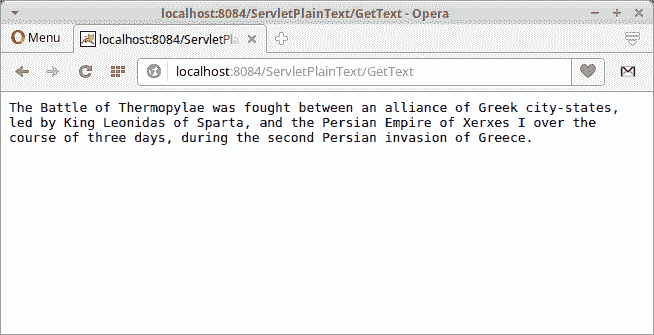

# 从 Java Servlet 提供纯文本

> 原文： [http://zetcode.com/articles/javaservlettext/](http://zetcode.com/articles/javaservlettext/)

在 Java Servlet 文本教程中，我们展示了如何从 Java Servlet 返回纯文本。 该 Web 应用已部署在 Tomcat 服务器上。

Servlet 是 Java 类，可响应特定类型的网络请求-最常见的是 HTTP 请求。 Java servlet 用于创建 Web 应用。 它们在 servlet 容器（例如 Tomcat 或 Jetty）中运行。 现代 Java Web 开发使用在 servlet 之上构建的框架。

Apache Tomcat 是由 Apache 软件基金会（ASF）开发的开源 Java Servlet 容器。 它是最流行的 Java Web 服务器。

## Java servlet 应用

以下 Web 应用使用 Java Servlet 将纯文本发送到客户端。 从资源目录中的文件中读取文本。

```java
$ tree
.
├── pom.xml
└── src
    ├── main
    │   ├── java
    │   │   └── com
    │   │       └── zetcode
    │   │           ├── util
    │   │           │   └── ReadTextUtil.java
    │   │           └── web
    │   │               └── GetText.java
    │   ├── resources
    │   │   └── thermopylae.txt
    │   └── webapp
    │       ├── index.html
    │       └── META-INF
    │           └── context.xml
    └── test
        └── java

```

这是项目结构。

`pom.xml`

```java
<?xml version="1.0" encoding="UTF-8"?>
<project xmlns="http://maven.apache.org/POM/4.0.0" 
         xmlns:xsi="http://www.w3.org/2001/XMLSchema-instance" 
         xsi:schemaLocation="http://maven.apache.org/POM/4.0.0 
http://maven.apache.org/xsd/maven-4.0.0.xsd">

    <modelVersion>4.0.0</modelVersion>

    <groupId>com.zetcode</groupId>
    <artifactId>ServletPlainText</artifactId>
    <version>1.0-SNAPSHOT</version>
    <packaging>war</packaging>

    <name>ServletPlainText</name>

    <properties>
        <project.build.sourceEncoding>UTF-8</project.build.sourceEncoding>
        <maven.compiler.source>1.8</maven.compiler.source>
        <maven.compiler.target>1.8</maven.compiler.target>
    </properties>

    <dependencies>

        <dependency>
            <groupId>javax.servlet</groupId>
            <artifactId>javax.servlet-api</artifactId>
            <version>3.1.0</version>
            <scope>provided</scope>
        </dependency>

        <dependency>
            <groupId>com.google.guava</groupId>
            <artifactId>guava</artifactId>
            <version>21.0</version>
        </dependency>        

        <dependency>
            <groupId>com.google.code.gson</groupId>
            <artifactId>gson</artifactId>
            <version>2.8.0</version>
        </dependency>

    </dependencies>

    <build>
        <plugins>

            <plugin>
                <groupId>org.apache.maven.plugins</groupId>
                <artifactId>maven-war-plugin</artifactId>
                <version>2.3</version>
                <configuration>
                    <failOnMissingWebXml>false</failOnMissingWebXml>
                </configuration>
            </plugin>

        </plugins>
    </build>
</project>

```

这是 Maven POM 文件。 我们有三个工件：用于 servlet 的`javax.servlet-api`，用于 Java JSON 处理的`gson`和`guava`通用库。 `maven-war-plugin`负责收集 Web 应用的所有工件依赖项，类和资源，并将它们打包到 Web 应用存档（WAR）中。

`context.xml`

```java
<?xml version="1.0" encoding="UTF-8"?>
<Context path="/ServletPlainText"/>

```

在 Tomcat `context.xml`文件中，我们定义了上下文路径。 它是 Web 应用的名称。

`thermopylae.txt`

```java
The Battle of Thermopylae was fought between an alliance of Greek city-states, 
led by King Leonidas of Sparta, and the Persian Empire of Xerxes I over the 
course of three days, during the second Persian invasion of Greece. 

```

这是要从 Web 应用读取并发送到客户端的文本文件。

`GetText.java`

```java
package com.zetcode.web;

import com.zetcode.util.ReadTextUtil;
import java.io.IOException;
import javax.servlet.ServletException;
import javax.servlet.ServletOutputStream;
import javax.servlet.annotation.WebServlet;
import javax.servlet.http.HttpServlet;
import javax.servlet.http.HttpServletRequest;
import javax.servlet.http.HttpServletResponse;

@WebServlet(name = "GetText", urlPatterns = {"/GetText"})
public class GetText extends HttpServlet {

    @Override
    protected void doGet(HttpServletRequest request, HttpServletResponse response)
            throws ServletException, IOException {

        response.setContentType("text/plain;charset=UTF-8");

        ServletOutputStream sout = response.getOutputStream();
        String content = ReadTextUtil.getContents();

        sout.print(content);
    }
}

```

这是`GetText` servlet。 它从位于资源目​​录中的文本文件中读取数据，并将文本以纯文本格式发送到客户端。

```java
response.setContentType("text/plain;charset=UTF-8");

```

我们将响应对象的内容类型设置为`text/plain`。

```java
ServletOutputStream sout = response.getOutputStream();

```

我们得到了`ServletOutputStream`，用于将字符文本发送到客户端。

```java
String content = ReadTextUtil.getContents();

```

我们将文本读入`content`变量。

```java
sout.print(content);

```

文本内容被写入作者。

`ReadTextUtil.java`

```java
package com.zetcode.util;

import com.google.common.base.Charsets;
import com.google.common.io.Files;
import java.io.File;
import java.io.IOException;
import java.net.URISyntaxException;
import java.net.URL;
import java.util.logging.Level;
import java.util.logging.Logger;

public class ReadTextUtil {

    public static String getContents()  {

        String data = null;
        String fileName = "thermopylae.txt";

        URL url = ReadTextUtil.class.getClassLoader().getResource(fileName);

        try {
            data = Files.toString(new File(url.toURI()), Charsets.UTF_8);
        } catch (IOException | URISyntaxException ex) {
            Logger.getLogger(ReadTextUtil.class.getName()).log(Level.SEVERE, null, ex);
        }

        return data;
    }
}

```

`ReadTextUtil`是用于读取文件内容的实用程序类。

```java
URL url = ReadTextUtil.class.getClassLoader().getResource(fileName);

```

我们使用`getResource()`方法获取文件资源。

```java
data = Files.toString(new File(url.toURI()), Charsets.UTF_8);

```

我们使用 Guava 的`Files.toString()`方法一次读取整个文件。

`index.html`

```java
<!DOCTYPE html>
<html>
    <head>
        <title>Start Page</title>
        <meta charset="UTF-8">
        <meta name="viewport" content="width=device-width, initial-scale=1">
    </head>
    <body>
        <a href="GetText">Get text</a>
    </body>
</html>

```

这是主页。 它包含一个调用`GetText` servlet 的链接。

```java
$ curl -I localhost:8084/ServletPlainText/GetText
HTTP/1.1 200 OK
Server: Apache-Coyote/1.1
Content-Type: text/plain;charset=UTF-8
Content-Length: 225
Date: Fri, 24 Nov 2017 15:21:57 GMT

```

我们使用`curl`命令获取响应的标题。 从服务器输出中，我们可以看到内容类型是文本。



Figure: Showing plain text in a browser

该图显示了 Opera 浏览器中的文本。

在本教程中，我们从 Java servlet 发送了文本数据。

您可能也对以下相关教程感兴趣： [Java servlet 教程](/articles/javaservlet/)， [Java servlet JSON 教程](/articles/javaservletjson/)， [Java ServletConfig 教程](/articles/javaservletconfig/)， [Java Servlet PDF 教程[](/articles/javaservletpdf/) ， [Java HttpServletMapping](/java/httpservletmapping/) ， [Java servlet 图像教程](/articles/javaservletimage/)， [Java Servlet HTTP 标头](/articles/javaservlethttpheaders/)或 [Java 教程](/lang/java/)