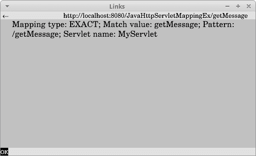

# Java HttpServletMapping

> 原文： [http://zetcode.com/java/httpservletmapping/](http://zetcode.com/java/httpservletmapping/)

Java HttpServletMapping 显示了如何使用 Servlet 4.0 中引入的 HttpServletMapping。

## HttpServletMapping

`HttpServletMapping`是新的 Servlet 4.0 API，可用于 URL 映射的运行时发现。

Servlet 映射是从`HttpServletRequest`实例获得的，该实例具有四种方法：

*   getMappingMatch（）—返回匹配的类型
*   getPattern（）—返回激活 servlet 请求的 URL 模式
*   getMatchValue（）—返回匹配的字符串
*   getServletName（）—返回被请求激活的 servlet 类的全限定名

## Java HttpServletMapping 示例

在下面的示例中，我们使用`HttpServletMapping`查找有关 URL 映射的信息。 该示例在 Tomcat 上运行。 注意，我们必须选择具有 Servlet 4.0 API JAR 的最新 Tomcat 版本。

```
$ tree
.
├── nb-configuration.xml
├── pom.xml
└── src
    ├── main
    │   ├── java
    │   │   └── com
    │   │       └── zetcode
    │   │           └── MyServlet.java
    │   └── webapp
    │       ├── index.html
    │       ├── META-INF
    │       │   └── context.xml
    │       └── WEB-INF
    └── test
        └── java

```

这是项目结构。

`MyServlet.java`

```
package com.zetcode;

import java.io.IOException;
import javax.servlet.ServletException;
import javax.servlet.ServletOutputStream;
import javax.servlet.annotation.WebServlet;
import javax.servlet.http.HttpServlet;
import javax.servlet.http.HttpServletMapping;
import javax.servlet.http.HttpServletRequest;
import javax.servlet.http.HttpServletResponse;

@WebServlet(name = "MyServlet", urlPatterns = {"/getMessage"})
public class MyServlet extends HttpServlet {

    @Override
    protected void doGet(HttpServletRequest request, HttpServletResponse response)
            throws ServletException, IOException {

        response.setContentType("text/plain;charset=UTF-8");

        HttpServletMapping mapping = request.getHttpServletMapping();
        String mapName = mapping.getMappingMatch().name();
        String value = mapping.getMatchValue();
        String pattern = mapping.getPattern();
        String servletName = mapping.getServletName();

        StringBuilder builder = new StringBuilder();
        builder.append("Mapping type: ").append(mapName)
                .append("; Match value: ").append(value)
                .append("; Pattern: ").append(pattern)
                .append("; Servlet name: ").append(servletName);

        ServletOutputStream out = response.getOutputStream();
        out.println(builder.toString());
    }
}

```

我们获取映射信息，并将其作为文本数据发送给客户端。

```
@WebServlet(name = "MyServlet", urlPatterns = {"/getMessage"})

```

我们设置与`@WebServlet`声明绑定 servlet 的 URL 模式。

```
HttpServletMapping mapping = request.getHttpServletMapping();
String mapName = mapping.getMappingMatch().name();
String value = mapping.getMatchValue();
String pattern = mapping.getPattern();
String servletName = mapping.getServletName();

```

从请求对象中，我们获得`getHttpServletMapping()`的 servlet 映射。 我们调用所有四个方法。

```
StringBuilder builder = new StringBuilder();
builder.append("Mapping type: ").append(mapName)
        .append("; Match value: ").append(value)
        .append("; Pattern: ").append(pattern)
        .append("; Servlet name: ").append(servletName);

```

根据数据，我们构建一个字符串。

```
ServletOutputStream out = response.getOutputStream();
out.println(builder.toString());

```

我们将字符串发送给客户。

`index.html`

```
<!DOCTYPE html>
<html>
    <head>
        <title>Home Page</title>
        <meta charset="UTF-8">
    </head>
    <body>
        <a href="getMessage">Get message</a>
    </body>
</html>

```

这是一个主页。 它具有一个调用 servlet 的链接。



Figure: HttpServletMapping details

在本教程中，我们展示了如何使用 Servlet 4.0 中引入的新`HttpServletMapping` API。 您可能也对相关教程感兴趣： [Java FileInputStream 教程](/java/fileinputstream/)，[提供 Java Servlet](/articles/javaservlettext/) ， [Java Servlet 教程](/articles/javaservlet/)， [Java ServletConfig 教程](/articles/javaservletconfig/)和 [Java 教程](/lang/java/)。