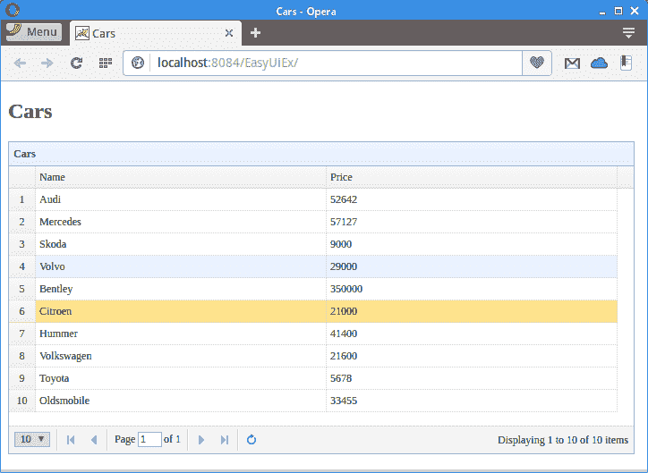

# EasyUI datagrid 

> 原文： [http://zetcode.com/articles/easyuidatagrid/](http://zetcode.com/articles/easyuidatagrid/)

在本教程中，我们将展示如何在 EasyUI datagrid 组件中显示来自 Derby 的数据库数据。 我们创建了一个简单的 Java Web 应用，该应用从 Derby 数据库中读取数据并将其发送到客户端浏览器。 数据显示在 datagrid 组件中。

## EasyUI

EasyUI 是一个 JavaScript 库，它提供了用于构建现代的，交互式 JavaScript 应用的基本功能。 EasyUI 为前端提供了许多有用的组件。 EasyUI 建立在 JQuery 之上。

Apache Derby 是完全用 Java 实现的开源关系数据库。 它占地面积小，易于部署和安装。 它支持嵌入式和客户端/服务器模式。 它也被称为 Java DB。

`cars.sql`

```java
CREATE TABLE CARS(ID INTEGER NOT NULL PRIMARY KEY GENERATED ALWAYS AS IDENTITY 
    (START WITH 1, INCREMENT BY 1), NAME VARCHAR(30), PRICE INT);

INSERT INTO CARS(NAME, PRICE) VALUES('Audi', 52642);
INSERT INTO CARS(NAME, PRICE) VALUES('Mercedes', 57127);
INSERT INTO CARS(NAME, PRICE) VALUES('Skoda', 9000);
INSERT INTO CARS(NAME, PRICE) VALUES('Volvo', 29000);
INSERT INTO CARS(NAME, PRICE) VALUES('Bentley', 350000);
INSERT INTO CARS(NAME, PRICE) VALUES('Citroen', 21000);
INSERT INTO CARS(NAME, PRICE) VALUES('Hummer', 41400);
INSERT INTO CARS(NAME, PRICE) VALUES('Volkswagen', 21600);

```

在我们的示例中，我们使用此数据库表。

```java
<dependencies>
    <dependency>
        <groupId>javax</groupId>
        <artifactId>javaee-web-api</artifactId>
        <version>7.0</version>
        <scope>provided</scope>
    </dependency>

    <dependency>
        <groupId>org.apache.derby</groupId>
        <artifactId>derbyclient</artifactId>
        <version>10.12.1.1</version>
    </dependency>    

    <dependency>
        <groupId>com.googlecode.json-simple</groupId>
        <artifactId>json-simple</artifactId>
        <version>1.1.1</version>
    </dependency>

    <dependency>
        <groupId>org.apache.derby</groupId>
        <artifactId>derbyoptionaltools</artifactId>
        <version>10.12.1.1</version>
    </dependency>

</dependencies>

```

在项目中，我们使用这四个依赖项。 `javaee-web-api`是一组用于构建 Java Web 应用的 JAR，`derbyclient`是 Derby 数据库驱动程序，`json-simple`是用于 JSON 的库，`derbyoptionaltools`用于将 SQL 结果集转换为 JSON 。

`index.html`

```java
<!DOCTYPE html>
<html>
    <head>
        <meta http-equiv="Content-Type" content="text/html; charset=UTF-8">
        <title>Cars</title>
        <link rel="stylesheet" type="text/css" href="http://www.jeasyui.com/easyui/themes/default/easyui.css">
        <link rel="stylesheet" type="text/css" href="http://www.jeasyui.com/easyui/themes/color.css">
        <script src="https://code.jquery.com/jquery-3.1.0.min.js"></script>
        <script type="text/javascript" src="http://www.jeasyui.com/easyui/jquery.easyui.min.js"></script>

    </head>
    <body>
        <h2>Cars</h2>

        <table id="dg" title="Cars" class="easyui-datagrid" style="width:700px;height:350px"
               url="GetCars"
               pagination="true"
               rownumbers="true" fitColumns="true" singleSelect="true">
            <thead>
                <tr>
                    <th field="NAME" width="50">Name</th>
                    <th field="PRICE" width="50">Price</th>
                </tr>
            </thead>
        </table>

    </body>
</html>

```

在`index.html`文件中，我们导入 EasyUI 和 JQuery 库。 我们使用 EasyUI 数据网格组件，该组件通过`class`属性设置。 `url`属性指向 Java Servlet，该 Java Servlet 以 JSON 格式返回数据。 行字段的名称必须与从 Servlet 返回的 JSON 数据的字段名称匹配。 JSON 是一种流行的轻量级数据交换格式。

`GetCars.java`

```java
package com.zetcode.web;

import com.zetcode.service.CarService;
import java.io.IOException;
import javax.servlet.ServletException;
import javax.servlet.annotation.WebServlet;
import javax.servlet.http.HttpServlet;
import javax.servlet.http.HttpServletRequest;
import javax.servlet.http.HttpServletResponse;
import org.json.simple.JSONArray;

@WebServlet(name = "GetCars", urlPatterns = {"/GetCars"})
public class GetCars extends HttpServlet {

    protected void processRequest(HttpServletRequest request, HttpServletResponse response)
            throws ServletException, IOException {

        response.setContentType("application/json");
        response.setCharacterEncoding("UTF-8");

        JSONArray ar = CarService.getCarsJSON();

        response.getWriter().write(ar.toJSONString());
    }

    @Override
    protected void doGet(HttpServletRequest request, HttpServletResponse response)
            throws ServletException, IOException {

        processRequest(request, response);
    }

    @Override
    protected void doPost(HttpServletRequest request, HttpServletResponse response)
            throws ServletException, IOException {

        processRequest(request, response);
    }
}

```

`GetCars` Java servlet 调用服务方法，该方法从 Derby 数据库表中检索数据。

```java
response.setContentType("application/json");

```

我们将内容类型设置为`application/json`。

```java
JSONArray ar = CarService.getCarsJSON();

```

`getCarsJSON()`方法以 JSON 格式返回数据。

```java
response.getWriter().write(ar.toJSONString());

```

数据发送到客户端。

`CarService.java`

```java
package com.zetcode.service;

import com.zetcode.web.GetCars;
import java.sql.Connection;
import java.sql.DriverManager;
import java.sql.PreparedStatement;
import java.sql.ResultSet;
import java.sql.SQLException;
import java.util.logging.Level;
import java.util.logging.Logger;
import org.apache.derby.optional.api.SimpleJsonUtils;
import org.json.simple.JSONArray;

public class CarService {

    private static JSONArray jarray;

    public static JSONArray getCarsJSON() {

        Connection con = null;
        PreparedStatement pst = null;
        ResultSet rs = null;

        String url = "jdbc:derby://localhost:1527/testdb";

        String user = "app";
        String password = "app";

        try {

            DriverManager.registerDriver(new org.apache.derby.jdbc.ClientDriver());
            con = DriverManager.getConnection(url, user, password);
            pst = con.prepareStatement("SELECT NAME, PRICE FROM Cars");
            rs = pst.executeQuery();

            jarray = SimpleJsonUtils.toJSON(rs);

        } catch (SQLException ex) {

            Logger lgr = Logger.getLogger(GetCars.class.getName());
            lgr.log(Level.SEVERE, ex.getMessage(), ex);

        } finally {

            try {
                if (rs != null) {
                    rs.close();
                }
                if (pst != null) {
                    pst.close();
                }
                if (con != null) {
                    con.close();
                }

            } catch (SQLException ex) {
                Logger lgr = Logger.getLogger(GetCars.class.getName());
                lgr.log(Level.WARNING, ex.getMessage(), ex);
            }
        }

        return jarray;
    }
}

```

`GetCars()`方法连接到 Derby 数据库并执行`SELECT`语句； 返回的数据将转换为 JSON。 JDBC 用于执行 SQL。

```java
pst = con.prepareStatement("SELECT NAME, PRICE FROM Cars");

```

我们从表中检索两列：名称和价格。

```java
jarray = SimpleJsonUtils.toJSON(rs);

```

我们使用`SimpleJsonUtils.toJSON()`方法将结果集转换为 JSON 对象数组。 该方法在 Derby 可选工具库中可用。



Figure: Displaying database data in a datagrid

在本文中，我们展示了如何在数据网格控件中显示 Derby 数据库中的数据库数据。 数据已使用 JSON 格式从数据库发送到 datagrid。

您可能也对以下相关教程感兴趣：[数据表 JSON 服务器教程](/articles/datatablesjsonserver/)， [Tomcat Derby 教程](/java/tomcatderby/)， [Apache Derby 教程](/db/apachederbytutorial/)，[使用 jsGrid 教程](/articles/jsgridservlet/)， [jQuery 自动完成教程](/articles/jqueryautocomplete/)，[在 EasyUI 数据网格中显示来自 Derby 的数据](/articles/easyuidatagrid/)，[在 JSP 和 PHP 中使用 jQuery DatePicker](/articles/jquerydatepicker/) 和 [Java 教程](/lang/java/)。