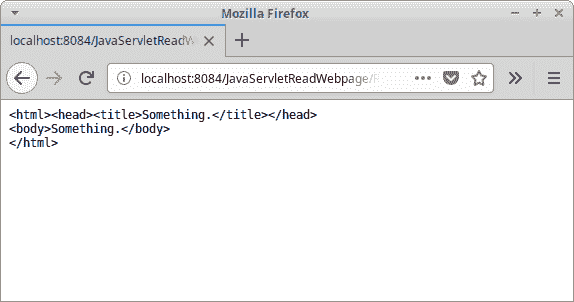

# Java Servlet 读取网页

> [http://zetcode.com/articles/javaservletreadwebpage/](http://zetcode.com/articles/javaservletreadwebpage/)

Java Servlet 读取网页教程向您展示了如何使用 Servlet 在 Java Web 应用程序中读取网页。

## Java Servlet

Servlet 是响应网络请求的 Java 类。 Java servlet 用于构建 Web 应用程序。 它们在 servlet 容器（例如 Tomcat 或 Jetty）中运行。 现代 Java Web 开发使用的框架是在 Servlet 之上构建的，包括 Spring 和 Vaadin。

Apache Commons Validator 是用于验证数据的 Java 库。 我们使用此库来验证正确的 URL 值。

## Java Servlet 读取网页示例

在下面的示例中，我们读取带有`InputStream`的网页，并向客户端显示该页面的 HTML 代码。 网页的名称是从 HTML 表单的`input`标签发送的。

```
$ tree
.
├── nb-configuration.xml
├── pom.xml
└── src
    ├── main
    │   ├── java
    │   │   └── com
    │   │       └── zetcode
    │   │           ├── service
    │   │           │   └── WebPageReader.java
    │   │           └── web
    │   │               └── ReadWebpage.java
    │   └── webapp
    │       ├── index.html
    │       ├── META-INF
    │       │   └── context.xml
    │       └── WEB-INF
    └── test
        └── java

```

这是项目结构。

```
<dependencies>
    <dependency>
        <groupId>javax.servlet</groupId>
        <artifactId>javax.servlet-api</artifactId>
        <version>3.1.0</version>
        <scope>provided</scope>

    </dependency>

    <dependency>
        <groupId>commons-validator</groupId>
        <artifactId>commons-validator</artifactId>
        <version>1.6</version>
    </dependency>        

</dependencies>

```

我们需要这两个 Maven 依赖项。 `javax.servlet-api`工件用于 servlet。 `commons-validator`依赖性用于数据验证。

`context.xml`

```
<?xml version="1.0" encoding="UTF-8"?>
<Context path="/JavaServletReadWebpage"/>

```

在 Tomcat `context.xml`文件中，我们定义了上下文路径。 它是 Web 应用程序的名称。

`ReadWebPage.java`

```
package com.zetcode.web;

import com.zetcode.service.WebPageReader;
import java.io.IOException;
import java.nio.charset.StandardCharsets;
import javax.servlet.ServletException;
import javax.servlet.ServletOutputStream;
import javax.servlet.annotation.WebServlet;
import javax.servlet.http.HttpServlet;
import javax.servlet.http.HttpServletRequest;
import javax.servlet.http.HttpServletResponse;

@WebServlet(name = "ReadWebPage", urlPatterns = {"/ReadWebPage"})
public class ReadWebpage extends HttpServlet {

    @Override
    protected void doGet(HttpServletRequest request, HttpServletResponse response)
            throws ServletException, IOException {

        response.setContentType("text/plain;charset=UTF-8");

        String page = request.getParameter("webpage");

        String content = new WebPageReader().setWebPageName(page).getWebPageContent();

        ServletOutputStream os = response.getOutputStream();
        os.write(content.getBytes(StandardCharsets.UTF_8));
    }
}

```

`ReadWebPage` Servlet 读取给定网页的内容，并将文本发送给客户端。

```
response.setContentType("text/plain;charset=UTF-8");

```

响应为纯文本，文本编码为 UTF-8。

```
String page = request.getParameter("webpage");

```

我们使用`getParameter()`从 request 参数获取网页的名称。

```
String content = new WebPageReader().setWebPageName(page).getWebPageContent();

```

`WebPageReader`用于获取网页的内容。

```
ServletOutputStream os = response.getOutputStream();
os.write(content.getBytes(StandardCharsets.UTF_8));

```

我们通过`ServletOutputStream`将数据发送给客户端。

`WebPageReader.java`

```
package com.zetcode.service;

import java.io.BufferedReader;
import java.io.IOException;
import java.io.InputStream;
import java.io.InputStreamReader;
import java.net.URL;
import java.nio.charset.StandardCharsets;
import java.util.logging.Level;
import java.util.logging.Logger;
import java.util.stream.Collectors;
import org.apache.commons.validator.routines.UrlValidator;

public class WebPageReader {

    private String webpage;
    private String content;

    public WebPageReader setWebPageName(String name) {

        webpage = name;
        return this;
    }

    public String getWebPageContent() {

        try {

            boolean valid = validateUrl(webpage);

            if (!valid) {

                content = "Invalid URL; use http(s)://www.example.com format";
                return content;
            }

            URL url = new URL(webpage);

            try (InputStream is = url.openStream();
                    BufferedReader br = new BufferedReader(
                            new InputStreamReader(is, StandardCharsets.UTF_8))) {

                content = br.lines().collect(
                      Collectors.joining(System.lineSeparator()));
            }

        } catch (IOException ex) {

            content = String.format("Cannot read webpage %s", ex);
            Logger.getLogger(WebPageReader.class.getName()).log(Level.SEVERE, null, ex);
        }

        return content;
    }

    private boolean validateUrl(String webpage) {

        UrlValidator urlValidator = new UrlValidator();

        return urlValidator.isValid(webpage);
    }
}

```

`WebPageReader`读取网页的内容。

```
private boolean validateUrl(String webpage) {

    UrlValidator urlValidator = new UrlValidator();

    return urlValidator.isValid(webpage);
}

```

在阅读网页之前，我们使用 Apache Commons Validator 库中的`UrlValidator`验证 URL。

```
URL url = new URL(webpage);

try (InputStream is = url.openStream();
        BufferedReader br = new BufferedReader(
                new InputStreamReader(is, StandardCharsets.UTF_8))) {

    content = br.lines().collect(
            Collectors.joining(System.lineSeparator()));
}

```

通过`InputStream`读取网页。 数据被加载到`String`中。 或者，我们可以使用 JSoup 库。

`index.html`

```
<!DOCTYPE html>
<html>
    <head>
        <title>Home page</title>
        <meta charset="UTF-8">
    </head>
    <body>
        <form action="ReadWebPage">

            <label for="page">Enter a web page name:</label>
            <input  type="text" id="page" name="webpage">

            <button type="submit">Submit</button>

        </form>
    </body>
</html>

```

主页包含表单，该表单将要阅读的网页发送到应用程序。 请注意，必须以完整的`http(s)://www.example.com`格式输入网页。



Figure: Java read web page

在屏幕截图中，我们可以看到一个简单网页的内容。

在本教程中，我们创建了一个 Java Servlet 应用程序，该应用程序读取所选网页的内容，并将 HTML 以纯文本格式发送回客户端。

您可能也对以下相关教程感兴趣： [Java 阅读网页](/articles/javareadwebpage/)， [Java Servlet 上传文件](/articles/javaservletuploadfile/)， [Java Log4j 教程](/java/log4j/)， [Java Servlet RESTful 客户端](/articles/javaservletrestclient/) ， [Java RequestDispatcher](/java/requestdispatcher/) ，[从 Java servlet](/articles/javaservlettext/) ， [Java servlet 图像教程](/articles/javaservletimage/)或 [Java 教程](/lang/java/)提供纯文本