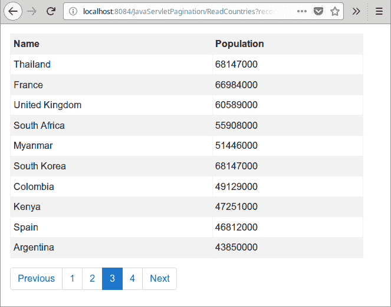

# Java Servlet 分页

> 原文： [http://zetcode.com/articles/javaservletpagination/](http://zetcode.com/articles/javaservletpagination/)

Java servlet 分页教程显示了如何使用 Java servlet 进行分页。 在示例中，Bootstrap 用于 UI。

## 分页

分页是将内容分为几页的过程。 用户具有用于通过特定页面链接访问这些页面的导航界面。 导航通常包括上一个/下一个和第一个/最后一个链接。 当数据库中有大量数据或一页中显示许多注释时，将使用分页。

## Java Servlet

Servlet 是 Java 类，可响应特定类型的网络请求-最常见的是 HTTP 请求。 Java servlet 用于创建 Web 应用程序。 它们在 servlet 容器（例如 Tomcat 或 Jetty）中运行。 现代 Java Web 开发使用在 servlet 之上构建的框架。

## 引导程序

Bootstrap 是 Twitter 的一个 UI 库，用于创建响应式，移动优先的 Web 应用程序。

## Java Servlet 分页示例

在以下应用程序中，我们从 MySQL 数据库加载数据并将其显示在表中。 有一个导航系统可以遍历数据库表中的所有数据。 在将数据显示在表中之前，用户可以选择表将显示多少行。

除了从数据库表中获取数据之外，我们还需要知道数据库表中所有行的数量，每页的记录数以及要在导航中显示的页面数。 SQL 语句可以计算出数据库中所有行的数量。 用户以 HTML 格式选择每页的记录数。 最后，从其他两个值计算分页中的页数。

`countries_mysql.sql`

```
CREATE TABLE Countries(ID BIGINT NOT NULL PRIMARY KEY AUTO_INCREMENT, 
    Name VARCHAR(100), Population INT);

INSERT INTO Countries(Name, Population) VALUES('China', 1382050000);
INSERT INTO Countries(Name, Population) VALUES('India', 1313210000);
INSERT INTO Countries(Name, Population) VALUES('USA', 324666000);
INSERT INTO Countries(Name, Population) VALUES('Indonesia', 260581000);
INSERT INTO Countries(Name, Population) VALUES('Brazil', 207221000);
INSERT INTO Countries(Name, Population) VALUES('Pakistan', 196626000);
INSERT INTO Countries(Name, Population) VALUES('Nigeria', 186988000);
INSERT INTO Countries(Name, Population) VALUES('Bangladesh', 162099000);
INSERT INTO Countries(Name, Population) VALUES('Nigeria', 186988000);
INSERT INTO Countries(Name, Population) VALUES('Russia', 146838000);
INSERT INTO Countries(Name, Population) VALUES('Japan', 126830000);
INSERT INTO Countries(Name, Population) VALUES('Mexico', 122273000);
INSERT INTO Countries(Name, Population) VALUES('Philippines', 103738000);
INSERT INTO Countries(Name, Population) VALUES('Ethiopia', 101853000);
INSERT INTO Countries(Name, Population) VALUES('Vietnam', 92700000);
INSERT INTO Countries(Name, Population) VALUES('Egypt', 92641000);
INSERT INTO Countries(Name, Population) VALUES('Germany', 82800000);
INSERT INTO Countries(Name, Population) VALUES('the Congo', 82243000);
INSERT INTO Countries(Name, Population) VALUES('Iran', 82800000);
INSERT INTO Countries(Name, Population) VALUES('Turkey', 79814000);
INSERT INTO Countries(Name, Population) VALUES('Thailand', 68147000);
INSERT INTO Countries(Name, Population) VALUES('France', 66984000);
INSERT INTO Countries(Name, Population) VALUES('United Kingdom', 60589000);
INSERT INTO Countries(Name, Population) VALUES('South Africa', 55908000);
INSERT INTO Countries(Name, Population) VALUES('Myanmar', 51446000);
INSERT INTO Countries(Name, Population) VALUES('South Korea', 68147000);
INSERT INTO Countries(Name, Population) VALUES('Colombia', 49129000);
INSERT INTO Countries(Name, Population) VALUES('Kenya', 47251000);
INSERT INTO Countries(Name, Population) VALUES('Spain', 46812000);
INSERT INTO Countries(Name, Population) VALUES('Argentina', 43850000);
INSERT INTO Countries(Name, Population) VALUES('Ukraine', 42603000);
INSERT INTO Countries(Name, Population) VALUES('Sudan', 41176000);
INSERT INTO Countries(Name, Population) VALUES('Algeria', 40400000);
INSERT INTO Countries(Name, Population) VALUES('Poland', 38439000);

```

该 SQL 脚本在 MySQL 中创建`Countries`表。

```
$ tree
.
├── nb-configuration.xml
├── pom.xml
└── src
    ├── main
    │   ├── java
    │   │   └── com
    │   │       └── zetcode
    │   │           ├── bean
    │   │           │   └── Country.java
    │   │           ├── service
    │   │           │   ├── CountryService.java
    │   │           │   └── ICountryService.java
    │   │           └── web
    │   │               └── ReadCountries.java
    │   ├── resources
    │   └── webapp
    │       ├── index.html
    │       ├── listCountries.jsp
    │       ├── META-INF
    │       │   └── context.xml
    │       └── WEB-INF
    └── test
        └── java

```

这是项目结构。

`pom.xml`

```
<?xml version="1.0" encoding="UTF-8"?>
<project xmlns="http://maven.apache.org/POM/4.0.0" 
         xmlns:xsi="http://www.w3.org/2001/XMLSchema-instance" 
         xsi:schemaLocation="http://maven.apache.org/POM/4.0.0 
http://maven.apache.org/xsd/maven-4.0.0.xsd">

    <modelVersion>4.0.0</modelVersion>

    <groupId>com.zetcode</groupId>
    <artifactId>JavaServletPagination</artifactId>
    <version>1.0-SNAPSHOT</version>
    <packaging>war</packaging>

    <name>JavaServletPagination</name>

    <properties>
        <project.build.sourceEncoding>UTF-8</project.build.sourceEncoding>
        <maven.compiler.source>1.8</maven.compiler.source>
        <maven.compiler.target>1.8</maven.compiler.target>
    </properties>

    <dependencies>
        <dependency>
            <groupId>javax.servlet</groupId>
            <artifactId>javax.servlet-api</artifactId>
            <version>3.1.0</version>
            <scope>provided</scope>
        </dependency>

        <dependency>
            <groupId>org.springframework</groupId>
            <artifactId>spring-jdbc</artifactId>
            <version>5.0.2.RELEASE</version>
        </dependency>

        <dependency>
            <groupId>mysql</groupId>
            <artifactId>mysql-connector-java</artifactId>
            <version>5.1.45</version>
        </dependency>        

        <dependency>
            <groupId>javax.servlet</groupId>
            <artifactId>jstl</artifactId>
            <version>1.2</version>
        </dependency>

    </dependencies>

    <build>
        <plugins>

            <plugin>
                <groupId>org.apache.maven.plugins</groupId>
                <artifactId>maven-war-plugin</artifactId>
                <version>2.3</version>
                <configuration>
                    <failOnMissingWebXml>false</failOnMissingWebXml>
                </configuration>
            </plugin>

        </plugins>
    </build>
</project>

```

这是 Maven POM 文件。 `javax.servlet-api`工件用于 servlet。 `spring-jdbc`依赖性用于 JdbcTemplate 库，该库简化了 Java 中的数据库编程。 `mysql-connector-java`是 Java 语言的 MySQL 驱动程序。 `jstl`依赖性为 JSP 页面提供了一些附加功能。 `maven-war-plugin`负责收集 Web 应用程序的所有工件依赖项，类和资源，并将它们打包到 Web 应用程序存档（WAR）中。

`context.xml`

```
<?xml version="1.0" encoding="UTF-8"?>
<Context path="/JavaServletPagination"/>

```

在 Tomcat `context.xml`文件中，我们定义了上下文路径。 它是 Web 应用程序的名称。

`Country.java`

```
package com.zetcode.bean;

public class Country {

    private String name;
    private int population;

    public String getName() {
        return name;
    }

    public void setName(String name) {
        this.name = name;
    }

    public int getPopulation() {
        return population;
    }

    public void setPopulation(int population) {
        this.population = population;
    }
}

```

`Country` bean 从`Countries`数据库表中保留一行。

`ReadCountries.java`

```
package com.zetcode.web;

import com.zetcode.bean.Country;
import com.zetcode.service.CountryService;
import java.io.IOException;
import java.util.List;
import javax.servlet.RequestDispatcher;
import javax.servlet.ServletException;
import javax.servlet.annotation.WebServlet;
import javax.servlet.http.HttpServlet;
import javax.servlet.http.HttpServletRequest;
import javax.servlet.http.HttpServletResponse;

@WebServlet(name = "ReadCountries", urlPatterns = {"/ReadCountries"})
public class ReadCountries extends HttpServlet {

    @Override
    protected void doGet(HttpServletRequest request, HttpServletResponse response)
            throws ServletException, IOException {

        response.setContentType("text/html;charset=UTF-8");

        int currentPage = Integer.valueOf(request.getParameter("currentPage"));
        int recordsPerPage = Integer.valueOf(request.getParameter("recordsPerPage"));

        CountryService countryService = new CountryService();

        List<Country> countries = countryService.findCountries(currentPage, 
                recordsPerPage);

        request.setAttribute("countries", countries);

        int rows = countryService.getNumberOfRows();

        int nOfPages = rows / recordsPerPage;

        if (nOfPages % recordsPerPage > 0) {
            nOfPages++;
        }

        request.setAttribute("noOfPages", nOfPages);
        request.setAttribute("currentPage", currentPage);
        request.setAttribute("recordsPerPage", recordsPerPage);

        RequestDispatcher dispatcher = request.getRequestDispatcher("listCountries.jsp");
        dispatcher.forward(request, response);
    }
}

```

`ReadCountries` Servlet 确定将从请求属性中检索多少数据，并从数据库表中读取指定的行数。

```
@WebServlet(name = "ReadCountries", urlPatterns = {"/ReadCountries"})

```

Java 类用`@WebServlet`注释修饰。 它映射到`ReadCountries` URL 模式。

```
response.setContentType("text/html;charset=UTF-8");

```

Servlet 将以 HTML 输出数据，并且数据的编码设置为 UTF-8。

```
int currentPage = Integer.valueOf(request.getParameter("currentPage"));
int recordsPerPage = Integer.valueOf(request.getParameter("recordsPerPage"));

```

从请求中我们得到两个重要的值：当前页和每页的记录数。

```
CountryService countryService = new CountryService();

List<Country> countries = countryService.findCountries(currentPage, 
        recordsPerPage);

request.setAttribute("countries", countries);

```

`CountryService`是用于连接到数据库并读取数据的服务类。 检索国家列表并将其设置为请求的属性。 稍后将由目标 JSP 页面使用。

```
int rows = countryService.getNumberOfRows();

int nOfPages = rows / recordsPerPage;

if (nOfPages % recordsPerPage > 0) {
    nOfPages++;
}

```

我们使用`getNumberOfRows()`服务方法从数据库表中获取所有行的数目。 我们计算导航中的页面数。

```
request.setAttribute("noOfPages", nOfPages);
request.setAttribute("currentPage", currentPage);
request.setAttribute("recordsPerPage", recordsPerPage);

```

页数，当前页和每页的记录数是我们建立分页所需的值。

```
RequestDispatcher dispatcher = request.getRequestDispatcher("listCountries.jsp");
dispatcher.forward(request, response);

```

处理被转发到`listCountries.jsp`页面。

`ICountryService.java`

```
package com.zetcode.service;

import com.zetcode.bean.Country;
import java.util.List;

public interface ICountryService  {

    public List<Country> findCountries(int currentPage, int numOfRecords);
    public int getNumberOfRows();
}

```

`ICountryService`包含两种签约方法：`findCountries()`和`getNumberOfRows()`。

`CountryService.java`

```
package com.zetcode.service;

import com.zetcode.bean.Country;
import java.sql.SQLException;
import java.util.List;
import java.util.logging.Level;
import java.util.logging.Logger;
import org.springframework.jdbc.core.BeanPropertyRowMapper;
import org.springframework.jdbc.core.JdbcTemplate;
import org.springframework.jdbc.datasource.SimpleDriverDataSource;

public class CountryService implements ICountryService {

    @Override
    public List<Country> findCountries(int currentPage, int recordsPerPage)  {

        List<Country> countries = null;

        int start = currentPage * recordsPerPage - recordsPerPage;

        try {
            String sql = "SELECT * FROM Countries LIMIT ?, ?";

            SimpleDriverDataSource ds = new SimpleDriverDataSource();
            ds.setDriver(new com.mysql.jdbc.Driver());
            ds.setUrl("jdbc:mysql://localhost:3306/testdb");
            ds.setUsername("testuser");
            ds.setPassword("test623");

            JdbcTemplate jtm = new JdbcTemplate(ds);
            countries = jtm.query(sql, new Object[] {start, recordsPerPage}, 
                    new BeanPropertyRowMapper(Country.class));

        } catch (SQLException ex) {
            Logger.getLogger(CountryService.class.getName()).log(Level.SEVERE, 
                null, ex);
        }

        return countries;
    }    

    @Override
    public int getNumberOfRows() {

        int numOfRows = 0;

        try {
            String sql = "SELECT COUNT(Id) FROM Countries";

            SimpleDriverDataSource ds = new SimpleDriverDataSource();
            ds.setDriver(new com.mysql.jdbc.Driver());
            ds.setUrl("jdbc:mysql://localhost:3306/testdb");
            ds.setUsername("testuser");
            ds.setPassword("test623");

            JdbcTemplate jtm = new JdbcTemplate(ds);
            numOfRows = jtm.queryForObject(sql, Integer.class);

        } catch (SQLException ex) {
            Logger.getLogger(CountryService.class.getName()).log(Level.SEVERE, 
                null, ex);
        }

        return numOfRows;
    }
}

```

`CountryService`包含两种合同方法的实现。

```
String sql = "SELECT * FROM Countries LIMIT ?, ?";

```

SQL LIMIT 子句用于获取当前页面的行数。

```
JdbcTemplate jtm = new JdbcTemplate(ds);
countries = jtm.query(sql, new Object[] {start, recordsPerPage}, 
        new BeanPropertyRowMapper(Country.class));

```

`JdbcTemplate`用于执行 SQL 语句。 在`BeanPropertyRowMapper`的帮助下，行自动映射到`Country` bean。

```
String sql = "SELECT COUNT(Id) FROM Countries";

```

通过此 SQL 语句，我们从数据库表中获取行数。

`index.html`

```
<!DOCTYPE html>
<html>
<head>
    <title>Home page</title>
    <meta charset="UTF-8">
    <link rel="stylesheet" href="https://maxcdn.bootstrapcdn.com/bootstrap/4.0.0-alpha.6/css/bootstrap.min.css">        
</head>

<body class="m-3">

<h1>Show countries</h1>

<form action="ReadCountries">

    <input type="hidden" name="currentPage" value="1">

    <div class="form-group col-md-4">

        <label for="records">Select records per page:</label>

        <select class="form-control" id="records" name="recordsPerPage"> 
            <option value="5">5</option> 
            <option value="10" selected>10</option>
            <option value="15">15</option>
        </select>

    </div>

    <button type="submit" class="btn btn-primary">Submit</button>

</form>

<script src="https://code.jquery.com/jquery-3.1.1.slim.min.js" ></script>
<script src="https://cdnjs.cloudflare.com/ajax/libs/tether/1.4.0/js/tether.min.js" ></script>
<script src="https://maxcdn.bootstrapcdn.com/bootstrap/4.0.0-alpha.6/js/bootstrap.min.js" ></script>

</body>
</html>

```

这是主页。 它包含一个 HTML 表单，用于通过`select`标签选择每页的记录数。 该表单使用 Bootstrap 库中的样式类。 提交表单后，处理将发送到`ReadCountries` Servlet。

```
<input type="hidden" name="currentPage" value="1">

```

该表单包含一个隐藏的`input`标记，该标记将`currentPage`参数设置为 1。

```
<select class="form-control" id="records" name="recordsPerPage"> 
    <option value="5">5</option> 
    <option value="10" selected>10</option>
    <option value="15">15</option>
</select>

```

`select`标签允许每页选择 5、10 或 15 条记录。

```
<button type="submit" class="btn btn-primary">Submit</button>

```

提交按钮执行表单。

`listCountries.jsp`

```
<%@page contentType="text/html" pageEncoding="UTF-8"%>
<%@taglib uri="http://java.sun.com/jsp/jstl/core" prefix="c" %>
<!DOCTYPE html>
<html>
<head>
    <meta charset="UTF-8">
    <title>Countries</title>
    <link rel="stylesheet" href="https://maxcdn.bootstrapcdn.com/bootstrap/4.0.0-alpha.6/css/bootstrap.min.css">
</head>

<body class="m-3">

<div class="row col-md-6">
    <table class="table table-striped table-bordered table-sm">
        <tr>
            <th>Name</th>
            <th>Population</th>
        </tr>

        <c:forEach items="${countries}" var="country">
            <tr>
                <td>${country.getName()}</td>
                <td>${country.getPopulation()}</td>    
            </tr>
        </c:forEach>
    </table>
</div>

<nav aria-label="Navigation for countries">
    <ul class="pagination">
        <c:if test="${currentPage != 1}">
            <li class="page-item"><a class="page-link" 
                href="ReadCountries?recordsPerPage=${recordsPerPage}&currentPage=${currentPage-1}">Previous</a>
            </li>
        </c:if>

        <c:forEach begin="1" end="${noOfPages}" var="i">
            <c:choose>
                <c:when test="${currentPage eq i}">
                    <li class="page-item active"><a class="page-link">
                            ${i} <span class="sr-only">(current)</span></a>
                    </li>
                </c:when>
                <c:otherwise>
                    <li class="page-item"><a class="page-link" 
                        href="ReadCountries?recordsPerPage=${recordsPerPage}&currentPage=${i}">${i}</a>
                    </li>
                </c:otherwise>
            </c:choose>
        </c:forEach>

        <c:if test="${currentPage lt noOfPages}">
            <li class="page-item"><a class="page-link" 
                href="ReadCountries?recordsPerPage=${recordsPerPage}&currentPage=${currentPage+1}">Next</a>
            </li>
        </c:if>              
    </ul>


<script src="https://code.jquery.com/jquery-3.1.1.slim.min.js"></script>
<script src="https://cdnjs.cloudflare.com/ajax/libs/tether/1.4.0/js/tether.min.js"></script>
<script src="https://maxcdn.bootstrapcdn.com/bootstrap/4.0.0-alpha.6/js/bootstrap.min.js"></script>

</body>
</html>

```

`listCountries.jsp`在表格和分页系统中显示数据。 Bootstrap 用于使 UI 响应并看起来不错。

```
<table class="table table-striped table-bordered table-sm">

```

`table`，`table-striped`，`table-bordered`和`table-sm`都是 Bootstrap 类。

```
<c:forEach items="${countries}" var="country">
    <tr>
        <td>${country.getName()}</td>
        <td>${country.getPopulation()}</td>    
    </tr>
</c:forEach>

```

使用 JSTL 的`forEach`标签，我们可以显示当前页面的所有数据。

```
<c:if test="${currentPage != 1}">
    <li class="page-item"><a class="page-link" 
        href="ReadCountries?recordsPerPage=${recordsPerPage}&currentPage=${currentPage-1}">Previous</a>
    </li>
</c:if>

```

使用`c:if`标签，我们仅在存在前一个链接时显示它。 在链接中，我们将`recordsPerPage`和`currentPage`值传递给请求对象。

```
<c:forEach begin="1" end="${noOfPages}" var="i">
    <c:choose>
        <c:when test="${currentPage eq i}">
            <li class="page-item active"><a class="page-link">
                    ${i} <span class="sr-only">(current)</span></a>
            </li>
        </c:when>
        <c:otherwise>
            <li class="page-item"><a class="page-link" 
                href="ReadCountries?recordsPerPage=${recordsPerPage}&currentPage=${i}">${i}</a>
            </li>
        </c:otherwise>
    </c:choose>
</c:forEach>

```

使用`forEach`标签，我们显示所有页面链接。



Figure: Java Servlet Pagination

该示例显示了一个装有数据和分页系统的表。 当前选择的页面突出显示。

在本教程中，我们展示了如何使用 Java Servlet 在 Web 应用程序中创建分页系统。

您可能也对以下相关教程感兴趣： [Java Servlet 上传文件](/articles/javaservletuploadfile/)， [Java Log4j 教程](/java/log4j/)， [Java Servlet RESTful 客户端](/articles/javaservletrestclient/)， [Java RequestDispatcher](/java/requestdispatcher/) ，[从 Java servlet](/articles/javaservlettext/) ， [Java servlet 图像教程](/articles/javaservletimage/)或 [Java 教程](/lang/java/)提供纯文本