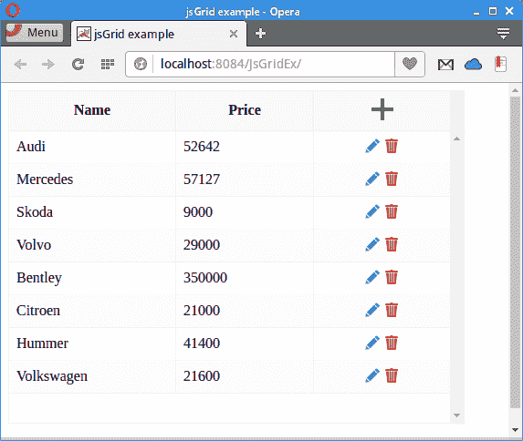

# 使用 jsGrid 组件

> 原文： [http://zetcode.com/articles/jsgridservlet/](http://zetcode.com/articles/jsgridservlet/)

在本教程中，我们从 Derby 数据库检索数据并将其显示在 jsGrid 组件中。 数据以 JSON 格式从 Derby 发送到 jsGrid。 作者的 Github [信息库](https://github.com/janbodnar/jsGrid-Servlet)中提供了本教程的源代码。

`jsGrid`是基于 jQuery 的轻量级客户端数据网格控件。 它支持基本的网格操作，如插入，编辑，过滤，删除，排序和分页。 `jsGrid`组件允许自定义其外观和子组件。

jQuery 是一个快速，小型且功能丰富的 JavaScript 库。 通过易于使用的 API（可在多种浏览器中使用），它使 HTML 文档的遍历和操作，事件处理，动画和 Ajax 变得更加简单。

Apache Derby 是完全用 Java 实现的开源关系数据库。 Derby 占用空间小，易于部署和安装。 它有两种模式：嵌入式和客户端/服务器。 也称为 Java DB。

JSON（JavaScript 对象表示法）是一种轻量级的数据交换格式。 人类很容易读写，机器也很容易解析和生成。 JSON 的官方 Internet 媒体类型为`application/json`。 JSON 文件扩展名是`.json`。

在我们的应用中，我们将使用以下四种 HTTP 方法：

*   GET-读取资源
*   POST-创建新资源
*   PUT —修改资源
*   DELETE —删除资源

这些 HTTP 动词将调用相应的 Java servlet 方法。

`cars.sql`

```
CREATE TABLE CARS(ID INTEGER NOT NULL PRIMARY KEY GENERATED ALWAYS AS IDENTITY 
    (START WITH 1, INCREMENT BY 1), NAME VARCHAR(30), PRICE INT);

INSERT INTO CARS(NAME, PRICE) VALUES('Audi', 52642);
INSERT INTO CARS(NAME, PRICE) VALUES('Mercedes', 57127);
INSERT INTO CARS(NAME, PRICE) VALUES('Skoda', 9000);
INSERT INTO CARS(NAME, PRICE) VALUES('Volvo', 29000);
INSERT INTO CARS(NAME, PRICE) VALUES('Bentley', 350000);
INSERT INTO CARS(NAME, PRICE) VALUES('Citroen', 21000);
INSERT INTO CARS(NAME, PRICE) VALUES('Hummer', 41400);
INSERT INTO CARS(NAME, PRICE) VALUES('Volkswagen', 21600);

```

在示例中，我们使用`CARS`数据库表，该表位于 Derby `testdb`数据库中。

```
<dependencies>
    <dependency>
        <groupId>javax</groupId>
        <artifactId>javaee-web-api</artifactId>
        <version>7.0</version>
        <scope>provided</scope>
    </dependency>

    <dependency>
        <groupId>org.apache.derby</groupId>
        <artifactId>derbyclient</artifactId>
        <version>10.12.1.1</version>
    </dependency>    

    <dependency>
        <groupId>com.googlecode.json-simple</groupId>
        <artifactId>json-simple</artifactId>
        <version>1.1.1</version>
    </dependency>

    <dependency>
        <groupId>com.google.guava</groupId>
        <artifactId>guava</artifactId>
        <version>19.0</version>
    </dependency>

    <dependency>
        <groupId>org.apache.derby</groupId>
        <artifactId>derbyoptionaltools</artifactId>
        <version>10.12.1.1</version>
    </dependency>        

</dependencies>

```

这些是我们项目中使用的依赖项。 `javaee-web-api`是一组用于创建 Java Web 应用的 JAR。 `derbyclient`是 Derby 的数据库驱动程序。 `json-simple`库用于处理 JSON 数据。 本项目使用`guava`的辅助方法。 `derbyoptionaltools`包含一个帮助程序方法，该方法将数据库结果集转换为 JSON 格式。

`index.html`

```
<!DOCTYPE html>
<html>
    <head>
        <title>jsGrid example</title>
        <meta http-equiv="Content-Type" content="text/html; charset=UTF-8">
        <meta name="viewport" content="width=device-width">
        <link href="css/style.css" rel="stylesheet">
        <link href="http://js-grid.com/css/jsgrid.min.css" rel="stylesheet">
        <link href="http://js-grid.com/css/jsgrid-theme.min.css" rel="stylesheet">        
    </head>
    <body>

        <div id="jsGrid"></div>

        <script src="http://code.jquery.com/jquery-1.11.3.min.js"></script>
        <script src="http://js-grid.com/js/jsgrid.min.js"></script>
        <script src="js/sample.js"></script>
    </body>
</html>

```

在`index.html`文件中，我们包含`jQuery`和`jsGrid`库。

```
<div id="jsGrid"></div>

```

`jsGrid`作为 div 标签包含在内。

`style.css`

```
html {
    height: 100%;
}

body {
    height: 100%;
    font-family: Verdana, Georgia;
}

```

为了显示 jsGrid 组件的完整大小，我们需要设置`&lt;body&gt;`和`&lt;html&gt;`标签的高度。

`sample.js`

```
$(function () {

    $.ajax({
        type: "GET",
        url: "/JsGridEx/ManageCars"
    }).done(function () {

        $("#jsGrid").jsGrid({
            height: "60%",
            width: "50%",
            inserting: true,
            editing: true,
            sorting: true,
            paging: true,
            autoload: true,
            pageSize: 10,
            controller: {
                loadData: function (filter) {
                    return $.ajax({
                        type: "GET",
                        url: "/JsGridEx/ManageCars",
                        data: filter
                    });
                },
                insertItem: function (item) {
                    return $.ajax({
                        type: "POST",
                        url: "/JsGridEx/ManageCars",
                        data: item
                    });
                },
                updateItem: function (item) {
                    return $.ajax({
                        type: "PUT",
                        url: "/JsGridEx/ManageCars",
                        data: item
                    });
                },
                deleteItem: function (item) {
                    return $.ajax({
                        type: "DELETE",
                        url: "/JsGridEx/ManageCars",
                        data: item
                    });
                }
            },
            fields: [
                {name: "NAME", title: "Name", type: "text", width: 60},
                {name: "PRICE", title: "Price", type: "text",  width: 50},
                {type: "control"}
            ]
        });

    });
});

```

在`sample.js`文件中，我们创建并配置`jsGrid`组件。

```
inserting: true,
editing: true,
sorting: true,
paging: true,

```

我们的`jsGrid`组件可以插入，编辑和排序数据，还支持分页。

```
loadData: function (filter) {
    return $.ajax({
        type: "GET",
        url: "/JsGridEx/ManageCars",
        data: filter
    });
}

```

`loadData()`函数在`ManageCars` Servlet 上发出 HTTP GET 方法。

```
insertItem: function (item) {
    return $.ajax({
        type: "POST",
        url: "/JsGridEx/ManageCars",
        data: item
    });
}

```

当我们插入新项目时，将在`ManageCars` Servlet 上发出 HTTP POST 方法。

```
updateItem: function (item) {
    return $.ajax({
        type: "PUT",
        url: "/JsGridEx/ManageCars",
        data: item
    });
}

```

更新项目会在`ManageCars` Servlet 上生成 HTTP PUT 方法。

```
deleteItem: function (item) {
    return $.ajax({
        type: "DELETE",
        url: "/JsGridEx/ManageCars",
        data: item
    });
}

```

删除项目会在`ManageCars` Servlet 上生成 HTTP DELETE 方法。

```
fields: [
    {name: "NAME", title: "Name", type: "text", width: 60},
    {name: "PRICE", title: "Price", type: "text",  width: 50},
    {type: "control"}
]

```

`jsGrid`组件具有三个两列：NAME 和 PRICE。 它们必须与 JSON 中返回的键完全匹配。

`ManageCars.java`

```
package com.zetcode.web;

import com.zetcode.service.CarService;
import com.zetcode.util.Utils;
import java.io.IOException;
import java.util.Map;
import javax.servlet.ServletException;
import javax.servlet.annotation.WebServlet;
import javax.servlet.http.HttpServlet;
import javax.servlet.http.HttpServletRequest;
import javax.servlet.http.HttpServletResponse;
import org.json.simple.JSONArray;

@WebServlet(name = "ManageCars", urlPatterns = {"/ManageCars"})
public class ManageCars extends HttpServlet {

    @Override
    protected void doGet(HttpServletRequest request, HttpServletResponse response)
            throws ServletException, IOException {

        response.setContentType("application/json");
        response.setCharacterEncoding("UTF-8");

        JSONArray ar = CarService.getCarsJSON();

        response.getWriter().write(ar.toJSONString());
    }

    @Override
    protected void doPost(HttpServletRequest request, HttpServletResponse response)
            throws ServletException {

        String name = request.getParameter("NAME");
        int price = Integer.valueOf(request.getParameter("PRICE"));

        CarService.insertCar(name, price);

        getServletContext().log("Car " + name + " inserted");
    }

    @Override
    protected void doPut(HttpServletRequest request, HttpServletResponse response)
            throws ServletException {

        Map<String, String> dataMap = Utils.getParameterMap(request);

        String carName = dataMap.get("NAME");
        int carPrice = Integer.valueOf(dataMap.get("PRICE"));

        CarService.updateCar(carName, carPrice);

        getServletContext().log("Car " + carName + " updated" + carPrice);
    }

    @Override
    protected void doDelete(HttpServletRequest request, HttpServletResponse response)
            throws ServletException {

        Map<String, String> dataMap = Utils.getParameterMap(request);

        String carName = dataMap.get("NAME");

        CarService.deleteCar(carName);

        getServletContext().log("Car:" + carName + " deleted");
    }
}

```

`ManageCars`是 Java Servlet，其中包含 HTTP GET，POST，PUT 和 DELETE 方法的相应方法。

```
@Override
protected void doGet(HttpServletRequest request, HttpServletResponse response)
        throws ServletException, IOException {

    response.setContentType("application/json");
    response.setCharacterEncoding("UTF-8");

    JSONArray ar = CarService.getCarsJSON();

    response.getWriter().write(ar.toJSONString());
}

```

响应于 HTTP GET 方法，调用`doGet()`方法。 它调用`CarService's` `getCarsJSON()`方法，该方法从 CARS 表中返回所有汽车。 数据以 JSON 格式发送回客户端。

```
@Override
protected void doPost(HttpServletRequest request, HttpServletResponse response)
        throws ServletException {

    String name = request.getParameter("NAME");
    int price = Integer.valueOf(request.getParameter("PRICE"));

    CarService.insertCar(name, price);

    getServletContext().log("Car " + name + " inserted");
}

```

在`doPost()`方法中，我们从请求中检索 NAME 和 PRICE 参数，然后使用`CarService.insertCar()`方法将它们插入数据库中。 当我们收到一个 HTTP POST 方法时，`doPost()`方法被调用，期望添加新的资源。

```
@Override
protected void doPut(HttpServletRequest request, HttpServletResponse response)
        throws ServletException {

    Map<String, String> dataMap = Utils.getParameterMap(request);

    String carName = dataMap.get("NAME");
    int carPrice = Integer.valueOf(dataMap.get("PRICE"));

    CarService.updateCar(carName, carPrice);

    getServletContext().log("Car " + carName + " updated" + carPrice);
}

```

在`doPut()`方法中，我们从请求中检索 NAME 和 PRICE 参数，然后使用`CarService.updateCar()`方法将它们插入数据库中。 当我们接收到 HTTP PUT 方法时，会期望`doPut()`方法被调用，期望对资源进行修改。

```
@Override
protected void doDelete(HttpServletRequest request, HttpServletResponse response)
        throws ServletException {

    Map<String, String> dataMap = Utils.getParameterMap(request);

    String carName = dataMap.get("NAME");

    CarService.deleteCar(carName);

    getServletContext().log("Car:" + carName + " deleted");
}

```

在`doDelete()`方法中，我们从请求中检索 NAME 参数，并使用`CarService.deleteCar()`方法删除汽车。 当我们收到一个 HTTP DELETE 方法，期望删除资源时，将调用`doDelete()`方法。

`CarService.java`

```
package com.zetcode.service;

import com.zetcode.util.Utils;
import java.sql.Connection;
import java.sql.PreparedStatement;
import java.sql.ResultSet;
import java.sql.SQLException;
import java.util.logging.Level;
import java.util.logging.Logger;
import javax.sql.DataSource;
import org.apache.derby.optional.api.SimpleJsonUtils;
import org.json.simple.JSONArray;

public class CarService {

    private static final Logger LOG = Logger.getLogger(CarService.class.getName());
    private static JSONArray jarray;

    public static void updateCar(String name, int price) {

        Connection con = null;
        PreparedStatement pst = null;

        try {

            DataSource ds = Utils.getDataSource();
            con = ds.getConnection();
            pst = con.prepareStatement("UPDATE CARS SET NAME=?, PRICE=? WHERE NAME=?");
            pst.setString(1, name);
            pst.setInt(2, price);
            pst.setString(3, name);
            pst.executeUpdate();

        } catch (SQLException ex) {

            Logger lgr = Logger.getLogger(CarService.class.getName());
            lgr.log(Level.SEVERE, ex.getMessage(), ex);

        } finally {

            try {
                if (pst != null) {
                    pst.close();
                }
                if (con != null) {
                    con.close();
                }

            } catch (SQLException ex) {

                LOG.log(Level.WARNING, ex.getMessage(), ex);
            }
        }
    }

    public static void deleteCar(String name) {

        Connection con = null;
        PreparedStatement pst = null;

        try {

            DataSource ds = Utils.getDataSource();
            con = ds.getConnection();
            pst = con.prepareStatement("DELETE FROM CARS WHERE Name=?");
            pst.setString(1, name);
            pst.executeUpdate();

        } catch (SQLException ex) {

            LOG.log(Level.SEVERE, ex.getMessage(), ex);

        } finally {

            try {
                if (pst != null) {
                    pst.close();
                }
                if (con != null) {
                    con.close();
                }

            } catch (SQLException ex) {

                LOG.log(Level.WARNING, ex.getMessage(), ex);
            }
        }
    }

    public static void insertCar(String name, int price) {

        Connection con = null;
        PreparedStatement pst = null;

        try {

            DataSource ds = Utils.getDataSource();
            con = ds.getConnection();
            pst = con.prepareStatement("INSERT INTO CARS(NAME, PRICE) "
                    + "VALUES(?, ?)");
            pst.setString(1, name);
            pst.setInt(2, price);
            pst.executeUpdate();

        } catch (SQLException ex) {

            LOG.log(Level.SEVERE, ex.getMessage(), ex);

        } finally {

            try {
                if (pst != null) {
                    pst.close();
                }
                if (con != null) {
                    con.close();
                }

            } catch (SQLException ex) {

                LOG.log(Level.WARNING, ex.getMessage(), ex);
            }
        }
    }

    public static JSONArray getCarsJSON() {

        Connection con = null;
        PreparedStatement pst = null;
        ResultSet rs = null;

        try {

            DataSource ds = Utils.getDataSource();
            con = ds.getConnection();
            pst = con.prepareStatement("SELECT NAME, PRICE FROM Cars");
            rs = pst.executeQuery();

            jarray = SimpleJsonUtils.toJSON(rs);

        } catch (SQLException ex) {

            LOG.log(Level.SEVERE, ex.getMessage(), ex);

        } finally {

            try {
                if (rs != null) {
                    rs.close();
                }
                if (pst != null) {
                    pst.close();
                }
                if (con != null) {
                    con.close();
                }

            } catch (SQLException ex) {

                LOG.log(Level.WARNING, ex.getMessage(), ex);
            }
        }

        return jarray;
    }
}

```

`CarService`包含用于数据检索和修改的方法。 我们使用标准的 JDBC 代码。 Java 数据库连接（JDBC）是 Java 编程语言的应用编程接口（API），它定义了客户端如何访问数据库。

```
DataSource ds = Utils.getDataSource();
con = ds.getConnection();
pst = con.prepareStatement("DELETE FROM CARS WHERE Name=?");
pst.setString(1, name);
pst.executeUpdate();

```

在这里，我们创建数据源并建立与 Derby 数据库的新连接。 我们执行 DELETE SQL 语句。

```
DataSource ds = Utils.getDataSource();
con = ds.getConnection();
pst = con.prepareStatement("INSERT INTO CARS(NAME, PRICE) "
        + "VALUES(?, ?)");
pst.setString(1, name);
pst.setInt(2, price);
pst.executeUpdate();

```

这是用于插入新车的 JDBC 代码。

```
DataSource ds = Utils.getDataSource();
con = ds.getConnection();
pst = con.prepareStatement("SELECT NAME, PRICE FROM Cars");
rs = pst.executeQuery();

jarray = SimpleJsonUtils.toJSON(rs);

```

在`getCarsJSON()`方法中，我们得到一个结果集，并使用`SimpleJsonUtils.toJSON()`将其转换为 JSONArray。 该方法是`derbyoptionaltools`的一部分。

`Utils.java`

```
package com.zetcode.util;

import com.google.common.base.Splitter;
import java.io.BufferedReader;
import java.io.IOException;
import java.io.InputStreamReader;
import java.util.Map;
import java.util.logging.Level;
import java.util.logging.Logger;
import javax.servlet.http.HttpServletRequest;
import javax.sql.DataSource;
import org.apache.derby.jdbc.ClientDataSource;

public class Utils {

    public static DataSource getDataSource() {

        ClientDataSource ds = new ClientDataSource();

        ds.setDatabaseName("testdb");
        ds.setUser("app");
        ds.setPassword("app");
        ds.setServerName("localhost");
        ds.setPortNumber(1527);

        return ds;
    }

    public static Map<String, String> getParameterMap(HttpServletRequest request) {

        BufferedReader br = null;
        Map<String, String> dataMap = null;

        try {

            InputStreamReader reader = new InputStreamReader(
                    request.getInputStream());
            br = new BufferedReader(reader);

            String data = br.readLine();

            dataMap = Splitter.on('&')
                    .trimResults()
                    .withKeyValueSeparator(
                            Splitter.on('=')
                            .limit(2)
                            .trimResults())
                    .split(data);

            return dataMap;

        } catch (IOException ex) {
            Logger.getLogger(Utils.class.getName()).log(Level.SEVERE, null, ex);
        } finally {
            if (br != null) {
                try {
                    br.close();
                } catch (IOException ex) {
                    Logger.getLogger(Utils.class.getName()).log(Level.WARNING, null, ex);
                }
            }
        }

        return dataMap;
    }
}

```

`Utils`是一个帮助程序类，它包含两个方法：`getDataSource()`和`getParameterMap()`。

```
public static DataSource getDataSource() {

    ClientDataSource ds = new ClientDataSource();

    ds.setDatabaseName("testdb");
    ds.setUser("app");
    ds.setPassword("app");
    ds.setServerName("localhost");
    ds.setPortNumber(1527);

    return ds;
}

```

`getDataSource()`创建并返回一个 Derby 数据源。

```
InputStreamReader reader = new InputStreamReader(
        request.getInputStream());
br = new BufferedReader(reader);

String data = br.readLine();

dataMap = Splitter.on('&')
        .trimResults()
        .withKeyValueSeparator(
                Splitter.on('=')
                .limit(2)
                .trimResults())
        .split(data);

return dataMap;

```

与`doGet()`和`doPost()`方法不同，`doPut()`和`doDelete()`无法使用`getParameter()`方法检索请求参数。 我们必须从流中获取它们。 为此，我们使用番石榴的`Splitter`类。 解析参数并在映射中返回。



Figure: jsGrid component

在本教程中，我们使用了 jsGrid 组件。 我们已使用从 Derby 数据库检索的数据填充了该组件。 数据以 JSON 格式从数据库发送。

您可能也对以下相关教程感兴趣： [Java 教程](/lang/java/)， [jQuery DatePicker 教程](/articles/jquerydatepicker/)， [Datatables JSON 服务器教程](/articles/datatablesjsonserver/)， [Apache Derby 教程](/db/apachederbytutorial/) 。