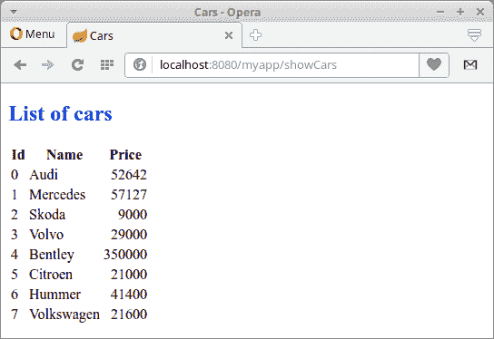

# Spring Boot Moustache 教程

> [http://zetcode.com/articles/springbootmustache/](http://zetcode.com/articles/springbootmustache/)

在 Spring Boot Mustache 教程中，我们将使用 Mustache 模板引擎和 HSQLDB 数据库创建一个简单的 Spring Boot Web 应用。

Spring 是流行的 Java 应用框架。 Spring Boot 致力于创建独立的，基于生产级别的基于 Spring 的应用，而无任何麻烦。

HSQLDB 是完全用 Java 创建的开源关系数据库管理系统。 它提供了一个小型，快速的多线程事务型数据库引擎，具有基于内存和基于磁盘的表，并支持嵌入式和服务器模式。 它包括一个功能强大的命令行 SQL 工具和简单的 GUI 查询工具。

##  Moustache 

Moustache 是一个简单的 Web 模板系统。 它可用于许多编程语言，包括 Java。 由于没有任何显式的控制流语句（例如`if`和`else`条件语句或`for`循环），因此，Mustache 被描述为无逻辑的。 可以使用节标记处理列表和 lambda 来实现循环和条件评估。

## Spring Boot Moustache 示例

以下示例是使用 Mustache 模板引擎的 Spring Boot Web 应用。 应用的数据位于 HSQLDB 数据库中。

```java
$ tree
.
├── pom.xml
└── src
    ├── main
    │   ├── java
    │   │   └── com
    │   │       └── zetcode
    │   │           ├── Application.java
    │   │           ├── bean
    │   │           │   └── Car.java
    │   │           ├── controller
    │   │           │   └── MyController.java
    │   │           └── service
    │   │               ├── CarService.java
    │   │               └── ICarService.java
    │   └── resources
    │       ├── application.yml
    │       ├── data-hsqldb.sql
    │       ├── schema-hsqldb.sql
    │       ├── static
    │       │   └── css
    │       │       └── style.css
    │       └── templates
    │           ├── index.html
    │           └── showCars.html
    └── test
        └── java

```

这是项目结构。 模板文件的后缀为`.html`。 它们默认位于`src/main/resources/template`目录中。 当在 Maven POM 文件中找到依赖项时，Spring Boot 会自动配置 Mustache。

`pom.xml`

```java
<?xml version="1.0" encoding="UTF-8"?>
<project xmlns="http://maven.apache.org/POM/4.0.0" 
         xmlns:xsi="http://www.w3.org/2001/XMLSchema-instance" 
         xsi:schemaLocation="http://maven.apache.org/POM/4.0.0 
                             http://maven.apache.org/xsd/maven-4.0.0.xsd">

    <modelVersion>4.0.0</modelVersion>
    <groupId>com.zetcode</groupId>
    <artifactId>SpringBootMustache</artifactId>
    <version>1.0-SNAPSHOT</version>
    <packaging>jar</packaging>
    <properties>
        <project.build.sourceEncoding>UTF-8</project.build.sourceEncoding>
        <maven.compiler.source>1.8</maven.compiler.source>
        <maven.compiler.target>1.8</maven.compiler.target>
    </properties>

    <parent>
        <groupId>org.springframework.boot</groupId>
        <artifactId>spring-boot-starter-parent</artifactId>
        <version>1.5.3.RELEASE</version>
    </parent>     

    <dependencies>

        <dependency>
            <groupId>org.hsqldb</groupId>
            <artifactId>hsqldb</artifactId>
        </dependency>

        <dependency>
            <groupId>org.springframework.boot</groupId>
            <artifactId>spring-boot-devtools</artifactId>
            <optional>true</optional>
        </dependency>                        

        <dependency>
            <groupId>org.springframework.boot</groupId>
            <artifactId>spring-boot-starter-mustache</artifactId>
        </dependency>    

        <dependency>
            <groupId>org.springframework.boot</groupId>
            <artifactId>spring-boot-starter-jdbc</artifactId>
        </dependency>         

    </dependencies>    

    <build>
        <plugins>
            <plugin>
                <groupId>org.springframework.boot</groupId>
                <artifactId>spring-boot-maven-plugin</artifactId>
            </plugin>            
        </plugins>
    </build>
</project>

```

这是 Maven 构建文件。 `spring-boot-devtools`启用热插拔，禁用模板缓存并启用实时重新加载。 `spring-boot-starter-mustache`是用于使用 Mustache 构建 Spring MVC 应用的入门程序。 `hsqldb`是 HSQLDB 的驱动程序。 `spring-boot-starter-jdbc`是在 Spring Boot 中使用 JDBC 的入门工具。

`Car.java`

```java
package com.zetcode.bean;

public class Car {

    private Long id;
    private String name;
    private int price;

    public Car() {}

    public Car(Long id, String name, int price) {
        this.id = id;
        this.name = name;
        this.price = price;
    }

    public Long getId() {
        return id;
    }

    public void setId(Long id) {
        this.id = id;
    }

    public String getName() {
        return name;
    }

    public void setName(String name) {
        this.name = name;
    }

    public int getPrice() {
        return price;
    }

    public void setPrice(int price) {
        this.price = price;
    }

    @Override
    public String toString() {
        return "Car{" + "id=" + id + ", name=" + name + ", price=" + price + '}';
    }
}

```

这是`Car` bean 类。 它包含汽车 ID，名称和价格字段。

`application.yml`

```java
server:
    context-path: /myapp

spring: 
    main:
        banner-mode: "off"       
    datasource:
        platform: hsqldb

logging: 
    level: 
        org: 
            springframework: ERROR

```

`application.yml`是主要的 Spring Boot 配置文件。 `context-path`定义 Web 应用的名称。 我们通过`localhost:8080/myapp/` URL 访问我们的应用。 使用`banner-mode`属性，我们可以关闭 Spring 横幅。 该平台值用于 SQL 初始化脚本：`schema-${platform}.sql`和`data-${platform}.sql`中。 另外，我们将 spring 框架的日志记录级别设置为`ERROR`。

注意，我们没有配置数据源。 如果没有配置数据，Spring 会以内存模式自动配置 HSQLDB。 我们希望有一个内存数据库，因此我们让 Spring 进行自动配置。

`schema-hsqldb.sql`

```java
CREATE TABLE CARS(ID BIGINT IDENTITY PRIMARY KEY, 
                  NAME VARCHAR(30), PRICE INT);

```

该 SQL 脚本创建`CARS`表。 HSQLDB 使用`IDENTITY`子句创建自动增加的列。 默认情况下，id 从零开始。

`data-hsqldb.sql`

```java
INSERT INTO CARS(NAME, PRICE) VALUES('Audi', 52642);
INSERT INTO CARS(NAME, PRICE) VALUES('Mercedes', 57127);
INSERT INTO CARS(NAME, PRICE) VALUES('Skoda', 9000);
INSERT INTO CARS(NAME, PRICE) VALUES('Volvo', 29000);
INSERT INTO CARS(NAME, PRICE) VALUES('Bentley', 350000);
INSERT INTO CARS(NAME, PRICE) VALUES('Citroen', 21000);
INSERT INTO CARS(NAME, PRICE) VALUES('Hummer', 41400);
INSERT INTO CARS(NAME, PRICE) VALUES('Volkswagen', 21600);

```

该脚本用数据填充表。 这两个脚本都位于类路径的根目录中。

`ICarService.java`

```java
package com.zetcode.service;

import com.zetcode.bean.Car;
import java.util.List;

public interface ICarService {

    public List<Car> findAll();
}

```

`ICarService`提供了一种从数据源获取所有城市的契约方法。

`CarService.java`

```java
package com.zetcode.service;

import com.zetcode.bean.Car;
import java.util.List;
import org.springframework.beans.factory.annotation.Autowired;
import org.springframework.jdbc.core.BeanPropertyRowMapper;
import org.springframework.jdbc.core.JdbcTemplate;
import org.springframework.stereotype.Service;

@Service
public class CarService implements ICarService {

    @Autowired
    private JdbcTemplate jtm;

    @Override
    public List<Car> findAll() {

        String sql = "SELECT * FROM CARS";

        List<Car> cars = jtm.query(sql, new BeanPropertyRowMapper(Car.class));

        return cars;
    }
}

```

`CarService`包含`findAll()`方法的实现。 我们借助`JdbcTemplate`从`CARS`表中检索所有汽车。

```java
@Autowired
private JdbcTemplate jtm;

```

注入`JdbcTemplate`。

```java
String sql = "SELECT * FROM CARS";

```

这是要执行的 SQL。 我们从`CARS`表中选择所有汽车。

```java
List<Car> cars = jtm.query(sql, new BeanPropertyRowMapper(Car.class));

```

`BeanPropertyRowMapper`将一行转换为指定映射目标类的新实例。

`MyController.java`

```java
package com.zetcode.controller;

import com.zetcode.bean.Car;
import com.zetcode.service.ICarService;
import java.util.HashMap;
import java.util.List;
import java.util.Map;
import org.springframework.beans.factory.annotation.Autowired;
import org.springframework.stereotype.Controller;
import org.springframework.ui.Model;
import org.springframework.web.bind.annotation.RequestMapping;
import org.springframework.web.servlet.ModelAndView;

@Controller
public class MyController {

    @Autowired
    private ICarService carService;

    @RequestMapping("/")
    public String index(Model model) {

        return "index";
    }    

    @RequestMapping("/showCars")
    public ModelAndView showCars() {

        List<Car> cars = carService.findAll();

        Map<String, Object> params = new HashMap<>();
        params.put("cars", cars);

        return new ModelAndView("showCars", params);
    }
}

```

这是 Spring Boot Web 应用的控制器类。 控制器被饰以`@Controller`注解。 控制器具有两个映射：一个用于主页的映射，一个用于列出所有汽车的映射。 当 Spring Boot 在 Maven POM 文件中检测到 Mustache 启动程序时，它会自动配置 Mustache 视图。

```java
@Autowired
private ICarService carService;

```

我们将`ICarService`注入到带有`@Autowired`注解的字段中。

```java
@RequestMapping("/")
public String index(Model model) {

    return "index";
}   

```

`"index"`是位于预定义`template`目录中的视图的名称。

```java
@RequestMapping("/showCars")
public ModelAndView showCars() {

    List<Car> cars = carService.findAll();

    Map<String, Object> params = new HashMap<>();
    params.put("cars", cars);

    return new ModelAndView("showCars", params);
}

```

该控制器方法可提供汽车清单。 我们从汽车服务中找到所有汽车对象，并将结果列表放入参数中。 Spring 将找到名为`showCars`的 Mustache 视图，并让引擎将模板与数据结合在一起。

`style.css`

```java
h2 {color: blue}

td:nth-child(3) {
    text-align: right;
}

```

`style.css`是位于`src/main/resources/static/css`目录中的静态文件。 它将`h2`标签设置为蓝色，并右对齐第三列的数据。

`index.html`

```java
<!DOCTYPE html>
<html>
    <head>
        <title>Home page</title>
        <meta charset="UTF-8"/>
        <meta name="viewport" content="width=device-width, initial-scale=1.0"/>
    </head>
    <body>
        <a href="showCars">Show cars</a>
    </body>
</html>

```

`index.html`模板文件是应用的主页。 它包含一个检索所有汽车对象的链接。

`showCars.html`

```java
<!DOCTYPE html>
<html>
    <head>
        <title>Cars</title>
        <link rel="stylesheet" href="css/style.css" />
        <meta charset="UTF-8"/>
        <meta name="viewport" content="width=device-width, initial-scale=1.0"/>
    </head>
    <body>
        <h2>List of cars</h2>

        <table>
            <tr>
                <th>Id</th>
                <th>Name</th>
                <th>Price</th>
            </tr>
            {{#cars}}
            <tr>
                <td>{{id}}</td>
                <td>{{name}}</td>
                <td>{{price}}</td>
            </tr>
            {{/cars}}
        </table>
    </body>
</html>

```

`showCars.html`是 Moustache 模板文件，其中包含要用来自模型的数据填充的占位符。 小 Moustache 使用`{{}}`语法。

```java
<link rel="stylesheet" href="css/style.css" />

```

我们包括静态 CSS 文件。

```java
{{#cars}}
<tr>
    <td>{{id}}</td>
    <td>{{name}}</td>
    <td>{{price}}</td>
</tr>
{{/cars}}

```

`{{#cars}}`语法称为段。 部分根据当前上下文中键的值，将文本块渲染一次或多次。 一节以`{{#name}}`开头，以`{{/name}}`结束。 如果该值是非空列表，则该部分将显示多次。 在每种情况下，该节的上下文都将设置为列表中的元素。

`Application.java`

```java
package com.zetcode;

import org.springframework.boot.SpringApplication;
import org.springframework.boot.autoconfigure.SpringBootApplication;

@SpringBootApplication
public class Application {

    public static void main(String[] args) {
        SpringApplication.run(Application.class, args);
    }
}

```

我们设置了 Spring Boot 应用。 `@SpringBootApplication`注解启用自动配置和组件扫描。



Figure: Listing cars

该应用部署在内置的 Tomcat 服务器上，该服务器侦听端口 8080。

在本教程中，我们使用 Mustache 和 HSQLDB 创建了一个 Spring Boot Web 应用。 您可能也对相关教程感兴趣： [Spring Boot Thymeleaf 配置](/articles/springbootthymeleafconf/)， [Spring Boot FreeMarker 教程](/springboot/freemarker/)， [Spring Boot Thymeleaf 教程](/articles/springbootthymeleaf/)， [Spring Boot Swing 集成教程](/articles/springbootswing/)， [Spring Web 应用简介](/articles/springwebfirst/)，[独立的 Spring 应用](/articles/standalonespring/)， [FreeMarker 教程](/java/freemarker/)， [Java 教程](/lang/java/)，[游戏简介](/java/play/)或[ Strips 简介](/java/stripes/)。